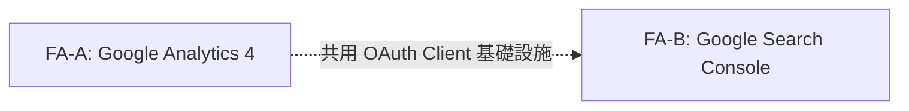
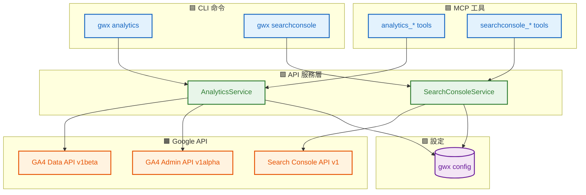
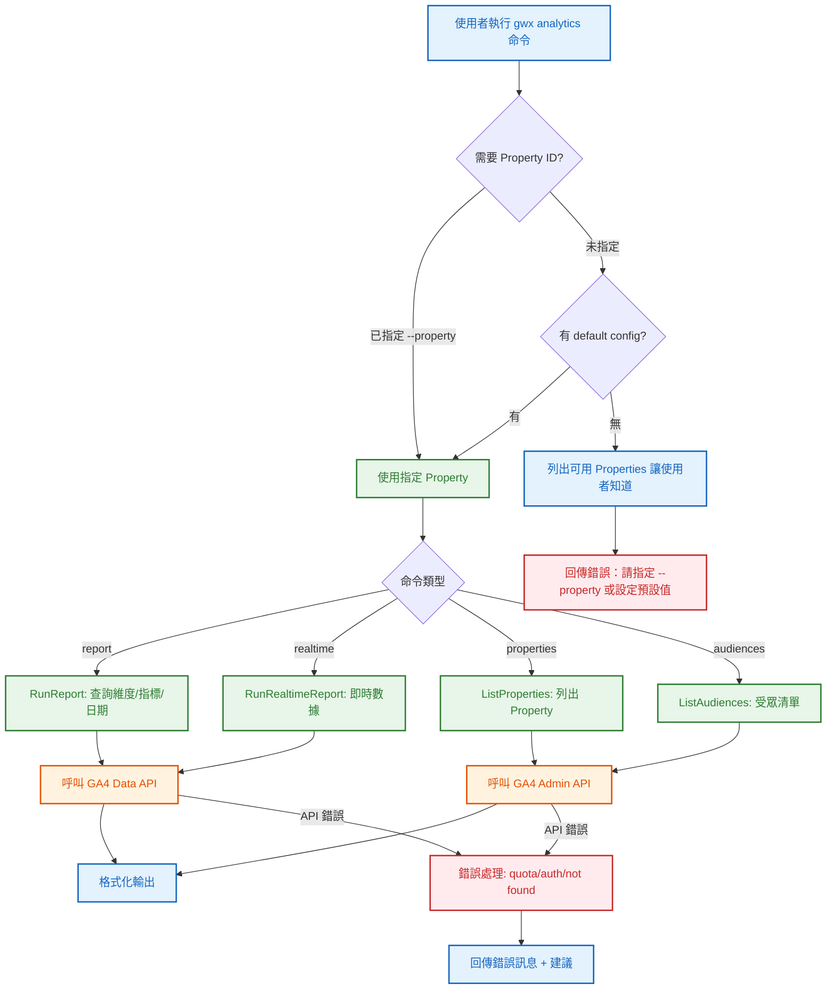
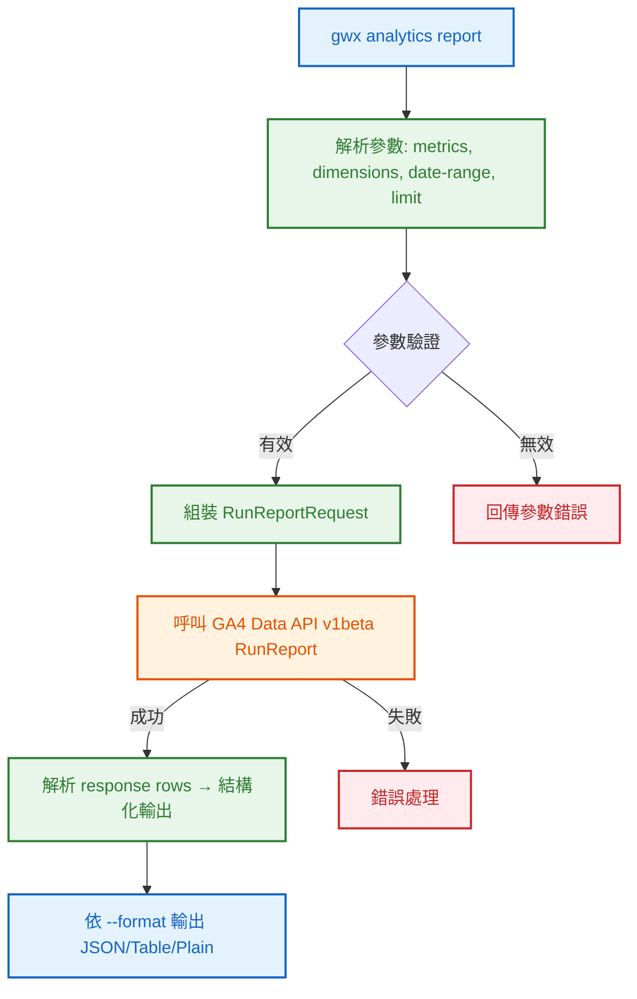
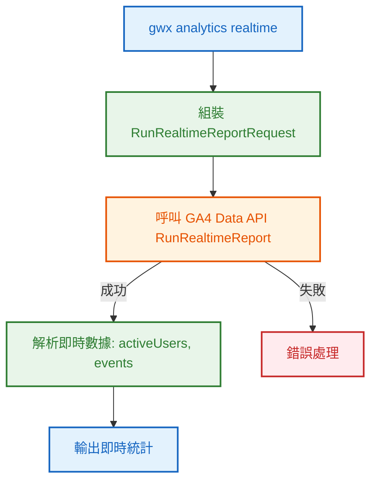
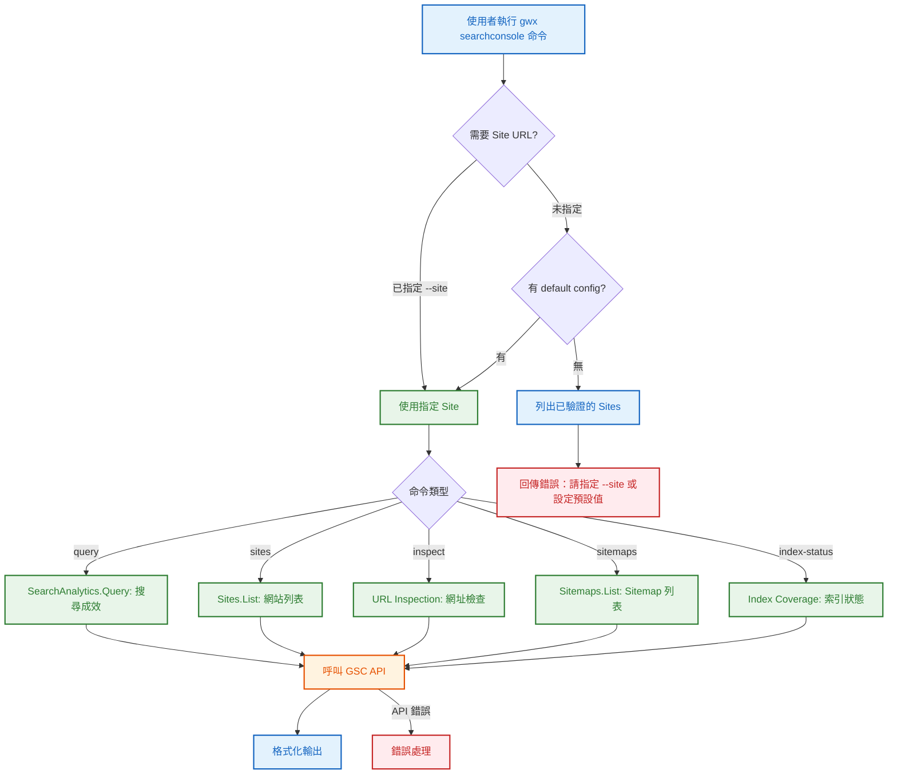
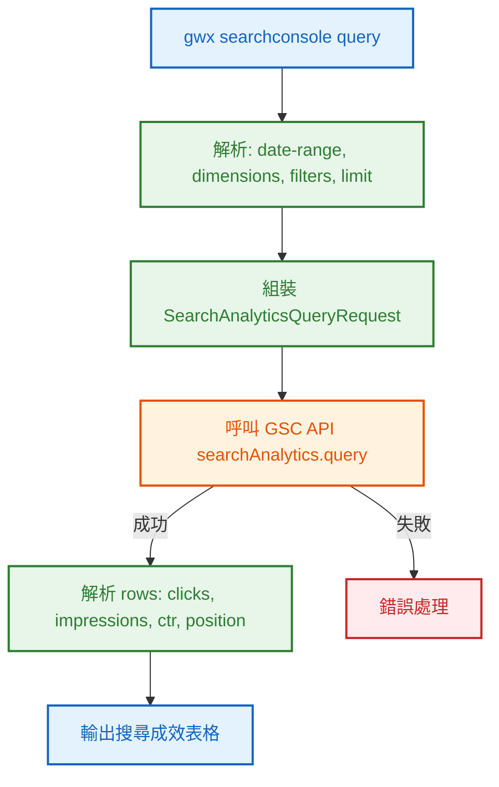
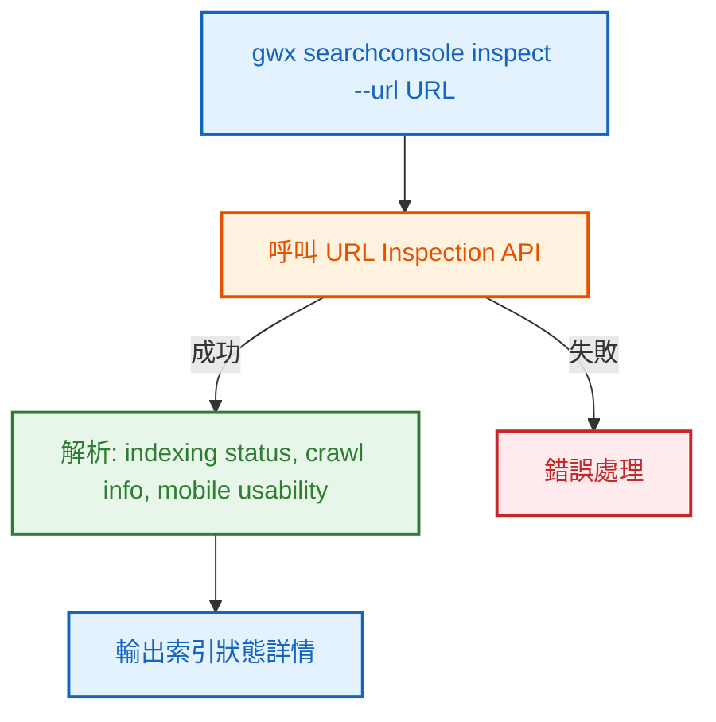
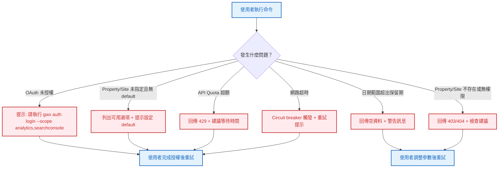

# S0 Brief Spec: Google Analytics 4 & Search Console 整合

> **階段**: S0 需求討論
> **建立時間**: 2026-03-19 14:00
> **Agent**: requirement-analyst
> **Spec Mode**: Full Spec
> **工作類型**: new_feature

---

## 0. 工作類型

| 類型 | 代碼 | 說明 |
|------|------|------|
| 新需求 | `new_feature` | 全新功能或流程，S1 聚焦影響範圍+可複用元件 |

**本次工作類型**：`new_feature`

## 1. 一句話描述

為 gwx 新增 Google Analytics 4（GA4）和 Google Search Console（GSC）兩個服務的完整整合，涵蓋 CLI 命令、MCP 工具與預設設定管理。

## 2. 為什麼要做

### 2.1 痛點

- **數據分散**：查看網站流量需要開 GA4 介面，查 SEO 需要開 Search Console，無法在 CLI/Agent 工作流中直接存取
- **Agent 斷層**：Claude Agent 目前能操作 8 個 Google 服務，但缺乏網站分析與 SEO 數據，無法提供完整的數位行銷洞察
- **報表手動化**：每日站會或定期報表需要手動擷取 GA4/GSC 數據，無法自動化整合到 `/standup` 或 Sheets

### 2.2 目標

- 讓 Claude Agent 能直接查詢 GA4 報表和 GSC 搜尋成效數據
- 支援自動化報表場景（standup、寫入 Sheets）
- 遵循現有 gwx 架構模式，無縫融入既有 8 個服務

## 3. 使用者

| 角色 | 說明 |
|------|------|
| CLI 使用者（人類） | 透過終端直接執行 `gwx analytics` / `gwx searchconsole` 命令查詢數據 |
| Claude Agent（MCP） | 透過 MCP 工具自動查詢 GA4/GSC 數據，用於報表、分析、回答問題 |

## 4. 核心流程

> **閱讀順序**：功能區拆解（理解全貌）→ 系統架構總覽（理解組成）→ 各功能區流程圖（對焦細節）→ 例外處理（邊界情境）

> 圖例：🟦 藍色 = CLI/MCP 介面　｜　🟩 綠色 = API 服務層　｜　🟧 橘色 = Google API　｜　🟪 紫色 = 設定儲存　｜　🟥 紅色 = 例外/錯誤

### 4.0 功能區拆解（Functional Area Decomposition）

#### 功能區識別表

| FA ID | 功能區名稱 | 一句話描述 | 入口 | 獨立性 |
|-------|-----------|-----------|------|--------|
| FA-A | Google Analytics 4 | GA4 報表查詢：RunReport、RealtimeReport、Property 列表、Admin 管理、Audience | `gwx analytics` / MCP `analytics_*` | 高 |
| FA-B | Google Search Console | GSC 搜尋成效、網站列表、網址檢查、Sitemap、索引狀態 | `gwx searchconsole` / MCP `searchconsole_*` | 高 |

#### 拆解策略

| FA 數量 | 獨立性 | 建議策略 | 說明 |
|---------|--------|---------|------|
| 2 | 高 | **單 SOP** | 兩個 FA 完全獨立（不同 Google API），但共用 OAuth、Client、cmd/mcp 架構模式，在同一個 SOP 內開發效率更高 |

**本次策略**：`single_sop`

#### 跨功能區依賴



| 來源 FA | 目標 FA | 依賴類型 | 說明 |
|---------|---------|---------|------|
| FA-A | FA-B | 基礎設施共用 | 共用 Client、OAuth scope 註冊、config 管理模式，無資料依賴 |

---

### 4.1 系統架構總覽



**架構重點**：

| 層級 | 組件 | 職責 |
|------|------|------|
| **CLI** | `gwx analytics`, `gwx searchconsole` | 命令解析、認證觸發、輸出格式化 |
| **MCP** | `analytics_*`, `searchconsole_*` | Agent 工具定義、參數驗證、路由 |
| **API** | `AnalyticsService`, `SearchConsoleService` | 核心業務邏輯，封裝 Google API 呼叫 |
| **Google** | GA4 Data/Admin API, GSC API | 第三方數據源 |
| **設定** | gwx config | 儲存 default property/site 設定 |

---

### 4.2 FA-A: Google Analytics 4

> 本節涵蓋 GA4 的完整功能流程。

#### 4.2.1 全局流程圖



#### 4.2.2 報表查詢子流程（局部）



**技術細節**：
- GA4 Data API 使用 `analyticsdata.googleapis.com/v1beta`
- RunReport 支援自訂維度（dimensions）和指標（metrics），需驗證名稱合法性
- 日期格式統一用 `YYYY-MM-DD`，支援 `today`、`yesterday`、`7daysAgo`、`30daysAgo` 等語法糖

#### 4.2.3 即時報表子流程（局部）



#### 4.2.N Happy Path 摘要

| 路徑 | 入口 | 結果 |
|------|------|------|
| **A：報表查詢** | `gwx analytics report --metrics sessions,pageviews --date-range 7daysAgo,today` | 回傳結構化報表數據 |
| **B：即時數據** | `gwx analytics realtime` | 回傳當前活躍用戶等即時指標 |
| **C：列出 Property** | `gwx analytics properties` | 回傳帳號下所有 GA4 Property 清單 |
| **D：受眾清單** | `gwx analytics audiences` | 回傳 Property 的 Audience 列表 |

---

### 4.3 FA-B: Google Search Console

> 本節涵蓋 GSC 的完整功能流程。

#### 4.3.1 全局流程圖



#### 4.3.2 搜尋成效查詢子流程（局部）



**技術細節**：
- GSC API 使用 `searchconsole.googleapis.com/v1`
- SearchAnalytics 支援的 dimensions: `query`, `page`, `country`, `device`, `date`, `searchAppearance`
- 回傳指標固定：`clicks`, `impressions`, `ctr`, `position`

#### 4.3.3 網址檢查子流程（局部）



#### 4.3.N Happy Path 摘要

| 路徑 | 入口 | 結果 |
|------|------|------|
| **A：搜尋成效** | `gwx searchconsole query --date-range 28d --dimensions query` | 回傳關鍵字排名、點擊、曝光數據 |
| **B：網站列表** | `gwx searchconsole sites` | 回傳已驗證的網站清單 |
| **C：網址檢查** | `gwx searchconsole inspect --url https://example.com/page` | 回傳該 URL 的索引狀態 |
| **D：Sitemap** | `gwx searchconsole sitemaps` | 回傳 Sitemap 清單與狀態 |
| **E：索引狀態** | `gwx searchconsole index-status` | 回傳整體索引覆蓋率摘要 |

---

### 4.4 例外流程圖



### 4.5 六維度例外清單

| 維度 | ID | FA | 情境 | 觸發條件 | 預期行為 | 嚴重度 |
|------|-----|-----|------|---------|---------|--------|
| 並行/競爭 | E1 | 全域 | 多個 GA4 報表同時查詢 | 併發多個 RunReport 請求 | Rate limiter 排隊處理，不額外限制 | P2 |
| 狀態轉換 | E2 | 全域 | OAuth token 過期 mid-request | Token 在 API 呼叫途中過期 | 現有 retry transport 自動 refresh，無需特殊處理 | P2 |
| 資料邊界 | E3 | FA-A | 日期範圍超出 GA4 資料保留期 | 查詢超過 14 個月前的數據或未來日期 | 回傳空資料 + 警告訊息「日期範圍可能超出資料保留期」 | P1 |
| 網路/外部 | E4 | 全域 | API quota 超額 | 達到 GA4/GSC 每日 token 上限 | 回傳 quota exceeded 錯誤 + 建議等待或減少查詢頻率 | P1 |
| 業務邏輯 | E5 | 全域 | Property/Site 未指定且無 default | --property/--site 未傳且 config 無預設值 | 回傳錯誤訊息，列出可用選項，提示設定 default | P1 |
| UI/體驗 | E6 | 全域 | CLI 環境無中斷風險 | N/A | 不需要特殊處理（CLI 非互動式 UI） | P2 |

### 4.6 白話文摘要

這次新增讓 gwx 能直接查詢 Google Analytics 4 的網站流量數據（訪客數、頁面瀏覽、即時用戶）和 Google Search Console 的搜尋引擎數據（關鍵字排名、曝光量、點擊率）。當 Google API 超出配額或網路異常時，系統會回傳明確的錯誤訊息和建議。最壞情況下 API 暫時不可用，但不會影響 gwx 其他服務的正常運作。

## 5. 成功標準

| # | FA | 類別 | 標準 | 驗證方式 |
|---|-----|------|------|---------|
| 1 | FA-A | 功能 | `gwx analytics report` 能查詢指定日期範圍的 GA4 報表數據 | 執行命令確認回傳正確的 metrics/dimensions |
| 2 | FA-A | 功能 | `gwx analytics realtime` 能查詢即時活躍用戶數據 | 執行命令確認回傳即時指標 |
| 3 | FA-A | 功能 | `gwx analytics properties` 能列出帳號下所有 GA4 Property | 執行命令確認回傳 Property 清單 |
| 4 | FA-A | 功能 | `gwx analytics audiences` 能列出 Audience | 執行命令確認回傳 Audience 清單 |
| 5 | FA-B | 功能 | `gwx searchconsole query` 能查詢搜尋成效數據 | 執行命令確認回傳 clicks/impressions/ctr/position |
| 6 | FA-B | 功能 | `gwx searchconsole sites` 能列出已驗證網站 | 執行命令確認回傳 Site 清單 |
| 7 | FA-B | 功能 | `gwx searchconsole inspect` 能檢查單一 URL 索引狀態 | 執行命令確認回傳索引詳情 |
| 8 | FA-B | 功能 | `gwx searchconsole sitemaps` 能列出 Sitemap | 執行命令確認回傳 Sitemap 清單 |
| 9 | FA-B | 功能 | `gwx searchconsole index-status` 能查詢索引覆蓋率 | 執行命令確認回傳索引統計 |
| 10 | 全域 | 設定 | `gwx config set analytics.default-property` 和 `searchconsole.default-site` 可設定預設值 | 設定後執行命令不帶 flag 確認生效 |
| 11 | 全域 | MCP | 所有 CLI 命令都有對應的 MCP 工具 | 透過 MCP 介面確認工具可用 |
| 12 | 全域 | 架構 | 遵循現有 gwx 三層架構模式（API → CMD → MCP） | Code review 確認 |
| 13 | 全域 | 安全 | 所有操作為唯讀（🟢 Green） | 確認無寫入 API 呼叫 |

## 6. 範圍

### 範圍內
- **FA-A**: GA4 Data API — RunReport、RunRealtimeReport
- **FA-A**: GA4 Admin API — ListProperties、ListAudiences
- **FA-B**: GSC API — SearchAnalytics.Query、Sites.List、URL Inspection、Sitemaps.List、Index Coverage
- **全域**: OAuth scope 註冊（analytics readonly、webmasters readonly）
- **全域**: CLI 命令定義（`gwx analytics`、`gwx searchconsole`）
- **全域**: MCP 工具定義與路由
- **全域**: `gwx config set` 支援 default property/site
- **全域**: Rate limiter 和 Circuit breaker 整合

### 範圍外
- GA4 Admin 寫入操作（建立/修改 Property、事件設定）
- GSC Sitemap 提交（submit）— 本次只做列表讀取
- GSC URL Inspection 的批量檢查
- 自訂 Dashboard 或視覺化
- 與 `/standup` skill 的深度整合（留給後續 iteration）

## 7. 已知限制與約束

- GA4 Data API 目前為 `v1beta`，API 可能有 breaking changes
- GA4 每日 API token quota 有限（Data API: 200,000 tokens/day/project）
- GSC SearchAnalytics 資料延遲約 2-3 天
- GSC URL Inspection API 每日限額 2,000 次/property
- OAuth scope 新增需要使用者重新授權（`gwx auth login --scope analytics,searchconsole`）

## 8. 前端 UI 畫面清單

> 本功能為純 CLI/MCP 後端功能，無前端 UI。省略此節。

## 9. 補充說明

### CLI 命令規劃

**GA4 命令結構**：
```
gwx analytics
├── report      # RunReport（核心）
├── realtime    # RunRealtimeReport
├── properties  # ListAccountSummaries / ListProperties
└── audiences   # ListAudiences
```

**GSC 命令結構**：
```
gwx searchconsole
├── query        # SearchAnalytics.Query（核心）
├── sites        # Sites.List
├── inspect      # URL Inspection
├── sitemaps     # Sitemaps.List
└── index-status # Index Coverage（透過 SearchAnalytics 維度實現）
```

### Google API 依賴

| API | Go Package | Scope |
|-----|-----------|-------|
| GA4 Data API v1beta | `google.golang.org/api/analyticsdata/v1beta` | `https://www.googleapis.com/auth/analytics.readonly` |
| GA4 Admin API v1alpha | `google.golang.org/api/analyticsadmin/v1alpha` | `https://www.googleapis.com/auth/analytics.readonly` |
| Search Console API v1 | `google.golang.org/api/searchconsole/v1` | `https://www.googleapis.com/auth/webmasters.readonly` |

### 方案比較

| 方案 | 概述 | 優勢 | 劣勢 | 推薦 |
|------|------|------|------|------|
| A：完整整合 | 完全遵循現有 gwx 模式，三層全做 | 一致性高、MCP 支援完整、Agent 可用 | 開發量較大（2 服務 × 3 層） | ✅ 推薦 |
| B：僅 CLI | 只做 CMD + API 層，不做 MCP | 較快交付 | Agent 無法使用，違背 gwx 設計理念 | ❌ |
| C：僅 MCP | 只做 MCP + API 層，不做 CLI | Agent 可用 | 人類無法從終端直接使用 | ❌ |

**選擇方案 A**：完整整合，與現有 8 個服務保持一致。

---

## 10. SDD Context

```json
{
  "sdd_context": {
    "stages": {
      "s0": {
        "status": "pending_confirmation",
        "agent": "requirement-analyst",
        "output": {
          "brief_spec_path": "dev/specs/2026-03-19_1_ga4-gsc-integration/s0_brief_spec.md",
          "work_type": "new_feature",
          "requirement": "為 gwx 新增 GA4 和 Google Search Console 整合，涵蓋 CLI、MCP、設定管理",
          "pain_points": [
            "查看流量/SEO 數據需手動開 GA4/GSC 介面",
            "Agent 缺乏網站分析與 SEO 數據",
            "報表無法自動化整合"
          ],
          "goal": "讓 CLI 使用者和 Claude Agent 能直接查詢 GA4/GSC 數據",
          "success_criteria": [
            "GA4 report/realtime/properties/audiences 命令可用",
            "GSC query/sites/inspect/sitemaps/index-status 命令可用",
            "所有命令有對應 MCP 工具",
            "支援 default property/site config",
            "所有操作為唯讀"
          ],
          "scope_in": [
            "GA4 Data API (RunReport, RunRealtimeReport)",
            "GA4 Admin API (ListProperties, ListAudiences)",
            "GSC API (SearchAnalytics, Sites, URL Inspection, Sitemaps, Index Coverage)",
            "CLI 命令、MCP 工具、OAuth scope、Config 管理"
          ],
          "scope_out": [
            "GA4 Admin 寫入操作",
            "GSC Sitemap 提交",
            "批量 URL Inspection",
            "Dashboard/視覺化",
            "/standup 深度整合"
          ],
          "constraints": [
            "GA4 Data API 為 v1beta",
            "GA4 quota 200K tokens/day",
            "GSC 資料延遲 2-3 天",
            "GSC URL Inspection 限額 2K/day",
            "需重新授權 OAuth scope"
          ],
          "functional_areas": [
            {
              "id": "FA-A",
              "name": "Google Analytics 4",
              "description": "GA4 報表查詢、即時數據、Property/Audience 管理",
              "independence": "high"
            },
            {
              "id": "FA-B",
              "name": "Google Search Console",
              "description": "搜尋成效查詢、網站管理、網址檢查、Sitemap、索引狀態",
              "independence": "high"
            }
          ],
          "decomposition_strategy": "single_sop",
          "child_sops": []
        }
      }
    }
  }
}
```
