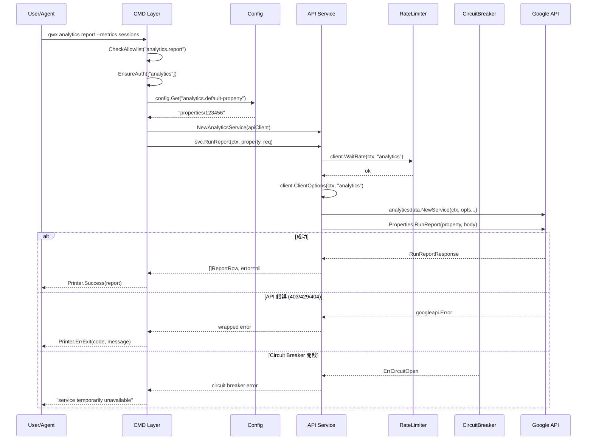

# S1 Dev Spec: GA4 & Google Search Console 整合

> **階段**: S1 技術分析
> **建立時間**: 2026-03-19 15:00
> **Agent**: codebase-explorer (Phase 1) + architect (Phase 2)
> **工作類型**: new_feature
> **複雜度**: L

---

## 1. 概述

### 1.1 需求參照
> 完整需求見 `s0_brief_spec.md`，以下僅摘要。

為 gwx 新增 Google Analytics 4（GA4）和 Google Search Console（GSC）兩個唯讀服務整合，涵蓋 CLI 命令、MCP 工具、OAuth scope、Config 管理四個層面。

### 1.2 技術方案摘要

遵循現有 codebase 的三層架構模式（API Service → CMD → MCP Tool），新增 `AnalyticsService` 和 `SearchConsoleService`，搭配一個輕量級 config set/get 機制（JSON flat map 存於 ``config.Dir()`/preferences.json`）。所有操作唯讀，使用 `analytics.readonly` 和 `webmasters.readonly` scope。MCP 工具拆分為獨立檔案 `tools_analytics.go` 和 `tools_searchconsole.go`，延續鏈式委派模式。

---

## 2. 影響範圍（Phase 1：codebase-explorer）

### 2.1 受影響檔案

#### 新增檔案

| 檔案 | 說明 |
|------|------|
| `internal/api/analytics.go` | AnalyticsService：GA4 Data API + Admin API 封裝 |
| `internal/api/searchconsole.go` | SearchConsoleService：GSC API 封裝 |
| `internal/cmd/analytics.go` | CLI `gwx analytics` 命令群組 |
| `internal/cmd/searchconsole.go` | CLI `gwx searchconsole` 命令群組 |
| `internal/cmd/config.go` | CLI `gwx config set/get/list` 命令 |
| `internal/config/preferences.go` | Preferences 讀寫（JSON flat map） |
| `internal/mcp/tools_analytics.go` | MCP analytics_* 工具定義 + 實作 |
| `internal/mcp/tools_searchconsole.go` | MCP searchconsole_* 工具定義 + 實作 |

#### 修改檔案

| 檔案 | 變更類型 | 說明 |
|------|---------|------|
| `internal/auth/scopes.go` | 修改 | ServiceScopes + ReadOnlyScopes 新增 analytics、searchconsole |
| `internal/api/ratelimiter.go` | 修改 | defaultRates 新增 analytics、searchconsole |
| `internal/cmd/root.go` | 修改 | CLI struct 新增 Analytics、SearchConsole、Config 欄位 |
| `internal/cmd/mcpserver.go` | 修改 | EnsureAuth services 清單新增 analytics、searchconsole |
| `internal/cmd/auth.go` | 修改 | AuthLoginCmd.Services default 新增 analytics、searchconsole |
| `internal/cmd/onboard.go` | 修改 | allServices 字串新增 analytics、searchconsole |
| `internal/mcp/tools.go` | 修改 | ListTools append + CallTool default 新增兩個委派 |
| `go.mod` / `go.sum` | 修改 | 驗證 analyticsdata/analyticsadmin/searchconsole 子包可用 |

### 2.2 依賴關係

- **上游依賴**：
  - `internal/auth/scopes.go` — scope 定義（必須先完成）
  - `internal/api/client.go` — Client struct（WaitRate、ClientOptions）
  - `internal/api/ratelimiter.go` — rate limit 設定
  - `internal/config/paths.go` — config 目錄路徑
- **下游影響**：
  - `internal/cmd/root.go` — CLI struct 需新增三個 Cmd 欄位
  - `internal/cmd/mcpserver.go` — EnsureAuth 服務清單
  - `internal/mcp/tools.go` — ListTools 和 CallTool 鏈

### 2.3 現有模式與技術考量

**Service 模式**（以 GmailService 為範本）：
```go
type XxxService struct { client *Client }
func NewXxxService(client *Client) *XxxService { return &XxxService{client: client} }
func (s *XxxService) Method(ctx context.Context, ...) (Result, error) {
    if err := s.client.WaitRate(ctx, "service_name"); err != nil { return ..., err }
    opts, err := s.client.ClientOptions(ctx, "service_name")
    svc, err := xxx.NewService(ctx, opts...)
    // API call
}
```

**CMD 模式**（以 GmailListCmd 為範本）：
```go
func (c *XxxCmd) Run(rctx *RunContext) error {
    if err := CheckAllowlist(rctx, "service.cmd"); err != nil { return rctx.Printer.ErrExit(exitcode.PermissionDenied, ...) }
    if err := EnsureAuth(rctx, []string{"service"}); err != nil { return rctx.Printer.ErrExit(exitcode.AuthRequired, ...) }
    if rctx.DryRun { rctx.Printer.Success(map[string]string{"dry_run": "..."}); return nil }
    svc := api.NewXxxService(rctx.APIClient)
    result, err := svc.Method(...)
    rctx.Printer.Success(result)
}
```

**MCP 鏈式委派**：tools.go CallTool default 區塊依序嘗試 `CallExtendedTool` → `CallNewTool` → `CallBatchTool`，本次新增 `CallAnalyticsTool` + `CallSearchConsoleTool`。

---

## 3. 技術決策

### 3.1 Config 機制方案

| 方案 | 描述 | 優點 | 缺點 | 推薦 |
|------|------|------|------|------|
| A: JSON flat map | `config.Dir()/preferences.json`（平台相依路徑）存 `map[string]string`（如 `{"analytics.default-property": "properties/123"}`） | 極簡、利用現有 `config.Dir()`、無外部依賴、CLI 直覺（`gwx config set key value`） | 無型別驗證、不支援巢狀結構 | **推薦** |
| B: 結構化 JSON | 巢狀 JSON 物件（`{"analytics": {"defaultProperty": "..."}, ...}`） | 分組清晰、可做 schema 驗證 | 實作複雜度高、CLI key 路徑需要解析器 | |
| C: 環境變數 | `GWX_ANALYTICS_DEFAULT_PROPERTY` | 零新程式碼、12-factor 友善 | UX 差（需手動 export）、無法 "set and forget" | |

**選擇方案 A**。理由：
1. gwx 是 CLI 工具，config 需求簡單（目前只有 default property/site 兩個值）
2. `config.Dir()` 已存在，直接在同目錄放 `preferences.json`
3. `gwx config set analytics.default-property properties/123456` 直覺好懂
4. 未來若需要更多 config，flat map 夠用；如果真的需要結構化，到時候再遷移

**API 設計**：
```go
// internal/config/preferences.go
func Load() (map[string]string, error)       // 從 config.Dir()/preferences.json 讀取；malformed JSON 回傳空 map + slog.Warn
func Save(prefs map[string]string) error      // 寫入 config.Dir()/preferences.json
func Get(key string) (string, error)          // 讀單一 key
func Set(key, value string) error             // 寫單一 key（讀→改→寫）
func Delete(key string) error                 // 刪除單一 key
func List() (map[string]string, error)        // = Load()
```

### 3.2 MCP 工具檔案拆分策略

延續現有 `tools_extended.go`、`tools_new.go`、`tools_batch.go` 模式，新增：
- `tools_analytics.go`：`AnalyticsTools() []Tool` + `CallAnalyticsTool()` + handler methods
- `tools_searchconsole.go`：`SearchConsoleTools() []Tool` + `CallSearchConsoleTool()` + handler methods

在 `tools.go` 的 `ListTools()` 末尾追加 `append(tools, AnalyticsTools()...)` 和 `append(tools, SearchConsoleTools()...)`。
在 `CallTool()` 的 default 區塊新增兩行委派。

### 3.3 GA4 Admin API v1alpha 降級策略

GA4 Admin API 目前為 `v1alpha`，介面可能變動。降級策略：
1. **Properties list**（`analyticsadmin.ManagementAccountsService`）：穩定操作，直接使用
2. **Audiences list**（`analyticsadmin.PropertiesAudiencesService`）：若 API 回傳 `NotImplemented` 或 schema 變更，回傳友善錯誤訊息而非 panic
3. 在 Service method 內加入版本註解 `// NOTE: v1alpha — may break on API update`
4. 不做自動降級（沒有 fallback API），出錯時清楚告知使用者

### 3.4 OAuth Scope Upgrade 策略

新增兩個 scope：
- `analytics`: `https://www.googleapis.com/auth/analytics.readonly`
- `searchconsole`: `https://www.googleapis.com/auth/webmasters.readonly`

**影響**：現有 token 不含這兩個 scope，使用者必須重新授權。

**處理方式**：
1. `ServiceScopes` 和 `ReadOnlyScopes` 加入新 scope（兩者相同，因為全部唯讀）
2. 使用者必須先執行 `gwx auth login --services analytics,searchconsole` 取得含新 scope 的 token
3. 若使用者未授權即執行新命令，`EnsureAuth` 從 keyring 取得的 token 不含新 scope，Google API 會回傳 403 insufficient_scope。新服務的 API 層應捕捉此錯誤，回傳明確提示：`"insufficient scope. Run 'gwx auth login --services analytics,searchconsole' to authorize."`
4. **注意**：`EnsureAuth` 本身不檢查 scope 差異（只檢查 token 是否存在），因此 scope 不足的錯誤會在 Google API 呼叫時才被發現
5. 文件記錄：需在 CHANGELOG 告知使用者重新 `gwx auth login`

### 3.5 Circuit Breaker（自動繼承）

Circuit Breaker 已在 `internal/api/client.go` 完整實作，透過 `breaker(service)` lazy-init 並注入 `RetryTransport`。所有經由 `ClientOptions()` 建立的服務自動繼承 CB 保護，無需額外任務或接線。新增的 analytics/searchconsole 服務呼叫 `ClientOptions()` 後即自動受 CB 保護。

### 3.6 Rate Limiter 設定

| 服務 | Rate | QPS | 備註 |
|------|------|-----|------|
| analytics | `rate.Every(500 * time.Millisecond)` | 2 | GA4 Data API quota: 10 concurrent, 保守設定 |
| searchconsole | `rate.Every(500 * time.Millisecond)` | 2 | GSC API quota: ~5 QPS, 保守設定 |

---

## 4. User Flow

```mermaid
flowchart TD
    subgraph GA4["FA-A: Google Analytics 4"]
        A1[gwx analytics report] --> A2{已認證?}
        A2 -->|否| A3[EnsureAuth 觸發授權]
        A3 --> A2
        A2 -->|是| A4{有 default property?}
        A4 -->|有| A5[使用 config default]
        A4 -->|沒有且未提供 --property| A6[錯誤: 需指定 property]
        A4 -->|有 --property 參數| A7[使用參數值]
        A5 --> A8[呼叫 GA4 Data API]
        A7 --> A8
        A8 --> A9{API 回應}
        A9 -->|成功| A10[Printer.Success 輸出]
        A9 -->|429 Rate Limit| A11[Circuit Breaker 開啟]
        A9 -->|403 Scope 不足| A12[提示重新授權]
    end

    subgraph GSC["FA-B: Google Search Console"]
        B1[gwx searchconsole query] --> B2{已認證?}
        B2 -->|否| B3[EnsureAuth 觸發授權]
        B3 --> B2
        B2 -->|是| B4{有 default site?}
        B4 -->|有| B5[使用 config default]
        B4 -->|沒有且未提供 --site| B6[錯誤: 需指定 site]
        B4 -->|有 --site 參數| B7[使用參數值]
        B5 --> B8[呼叫 GSC API]
        B7 --> B8
        B8 --> B9{API 回應}
        B9 -->|成功| B10[Printer.Success 輸出]
        B9 -->|429| B11[Circuit Breaker 開啟]
        B9 -->|403| B12[提示重新授權]
    end

    subgraph Config["共用: Config"]
        C1[gwx config set key value] --> C2[寫入 preferences.json]
        C3[gwx config get key] --> C4[讀取 preferences.json]
        C5[gwx config list] --> C6[列出所有設定]
    end
```



### 4.1 主要流程

| 步驟 | 使用者動作 | 系統回應 | 備註 |
|------|---------|---------|------|
| 1 | `gwx config set analytics.default-property properties/123` | 儲存至 preferences.json，輸出 `{"set": "analytics.default-property", "value": "properties/123"}` | 只需做一次 |
| 2 | `gwx analytics report --metrics sessions,pageviews` | 從 config 讀取 default property，呼叫 GA4 Data API RunReport，輸出 JSON 報表 | 可用 --property 覆蓋 |
| 3 | `gwx analytics realtime` | 呼叫 GA4 Data API RunRealtimeReport，輸出即時數據 | |
| 4 | `gwx searchconsole query --start-date 2026-03-01` | 呼叫 GSC SearchAnalytics.Query，輸出搜尋成效 | |
| 5 | MCP Agent 呼叫 `analytics_report` tool | 同 CLI 流程但透過 MCP stdio | |

### 4.2 異常流程

| 情境 | 觸發條件 | 系統處理 | 使用者看到 |
|------|---------|---------|---------|
| E1: 未授權 | token 缺少 analytics/searchconsole scope | EnsureAuth 失敗 | `"not authenticated. Run 'gwx auth login --services analytics'"` |
| E1.5: Scope 不足 | 現有 token 不含 analytics/searchconsole scope | Google API 回傳 403 insufficient_scope | `"insufficient scope. Run 'gwx auth login --services analytics,searchconsole'"` |
| E2: 未指定 property/site | CLI 無 --property 且 config 無 default | 參數驗證失敗 | `"property is required. Use --property or 'gwx config set analytics.default-property'"` |
| E3: API 限額 | GA4 200K tokens/day 或 GSC 2K URL inspections/day | API 回傳 429 | `"API quota exceeded. Try again later."` |
| E4: Property 不存在 | 使用者指定的 property ID 無效 | API 回傳 404 | `"property not found: properties/999"` |
| E5: GA4 Admin API 變更 | v1alpha API 介面變動 | 回傳 wrapped error | `"GA4 Admin API error (v1alpha): ..."` |

---

## 5. Data Flow



### 5.1 API 設計

#### AnalyticsService（`internal/api/analytics.go`）

```go
package api

import (
    "context"
    analyticsdata "google.golang.org/api/analyticsdata/v1beta"
    analyticsadmin "google.golang.org/api/analyticsadmin/v1alpha"
)

type AnalyticsService struct {
    client *Client
}

func NewAnalyticsService(client *Client) *AnalyticsService {
    return &AnalyticsService{client: client}
}

// --- Data Types ---

type ReportRequest struct {
    Property   string   // e.g. "properties/123456"
    StartDate  string   // YYYY-MM-DD
    EndDate    string   // YYYY-MM-DD
    Metrics    []string // e.g. ["sessions", "activeUsers"]
    Dimensions []string // e.g. ["date", "country"]
    Limit      int64    // max rows, default 100
}

type ReportRow struct {
    Dimensions map[string]string `json:"dimensions"`
    Metrics    map[string]string `json:"metrics"`
}

type ReportResult struct {
    Rows      []ReportRow `json:"rows"`
    RowCount  int         `json:"row_count"`
    Property  string      `json:"property"`
    DateRange string      `json:"date_range"`
}

type RealtimeResult struct {
    Rows      []ReportRow `json:"rows"`
    RowCount  int         `json:"row_count"`
    Property  string      `json:"property"`
}

type PropertySummary struct {
    Name        string `json:"name"`        // "properties/123456"
    DisplayName string `json:"display_name"`
    Industry    string `json:"industry,omitempty"`
    TimeZone    string `json:"time_zone,omitempty"`
}

type AudienceSummary struct {
    Name        string `json:"name"`
    DisplayName string `json:"display_name"`
    Description string `json:"description,omitempty"`
    MemberCount int64  `json:"member_count,omitempty"`
}

// --- Methods ---

// RunReport executes a GA4 report query.
func (s *AnalyticsService) RunReport(ctx context.Context, req *ReportRequest) (*ReportResult, error)

// RunRealtimeReport gets real-time data for a property.
func (s *AnalyticsService) RunRealtimeReport(ctx context.Context, property string, metrics []string) (*RealtimeResult, error)

// ListProperties lists GA4 properties accessible to the authenticated user.
func (s *AnalyticsService) ListProperties(ctx context.Context) ([]PropertySummary, error)

// ListAudiences lists audiences for a property.
// NOTE: Uses v1alpha Admin API — may break on API update.
func (s *AnalyticsService) ListAudiences(ctx context.Context, property string) ([]AudienceSummary, error)
```

#### SearchConsoleService（`internal/api/searchconsole.go`）

```go
package api

import (
    "context"
    searchconsole "google.golang.org/api/searchconsole/v1"
)

type SearchConsoleService struct {
    client *Client
}

func NewSearchConsoleService(client *Client) *SearchConsoleService {
    return &SearchConsoleService{client: client}
}

// --- Data Types ---

type SearchQueryRequest struct {
    SiteURL    string   // e.g. "https://example.com"
    StartDate  string   // YYYY-MM-DD
    EndDate    string   // YYYY-MM-DD
    Dimensions []string // e.g. ["query", "page", "country"]
    Query      string   // filter by query text (optional)
    Limit      int      // default 100, max 25000
}

type SearchQueryRow struct {
    Keys        []string `json:"keys"`
    Clicks      float64  `json:"clicks"`
    Impressions float64  `json:"impressions"`
    CTR         float64  `json:"ctr"`
    Position    float64  `json:"position"`
}

type SearchQueryResult struct {
    Rows      []SearchQueryRow `json:"rows"`
    RowCount  int              `json:"row_count"`
    SiteURL   string           `json:"site_url"`
    DateRange string           `json:"date_range"`
}

type SiteSummary struct {
    SiteURL         string `json:"site_url"`
    PermissionLevel string `json:"permission_level"`
}

type URLInspectionResult struct {
    URL             string `json:"url"`
    Verdict         string `json:"verdict"`          // PASS, PARTIAL, FAIL, NEUTRAL
    CoverageState   string `json:"coverage_state"`
    IndexingState   string `json:"indexing_state"`
    LastCrawlTime   string `json:"last_crawl_time,omitempty"`
    CrawledAs       string `json:"crawled_as,omitempty"`
    RobotsTxtState  string `json:"robots_txt_state,omitempty"`
}

type SitemapInfo struct {
    Path          string `json:"path"`
    Type          string `json:"type"`
    LastSubmitted string `json:"last_submitted,omitempty"`
    LastDownloaded string `json:"last_downloaded,omitempty"`
    IsPending     bool   `json:"is_pending"`
    Warnings      int64  `json:"warnings"`
    Errors        int64  `json:"errors"`
}

type IndexStatusSummary struct {
    SiteURL          string `json:"site_url"`
    TotalIndexed     int64  `json:"total_indexed,omitempty"`
    TotalSubmitted   int64  `json:"total_submitted,omitempty"`
    CoverageState    string `json:"coverage_state,omitempty"`
}

// --- Methods ---

// Query runs a Search Analytics query.
func (s *SearchConsoleService) Query(ctx context.Context, req *SearchQueryRequest) (*SearchQueryResult, error)

// ListSites lists all sites the user has access to.
func (s *SearchConsoleService) ListSites(ctx context.Context) ([]SiteSummary, error)

// InspectURL inspects a URL's index status.
// NOTE: GSC URL Inspection API has a 2000 requests/day quota.
func (s *SearchConsoleService) InspectURL(ctx context.Context, siteURL, inspectURL string) (*URLInspectionResult, error)

// ListSitemaps lists sitemaps for a site.
func (s *SearchConsoleService) ListSitemaps(ctx context.Context, siteURL string) ([]SitemapInfo, error)

// GetIndexStatus gets index coverage status for a site.
// NOTE: This uses Search Analytics data to approximate index status.
func (s *SearchConsoleService) GetIndexStatus(ctx context.Context, siteURL string) (*IndexStatusSummary, error)
```

#### Preferences（`internal/config/preferences.go`）

```go
package config

// Load reads preferences from `config.Dir()`/preferences.json.
// Returns empty map if file doesn't exist.
func Load() (map[string]string, error)

// Save writes preferences to `config.Dir()`/preferences.json.
func Save(prefs map[string]string) error

// Get reads a single preference key.
func Get(key string) (string, error)

// Set writes a single preference key (read-modify-write).
func Set(key, value string) error

// Delete removes a single preference key.
func Delete(key string) error
```

---

## 6. 任務清單

### 6.1 任務總覽

| # | 任務 ID | FA | 描述 | 複雜度 | Agent | 依賴 |
|---|---------|-----|------|--------|-------|------|
| 1 | T-01 | 共用 | Config 機制（preferences.go + config cmd） | M | general-purpose | - |
| 2 | T-02 | 共用 | OAuth scope + rate limiter 設定 | S | general-purpose | - |
| 3 | T-03 | 共用 | 服務清單同步（auth/onboard/mcpserver） | S | general-purpose | T-02 |
| 4 | T-04 | FA-A | AnalyticsService API 層 | L | general-purpose | T-02 |
| 5 | T-05 | FA-B | SearchConsoleService API 層 | L | general-purpose | T-02 |
| 6 | T-06 | FA-A | Analytics CLI 命令 | M | general-purpose | T-01, T-04 |
| 7 | T-07 | FA-B | SearchConsole CLI 命令 | M | general-purpose | T-01, T-05 |
| 8 | T-08 | 共用 | root.go CLI struct 更新 | S | general-purpose | T-06, T-07 |
| 9 | T-09 | FA-A | MCP analytics 工具 | M | general-purpose | T-04 |
| 10 | T-10 | FA-B | MCP searchconsole 工具 | M | general-purpose | T-05 |
| 11 | T-11 | 共用 | MCP tools.go 整合（ListTools + CallTool 鏈） | S | general-purpose | T-09, T-10 |
| 12 | T-12 | 共用 | go.mod 驗證 + 編譯測試 | S | general-purpose | T-04, T-05 |
| 13 | T-13 | 共用 | MCP config 工具 | S | general-purpose | T-01, T-11 |

### 6.2 任務詳情

#### T-01: Config 機制

- **FA**: 共用
- **類型**: 基礎設施
- **複雜度**: M
- **Agent**: general-purpose
- **影響檔案**:
  - `internal/config/preferences.go`（新增）
  - `internal/config/preferences_test.go`（新增）
  - `internal/cmd/config.go`（新增）
- **描述**:
  實作 preferences.json 的讀寫機制（`Load`/`Save`/`Get`/`Set`/`Delete`）。
  新增 CLI 命令 `gwx config set <key> <value>`、`gwx config get <key>`、`gwx config list`。
  檔案位置：``config.Dir()`/preferences.json`，格式為 `map[string]string` 的 JSON。
- **DoD**:
  - [ ] `config.Get("key")` 可讀取已設定的值
  - [ ] `config.Set("key", "value")` 可寫入值，已存在則覆蓋
  - [ ] `config.Delete("key")` 可刪除值
  - [ ] 檔案不存在時 `Load` 回傳空 map 不報錯
  - [ ] preferences.json 格式損壞（malformed JSON）時 `Load` 不 panic，回傳空 map + slog.Warn
  - [ ] `gwx config set`、`gwx config get`、`gwx config list` 三個 CLI 命令可用
  - [ ] 每個 CMD 遵循 CheckAllowlist → DryRun check → 操作 → Printer.Success 模式
  - [ ] 單元測試覆蓋 Load/Save/Get/Set/Delete
- **驗收方式**: `gwx config set analytics.default-property properties/123 && gwx config get analytics.default-property` 輸出正確值

#### T-02: OAuth Scope + Rate Limiter

- **FA**: 共用
- **類型**: 基礎設施
- **複雜度**: S
- **Agent**: general-purpose
- **影響檔案**:
  - `internal/auth/scopes.go`（修改）
  - `internal/api/ratelimiter.go`（修改）
- **描述**:
  在 `ServiceScopes` 和 `ReadOnlyScopes` 新增 `"analytics"` 和 `"searchconsole"` 條目。
  Analytics 使用 `https://www.googleapis.com/auth/analytics.readonly`（ServiceScopes 和 ReadOnlyScopes 相同，因為全部唯讀）。
  SearchConsole 使用 `https://www.googleapis.com/auth/webmasters.readonly`。
  在 `defaultRates` 新增 `"analytics": rate.Every(500 * time.Millisecond)` 和 `"searchconsole": rate.Every(500 * time.Millisecond)`。
- **DoD**:
  - [ ] `auth.AllScopes([]string{"analytics"}, false)` 回傳 analytics.readonly scope
  - [ ] `auth.AllScopes([]string{"searchconsole"}, true)` 回傳 webmasters.readonly scope
  - [ ] `defaultRates["analytics"]` 和 `defaultRates["searchconsole"]` 存在
  - [ ] 現有服務 scope 不受影響（回歸）
- **驗收方式**: 編譯通過 + 現有 scope 測試不變

#### T-03: 服務清單同步

- **FA**: 共用
- **類型**: 基礎設施
- **複雜度**: S
- **Agent**: general-purpose
- **依賴**: T-02
- **影響檔案**:
  - `internal/cmd/auth.go`（修改）
  - `internal/cmd/onboard.go`（修改）
  - `internal/cmd/mcpserver.go`（修改）
- **描述**:
  1. `auth.go` 第 22 行 `AuthLoginCmd.Services` default 從 `"gmail,calendar,drive,docs,sheets,tasks,people,chat"` 改為 `"gmail,calendar,drive,docs,sheets,tasks,people,chat,analytics,searchconsole"`
  2. `onboard.go` 第 51 行 `allServices` 字串加入 `", analytics, searchconsole"`
  3. `onboard.go` 第 62 行 default services slice 加入 `"analytics"`, `"searchconsole"`
  4. `mcpserver.go` 第 21 行 `EnsureAuth` services slice 加入 `"analytics"`, `"searchconsole"`
- **DoD**:
  - [ ] `gwx auth login` 預設包含 analytics、searchconsole
  - [ ] `gwx onboard` 預設包含 analytics、searchconsole
  - [ ] MCP server 啟動時 EnsureAuth 包含 analytics、searchconsole
  - [ ] 不影響現有服務的認證流程
- **驗收方式**: `gwx auth login --help` 顯示 default 包含 analytics, searchconsole

#### T-04: AnalyticsService API 層

- **FA**: FA-A
- **類型**: API 服務
- **複雜度**: L
- **Agent**: general-purpose
- **依賴**: T-02
- **影響檔案**:
  - `internal/api/analytics.go`（新增）
  - `internal/api/analytics_test.go`（新增）
- **描述**:
  實作 `AnalyticsService` 及其四個方法：`RunReport`、`RunRealtimeReport`、`ListProperties`、`ListAudiences`。
  所有方法遵循 WaitRate → ClientOptions → NewService → API call 模式。
  `RunReport` 使用 `analyticsdata/v1beta` 的 `Properties.RunReport` RPC。
  `RunRealtimeReport` 使用 `Properties.RunRealtimeReport` RPC。
  `ListProperties` 使用 `analyticsadmin/v1alpha` 的 `AccountSummaries.List`（列出所有可見的 properties）。注意：API 回傳兩層巢狀結構（Account → PropertySummary[]），需遍歷所有 AccountSummary 並 flatten 其 PropertySummaries 欄位。支援 pageToken 分頁迴圈。
  `ListAudiences` 使用 `analyticsadmin/v1alpha` 的 `Properties.Audiences.List`。
- **DoD**:
  - [ ] `RunReport` 正確構建 RunReportRequest 並解析回應為 `[]ReportRow`
  - [ ] `RunRealtimeReport` 正確呼叫 RunRealtimeReport RPC
  - [ ] `ListProperties` 回傳 `[]PropertySummary`
  - [ ] `ListAudiences` 回傳 `[]AudienceSummary`，v1alpha 錯誤有友善訊息
  - [ ] 所有方法呼叫前有 WaitRate
  - [ ] 錯誤訊息包含足夠上下文（方法名、property ID）
- **驗收方式**: 編譯通過，單元測試覆蓋各方法的參數構建邏輯

#### T-05: SearchConsoleService API 層

- **FA**: FA-B
- **類型**: API 服務
- **複雜度**: L
- **Agent**: general-purpose
- **依賴**: T-02
- **影響檔案**:
  - `internal/api/searchconsole.go`（新增）
  - `internal/api/searchconsole_test.go`（新增）
- **描述**:
  實作 `SearchConsoleService` 及其五個方法：`Query`、`ListSites`、`InspectURL`、`ListSitemaps`、`GetIndexStatus`。
  `Query` 使用 `searchconsole/v1` 的 `SearchAnalytics.Query` RPC。
  `ListSites` 使用 `Sites.List`。
  `InspectURL` 使用 `UrlInspection.Index.Inspect`。
  `ListSitemaps` 使用 `Sitemaps.List`。
  `GetIndexStatus` 使用 SearchAnalytics 數據近似索引狀態（GSC 沒有直接的 index status API，用 impressions > 0 的頁面數近似）。
- **DoD**:
  - [ ] `Query` 正確構建 SearchAnalyticsQueryRequest 並解析回應
  - [ ] `ListSites` 回傳 `[]SiteSummary`
  - [ ] `InspectURL` 回傳 `URLInspectionResult`，包含方法內 quota 警告註解
  - [ ] `ListSitemaps` 回傳 `[]SitemapInfo`
  - [ ] `GetIndexStatus` 回傳近似索引狀態
  - [ ] 所有方法呼叫前有 WaitRate
- **驗收方式**: 編譯通過，單元測試覆蓋參數構建邏輯

#### T-06: Analytics CLI 命令

- **FA**: FA-A
- **類型**: CLI
- **複雜度**: M
- **Agent**: general-purpose
- **依賴**: T-01, T-04
- **影響檔案**:
  - `internal/cmd/analytics.go`（新增）
- **描述**:
  實作以下 CLI 命令結構：
  ```
  gwx analytics
    report     --property --metrics --dimensions --start-date --end-date --limit
    realtime   --property --metrics
    properties
    audiences  --property
  ```
  每個 Run 方法遵循 CheckAllowlist → EnsureAuth → DryRun → 讀取 config default property → Service call → Printer.Success。
  `--property` 參數若未提供，從 `config.Get("analytics.default-property")` 讀取。
- **DoD**:
  - [ ] `gwx analytics report` 可執行（含 --property 和 config default 兩條路徑）
  - [ ] `gwx analytics realtime` 可執行
  - [ ] `gwx analytics properties` 可執行（不需 property 參數）
  - [ ] `gwx analytics audiences` 可執行
  - [ ] 所有命令遵循 CheckAllowlist → EnsureAuth → DryRun 模式
  - [ ] 未提供 property 且 config 無 default 時，回傳清楚錯誤訊息
  - [ ] `--help` 輸出完整命令說明
- **驗收方式**: `gwx analytics report --help` 顯示正確參數；dry-run 模式回傳預期結構

#### T-07: SearchConsole CLI 命令

- **FA**: FA-B
- **類型**: CLI
- **複雜度**: M
- **Agent**: general-purpose
- **依賴**: T-01, T-05
- **影響檔案**:
  - `internal/cmd/searchconsole.go`（新增）
- **描述**:
  實作以下 CLI 命令結構：
  ```
  gwx searchconsole
    query        --site --start-date --end-date --dimensions --query-filter --limit
    sites
    inspect      --site <url>
    sitemaps     --site
    index-status --site
  ```
  `--site` 參數若未提供，從 `config.Get("searchconsole.default-site")` 讀取。
- **DoD**:
  - [ ] `gwx searchconsole query` 可執行（含 --site 和 config default 兩條路徑）
  - [ ] `gwx searchconsole sites` 可執行（不需 site 參數）
  - [ ] `gwx searchconsole inspect <url>` 可執行
  - [ ] `gwx searchconsole sitemaps` 可執行
  - [ ] `gwx searchconsole index-status` 可執行
  - [ ] 所有命令遵循 CheckAllowlist → EnsureAuth → DryRun 模式
  - [ ] 未提供 site 且 config 無 default 時，回傳清楚錯誤訊息
- **驗收方式**: `gwx searchconsole query --help` 顯示正確參數；dry-run 模式回傳預期結構

#### T-08: root.go CLI Struct 更新

- **FA**: 共用
- **類型**: CLI
- **複雜度**: S
- **Agent**: general-purpose
- **依賴**: T-06, T-07, T-01
- **影響檔案**:
  - `internal/cmd/root.go`（修改）
- **描述**:
  在 CLI struct 的 Service commands 區塊新增：
  ```go
  Analytics     AnalyticsCmd     `cmd:"" help:"Google Analytics 4 operations"`
  SearchConsole SearchConsoleCmd `cmd:"searchconsole" help:"Google Search Console operations"`
  Config        ConfigCmd        `cmd:"" help:"Configuration management"`
  ```
- **DoD**:
  - [ ] `gwx analytics --help` 可用
  - [ ] `gwx searchconsole --help` 可用
  - [ ] `gwx config --help` 可用
  - [ ] 現有命令不受影響
- **驗收方式**: `gwx --help` 列出 analytics、searchconsole、config

#### T-09: MCP Analytics 工具

- **FA**: FA-A
- **類型**: MCP
- **複雜度**: M
- **Agent**: general-purpose
- **依賴**: T-04
- **影響檔案**:
  - `internal/mcp/tools_analytics.go`（新增）
- **描述**:
  定義 4 個 MCP 工具：
  - `analytics_report` — 執行 GA4 報表查詢
  - `analytics_realtime` — 即時數據
  - `analytics_properties` — 列出 properties
  - `analytics_audiences` — 列出 audiences

  實作 `AnalyticsTools() []Tool` + `CallAnalyticsTool(ctx, name, args) (*ToolResult, error, bool)` + handler methods。
  property 參數若未提供，從 `config.Get("analytics.default-property")` 讀取。
- **DoD**:
  - [ ] `AnalyticsTools()` 回傳 4 個工具定義，InputSchema 完整
  - [ ] `CallAnalyticsTool` 正確路由到對應 handler
  - [ ] 每個 handler 遵循 Service call → jsonResult 模式
  - [ ] property 支援 config default fallback
- **驗收方式**: MCP ListTools 包含 analytics_* 工具

#### T-10: MCP SearchConsole 工具

- **FA**: FA-B
- **類型**: MCP
- **複雜度**: M
- **Agent**: general-purpose
- **依賴**: T-05
- **影響檔案**:
  - `internal/mcp/tools_searchconsole.go`（新增）
- **描述**:
  定義 5 個 MCP 工具：
  - `searchconsole_query` — 搜尋成效查詢
  - `searchconsole_sites` — 列出網站
  - `searchconsole_inspect` — URL 檢查
  - `searchconsole_sitemaps` — 列出 sitemap
  - `searchconsole_index_status` — 索引狀態

  實作 `SearchConsoleTools() []Tool` + `CallSearchConsoleTool(ctx, name, args) (*ToolResult, error, bool)` + handler methods。
- **DoD**:
  - [ ] `SearchConsoleTools()` 回傳 5 個工具定義，InputSchema 完整
  - [ ] `CallSearchConsoleTool` 正確路由到對應 handler
  - [ ] site 支援 config default fallback
- **驗收方式**: MCP ListTools 包含 searchconsole_* 工具

#### T-11: MCP tools.go 整合

- **FA**: 共用
- **類型**: MCP
- **複雜度**: S
- **Agent**: general-purpose
- **依賴**: T-09, T-10
- **影響檔案**:
  - `internal/mcp/tools.go`（修改）
- **描述**:
  1. `ListTools()` 末尾新增：
     ```go
     tools = append(tools, AnalyticsTools()...)
     tools = append(tools, SearchConsoleTools()...)
     ```
  2. `CallTool()` default 區塊新增：
     ```go
     if result, err, handled := h.CallAnalyticsTool(ctx, name, args); handled { return result, err }
     if result, err, handled := h.CallSearchConsoleTool(ctx, name, args); handled { return result, err }
     ```
- **DoD**:
  - [ ] MCP ListTools 回傳包含所有 analytics_* 和 searchconsole_* 工具
  - [ ] MCP CallTool 可路由到 analytics/searchconsole handler
  - [ ] 現有工具不受影響（回歸）
- **驗收方式**: MCP server 啟動後 ListTools 回傳完整工具清單

#### T-12: go.mod 驗證 + 編譯測試

- **FA**: 共用
- **類型**: 基礎設施
- **複雜度**: S
- **Agent**: general-purpose
- **依賴**: T-04, T-05
- **影響檔案**:
  - `go.mod`（修改）
  - `go.sum`（修改）
- **描述**:
  驗證 `google.golang.org/api v0.272.0` 的子包 `analyticsdata/v1beta`、`analyticsadmin/v1alpha`、`searchconsole/v1` 可正常 import（這些是同一 module 的子目錄，不是獨立 module，無需額外 `go get`）。
  執行 `go build ./...` 確認全專案編譯通過（import 路徑無 undefined 錯誤）。
  執行 `go test ./...` 確認現有測試不受影響。
- **DoD**:
  - [ ] 三個子包 import 不報錯
  - [ ] `go build ./...` 成功
  - [ ] `go test ./...` 全部通過
  - [ ] `go vet ./...` 無警告
- **驗收方式**: CI 綠燈

#### T-13: MCP Config 工具

- **FA**: 共用
- **類型**: MCP
- **複雜度**: S
- **Agent**: general-purpose
- **依賴**: T-01, T-11
- **影響檔案**:
  - `internal/mcp/tools_config.go`（新增）
  - `internal/mcp/tools.go`（修改 — ListTools + CallTool 鏈追加 config）
- **描述**:
  定義 3 個 MCP 工具：
  - `config_set` — 設定 preference key-value
  - `config_get` — 讀取 preference key
  - `config_list` — 列出所有 preferences
  實作 `ConfigTools() []Tool` + `CallConfigTool(ctx, name, args) (*ToolResult, error, bool)` + handler methods。
- **DoD**:
  - [ ] `ConfigTools()` 回傳 3 個工具定義，InputSchema 完整
  - [ ] `CallConfigTool` 正確路由到對應 handler
  - [ ] MCP ListTools 包含 config_* 工具
  - [ ] config_set 接受 key + value 參數，回傳設定結果
- **驗收方式**: MCP Agent 可透過 config_set 設定 default property

---

## 7. 驗收標準

### 7.1 功能驗收

| # | 場景 | Given | When | Then | 優先級 |
|---|------|-------|------|------|--------|
| AC-01 | GA4 報表查詢 | 使用者已授權 analytics scope，已設定 default property | 執行 `gwx analytics report --metrics sessions --start-date 2026-03-01 --end-date 2026-03-18` | 回傳 JSON 格式的報表數據，包含 rows、row_count、property、date_range | P0 |
| AC-02 | GA4 即時數據 | 使用者已授權，已設定 default property | 執行 `gwx analytics realtime --metrics activeUsers` | 回傳即時活躍用戶數據 | P0 |
| AC-03 | GA4 Properties 列表 | 使用者已授權 | 執行 `gwx analytics properties` | 回傳所有可存取的 GA4 properties | P0 |
| AC-04 | GA4 Audiences 列表 | 使用者已授權，指定 property | 執行 `gwx analytics audiences --property properties/123` | 回傳該 property 的 audiences | P1 |
| AC-05 | GSC 搜尋成效查詢 | 使用者已授權，已設定 default site | 執行 `gwx searchconsole query --start-date 2026-03-01` | 回傳搜尋成效數據（clicks, impressions, ctr, position） | P0 |
| AC-06 | GSC 網站列表 | 使用者已授權 | 執行 `gwx searchconsole sites` | 回傳所有可存取的網站 | P0 |
| AC-07 | GSC URL 檢查 | 使用者已授權，指定 site | 執行 `gwx searchconsole inspect --site https://example.com https://example.com/page` | 回傳 URL 索引狀態 | P1 |
| AC-08 | GSC Sitemap 列表 | 使用者已授權 | 執行 `gwx searchconsole sitemaps --site https://example.com` | 回傳 sitemap 清單（唯讀，不含 submit） | P1 |
| AC-09 | Config set/get | 無 | 執行 `gwx config set analytics.default-property properties/123` 然後 `gwx config get analytics.default-property` | 回傳 `properties/123` | P0 |
| AC-10 | Config default fallback | 已設定 `analytics.default-property` | 執行 `gwx analytics report --metrics sessions` 不帶 --property | 使用 config 中的 default property | P0 |
| AC-11 | 未設定 property 錯誤 | config 無 default，CLI 無 --property | 執行 `gwx analytics report --metrics sessions` | 回傳錯誤訊息要求指定 property | P0 |
| AC-12 | MCP analytics 工具 | MCP server 已啟動 | Agent 呼叫 `analytics_report` tool | 回傳報表數據 JSON | P0 |
| AC-13 | MCP searchconsole 工具 | MCP server 已啟動 | Agent 呼叫 `searchconsole_query` tool | 回傳搜尋成效 JSON | P0 |
| AC-14 | Dry-run 模式 | 任意 | 執行 `gwx analytics report --dry-run` | 回傳 dry_run 預覽而非實際呼叫 API | P1 |
| AC-15 | 未授權錯誤 | token 不含 analytics scope | 執行 `gwx analytics report` | 回傳 auth required 錯誤，提示 `gwx auth login` | P0 |

### 7.2 非功能驗收

| 項目 | 標準 |
|------|------|
| 效能 | Rate limiter 控制 analytics/searchconsole 各 2 QPS，不超過 Google 配額 |
| 安全 | 全部操作唯讀，ServiceScopes 和 ReadOnlyScopes 使用相同 readonly scope |
| 相容性 | 現有 8 個服務的 CLI/MCP 功能不受影響 |
| 可維護性 | MCP 工具拆分到獨立檔案，不膨脹 tools.go |

### 7.3 測試計畫

- **單元測試**：preferences.go 讀寫、ReportRequest 構建、SearchQueryRequest 構建
- **整合測試**：go build/vet/test 全專案通過
- **手動測試**：用真實 GA4/GSC 帳號測試 CLI 命令（需要有效 OAuth credentials）

---

## 8. 風險與緩解

| 風險 | 影響 | 機率 | 緩解措施 |
|------|------|------|---------|
| OAuth scope 重新授權 | 所有現有使用者需重新 `gwx auth login` | 高 | 在 CHANGELOG 明確說明；gwx analytics 指令報錯時提示 re-auth 命令 |
| go.mod 子包不可用 | 無法 import GA4/GSC SDK | 低 | `google.golang.org/api v0.272.0` 是新版，子包應該都有；若不可用需手動 HTTP client |
| GA4 Admin v1alpha 介面變動 | ListProperties/ListAudiences 可能壞掉 | 中 | 方法內加版本註解；錯誤訊息明確標示 v1alpha；ListAudiences 設為 P1 非核心功能 |
| Config 檔案被外部工具修改 | preferences.json 格式損壞 | 低 | Load 失敗時回傳空 map + warning log；不 panic |
| GSC URL Inspection 2K/day 限額 | 使用者快速消耗配額 | 中 | 在 CLI help 和 MCP description 標示配額限制；每次呼叫後 log 警告 |
| MCP slog stdout 污染 | MCP JSON-RPC 被 slog 輸出打斷 | 已知 | 延續現有做法：MCP server 模式 slog 寫 stderr |

### 回歸風險

1. **auth.go / onboard.go 服務清單**：新增 analytics/searchconsole 到 default services 後，`gwx auth login`（無 --services 參數）和 `gwx onboard` 會請求更多 scope。若使用者之前的 Google Cloud Project 未啟用 Analytics/Search Console API，OAuth 授權頁面會報錯。**緩解**：這些是 Google Cloud Console 端的設定，非 gwx 問題，但需在文件說明。
2. **mcpserver.go EnsureAuth**：新增服務到 EnsureAuth 清單後，MCP server 啟動需要有 analytics/searchconsole scope 的 token。若使用者 token 不含這些 scope，MCP server 可能啟動失敗。**緩解**：EnsureAuth 已有 fallback（try loading config），且 MCP server 第 22-28 行有 GWX_ACCESS_TOKEN fallback。
3. **現有 CLI 命令**：root.go 新增三個 Cmd 欄位不影響現有命令的解析和執行。Kong parser 是 additive 的。
4. **現有 MCP 工具**：ListTools 是 append 操作，CallTool 只在 default 區塊新增委派，不影響 switch 內的現有 case。

---

## 9. 附錄：已知技術債（本次順便修）

本案**不修復**以下技術債（超出 scope），但紀錄供後續參考：
- `mcpserver.go` EnsureAuth services 清單硬編碼，應改為從 `auth.ServiceScopes` keys 動態生成
- `onboard.go` allServices 字串硬編碼，同上
- `handleAPIError` 在 `cmd/gmail.go` 裡，應提取為共用函式

---

## SDD Context

```json
{
  "stages": {
    "s1": {
      "status": "completed",
      "agents": ["codebase-explorer", "architect"],
      "output": {
        "completed_phases": [1, 2],
        "dev_spec_path": "dev/specs/2026-03-19_1_ga4-gsc-integration/s1_dev_spec.md",
        "tasks": ["T-01","T-02","T-03","T-04","T-05","T-06","T-07","T-08","T-09","T-10","T-11","T-12"],
        "acceptance_criteria": ["AC-01","AC-02","AC-03","AC-04","AC-05","AC-06","AC-07","AC-08","AC-09","AC-10","AC-11","AC-12","AC-13","AC-14","AC-15"],
        "solution_summary": "遵循現有三層架構（API→CMD→MCP）新增 AnalyticsService 和 SearchConsoleService，搭配 JSON flat map config 機制，全部唯讀操作",
        "tech_debt": ["mcpserver.go/onboard.go 服務清單硬編碼未修復"],
        "regression_risks": ["OAuth scope 擴大需重新授權","MCP server EnsureAuth 服務清單擴大"]
      }
    }
  }
}
```
