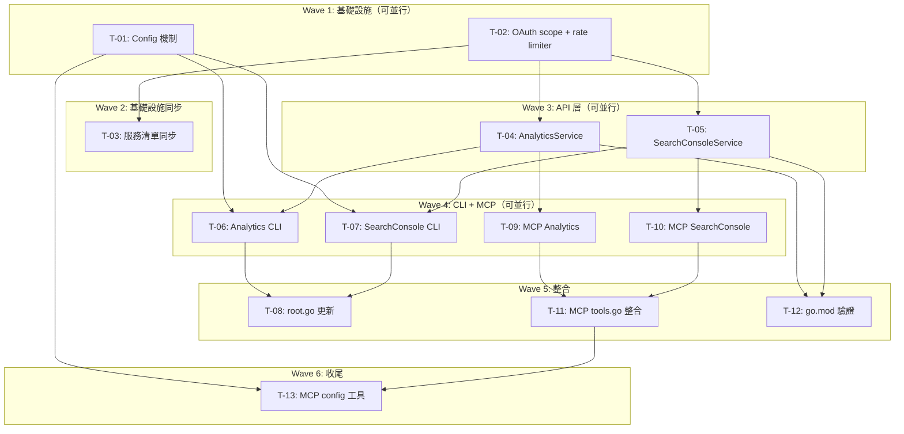

# S3 Implementation Plan: GA4 & Google Search Console 整合

> **階段**: S3 實作計畫
> **建立時間**: 2026-03-19 16:30
> **Agent**: architect (general-purpose)

---

## 1. 概述

### 1.1 功能目標
為 gwx 新增 Google Analytics 4（GA4）和 Google Search Console（GSC）兩個唯讀服務整合，涵蓋 API Service、CLI 命令、MCP 工具、OAuth scope、Config 管理五個層面。

### 1.2 實作範圍
- **範圍內**: GA4 Data API（RunReport, RunRealtimeReport）、GA4 Admin API（ListProperties, ListAudiences）、GSC API（SearchAnalytics, Sites, URL Inspection, Sitemaps, Index Coverage）、CLI 命令、MCP 工具、OAuth scope、Config 管理
- **範圍外**: GA4 Admin 寫入操作、GSC Sitemap 提交、批量 URL Inspection、Dashboard/視覺化

### 1.3 關聯文件
| 文件 | 路徑 | 狀態 |
|------|------|------|
| Brief Spec | `./s0_brief_spec.md` | completed |
| Dev Spec | `./s1_dev_spec.md` | completed |
| Review Report | `./s2_review_report.md` | completed |
| Implementation Plan | `./s3_implementation_plan.md` | 當前 |

---

## 2. 實作任務清單

### 2.1 任務總覽

| # | 任務 | 類型 | Agent | 依賴 | 複雜度 | TDD | 狀態 |
|---|------|------|-------|------|--------|-----|------|
| T-01 | Config 機制（preferences.go + config cmd） | 基礎設施 | `general-purpose` | - | M | ✅ | ⬜ |
| T-02 | OAuth scope + rate limiter 設定 | 基礎設施 | `general-purpose` | - | S | ⛔ | ⬜ |
| T-03 | 服務清單同步（auth/onboard/mcpserver） | 基礎設施 | `general-purpose` | T-02 | S | ⛔ | ⬜ |
| T-04 | AnalyticsService API 層 | API 服務 | `general-purpose` | T-02 | L | ✅ | ⬜ |
| T-05 | SearchConsoleService API 層 | API 服務 | `general-purpose` | T-02 | L | ✅ | ⬜ |
| T-06 | Analytics CLI 命令 | CLI | `general-purpose` | T-01, T-04 | M | ⛔ | ⬜ |
| T-07 | SearchConsole CLI 命令 | CLI | `general-purpose` | T-01, T-05 | M | ⛔ | ⬜ |
| T-08 | root.go CLI struct 更新 | CLI | `general-purpose` | T-06, T-07 | S | ⛔ | ⬜ |
| T-09 | MCP analytics 工具 | MCP | `general-purpose` | T-04 | M | ⛔ | ⬜ |
| T-10 | MCP searchconsole 工具 | MCP | `general-purpose` | T-05 | M | ⛔ | ⬜ |
| T-11 | MCP tools.go 整合 | MCP | `general-purpose` | T-09, T-10 | S | ⛔ | ⬜ |
| T-12 | go.mod 驗證 + 編譯測試 | 驗證 | `general-purpose` | T-04, T-05 | S | ⛔ | ⬜ |
| T-13 | MCP config 工具 | MCP | `general-purpose` | T-01, T-11 | S | ⛔ | ⬜ |

**狀態圖例**：⬜ pending | 🔄 in_progress | ✅ completed | ❌ blocked | ⏭️ skipped

**複雜度**：S（<30min） | M（30min-2hr） | L（>2hr）

**TDD**: ✅ = has tdd_plan | ⛔ = N/A（skip_justification 見任務詳情）

---

## 3. 任務詳情

### Task T-01: Config 機制（preferences.go + config cmd）

**基本資訊**
| 項目 | 內容 |
|------|------|
| 類型 | 基礎設施 |
| Agent | `general-purpose` |
| 複雜度 | M |
| 依賴 | - |
| 狀態 | ⬜ pending |

**描述**
實作 preferences.json 的讀寫機制（`Load`/`Save`/`Get`/`Set`/`Delete`），以及 CLI 命令 `gwx config set <key> <value>`、`gwx config get <key>`、`gwx config list`。檔案位置：`config.Dir()/preferences.json`，格式為 `map[string]string` 的 JSON。

**輸入**
- `internal/config/paths.go` 提供 `config.Dir()` 函式

**輸出**
- `internal/config/preferences.go`：Preferences 讀寫 API
- `internal/config/preferences_test.go`：單元測試
- `internal/cmd/config.go`：CLI 命令

**受影響檔案**
| 檔案 | 變更類型 | 說明 |
|------|---------|------|
| `internal/config/preferences.go` | 新增 | Preferences 讀寫（JSON flat map） |
| `internal/config/preferences_test.go` | 新增 | 單元測試 |
| `internal/cmd/config.go` | 新增 | CLI `gwx config set/get/list` 命令 |

**DoD**
- [ ] `config.Get("key")` 可讀取已設定的值
- [ ] `config.Set("key", "value")` 可寫入值，已存在則覆蓋
- [ ] `config.Delete("key")` 可刪除值
- [ ] 檔案不存在時 `Load` 回傳空 map 不報錯
- [ ] preferences.json 格式損壞（malformed JSON）時 `Load` 不 panic，回傳空 map + slog.Warn
- [ ] `gwx config set`、`gwx config get`、`gwx config list` 三個 CLI 命令可用
- [ ] 每個 CMD 遵循 CheckAllowlist -> DryRun check -> 操作 -> Printer.Success 模式
- [ ] 單元測試覆蓋 Load/Save/Get/Set/Delete

**TDD Plan**
| 項目 | 內容 |
|------|------|
| 測試檔案 | `internal/config/preferences_test.go` |
| 測試指令 | `go test ./internal/config/ -run TestPreferences -v` |
| 預期失敗測試 | TestPreferencesLoad_FileNotExist, TestPreferencesLoad_MalformedJSON, TestPreferencesSetGet, TestPreferencesDelete, TestPreferencesSave_CreateDir |

**驗證方式**
```bash
go test ./internal/config/ -run TestPreferences -v
go build ./internal/cmd/
```

**實作備註**
- 使用 `os.MkdirAll` 確保 config 目錄存在
- `Save` 使用 `os.WriteFile` + `0644` 權限
- `Load` 遇到 `os.ErrNotExist` 回傳空 map；遇到 `json.Unmarshal` 錯誤回傳空 map + `slog.Warn`
- CLI 命令參考 `internal/cmd/gmail.go` 的 CheckAllowlist/EnsureAuth/DryRun 模式
- Config 命令不需 EnsureAuth（純本地檔案操作）

---

### Task T-02: OAuth Scope + Rate Limiter 設定

**基本資訊**
| 項目 | 內容 |
|------|------|
| 類型 | 基礎設施 |
| Agent | `general-purpose` |
| 複雜度 | S |
| 依賴 | - |
| 狀態 | ⬜ pending |

**描述**
在 `ServiceScopes` 和 `ReadOnlyScopes` 新增 `"analytics"` 和 `"searchconsole"` 條目。在 `defaultRates` 新增對應 rate limit 設定。

**輸入**
- 現有 `internal/auth/scopes.go` 的 map 結構
- 現有 `internal/api/ratelimiter.go` 的 defaultRates

**輸出**
- 兩個 map 各新增 2 個 entry

**受影響檔案**
| 檔案 | 變更類型 | 說明 |
|------|---------|------|
| `internal/auth/scopes.go` | 修改 | ServiceScopes + ReadOnlyScopes 新增 analytics, searchconsole |
| `internal/api/ratelimiter.go` | 修改 | defaultRates 新增 analytics, searchconsole |

**DoD**
- [ ] `ServiceScopes["analytics"]` = `analytics.readonly` scope
- [ ] `ServiceScopes["searchconsole"]` = `webmasters.readonly` scope
- [ ] `ReadOnlyScopes` 同上（唯讀服務，兩者相同）
- [ ] `defaultRates["analytics"]` = `rate.Every(500 * time.Millisecond)`
- [ ] `defaultRates["searchconsole"]` = `rate.Every(500 * time.Millisecond)`
- [ ] 現有服務 scope 不受影響

**TDD Plan**: N/A -- 純 map literal 新增條目，無邏輯分支可測。驗證方式為編譯通過 + 現有 scope 測試回歸。

**驗證方式**
```bash
go build ./internal/auth/ ./internal/api/
go test ./internal/auth/ -v
```

---

### Task T-03: 服務清單同步（auth/onboard/mcpserver）

**基本資訊**
| 項目 | 內容 |
|------|------|
| 類型 | 基礎設施 |
| Agent | `general-purpose` |
| 複雜度 | S |
| 依賴 | T-02 |
| 狀態 | ⬜ pending |

**描述**
將 `analytics` 和 `searchconsole` 加入三個硬編碼的服務清單：
1. `auth.go` AuthLoginCmd.Services default 字串
2. `onboard.go` allServices 字串 + default services slice
3. `mcpserver.go` EnsureAuth services slice

**輸入**
- T-02 完成（scope 已定義）

**輸出**
- 三個檔案的服務清單更新

**受影響檔案**
| 檔案 | 變更類型 | 說明 |
|------|---------|------|
| `internal/cmd/auth.go` | 修改 | Services default 新增 analytics, searchconsole |
| `internal/cmd/onboard.go` | 修改 | allServices + default services 新增 |
| `internal/cmd/mcpserver.go` | 修改 | EnsureAuth services 新增 |

**DoD**
- [ ] `gwx auth login` 預設包含 analytics, searchconsole
- [ ] `gwx onboard` 預設包含 analytics, searchconsole
- [ ] MCP server 啟動時 EnsureAuth 包含 analytics, searchconsole
- [ ] 不影響現有服務的認證流程

**TDD Plan**: N/A -- 純字串/slice 新增，無邏輯分支。驗證方式為編譯通過 + `gwx auth login --help` 確認 default。

**驗證方式**
```bash
go build ./internal/cmd/
```

---

### Task T-04: AnalyticsService API 層

**基本資訊**
| 項目 | 內容 |
|------|------|
| 類型 | API 服務 |
| Agent | `general-purpose` |
| 複雜度 | L |
| 依賴 | T-02 |
| 狀態 | ⬜ pending |

**描述**
實作 `AnalyticsService` 及其四個方法：`RunReport`、`RunRealtimeReport`、`ListProperties`、`ListAudiences`。所有方法遵循 WaitRate -> ClientOptions -> NewService -> API call 模式。

- `RunReport` 使用 `analyticsdata/v1beta` 的 `Properties.RunReport`
- `RunRealtimeReport` 使用 `Properties.RunRealtimeReport`
- `ListProperties` 使用 `analyticsadmin/v1alpha` 的 `AccountSummaries.List`（需 flatten AccountSummary -> PropertySummary[]，支援 pageToken 分頁）
- `ListAudiences` 使用 `analyticsadmin/v1alpha` 的 `Properties.Audiences.List`

**輸入**
- T-02 完成（scope + rate limit 已定義）
- `internal/api/client.go` 提供 `Client` struct

**輸出**
- `internal/api/analytics.go`：完整 AnalyticsService
- `internal/api/analytics_test.go`：單元測試

**受影響檔案**
| 檔案 | 變更類型 | 說明 |
|------|---------|------|
| `internal/api/analytics.go` | 新增 | AnalyticsService：GA4 Data API + Admin API 封裝 |
| `internal/api/analytics_test.go` | 新增 | 單元測試 |

**DoD**
- [ ] `RunReport` 正確構建 RunReportRequest 並解析回應為 `[]ReportRow`
- [ ] `RunRealtimeReport` 正確呼叫 RunRealtimeReport RPC
- [ ] `ListProperties` 回傳 `[]PropertySummary`（flatten AccountSummaries，支援 pageToken）
- [ ] `ListAudiences` 回傳 `[]AudienceSummary`，v1alpha 錯誤有友善訊息
- [ ] 所有方法呼叫前有 WaitRate
- [ ] 錯誤訊息包含足夠上下文（方法名、property ID）

**TDD Plan**
| 項目 | 內容 |
|------|------|
| 測試檔案 | `internal/api/analytics_test.go` |
| 測試指令 | `go test ./internal/api/ -run TestAnalytics -v` |
| 預期失敗測試 | TestAnalyticsRunReport_BuildRequest, TestAnalyticsRunReport_ParseResponse, TestAnalyticsListProperties_Flatten, TestAnalyticsListAudiences_V1AlphaError |

**驗證方式**
```bash
go test ./internal/api/ -run TestAnalytics -v
go vet ./internal/api/
```

**實作備註**
- 參考 `internal/api/gmail.go` 的 Service 模式
- `ListProperties` 需遍歷所有 AccountSummary 並 flatten 其 PropertySummaries
- `ListAudiences` 加入版本註解 `// NOTE: v1alpha -- may break on API update`
- 錯誤處理：403 insufficient_scope 回傳明確提示重新授權

---

### Task T-05: SearchConsoleService API 層

**基本資訊**
| 項目 | 內容 |
|------|------|
| 類型 | API 服務 |
| Agent | `general-purpose` |
| 複雜度 | L |
| 依賴 | T-02 |
| 狀態 | ⬜ pending |

**描述**
實作 `SearchConsoleService` 及其五個方法：`Query`、`ListSites`、`InspectURL`、`ListSitemaps`、`GetIndexStatus`。

- `Query` 使用 `searchconsole/v1` 的 `SearchAnalytics.Query`
- `ListSites` 使用 `Sites.List`
- `InspectURL` 使用 `UrlInspection.Index.Inspect`（2K/day 配額）
- `ListSitemaps` 使用 `Sitemaps.List`
- `GetIndexStatus` 使用 SearchAnalytics 數據近似索引狀態

**輸入**
- T-02 完成（scope + rate limit 已定義）
- `internal/api/client.go` 提供 `Client` struct

**輸出**
- `internal/api/searchconsole.go`：完整 SearchConsoleService
- `internal/api/searchconsole_test.go`：單元測試

**受影響檔案**
| 檔案 | 變更類型 | 說明 |
|------|---------|------|
| `internal/api/searchconsole.go` | 新增 | SearchConsoleService：GSC API 封裝 |
| `internal/api/searchconsole_test.go` | 新增 | 單元測試 |

**DoD**
- [ ] `Query` 正確構建 SearchAnalyticsQueryRequest 並解析回應
- [ ] `ListSites` 回傳 `[]SiteSummary`
- [ ] `InspectURL` 回傳 `URLInspectionResult`，方法內含 quota 警告註解
- [ ] `ListSitemaps` 回傳 `[]SitemapInfo`
- [ ] `GetIndexStatus` 回傳近似索引狀態
- [ ] 所有方法呼叫前有 WaitRate

**TDD Plan**
| 項目 | 內容 |
|------|------|
| 測試檔案 | `internal/api/searchconsole_test.go` |
| 測試指令 | `go test ./internal/api/ -run TestSearchConsole -v` |
| 預期失敗測試 | TestSearchConsoleQuery_BuildRequest, TestSearchConsoleQuery_ParseResponse, TestSearchConsoleListSites, TestSearchConsoleInspectURL, TestSearchConsoleGetIndexStatus |

**驗證方式**
```bash
go test ./internal/api/ -run TestSearchConsole -v
go vet ./internal/api/
```

**實作備註**
- 參考 `internal/api/gmail.go` 的 Service 模式
- `InspectURL` 加入配額警告註解 `// NOTE: 2000 requests/day quota`
- `GetIndexStatus` 使用 SearchAnalytics query 近似（無直接 API）

---

### Task T-06: Analytics CLI 命令

**基本資訊**
| 項目 | 內容 |
|------|------|
| 類型 | CLI |
| Agent | `general-purpose` |
| 複雜度 | M |
| 依賴 | T-01, T-04 |
| 狀態 | ⬜ pending |

**描述**
實作 CLI 命令結構：`gwx analytics report|realtime|properties|audiences`。每個 Run 方法遵循 CheckAllowlist -> EnsureAuth -> DryRun -> 讀取 config default property -> Service call -> Printer.Success。`--property` 若未提供，從 `config.Get("analytics.default-property")` 讀取。

**輸入**
- T-01 完成（config 機制可用）
- T-04 完成（AnalyticsService API 可用）

**輸出**
- `internal/cmd/analytics.go`：CLI 命令群組

**受影響檔案**
| 檔案 | 變更類型 | 說明 |
|------|---------|------|
| `internal/cmd/analytics.go` | 新增 | CLI `gwx analytics` 命令群組 |

**DoD**
- [ ] `gwx analytics report` 可執行（含 --property 和 config default 兩條路徑）
- [ ] `gwx analytics realtime` 可執行
- [ ] `gwx analytics properties` 可執行（不需 property 參數）
- [ ] `gwx analytics audiences` 可執行
- [ ] 所有命令遵循 CheckAllowlist -> EnsureAuth -> DryRun 模式
- [ ] 未提供 property 且 config 無 default 時，回傳清楚錯誤訊息
- [ ] `--help` 輸出完整命令說明

**TDD Plan**: N/A -- CLI 命令為薄層膠水（CheckAllowlist -> EnsureAuth -> DryRun -> Service call -> Printer），核心邏輯在 T-04 已測。驗證方式為編譯通過 + dry-run 測試。

**驗證方式**
```bash
go build ./internal/cmd/
# dry-run 測試（不需真實 API）
```

---

### Task T-07: SearchConsole CLI 命令

**基本資訊**
| 項目 | 內容 |
|------|------|
| 類型 | CLI |
| Agent | `general-purpose` |
| 複雜度 | M |
| 依賴 | T-01, T-05 |
| 狀態 | ⬜ pending |

**描述**
實作 CLI 命令結構：`gwx searchconsole query|sites|inspect|sitemaps|index-status`。`--site` 若未提供，從 `config.Get("searchconsole.default-site")` 讀取。

**輸入**
- T-01 完成（config 機制可用）
- T-05 完成（SearchConsoleService API 可用）

**輸出**
- `internal/cmd/searchconsole.go`：CLI 命令群組

**受影響檔案**
| 檔案 | 變更類型 | 說明 |
|------|---------|------|
| `internal/cmd/searchconsole.go` | 新增 | CLI `gwx searchconsole` 命令群組 |

**DoD**
- [ ] `gwx searchconsole query` 可執行（含 --site 和 config default 兩條路徑）
- [ ] `gwx searchconsole sites` 可執行（不需 site 參數）
- [ ] `gwx searchconsole inspect <url>` 可執行
- [ ] `gwx searchconsole sitemaps` 可執行
- [ ] `gwx searchconsole index-status` 可執行
- [ ] 所有命令遵循 CheckAllowlist -> EnsureAuth -> DryRun 模式
- [ ] 未提供 site 且 config 無 default 時，回傳清楚錯誤訊息

**TDD Plan**: N/A -- 同 T-06，CLI 薄層膠水。核心邏輯在 T-05 已測。

**驗證方式**
```bash
go build ./internal/cmd/
```

---

### Task T-08: root.go CLI Struct 更新

**基本資訊**
| 項目 | 內容 |
|------|------|
| 類型 | CLI |
| Agent | `general-purpose` |
| 複雜度 | S |
| 依賴 | T-06, T-07 |
| 狀態 | ⬜ pending |

**描述**
在 CLI struct 的 Service commands 區塊新增 `Analytics`、`SearchConsole`、`Config` 三個欄位（Kong struct tag）。

**輸入**
- T-06, T-07 完成（CLI command struct 已定義）

**輸出**
- `internal/cmd/root.go` 新增三個 Cmd 欄位

**受影響檔案**
| 檔案 | 變更類型 | 說明 |
|------|---------|------|
| `internal/cmd/root.go` | 修改 | CLI struct 新增 Analytics, SearchConsole, Config 欄位 |

**DoD**
- [ ] `gwx analytics --help` 可用
- [ ] `gwx searchconsole --help` 可用
- [ ] `gwx config --help` 可用
- [ ] 現有命令不受影響

**TDD Plan**: N/A -- 純 struct 欄位新增，Kong parser additive。驗證方式為 `gwx --help` 確認。

**驗證方式**
```bash
go build ./...
# gwx --help 列出 analytics, searchconsole, config
```

---

### Task T-09: MCP Analytics 工具

**基本資訊**
| 項目 | 內容 |
|------|------|
| 類型 | MCP |
| Agent | `general-purpose` |
| 複雜度 | M |
| 依賴 | T-04 |
| 狀態 | ⬜ pending |

**描述**
定義 4 個 MCP 工具：`analytics_report`、`analytics_realtime`、`analytics_properties`、`analytics_audiences`。實作 `AnalyticsTools() []Tool` + `CallAnalyticsTool(ctx, name, args) (*ToolResult, error, bool)` + handler methods。property 參數支援 config default fallback。

**輸入**
- T-04 完成（AnalyticsService API 可用）

**輸出**
- `internal/mcp/tools_analytics.go`：MCP 工具定義 + 實作

**受影響檔案**
| 檔案 | 變更類型 | 說明 |
|------|---------|------|
| `internal/mcp/tools_analytics.go` | 新增 | MCP analytics_* 工具定義 + 實作 |

**DoD**
- [ ] `AnalyticsTools()` 回傳 4 個工具定義，InputSchema 完整
- [ ] `CallAnalyticsTool` 正確路由到對應 handler
- [ ] 每個 handler 遵循 Service call -> jsonResult 模式
- [ ] property 支援 config default fallback

**TDD Plan**: N/A -- MCP 工具為薄層委派（接收 args -> 調用 Service -> 回傳 JSON），核心邏輯在 T-04 已測。現有 MCP 工具也無單元測試（延續 codebase 慣例）。

**驗證方式**
```bash
go build ./internal/mcp/
```

---

### Task T-10: MCP SearchConsole 工具

**基本資訊**
| 項目 | 內容 |
|------|------|
| 類型 | MCP |
| Agent | `general-purpose` |
| 複雜度 | M |
| 依賴 | T-05 |
| 狀態 | ⬜ pending |

**描述**
定義 5 個 MCP 工具：`searchconsole_query`、`searchconsole_sites`、`searchconsole_inspect`、`searchconsole_sitemaps`、`searchconsole_index_status`。實作 `SearchConsoleTools() []Tool` + `CallSearchConsoleTool(ctx, name, args) (*ToolResult, error, bool)` + handler methods。

**輸入**
- T-05 完成（SearchConsoleService API 可用）

**輸出**
- `internal/mcp/tools_searchconsole.go`：MCP 工具定義 + 實作

**受影響檔案**
| 檔案 | 變更類型 | 說明 |
|------|---------|------|
| `internal/mcp/tools_searchconsole.go` | 新增 | MCP searchconsole_* 工具定義 + 實作 |

**DoD**
- [ ] `SearchConsoleTools()` 回傳 5 個工具定義，InputSchema 完整
- [ ] `CallSearchConsoleTool` 正確路由到對應 handler
- [ ] site 支援 config default fallback

**TDD Plan**: N/A -- 同 T-09，MCP 薄層委派。

**驗證方式**
```bash
go build ./internal/mcp/
```

---

### Task T-11: MCP tools.go 整合

**基本資訊**
| 項目 | 內容 |
|------|------|
| 類型 | MCP |
| Agent | `general-purpose` |
| 複雜度 | S |
| 依賴 | T-09, T-10 |
| 狀態 | ⬜ pending |

**描述**
在 `tools.go` 的 `ListTools()` 末尾追加 `AnalyticsTools()` 和 `SearchConsoleTools()`。在 `CallTool()` 的 default 區塊新增 `CallAnalyticsTool` 和 `CallSearchConsoleTool` 委派。

**輸入**
- T-09, T-10 完成（工具函式已定義）

**輸出**
- `internal/mcp/tools.go` 修改（ListTools + CallTool 鏈）

**受影響檔案**
| 檔案 | 變更類型 | 說明 |
|------|---------|------|
| `internal/mcp/tools.go` | 修改 | ListTools append + CallTool default 新增委派 |

**DoD**
- [ ] MCP ListTools 回傳包含所有 analytics_* 和 searchconsole_* 工具
- [ ] MCP CallTool 可路由到 analytics/searchconsole handler
- [ ] 現有工具不受影響（回歸）

**TDD Plan**: N/A -- 純 append + 委派接線，無邏輯分支。

**驗證方式**
```bash
go build ./internal/mcp/
```

---

### Task T-12: go.mod 驗證 + 編譯測試

**基本資訊**
| 項目 | 內容 |
|------|------|
| 類型 | 驗證 |
| Agent | `general-purpose` |
| 複雜度 | S |
| 依賴 | T-04, T-05 |
| 狀態 | ⬜ pending |

**描述**
驗證 `google.golang.org/api v0.272.0` 的子包 `analyticsdata/v1beta`、`analyticsadmin/v1alpha`、`searchconsole/v1` 可正常 import。執行全專案 build + test + vet。

**輸入**
- T-04, T-05 完成（import 已使用子包）

**輸出**
- `go.mod` / `go.sum` 可能更新（go mod tidy）
- 編譯、測試、靜態分析全部通過

**受影響檔案**
| 檔案 | 變更類型 | 說明 |
|------|---------|------|
| `go.mod` | 修改（可能） | go mod tidy |
| `go.sum` | 修改（可能） | 依賴校驗 |

**DoD**
- [ ] 三個子包 import 不報錯
- [ ] `go build ./...` 成功
- [ ] `go test ./...` 全部通過
- [ ] `go vet ./...` 無警告

**TDD Plan**: N/A -- 本任務本身就是驗證任務，非功能實作。

**驗證方式**
```bash
go mod tidy
go build ./...
go test ./...
go vet ./...
```

---

### Task T-13: MCP Config 工具

**基本資訊**
| 項目 | 內容 |
|------|------|
| 類型 | MCP |
| Agent | `general-purpose` |
| 複雜度 | S |
| 依賴 | T-01, T-11 |
| 狀態 | ⬜ pending |

**描述**
定義 3 個 MCP 工具：`config_set`、`config_get`、`config_list`。實作 `ConfigTools() []Tool` + `CallConfigTool(ctx, name, args) (*ToolResult, error, bool)` + handler methods。在 `tools.go` 追加 ConfigTools 到 ListTools 和 CallTool 鏈。

**輸入**
- T-01 完成（config preferences API 可用）
- T-11 完成（tools.go 整合模式可參考）

**輸出**
- `internal/mcp/tools_config.go`：MCP config 工具
- `internal/mcp/tools.go` 修改（追加 config 委派）

**受影響檔案**
| 檔案 | 變更類型 | 說明 |
|------|---------|------|
| `internal/mcp/tools_config.go` | 新增 | MCP config_* 工具定義 + 實作 |
| `internal/mcp/tools.go` | 修改 | ListTools + CallTool 追加 config 委派 |

**DoD**
- [ ] `ConfigTools()` 回傳 3 個工具定義，InputSchema 完整
- [ ] `CallConfigTool` 正確路由到對應 handler
- [ ] MCP ListTools 包含 config_* 工具
- [ ] config_set 接受 key + value 參數，回傳設定結果

**TDD Plan**: N/A -- MCP 薄層委派，config 核心邏輯在 T-01 已測。

**驗證方式**
```bash
go build ./internal/mcp/
```

---

## 4. 依賴關係圖



---

## 5. 執行順序與 Agent 分配

### 5.1 執行波次

| 波次 | 任務 | Agent | 可並行 | 備註 |
|------|------|-------|--------|------|
| Wave 1 | T-01, T-02 | `general-purpose` | 是（互不依賴） | 基礎設施，無外部依賴 |
| Wave 2 | T-03 | `general-purpose` | 否 | 依賴 T-02，純字串修改，極快 |
| Wave 3 | T-04, T-05 | `general-purpose` | 是（互不依賴） | 核心 API 層，本案最大工作量 |
| Wave 4 | T-06, T-07, T-09, T-10 | `general-purpose` | 是（四任務互不依賴） | CLI 和 MCP 可完全並行 |
| Wave 5 | T-08, T-11, T-12 | `general-purpose` | 是（互不依賴） | 整合接線 + 驗證 |
| Wave 6 | T-13 | `general-purpose` | 否 | 收尾，依賴 T-01 + T-11 |

### 5.2 Agent 調度指令

```
# Wave 1 — 並行
Task(agent: "general-purpose", task: "T-01", description: "S4-T01 Config 機制")
Task(agent: "general-purpose", task: "T-02", description: "S4-T02 OAuth scope + rate limiter")

# Wave 2
Task(agent: "general-purpose", task: "T-03", description: "S4-T03 服務清單同步")

# Wave 3 — 並行
Task(agent: "general-purpose", task: "T-04", description: "S4-T04 AnalyticsService API")
Task(agent: "general-purpose", task: "T-05", description: "S4-T05 SearchConsoleService API")

# Wave 4 — 並行
Task(agent: "general-purpose", task: "T-06", description: "S4-T06 Analytics CLI")
Task(agent: "general-purpose", task: "T-07", description: "S4-T07 SearchConsole CLI")
Task(agent: "general-purpose", task: "T-09", description: "S4-T09 MCP Analytics 工具")
Task(agent: "general-purpose", task: "T-10", description: "S4-T10 MCP SearchConsole 工具")

# Wave 5 — 並行
Task(agent: "general-purpose", task: "T-08", description: "S4-T08 root.go 更新")
Task(agent: "general-purpose", task: "T-11", description: "S4-T11 MCP tools.go 整合")
Task(agent: "general-purpose", task: "T-12", description: "S4-T12 go.mod 驗證")

# Wave 6
Task(agent: "general-purpose", task: "T-13", description: "S4-T13 MCP config 工具")
```

---

## 6. 驗證計畫

### 6.1 逐任務驗證

| 任務 | 驗證指令 | 預期結果 |
|------|---------|---------|
| T-01 | `go test ./internal/config/ -run TestPreferences -v` | Tests passed |
| T-02 | `go build ./internal/auth/ ./internal/api/` | Build succeeded |
| T-03 | `go build ./internal/cmd/` | Build succeeded |
| T-04 | `go test ./internal/api/ -run TestAnalytics -v` | Tests passed |
| T-05 | `go test ./internal/api/ -run TestSearchConsole -v` | Tests passed |
| T-06 | `go build ./internal/cmd/` | Build succeeded |
| T-07 | `go build ./internal/cmd/` | Build succeeded |
| T-08 | `go build ./...` | Build succeeded |
| T-09 | `go build ./internal/mcp/` | Build succeeded |
| T-10 | `go build ./internal/mcp/` | Build succeeded |
| T-11 | `go build ./internal/mcp/` | Build succeeded |
| T-12 | `go build ./... && go test ./... && go vet ./...` | All passed |
| T-13 | `go build ./internal/mcp/` | Build succeeded |

### 6.2 整體驗證

```bash
# 全專案編譯
go build ./...

# 全專案測試
go test ./...

# 靜態分析
go vet ./...

# 依賴整理
go mod tidy
```

---

## 7. 實作進度追蹤

### 7.1 進度總覽

| 指標 | 數值 |
|------|------|
| 總任務數 | 13 |
| 已完成 | 0 |
| 進行中 | 0 |
| 待處理 | 13 |
| 完成率 | 0% |

### 7.2 時間軸

| 時間 | 事件 | 備註 |
|------|------|------|
| 2026-03-19 16:30 | S3 Implementation Plan 產出 | |
| | | |

---

## 8. 變更記錄

### 8.1 檔案變更清單

```
新增：
  internal/config/preferences.go
  internal/config/preferences_test.go
  internal/cmd/config.go
  internal/cmd/analytics.go
  internal/cmd/searchconsole.go
  internal/api/analytics.go
  internal/api/analytics_test.go
  internal/api/searchconsole.go
  internal/api/searchconsole_test.go
  internal/mcp/tools_analytics.go
  internal/mcp/tools_searchconsole.go
  internal/mcp/tools_config.go

修改：
  internal/auth/scopes.go
  internal/api/ratelimiter.go
  internal/cmd/auth.go
  internal/cmd/onboard.go
  internal/cmd/mcpserver.go
  internal/cmd/root.go
  internal/mcp/tools.go
  go.mod
  go.sum
```

### 8.2 Commit 記錄

| Commit | 訊息 | 關聯任務 |
|--------|------|---------|
| | | |

---

## 9. 風險與問題追蹤

### 9.1 已識別風險

| # | 風險 | 影響 | 緩解措施 | 狀態 |
|---|------|------|---------|------|
| 1 | OAuth scope 重新授權 | 高 | CHANGELOG 明確說明；報錯時提示 re-auth 命令 | 監控中 |
| 2 | GA4 Admin v1alpha 介面變動 | 中 | 版本註解 + 友善錯誤訊息；ListAudiences 為 P1 | 監控中 |
| 3 | GSC URL Inspection 2K/day 配額 | 中 | help text + MCP description 標示配額 | 監控中 |
| 4 | MCP server EnsureAuth 擴大 | 中 | EnsureAuth 有 fallback；GWX_ACCESS_TOKEN 環境變數 | 監控中 |
| 5 | Google Cloud Project 未啟用新 API | 中 | 文件說明需在 GCP Console 啟用 API | 監控中 |

### 9.2 問題記錄

| # | 問題 | 發現時間 | 狀態 | 解決方案 |
|---|------|---------|------|---------|
| | | | | |

---

## 附錄

### A. 相關文件
- S0 Brief Spec: `./s0_brief_spec.md`
- S1 Dev Spec: `./s1_dev_spec.md`
- S2 Review Report: `./s2_review_report.md`

### B. 參考資料
- [GA4 Data API v1beta](https://developers.google.com/analytics/devguides/reporting/data/v1)
- [GA4 Admin API v1alpha](https://developers.google.com/analytics/devguides/config/admin/v1)
- [Google Search Console API v1](https://developers.google.com/webmaster-tools/v1/api_reference_index)
- [google.golang.org/api](https://pkg.go.dev/google.golang.org/api)

### C. 專案規範提醒

#### Go 後端
- 所有 API Service 遵循 `WaitRate -> ClientOptions -> NewService -> API call` 模式（參考 `internal/api/gmail.go`）
- 所有 CLI 命令遵循 `CheckAllowlist -> EnsureAuth -> DryRun -> Service call -> Printer.Success` 模式
- MCP 工具遵循鏈式委派模式：`XxxTools() []Tool` + `CallXxxTool(ctx, name, args) (*ToolResult, error, bool)`
- 錯誤處理使用 `fmt.Errorf("method_name: %w", err)` 格式
- 測試使用 `testing` 標準庫，測試函式名稱 `TestXxx_Scenario`
- struct tag 使用 Kong 語法：`` `cmd:"" help:"..."` ``

---

## SDD Context

```json
{
  "sdd_context": {
    "stages": {
      "s3": {
        "status": "pending_confirmation",
        "agent": "architect",
        "started_at": "2026-03-19T16:30:00+08:00",
        "completed_at": "2026-03-19T16:30:00+08:00",
        "output": {
          "implementation_plan_path": "dev/specs/2026-03-19_1_ga4-gsc-integration/s3_implementation_plan.md",
          "waves": [
            {
              "wave": 1,
              "name": "基礎設施",
              "tasks": [
                { "id": "T-01", "name": "Config 機制", "agent": "general-purpose", "dependencies": [], "complexity": "M", "parallel": true },
                { "id": "T-02", "name": "OAuth scope + rate limiter", "agent": "general-purpose", "dependencies": [], "complexity": "S", "parallel": true }
              ],
              "parallel": true
            },
            {
              "wave": 2,
              "name": "基礎設施同步",
              "tasks": [
                { "id": "T-03", "name": "服務清單同步", "agent": "general-purpose", "dependencies": ["T-02"], "complexity": "S", "parallel": false }
              ],
              "parallel": false
            },
            {
              "wave": 3,
              "name": "API 層",
              "tasks": [
                { "id": "T-04", "name": "AnalyticsService", "agent": "general-purpose", "dependencies": ["T-02"], "complexity": "L", "parallel": true },
                { "id": "T-05", "name": "SearchConsoleService", "agent": "general-purpose", "dependencies": ["T-02"], "complexity": "L", "parallel": true }
              ],
              "parallel": true
            },
            {
              "wave": 4,
              "name": "CLI + MCP",
              "tasks": [
                { "id": "T-06", "name": "Analytics CLI", "agent": "general-purpose", "dependencies": ["T-01", "T-04"], "complexity": "M", "parallel": true },
                { "id": "T-07", "name": "SearchConsole CLI", "agent": "general-purpose", "dependencies": ["T-01", "T-05"], "complexity": "M", "parallel": true },
                { "id": "T-09", "name": "MCP Analytics 工具", "agent": "general-purpose", "dependencies": ["T-04"], "complexity": "M", "parallel": true },
                { "id": "T-10", "name": "MCP SearchConsole 工具", "agent": "general-purpose", "dependencies": ["T-05"], "complexity": "M", "parallel": true }
              ],
              "parallel": true
            },
            {
              "wave": 5,
              "name": "整合",
              "tasks": [
                { "id": "T-08", "name": "root.go 更新", "agent": "general-purpose", "dependencies": ["T-06", "T-07"], "complexity": "S", "parallel": true },
                { "id": "T-11", "name": "MCP tools.go 整合", "agent": "general-purpose", "dependencies": ["T-09", "T-10"], "complexity": "S", "parallel": true },
                { "id": "T-12", "name": "go.mod 驗證", "agent": "general-purpose", "dependencies": ["T-04", "T-05"], "complexity": "S", "parallel": true }
              ],
              "parallel": true
            },
            {
              "wave": 6,
              "name": "收尾",
              "tasks": [
                { "id": "T-13", "name": "MCP config 工具", "agent": "general-purpose", "dependencies": ["T-01", "T-11"], "complexity": "S", "parallel": false }
              ],
              "parallel": false
            }
          ],
          "total_tasks": 13,
          "estimated_waves": 6,
          "verification": {
            "static_analysis": ["go vet ./..."],
            "unit_tests": ["go test ./..."],
            "build": ["go build ./..."]
          }
        }
      }
    }
  }
}
```
