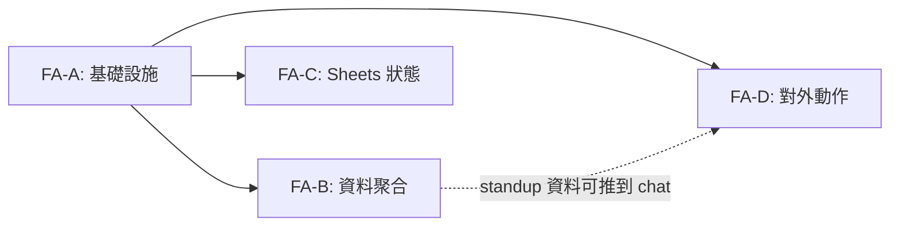
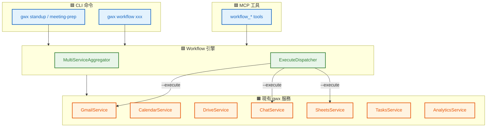
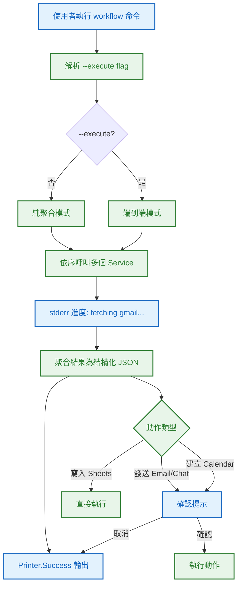
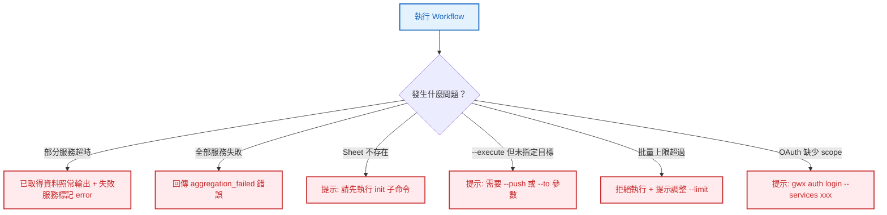

# S0 Brief Spec: 內建 Workflow Skills

> **階段**: S0 需求討論
> **建立時間**: 2026-03-19 19:00
> **Agent**: requirement-analyst
> **Spec Mode**: Full Spec
> **工作類型**: new_feature

---

## 0. 工作類型

**本次工作類型**：`new_feature`

## 1. 一句話描述

將 gwx 的 13 個 workflow（8 Combo Skills + 5 Recipes）內建為 CLI 命令 + MCP 工具，預設輸出結構化 JSON，加 `--execute` 可端到端執行。

## 2. 為什麼要做

### 2.1 痛點

- **依賴 Claude Code**：目前 workflow 只能在 Claude Code 的 slash command 中使用，Codex、GPT、自建 Agent 都無法觸發
- **不可程式化**：markdown 定義的 workflow 無法被 shell script、cron job、CI/CD 呼叫
- **資料聚合手動**：每次要跨服務彙整資料，都需要手動跑多個 `gwx` 命令再自己拼接

### 2.2 目標

- 任何 Agent 或人類都能透過 `gwx standup` / `gwx workflow test-matrix` 一行觸發跨服務工作流
- MCP 工具讓 Claude 直接呼叫 `workflow_standup`、`workflow_meeting_prep` 等
- `--execute` flag 啟用端到端模式（含發送/寫入），預設只做資料聚合

## 3. 使用者

| 角色 | 說明 |
|------|------|
| CLI 使用者（人類） | 終端直接執行 workflow 命令，或加到 cron |
| Claude Agent（MCP） | 透過 MCP 工具自動觸發 workflow |
| 其他 Agent（Bash） | 透過 `gwx workflow xxx` 指令呼叫 |

## 4. 核心流程

### 4.0 功能區拆解（Functional Area Decomposition）

#### 功能區識別表

| FA ID | 功能區名稱 | 一句話描述 | 入口 | 獨立性 |
|-------|-----------|-----------|------|--------|
| FA-A | Workflow 基礎設施 | workflow 命令群組、多服務聚合框架、--execute 機制、進度輸出 | `gwx workflow` | 低（被其他 FA 依賴） |
| FA-B | 資料聚合型 Workflow | standup、meeting-prep、weekly-digest、context-boost、bug-intake | `gwx standup` / `gwx workflow xxx` | 中 |
| FA-C | Sheets 狀態型 Workflow | test-matrix、spec-health、sprint-board | `gwx workflow xxx` | 中 |
| FA-D | 對外動作型 Workflow | review-notify、email-from-doc、sheet-to-email、parallel-schedule | `gwx workflow xxx` | 中 |

#### 拆解策略

**本次策略**：`single_sop_fa_labeled`

4 個 FA，中獨立性，共用基礎設施（FA-A）。一份 spec，S3 波次按 FA 分組。

#### 跨功能區依賴



| 來源 FA | 目標 FA | 依賴類型 | 說明 |
|---------|---------|---------|------|
| FA-A | FA-B/C/D | 基礎設施 | 所有 workflow 共用聚合框架和 --execute 機制 |
| FA-B | FA-D | 資料流 | standup 的 --execute 可推到 Chat/Email |

---

### 4.1 系統架構總覽



**架構重點**：

| 層級 | 組件 | 職責 |
|------|------|------|
| **CLI** | 頂層命令 + `gwx workflow` 群組 | 參數解析、路由到 workflow 引擎 |
| **MCP** | `workflow_*` 工具 | Agent 呼叫介面 |
| **Workflow 引擎** | `internal/workflow/` | 多服務聚合、--execute 分派、進度輸出 |
| **現有服務** | `internal/api/*Service` | 實際 API 呼叫（已存在，不需修改） |

---

### 4.2 FA-A: Workflow 基礎設施

#### 4.2.1 全局流程圖



**技術細節**：
- `MultiServiceAggregator`：封裝「呼叫多個 Service → 聚合結果 → 部分失敗處理」的通用邏輯
- 進度輸出到 stderr（不污染 JSON stdout）
- `--execute` 觸發 `ExecuteDispatcher`，依安全等級決定是否需要確認

#### 4.2.N Happy Path 摘要

| 路徑 | 入口 | 結果 |
|------|------|------|
| **A：純聚合** | `gwx standup` | 輸出結構化 JSON |
| **B：端到端** | `gwx standup --execute --push chat:spaces/AAAA` | 聚合 + 發送到 Chat |

---

### 4.3 FA-B: 資料聚合型 Workflow（5 個）

#### 4.3.1 Workflow 清單

| # | CLI 命令 | MCP 工具 | 聚合的服務 | 說明 |
|---|---------|----------|-----------|------|
| 1 | `gwx standup` | `workflow_standup` | Git + Gmail + Calendar + Tasks | 每日站會報告 |
| 2 | `gwx meeting-prep EVENT_ID` | `workflow_meeting_prep` | Calendar + Gmail + Contacts + Drive | 會議準備資料 |
| 3 | `gwx workflow weekly-digest` | `workflow_weekly_digest` | Gmail + Calendar + Tasks | 每週摘要 |
| 4 | `gwx workflow context-boost TOPIC` | `workflow_context_boost` | Gmail + Drive + Calendar | 主題上下文彙整 |
| 5 | `gwx workflow bug-intake` | `workflow_bug_intake` | Gmail | Bug 信件搜尋與結構化提取 |

#### 4.3.2 各 Workflow 資料流

**standup**：
```
Git log (shell) → 昨日 commits
Gmail digest → 昨日寄送/收到的重要信件
Calendar agenda → 今日會議
Tasks list → 待辦事項
→ 聚合為 { done: [...], plan: [...], blockers: [...] }
```

**meeting-prep**：
```
Calendar get EVENT_ID → 會議資訊 + 與會者
Contacts search → 與會者詳情
Gmail search → 與該會議/與會者相關的近期信件
Drive search → 相關文件
→ 聚合為 { meeting: {...}, attendees: [...], recent_emails: [...], related_docs: [...] }
```

**weekly-digest**：
```
Gmail digest (7 days) → 本週信件摘要
Calendar list (7 days) → 本週會議
Tasks list (completed) → 已完成待辦
→ 聚合為 { emails: {...}, meetings: [...], completed_tasks: [...] }
```

**context-boost**：
```
Gmail search TOPIC → 相關信件
Drive search TOPIC → 相關文件
Calendar list (14 days) → 可能相關的會議
→ 聚合為 { topic, emails: [...], docs: [...], meetings: [...] }
```

**bug-intake**：
```
Gmail search "bug OR error OR crash OR issue" → 候選信件
→ 聚合為 { candidates: [{ subject, from, date, body_preview, extracted: { steps, expected, actual } }] }
```

#### 4.3.N Happy Path 摘要

| 路徑 | 入口 | 結果 |
|------|------|------|
| standup | `gwx standup` | JSON: done/plan/blockers |
| standup --execute | `gwx standup --execute --push chat:spaces/X` | 聚合 + 發送 Chat 訊息 |
| meeting-prep | `gwx meeting-prep EVENT_ID` | JSON: meeting/attendees/emails/docs |
| context-boost | `gwx workflow context-boost "invoice"` | JSON: emails/docs/meetings about topic |
| bug-intake | `gwx workflow bug-intake --after 2026-03-15` | JSON: candidate bug emails |

---

### 4.4 FA-C: Sheets 狀態型 Workflow（3 個）

#### 4.4.1 Workflow 清單

| # | CLI 命令 | MCP 工具 | 操作 | 說明 |
|---|---------|----------|------|------|
| 1 | `gwx workflow test-matrix` | `workflow_test_matrix` | Sheets CRUD | 測試進度追蹤 |
| 2 | `gwx workflow spec-health` | `workflow_spec_health` | Sheets CRUD | Spec 品質儀表板 |
| 3 | `gwx workflow sprint-board` | `workflow_sprint_board` | Sheets CRUD | Sprint 看板 |

#### 4.4.2 共用模式

所有 Sheets workflow 遵循相同模式：
1. `init` 子命令：建立 Sheet（含預設欄位結構）
2. `sync` / `update` 子命令：更新資料
3. `stats` 子命令：讀取統計
4. Sheet ID 記錄在 `config.Set("workflow.{name}.sheet-id", ID)`

```
gwx workflow test-matrix init --feature "invoice"     → 建立 Sheet，存 ID 到 config
gwx workflow test-matrix sync SPEC_FOLDER             → 從 S3 plan 同步測試案例
gwx workflow test-matrix stats                        → 讀取測試進度統計
```

---

### 4.5 FA-D: 對外動作型 Workflow（5 個）

#### 4.5.1 Workflow 清單

| # | CLI 命令 | MCP 工具 | 動作 | 安全等級 |
|---|---------|----------|------|---------|
| 1 | `gwx workflow review-notify` | `workflow_review_notify` | 發送 Chat/Email | 🔴 |
| 2 | `gwx workflow email-from-doc DOC_ID` | `workflow_email_from_doc` | Docs → Email | 🔴 |
| 3 | `gwx workflow sheet-to-email SHEET_ID` | `workflow_sheet_to_email` | Sheets → 批量 Email | 🔴 |
| 4 | `gwx workflow parallel-schedule` | `workflow_parallel_schedule` | 建立 Calendar 事件 | 🟡 |
| 5 | `gwx standup --execute --push` | （standup 的 execute 模式） | 發送到 Chat/Email | 🔴 |

#### 4.5.2 安全機制

- 所有 🔴 動作必須 `--execute` flag 才會執行
- 執行前顯示完整預覽（收件人、內容摘要）
- MCP 工具的 description 明確標示 `CAUTION: sends real messages`
- `sheet-to-email` 強制 `--limit 50` 上限

---

### 4.6 例外流程圖



### 4.7 六維度例外清單

| 維度 | ID | FA | 情境 | 觸發條件 | 預期行為 | 嚴重度 |
|------|-----|-----|------|---------|---------|--------|
| 並行 | E1 | 全域 | 多 workflow 同時搶 rate limit | 併發跑 standup + meeting-prep | 共用 per-service rate limiter 排隊 | P2 |
| 狀態 | E2 | FA-C | Sheet 被手動刪除 | Sheets workflow 引用已刪除的 Sheet | 回傳 not_found + 建議重建 | P1 |
| 資料邊界 | E3 | FA-B | 搜尋結果為空 | Gmail 沒信、Calendar 沒會議 | 回傳空陣列 + 提示，不報錯 | P2 |
| 網路 | E4 | 全域 | 聚合中某服務超時 | 多服務呼叫中一個掛了 | 部分成功：已取得照輸出，失敗標記 error | P1 |
| 業務 | E5 | FA-D | 批量寄信超過上限 | sheet-to-email 500 筆 | 強制 limit 50 + 拒絕超額 | P0 |
| UI/體驗 | E6 | 全域 | 多服務聚合耗時 | 聚合 3+ 服務各花 2-3 秒 | stderr 進度輸出 | P2 |

### 4.8 白話文摘要

這次讓 gwx 直接提供跨服務的工作流功能。使用者一行指令就能生成站會報告、準備會議資料、追蹤測試進度等。預設只讀取資料輸出 JSON，加 `--execute` 才會真的寄信或建事件。當某個 Google 服務暫時不可用，已取得的資料照樣輸出，不會整個失敗。

## 5. 成功標準

| # | FA | 類別 | 標準 | 驗證方式 |
|---|-----|------|------|---------|
| 1 | FA-A | 架構 | workflow 引擎支援多服務聚合 + 部分失敗容忍 | 單元測試 |
| 2 | FA-A | 架構 | --execute flag 控制是否執行動作 | CLI 測試 |
| 3 | FA-A | 架構 | stderr 進度輸出不污染 JSON stdout | 驗證 stdout 是合法 JSON |
| 4 | FA-B | 功能 | 5 個資料聚合 workflow 可執行並回傳結構化 JSON | 執行命令確認 |
| 5 | FA-C | 功能 | 3 個 Sheets workflow 的 init/sync/stats 可執行 | 執行命令確認 |
| 6 | FA-D | 功能 | 4 個動作 workflow 在 --execute 下可執行 | 執行命令確認 |
| 7 | FA-D | 安全 | 🔴 動作必須 --execute + 確認才執行 | 不帶 --execute 確認只輸出 JSON |
| 8 | 全域 | MCP | 所有 workflow 有對應 MCP 工具 | MCP ListTools 確認 |
| 9 | 全域 | 架構 | 遵循現有 gwx 三層架構 | Code review |

## 6. 範圍

### 範圍內
- **FA-A**: workflow 引擎（MultiServiceAggregator、ExecuteDispatcher、進度輸出）
- **FA-B**: 5 個資料聚合 workflow（CLI + MCP）
- **FA-C**: 3 個 Sheets 狀態 workflow（CLI + MCP，含 init/sync/stats）
- **FA-D**: 4 個對外動作 workflow（CLI + MCP，含安全確認機制）
- **全域**: MCP 工具定義與路由、root.go 更新

### 範圍外
- AI 推理/摘要（Agent 拿到 JSON 自己做）
- 前端 UI / Dashboard
- Workflow 自訂化（用戶自定義 workflow 組合）
- standup-report 獨立實作（合併到 standup）

## 7. 已知限制與約束

- 依賴現有 gwx 服務（Gmail、Calendar、Drive、Sheets、Chat、Tasks、Contacts）已全部實作
- standup 的 git log 部分用 shell exec，非 Google API
- sheet-to-email 的批量上限為 50 封（安全限制）
- Sheets workflow 的 Sheet 結構由 gwx 定義，不支援自訂欄位

## 8. 前端 UI 畫面清單

> 純 CLI/MCP 功能，無前端 UI。省略此節。

## 9. 補充說明

### CLI 結構規劃

**頂層命令（高頻）**：
```
gwx standup         # 每日站會（合併 standup + standup-report）
gwx meeting-prep    # 會議準備
```

**workflow 子命令群組**：
```
gwx workflow
├── weekly-digest       # 每週摘要
├── context-boost       # 主題上下文彙整
├── bug-intake          # Bug 信件搜尋
├── test-matrix         # 測試追蹤（init/sync/stats）
├── spec-health         # Spec 品質追蹤（init/record/stats）
├── sprint-board        # Sprint 看板（init/ticket/stats/archive）
├── review-notify       # Review 結果推送
├── email-from-doc      # Docs → Email
├── sheet-to-email      # Sheets → 批量 Email
└── parallel-schedule   # 排 review 會議
```

### --execute 機制

```bash
# 預設：純資料聚合，輸出 JSON
gwx standup

# 端到端：聚合 + 執行動作
gwx standup --execute --push chat:spaces/AAAA
gwx standup --execute --push email:team@co.com
gwx workflow review-notify --execute --push chat:spaces/AAAA
gwx workflow email-from-doc DOC_ID --execute --to boss@co.com
gwx workflow sheet-to-email SHEET_ID --execute --limit 20
```

### S1 CLI 設計修訂

S1 技術分析階段對以下兩個命令的 CLI 契約做了修訂，與本節原始描述不同，以下說明為準：

**meeting-prep**：參數由 `EVENT_ID`（位置參數）改為 `--meeting`（關鍵字匹配）。

理由：使用者通常不知道 Google Calendar 的 Event ID，以會議標題關鍵字匹配更實用。

```bash
# S0 原始設計（已廢棄）
gwx meeting-prep EVENT_ID

# S1 修訂設計（以此為準）
gwx meeting-prep --meeting "Weekly"
gwx meeting-prep "Weekly"   # 位置參數亦可（關鍵字模式）
```

**bug-intake**：由單一 `bug_id` 位置參數改為搜尋模式（`--after` 日期過濾）。

理由：gwx 不管理 bug ID，搜尋 bug 相關信件的實際入口是時間範圍，而非外部系統的 bug ID。`--bug-id` 保留為選填，作為 grep 關鍵字使用。

```bash
# S0 原始設計（已廢棄）
gwx workflow bug-intake BUG_ID

# S1 修訂設計（以此為準）
gwx workflow bug-intake --after 2026-03-15
gwx workflow bug-intake --after 2026-03-15 --bug-id "BUG-123"  # bug-id 為搜尋關鍵字
```

---

## 10. SDD Context

```json
{
  "sdd_context": {
    "stages": {
      "s0": {
        "status": "pending_confirmation",
        "agent": "requirement-analyst",
        "output": {
          "brief_spec_path": "dev/specs/2026-03-19_2_builtin-workflow-skills/s0_brief_spec.md",
          "work_type": "new_feature",
          "requirement": "將 13 個 workflow skills 內建為 gwx CLI + MCP 工具",
          "pain_points": ["依賴 Claude Code", "不可程式化", "資料聚合手動"],
          "goal": "任何 Agent 或人類一行指令觸發跨服務工作流",
          "success_criteria": [
            "workflow 引擎支援多服務聚合 + 部分失敗",
            "--execute 控制是否執行動作",
            "13 個 workflow CLI + MCP 可用",
            "🔴 動作需 --execute + 確認"
          ],
          "scope_in": ["workflow 引擎", "13 個 workflow CLI+MCP", "安全確認機制"],
          "scope_out": ["AI 推理", "UI", "自訂 workflow"],
          "constraints": ["依賴現有服務", "sheet-to-email limit 50", "git log 用 shell exec"],
          "functional_areas": [
            {"id": "FA-A", "name": "Workflow 基礎設施", "description": "命令群組、聚合框架、execute 機制", "independence": "low"},
            {"id": "FA-B", "name": "資料聚合型 Workflow", "description": "standup、meeting-prep、weekly-digest、context-boost、bug-intake", "independence": "medium"},
            {"id": "FA-C", "name": "Sheets 狀態型 Workflow", "description": "test-matrix、spec-health、sprint-board", "independence": "medium"},
            {"id": "FA-D", "name": "對外動作型 Workflow", "description": "review-notify、email-from-doc、sheet-to-email、parallel-schedule", "independence": "medium"}
          ],
          "decomposition_strategy": "single_sop_fa_labeled",
          "child_sops": []
        }
      }
    }
  }
}
```
