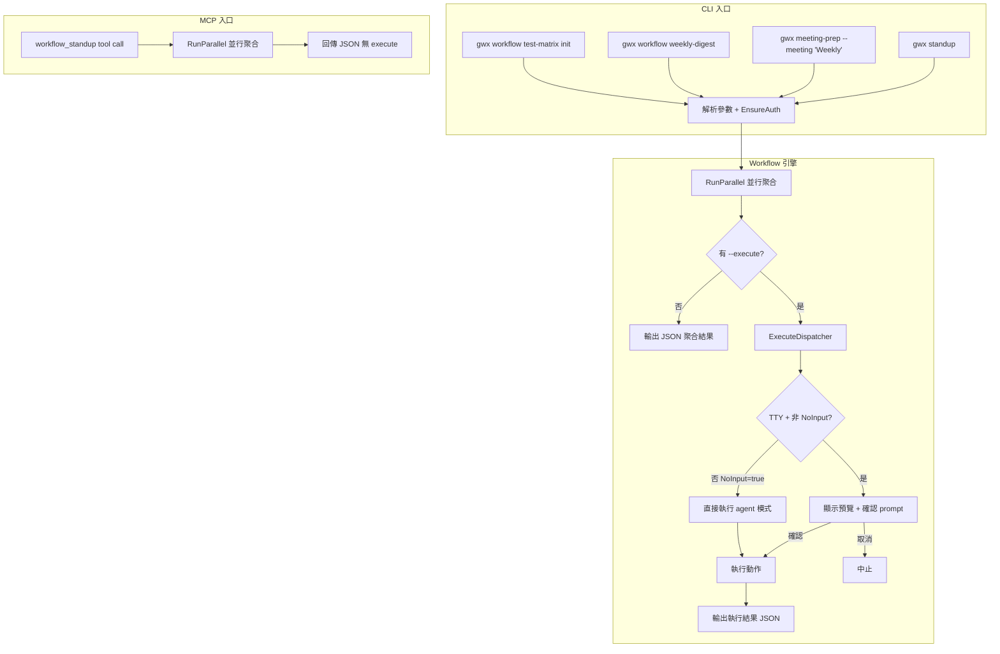
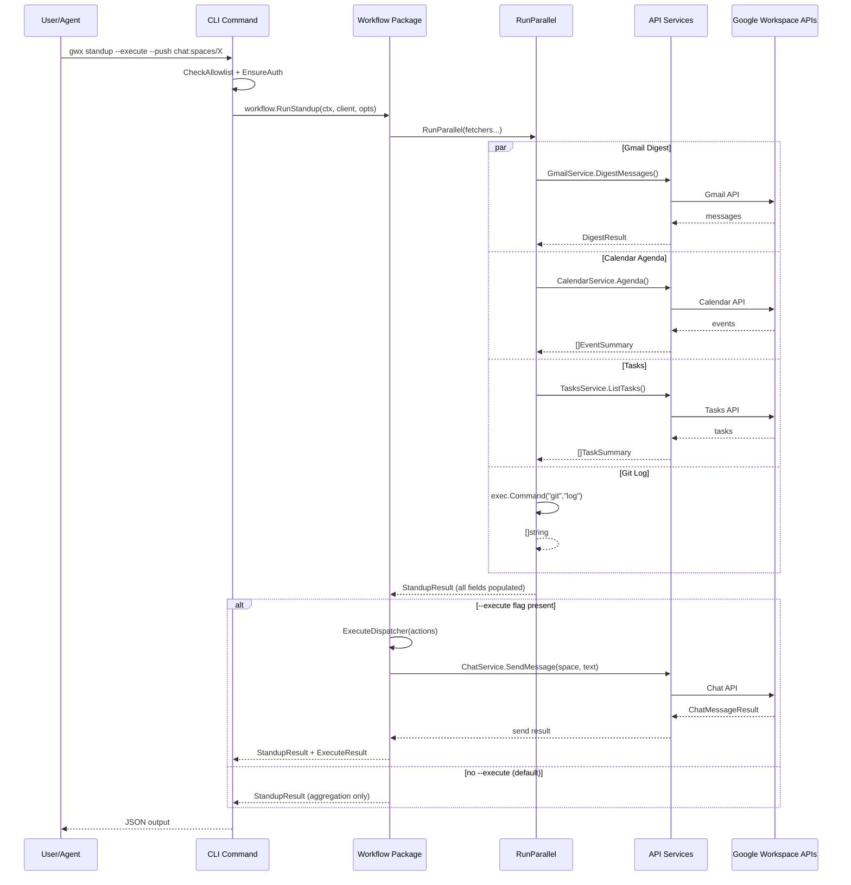

# S1 Dev Spec: 內建 Workflow Skills

> **階段**: S1 技術分析
> **建立時間**: 2026-03-19 19:30
> **Agent**: codebase-explorer (Phase 1) + architect (Phase 2)
> **工作類型**: new_feature
> **複雜度**: L

---

## 1. 概述

### 1.1 需求參照
> 完整需求見 `s0_brief_spec.md`，以下僅摘要。

將 13 個跨服務 workflow skills 內建為 gwx CLI 命令 + MCP 工具，讓任何 Agent 或人類一行指令觸發跨服務工作流程。

### 1.2 技術方案摘要

新建 `internal/workflow/` package 作為 workflow 邏輯層，每個 workflow 一個檔案，共用 `aggregator.go`（並行聚合框架）和 `executor.go`（動作派發 + 確認機制）。CLI 層在 `internal/cmd/` 下新建命令檔案，高頻 workflow（standup、meeting-prep）掛頂層，其餘 11 個掛 `gwx workflow` 子命令群組。MCP 層新建 `internal/mcp/tools_workflow.go`，沿用現有 chain-of-responsibility 模式串接。設定層新建 `internal/config/workflow_config.go` 提供 KV 存取（JSON 檔案），供 FA-C Sheets workflow 存放 Sheet ID。

---

## 2. 影響範圍（Phase 1：codebase-explorer）

### 2.1 受影響檔案

#### 新增檔案
| 檔案 | 說明 |
|------|------|
| `internal/workflow/aggregator.go` | 並行聚合框架：RunParallel helper |
| `internal/workflow/executor.go` | 動作派發 + TTY 確認機制 |
| `internal/workflow/standup.go` | Standup workflow 邏輯 |
| `internal/workflow/meeting_prep.go` | Meeting Prep workflow 邏輯 |
| `internal/workflow/weekly_digest.go` | Weekly Digest workflow 邏輯 |
| `internal/workflow/context_boost.go` | Context Boost workflow 邏輯 |
| `internal/workflow/bug_intake.go` | Bug Intake workflow 邏輯 |
| `internal/workflow/test_matrix.go` | Test Matrix workflow 邏輯（Sheets init/sync/stats） |
| `internal/workflow/spec_health.go` | Spec Health workflow 邏輯（Sheets init/record/stats） |
| `internal/workflow/sprint_board.go` | Sprint Board workflow 邏輯（Sheets init/ticket/stats/archive） |
| `internal/workflow/review_notify.go` | Review Notify workflow 邏輯 |
| `internal/workflow/email_from_doc.go` | Email From Doc workflow 邏輯 |
| `internal/workflow/sheet_to_email.go` | Sheet To Email workflow 邏輯 |
| `internal/workflow/parallel_schedule.go` | Parallel Schedule workflow 邏輯 |
| `internal/cmd/standup.go` | CLI: `gwx standup` |
| `internal/cmd/meeting_prep.go` | CLI: `gwx meeting-prep` |
| `internal/cmd/workflow.go` | CLI: `gwx workflow` 子命令群組（含 11 個子命令） |
| `internal/mcp/tools_workflow.go` | MCP: 13 個 workflow 工具定義 + handler |
| `internal/config/workflow_config.go` | Config KV store（JSON flat map） |

#### 修改檔案
| 檔案 | 變更類型 | 說明 |
|------|---------|------|
| `internal/cmd/root.go` | 修改 | CLI struct 新增 Standup、MeetingPrep、Workflow 三個欄位 |
| `internal/mcp/tools.go` | 修改 | ListTools 追加 `WorkflowTools()`，CallTool default 追加 `CallWorkflowTool` chain |

### 2.2 依賴關係

**上游依賴**（已驗證全部存在）：
| Service | 使用方法 |
|---------|---------|
| `GmailService` | `ListMessages`, `SearchMessages`, `SendMessage`, `DigestMessages` |
| `CalendarService` | `ListEvents`, `Agenda`, `CreateEvent`, `FindSlot` |
| `DriveService` | `SearchFiles`, `ListFiles` |
| `SheetsService` | `ReadRange`, `AppendValues`, `UpdateValues`, `CreateSpreadsheet`, `GetInfo` |
| `TasksService` | `ListTasks`, `ListTaskLists` |
| `ContactsService` | `SearchContacts` |
| `ChatService` | `SendMessage`, `ListSpaces` |
| `DocsService` | `GetDocument`, `CreateFromTemplate` |

**下游影響**：無（純新增功能，不改變現有 API/MCP 行為）

### 2.3 現有模式與技術考量

**並行聚合模式**（來自 `context.go`）：
- `sync.WaitGroup` + goroutine fan-out
- 每個 goroutine 寫入 result struct 的獨立欄位（無需加鎖，因 wg.Wait() 前不讀取）
- 部分失敗寫入 `.Error string` 欄位
- 新 aggregator 必須提取此模式為可複用框架，避免第三份複製

**MCP chain-of-responsibility 模式**（來自 `tools.go`）：
- `ListTools()` 尾部 `append(tools, ExtendedTools()...)` + `append(tools, NewTools()...)` + `append(tools, BatchTools()...)`
- `CallTool()` default branch 依序嘗試 `CallExtendedTool` → `CallNewTool` → `CallBatchTool`
- 新增 `WorkflowTools()` + `CallWorkflowTool()` 接在 `BatchTools` 之後

**CLI kong 模式**（來自 `root.go`）：
- Root struct 欄位 + `cmd:""` tag
- 子命令群組用嵌套 struct（如 `GmailCmd`）
- `RunContext` 透過 `kctx.Run(rctx)` 注入

---

## 3. User Flow（Phase 2：architect）



### 3.1 主要流程

| 步驟 | 用戶動作 | 系統回應 | 備註 |
|------|---------|---------|------|
| 1 | 執行 CLI 命令（如 `gwx standup`） | 檢查 allowlist、載入認證 | 需要的 services 由 workflow 決定 |
| 2 | - | RunParallel 並行呼叫多個 API 服務 | 部分服務失敗不中斷，寫入 .Error |
| 3 | - | 組裝 Result struct，JSON 輸出 | 預設模式到此結束 |
| 4 | 加 `--execute` 旗標 | ExecuteDispatcher 接管 | FA-D 動作型 workflow 才有意義 |
| 5 | TTY 下看到預覽 + `[y/N]` 確認 | 確認後執行動作（發信/建事件等） | `--no-input` 跳過確認 |
| 6 | - | 輸出執行結果 JSON | 包含每個動作的成功/失敗 |

### 3.2 異常流程

| 情境 | 觸發條件 | 系統處理 | 用戶看到 |
|------|---------|---------|---------|
| 未認證 | token 不存在或過期 | `EnsureAuth` 回傳錯誤 | `not authenticated. Run 'gwx auth login'` |
| 部分服務失敗 | 某個 goroutine 的 API call 失敗 | 該欄位寫 `.Error`，其餘正常回傳 | JSON 中該區段有 `"error": "..."` |
| 非 git repo 執行 standup | `git log` 失敗 | git_changes 回傳空陣列 | `"git_changes": []` |
| sheet-to-email 超過 50 筆 | rows > 50 | 硬拒絕，不執行 | `error: row count 75 exceeds limit 50` |
| MCP 呼叫帶 execute | MCP handler 收到 execute=true | 忽略 execute 參數 | 回傳聚合結果，無動作執行 |
| TTY 下確認回答 N | 用戶拒絕 | 中止動作，回傳 `"cancelled": true` | `{"cancelled": true, "reason": "user declined"}` |

---

## 4. Data Flow



### 4.1 核心 Package 設計

#### `internal/workflow/aggregator.go` — 並行聚合框架

```go
// FetchResult wraps a named result from a parallel fetch.
type FetchResult struct {
    Name  string
    Value interface{}
    Error error
}

// Fetcher is a function that fetches data from a service.
type Fetcher struct {
    Name string
    Fn   func(ctx context.Context) (interface{}, error)
}

// RunParallel executes fetchers concurrently, returns results keyed by name.
// Partial failures are captured in FetchResult.Error, never abort the whole batch.
func RunParallel(ctx context.Context, fetchers []Fetcher) []FetchResult
```

#### `internal/workflow/executor.go` — 動作派發

```go
// Action describes a side-effect to execute.
type Action struct {
    Name        string                                          // e.g. "send_email", "create_event"
    Description string                                          // human-readable preview line
    Fn          func(ctx context.Context) (interface{}, error)  // actual execution
}

// ExecuteOpts controls execution behavior.
type ExecuteOpts struct {
    Execute bool   // --execute flag
    NoInput bool   // --no-input flag (skip confirmation)
    IsMCP   bool   // MCP mode: never execute
}

// ExecuteResult holds outcomes of action execution.
type ExecuteResult struct {
    Executed bool                   `json:"executed"`
    Cancelled bool                  `json:"cancelled,omitempty"`
    Reason   string                 `json:"reason,omitempty"`
    Actions  []ActionResult         `json:"actions,omitempty"`
}

type ActionResult struct {
    Name    string      `json:"name"`
    Success bool        `json:"success"`
    Result  interface{} `json:"result,omitempty"`
    Error   string      `json:"error,omitempty"`
}

// Dispatch shows preview, asks confirmation if TTY, then executes actions.
// If IsMCP=true or Execute=false, returns without executing.
func Dispatch(ctx context.Context, actions []Action, opts ExecuteOpts) (*ExecuteResult, error)
```

#### `internal/config/workflow_config.go` — KV 設定

```go
// WorkflowConfig provides key-value storage for workflow settings.
// Stored at ~/.config/gwx/workflow.json as a flat JSON map.
//
// Key convention: "{workflow_name}.{setting}" e.g. "test-matrix.sheet-id"

func GetWorkflowConfig(key string) (string, error)
func SetWorkflowConfig(key, value string) error
func GetAllWorkflowConfig() (map[string]string, error)
```

### 4.2 Workflow Result Structs

每個 workflow 的 Run 函式回傳專用 Result struct，直接 JSON marshal 為 CLI/MCP 輸出。

#### FA-B: 資料聚合型

```go
// StandupResult — gwx standup
type StandupResult struct {
    Date        string              `json:"date"`
    EmailDigest *DigestSection      `json:"email_digest"`
    Calendar    *CalendarSection    `json:"calendar"`
    Tasks       *TasksSection       `json:"tasks"`
    GitChanges  *GitSection         `json:"git_changes"`
    Execute     *ExecuteResult      `json:"execute,omitempty"`
}

type DigestSection struct {
    Summary    string                  `json:"summary"`
    Categories []api.DigestCategory    `json:"categories,omitempty"`
    Error      string                  `json:"error,omitempty"`
}

type CalendarSection struct {
    Count  int                `json:"count"`
    Events []api.EventSummary `json:"events,omitempty"`
    Error  string             `json:"error,omitempty"`
}

type TasksSection struct {
    Count int                `json:"count"`
    Tasks []api.TaskSummary  `json:"tasks,omitempty"`
    Error string             `json:"error,omitempty"`
}

type GitSection struct {
    Commits []string `json:"commits"`
    Error   string   `json:"error,omitempty"`
}

// MeetingPrepResult — gwx meeting-prep
type MeetingPrepResult struct {
    Meeting    api.EventSummary      `json:"meeting"`
    Attendees  *AttendeesSection     `json:"attendees"`
    RecentMail *RecentMailSection    `json:"recent_mail"`
    RelatedDocs *RelatedDocsSection  `json:"related_docs"`
    Execute    *ExecuteResult        `json:"execute,omitempty"`
}

type AttendeesSection struct {
    Count    int                   `json:"count"`
    Contacts []api.ContactSummary  `json:"contacts,omitempty"`
    Error    string                `json:"error,omitempty"`
}

type RecentMailSection struct {
    Count    int                    `json:"count"`
    Messages []api.MessageSummary   `json:"messages,omitempty"`
    Error    string                 `json:"error,omitempty"`
}

type RelatedDocsSection struct {
    Count int               `json:"count"`
    Files []api.FileSummary  `json:"files,omitempty"`
    Error string             `json:"error,omitempty"`
}

// WeeklyDigestResult — gwx workflow weekly-digest
type WeeklyDigestResult struct {
    Period      string             `json:"period"`
    EmailStats  *EmailStatsSection `json:"email_stats"`
    MeetingLoad *MeetingLoadSection `json:"meeting_load"`
    TasksDone   *TasksDoneSection  `json:"tasks_done"`
    Execute     *ExecuteResult     `json:"execute,omitempty"`
}

// ContextBoostResult — gwx workflow context-boost
type ContextBoostResult struct {
    Topic       string              `json:"topic"`
    Emails      *RecentMailSection  `json:"emails"`
    Files       *RelatedDocsSection `json:"files"`
    Events      *CalendarSection    `json:"events"`
    Contacts    *AttendeesSection   `json:"contacts"`
}

// BugIntakeResult — gwx workflow bug-intake
type BugIntakeResult struct {
    BugID       string              `json:"bug_id"`
    RelatedMail *RecentMailSection  `json:"related_mail"`
    RelatedDocs *RelatedDocsSection `json:"related_docs"`
    GitHistory  *GitSection         `json:"git_history"`
    Execute     *ExecuteResult      `json:"execute,omitempty"`
}
```

#### FA-C: Sheets 狀態型

```go
// TestMatrixResult — gwx workflow test-matrix {init|sync|stats}
type TestMatrixResult struct {
    Action      string      `json:"action"`  // "init", "sync", "stats"
    SheetID     string      `json:"sheet_id"`
    SheetURL    string      `json:"sheet_url,omitempty"`
    Stats       interface{} `json:"stats,omitempty"`
    SyncResult  interface{} `json:"sync_result,omitempty"`
}

// Test Matrix Sheet 欄位定義:
// | A: Test ID | B: Test Name | C: Module | D: Status (pass/fail/skip/pending) |
// | E: Last Run | F: Duration (ms) | G: Notes |

// SpecHealthResult — gwx workflow spec-health {init|record|stats}
type SpecHealthResult struct {
    Action      string      `json:"action"`
    SheetID     string      `json:"sheet_id"`
    SheetURL    string      `json:"sheet_url,omitempty"`
    Stats       interface{} `json:"stats,omitempty"`
    RecordResult interface{} `json:"record_result,omitempty"`
}

// Spec Health Sheet 欄位定義:
// | A: Spec Folder | B: Feature | C: Stage | D: Status (draft/review/approved/stale) |
// | E: Last Updated | F: Author | G: Notes |

// SprintBoardResult — gwx workflow sprint-board {init|ticket|stats|archive}
type SprintBoardResult struct {
    Action       string      `json:"action"`
    SheetID      string      `json:"sheet_id"`
    SheetURL     string      `json:"sheet_url,omitempty"`
    Stats        interface{} `json:"stats,omitempty"`
    TicketResult interface{} `json:"ticket_result,omitempty"`
}

// Sprint Board Sheet 欄位定義:
// | A: Ticket ID | B: Title | C: Assignee | D: Status (todo/in-progress/review/done) |
// | E: Priority (P0-P3) | F: Sprint | G: Created | H: Updated | I: Notes |
```

#### FA-D: 對外動作型

```go
// ReviewNotifyResult — gwx workflow review-notify
type ReviewNotifyResult struct {
    Spec        string         `json:"spec"`
    Reviewers   []string       `json:"reviewers"`
    Preview     string         `json:"preview"`
    Execute     *ExecuteResult `json:"execute,omitempty"`
}

// EmailFromDocResult — gwx workflow email-from-doc
type EmailFromDocResult struct {
    DocID       string         `json:"doc_id"`
    DocTitle    string         `json:"doc_title"`
    Recipients  []string       `json:"recipients"`
    Preview     string         `json:"preview"`
    Execute     *ExecuteResult `json:"execute,omitempty"`
}

// SheetToEmailResult — gwx workflow sheet-to-email
type SheetToEmailResult struct {
    SheetID     string         `json:"sheet_id"`
    RowCount    int            `json:"row_count"`
    Limit       int            `json:"limit"`   // always 50
    Preview     []string       `json:"preview"` // first 3 recipient previews
    Execute     *ExecuteResult `json:"execute,omitempty"`
}

// ParallelScheduleResult — gwx workflow parallel-schedule
type ParallelScheduleResult struct {
    Title       string            `json:"title"`
    Duration    string            `json:"duration"`
    Attendees   []string          `json:"attendees"`
    Slots       []map[string]string `json:"slots"` // per-attendee available slots
    Events      []EventPreview    `json:"events,omitempty"` // preview of events to create
    Execute     *ExecuteResult    `json:"execute,omitempty"`
}

type EventPreview struct {
    Attendee string `json:"attendee"`
    Start    string `json:"start"`
    End      string `json:"end"`
}
```

### 4.3 CLI 命令簽名

```go
// cmd/standup.go
type StandupCmd struct {
    Days    int    `help:"Days of history" default:"1" short:"d"`
    Execute bool   `help:"Execute actions (e.g. push to chat)" name:"execute"`
    Push    string `help:"Push target (chat:spaces/XXX)" name:"push"`
}

// cmd/meeting_prep.go
type MeetingPrepCmd struct {
    Meeting string `arg:"" help:"Meeting title or keyword to match"`
    Days    int    `help:"Days ahead to search" default:"1" short:"d"`
    Execute bool   `help:"Execute actions" name:"execute"`
}

// cmd/workflow.go — 子命令群組
type WorkflowCmd struct {
    WeeklyDigest     WeeklyDigestCmd     `cmd:"weekly-digest" help:"Weekly activity digest"`
    ContextBoost     ContextBoostCmd     `cmd:"context-boost" help:"Deep context gathering for a topic"`
    BugIntake        BugIntakeCmd        `cmd:"bug-intake" help:"Gather context for a bug report"`
    TestMatrix       TestMatrixCmd       `cmd:"test-matrix" help:"Manage test results in Sheets"`
    SpecHealth       SpecHealthCmd       `cmd:"spec-health" help:"Track spec status in Sheets"`
    SprintBoard      SprintBoardCmd      `cmd:"sprint-board" help:"Sprint board in Sheets"`
    ReviewNotify     ReviewNotifyCmd     `cmd:"review-notify" help:"Notify reviewers about a spec"`
    EmailFromDoc     EmailFromDocCmd     `cmd:"email-from-doc" help:"Send email from a Google Doc"`
    SheetToEmail     SheetToEmailCmd     `cmd:"sheet-to-email" help:"Send personalized emails from Sheet data"`
    ParallelSchedule ParallelScheduleCmd `cmd:"parallel-schedule" help:"Schedule parallel 1-on-1 reviews"`
    Digest           WeeklyDigestCmd     `cmd:"digest" help:"Alias for weekly-digest" hidden:""`
}
```

### 4.4 MCP 工具定義

19 個 read-only 工具，命名慣例 `workflow_{name}`：

| MCP Tool Name | 對應 Workflow | 必填參數 | 選填參數 |
|---------------|-------------|---------|---------|
| `workflow_standup` | standup | - | `days` |
| `workflow_meeting_prep` | meeting-prep | `meeting` | `days` |
| `workflow_weekly_digest` | weekly-digest | - | `weeks` |
| `workflow_context_boost` | context-boost | `topic` | `days`, `limit` |
| `workflow_bug_intake` | bug-intake | `bug_id` | - |
| `workflow_test_matrix_init` | test-matrix init | `feature` | - |
| `workflow_test_matrix_sync` | test-matrix sync | `sheet_id`, `file` | - |
| `workflow_test_matrix_stats` | test-matrix stats | `sheet_id` | - |
| `workflow_spec_health_init` | spec-health init | `feature` | - |
| `workflow_spec_health_record` | spec-health record | `sheet_id`, `spec_folder` | - |
| `workflow_spec_health_stats` | spec-health stats | `sheet_id` | `spec_folder` |
| `workflow_sprint_board_init` | sprint-board init | `feature` | - |
| `workflow_sprint_board_ticket` | sprint-board ticket | `sheet_id`, `title` | `assignee`, `priority` |
| `workflow_sprint_board_stats` | sprint-board stats | `sheet_id` | - |
| `workflow_review_notify` | review-notify (preview only) | `spec_folder`, `reviewers` | `channel` |
| `workflow_email_from_doc` | email-from-doc (preview only) | `doc_id`, `recipients` | `subject` |
| `workflow_sheet_to_email` | sheet-to-email (preview only) | `sheet_id`, `range` | `subject_col`, `body_col`, `email_col` |
| `workflow_parallel_schedule` | parallel-schedule (preview only) | `title`, `attendees`, `duration` | `days_ahead` |
| `workflow_digest` | weekly-digest (alias) | - | `weeks` |

> 所有 MCP workflow 工具皆為 **read-only**：FA-C init/sync/record 工具只回傳預覽不實際建立 Sheet（Sheet 建立須透過 CLI `--execute`）；FA-D 動作型只回傳預覽，不執行動作。

---

## 5. 任務清單

### 5.1 任務總覽

| # | 任務 | FA | 類型 | 複雜度 | Agent | 依賴 |
|---|------|----|------|--------|-------|------|
| T-01 | Config workflow_config.go | A | 後端 | S | go-expert | - |
| T-02 | Aggregator RunParallel | A | 後端 | M | go-expert | - |
| T-03 | Executor Dispatch | A | 後端 | M | go-expert | - |
| T-04 | WorkflowCmd 群組 + root.go 更新 | A | 後端 | S | go-expert | - |
| T-05 | standup workflow + CLI | B | 後端 | M | go-expert | T-02, T-03, T-04 |
| T-06 | meeting-prep workflow + CLI | B | 後端 | M | go-expert | T-02, T-03, T-04 |
| T-07 | weekly-digest workflow + CLI | B | 後端 | S | go-expert | T-02, T-04 |
| T-08 | context-boost workflow + CLI | B | 後端 | S | go-expert | T-02, T-04 |
| T-09 | bug-intake workflow + CLI | B | 後端 | S | go-expert | T-02, T-04 |
| T-10 | test-matrix workflow + CLI | C | 後端 | M | go-expert | T-01, T-02, T-04 |
| T-11 | spec-health workflow + CLI | C | 後端 | M | go-expert | T-01, T-02, T-04 |
| T-12 | sprint-board workflow + CLI | C | 後端 | M | go-expert | T-01, T-02, T-04 |
| T-13 | review-notify workflow + CLI | D | 後端 | M | go-expert | T-02, T-03, T-04 |
| T-14 | email-from-doc workflow + CLI | D | 後端 | M | go-expert | T-02, T-03, T-04 |
| T-15 | sheet-to-email workflow + CLI | D | 後端 | M | go-expert | T-02, T-03, T-04 |
| T-16 | parallel-schedule workflow + CLI | D | 後端 | M | go-expert | T-02, T-03, T-04 |
| T-17 | MCP tools_workflow.go（13 工具） | - | 後端 | L | go-expert | T-05~T-16 |
| T-18 | MCP tools.go 整合 | - | 後端 | S | go-expert | T-17 |
| T-19 | go build + go vet 驗證 | - | 後端 | S | go-expert | T-18 |

### 5.2 任務詳情

#### Task T-01: Config workflow_config.go
- **類型**: 後端
- **複雜度**: S
- **Agent**: go-expert
- **描述**: 新建 `internal/config/workflow_config.go`，提供 JSON flat map KV store。存放於 `~/.config/gwx/workflow.json`。使用 `config.Dir()` 定位目錄。提供 `GetWorkflowConfig(key)`, `SetWorkflowConfig(key, value)`, `GetAllWorkflowConfig()` 三個函式。讀寫需 file lock 防止併發（`flock` 或寫入 temp + rename）。
- **DoD**:
  - [ ] `GetWorkflowConfig` 讀取 key，不存在回傳 `"", nil`
  - [ ] `SetWorkflowConfig` 寫入 key-value，自動建立檔案/目錄
  - [ ] 檔案格式為 `{"test-matrix.sheet-id": "abc123", ...}`
  - [ ] 寫入用 temp file + rename 確保原子性
  - [ ] `go vet` 通過
- **驗收方式**: 單元測試 mock config dir

#### Task T-02: Aggregator RunParallel
- **類型**: 後端
- **複雜度**: M
- **Agent**: go-expert
- **描述**: 新建 `internal/workflow/aggregator.go`，實作 `RunParallel` 函式。接收 `[]Fetcher`，每個 Fetcher 含 `Name string` 和 `Fn func(ctx context.Context) (interface{}, error)`。使用 goroutine 並行執行，收集結果為 `[]FetchResult`。支援 context cancellation。部分失敗不中斷其他 goroutine。
- **DoD**:
  - [ ] `RunParallel` 並行執行所有 fetcher
  - [ ] 任一 fetcher panic 時 recover 並寫入 Error
  - [ ] context cancel 時所有 fetcher 可感知
  - [ ] 回傳 `[]FetchResult` 順序與輸入 `[]Fetcher` 一致
  - [ ] `go vet` 通過
- **驗收方式**: 單元測試：正常並行、部分失敗、context cancel

#### Task T-03: Executor Dispatch
- **類型**: 後端
- **複雜度**: M
- **Agent**: go-expert
- **描述**: 新建 `internal/workflow/executor.go`，實作 `Dispatch` 函式。根據 `ExecuteOpts` 決定行為：
  - `IsMCP=true` → 回傳 `{executed: false, reason: "mcp_read_only"}`
  - `Execute=false` → 回傳 `{executed: false, reason: "no_execute_flag"}`
  - `Execute=true + NoInput=false + TTY` → 印出預覽到 stderr，讀 stdin 確認
  - `Execute=true + NoInput=true` → 直接執行（agent 模式）
  - 確認後依序執行 actions，收集結果
- **DoD**:
  - [ ] 五種分支皆正確處理
  - [ ] 預覽輸出走 stderr（不污染 JSON stdout）
  - [ ] 確認 prompt 格式：`Execute N action(s)? [y/N]`
  - [ ] 單一 action 失敗不中斷其餘
  - [ ] `go vet` 通過
- **驗收方式**: 單元測試 mock stdin/stderr

#### Task T-04: WorkflowCmd 群組 + root.go 更新
- **類型**: 後端
- **複雜度**: S
- **Agent**: go-expert
- **描述**: 新建 `internal/cmd/workflow.go` 定義 `WorkflowCmd` struct（空殼，子命令在各 workflow 任務中填入）。修改 `internal/cmd/root.go` CLI struct 新增三個欄位：`Standup StandupCmd`, `MeetingPrep MeetingPrepCmd`, `Workflow WorkflowCmd`。確認 kong 解析不與現有命令衝突。
- **DoD**:
  - [ ] `root.go` CLI struct 新增 3 個欄位
  - [ ] `gwx standup --help` 可用
  - [ ] `gwx meeting-prep --help` 可用
  - [ ] `gwx workflow --help` 顯示子命令群組
  - [ ] 不影響現有命令（`gwx gmail`, `gwx context` 等）
  - [ ] 所有 workflow CLI 命令的 `Run` 方法第一行是 `CheckAllowlist(rctx, "workflow.{name}")`，其中 `{name}` 為對應 workflow 名稱（如 `workflow.standup`、`workflow.test-matrix`）
  - [ ] `go build` 通過
- **驗收方式**: `go build && ./gwx standup --help`

#### Task T-05: standup workflow + CLI
- **類型**: 後端
- **複雜度**: M
- **Agent**: go-expert
- **依賴**: T-02, T-03, T-04
- **描述**: 新建 `internal/workflow/standup.go` 和 `internal/cmd/standup.go`。Standup workflow 並行聚合 4 個來源：(1) Gmail digest（`DigestMessages`）、(2) Calendar agenda（`Agenda`）、(3) Tasks（`ListTasks`）、(4) Git log（`os/exec: git log --oneline --since=yesterday`）。`--execute --push chat:spaces/XXX` 時用 `ChatService.SendMessage` 推送摘要。需要 services: `gmail`, `calendar`, `tasks`, `chat`（chat 只在 execute+push 時需要）。
- **DoD**:
  - [ ] `gwx standup` 輸出 StandupResult JSON
  - [ ] 4 個聚合來源並行執行
  - [ ] 非 git repo 時 git_changes 為空陣列不報錯
  - [ ] `--execute --push chat:spaces/XXX` 推送成功
  - [ ] 部分服務失敗時其餘正常
  - [ ] `go vet` 通過
- **驗收方式**: `gwx standup` 回傳完整 JSON

#### Task T-06: meeting-prep workflow + CLI
- **類型**: 後端
- **複雜度**: M
- **Agent**: go-expert
- **依賴**: T-02, T-03, T-04
- **描述**: 新建 `internal/workflow/meeting_prep.go` 和 `internal/cmd/meeting_prep.go`。用 `CalendarService.Agenda` 找到匹配 meeting title 的事件，然後並行聚合：(1) 出席者聯絡資訊（`ContactsService.SearchContacts`）、(2) 與出席者的近期信件（`GmailService.SearchMessages`）、(3) 相關文件（`DriveService.SearchFiles`）。services: `calendar`, `contacts`, `gmail`, `drive`。
- **DoD**:
  - [ ] `gwx meeting-prep "Weekly"` 找到匹配事件並聚合
  - [ ] 找不到匹配事件時回傳明確錯誤
  - [ ] 3 個聚合來源並行
  - [ ] `go vet` 通過
- **驗收方式**: `gwx meeting-prep "Weekly"` 回傳 MeetingPrepResult JSON

#### Task T-07: weekly-digest workflow + CLI
- **類型**: 後端
- **複雜度**: S
- **Agent**: go-expert
- **依賴**: T-02, T-04
- **描述**: 新建 `internal/workflow/weekly_digest.go`，掛到 `WorkflowCmd.WeeklyDigest`。並行聚合：(1) 過去 7 天 email stats（用 `DigestMessages` 或 `ListMessages` 統計）、(2) 過去 7 天會議數量/時數、(3) 已完成任務。services: `gmail`, `calendar`, `tasks`。
- **DoD**:
  - [ ] `gwx workflow weekly-digest` 輸出 WeeklyDigestResult
  - [ ] 預設 7 天，可用 `--weeks 2` 調整
  - [ ] `go vet` 通過
- **驗收方式**: CLI 輸出正確 JSON

#### Task T-08: context-boost workflow + CLI
- **類型**: 後端
- **複雜度**: S
- **Agent**: go-expert
- **依賴**: T-02, T-04
- **描述**: 新建 `internal/workflow/context_boost.go`，掛到 `WorkflowCmd.ContextBoost`。與現有 `context` 命令類似但更深入：並行查 Gmail + Drive + Calendar + Contacts。services: `gmail`, `drive`, `calendar`, `contacts`。
- **DoD**:
  - [ ] `gwx workflow context-boost --topic "Project X"` 回傳 ContextBoostResult
  - [ ] 比 `gwx context` 多查 contacts
  - [ ] `go vet` 通過
- **驗收方式**: CLI 輸出正確 JSON

#### Task T-09: bug-intake workflow + CLI
- **類型**: 後端
- **複雜度**: S
- **Agent**: go-expert
- **依賴**: T-02, T-04
- **描述**: 新建 `internal/workflow/bug_intake.go`，掛到 `WorkflowCmd.BugIntake`。用 bug ID 或關鍵字並行查：(1) 相關郵件、(2) 相關文件、(3) git log（`git log --all --grep=BUG_ID`）。services: `gmail`, `drive`。
- **DoD**:
  - [ ] `gwx workflow bug-intake --bug-id "BUG-123"` 輸出 BugIntakeResult
  - [ ] git log grep 失敗時不報錯
  - [ ] `go vet` 通過
- **驗收方式**: CLI 輸出正確 JSON

#### Task T-10: test-matrix workflow + CLI
- **類型**: 後端
- **複雜度**: M
- **Agent**: go-expert
- **依賴**: T-01, T-02, T-04
- **描述**: 新建 `internal/workflow/test_matrix.go`，掛到 `WorkflowCmd.TestMatrix`。三個子命令：
  - `init`: 用 `CreateSpreadsheet` 建立新 Sheet，寫入 header row，存 sheet ID 到 workflow config
  - `sync`: 讀取 test output（stdin 或 `--file`），用 `AppendValues`/`UpdateValues` 更新 Sheet
  - `stats`: 讀取 Sheet 統計 pass/fail/skip 數量
  - Sheet 欄位: Test ID | Test Name | Module | Status | Last Run | Duration | Notes
  - services: `sheets`
- **DoD**:
  - [ ] `gwx workflow test-matrix init` 建立 Sheet 並儲存 ID
  - [ ] `gwx workflow test-matrix sync --file results.json` 更新 Sheet
  - [ ] `gwx workflow test-matrix stats` 回傳統計
  - [ ] Sheet ID 存在 workflow config 中
  - [ ] `go vet` 通過
- **驗收方式**: init → sync → stats 完整流程

#### Task T-11: spec-health workflow + CLI
- **類型**: 後端
- **複雜度**: M
- **Agent**: go-expert
- **依賴**: T-01, T-02, T-04
- **描述**: 新建 `internal/workflow/spec_health.go`，掛到 `WorkflowCmd.SpecHealth`。三個子命令：
  - `init`: 建立 Sheet + 存 config
  - `record --spec-folder dev/specs/xxx`: 解析 `sdd_context.json`，提取 feature/stage/status 寫入 Sheet
  - `stats`: 統計 draft/review/approved/stale 數量
  - Sheet 欄位: Spec Folder | Feature | Stage | Status | Last Updated | Author | Notes
  - services: `sheets`
  - spec_folder 由 CLI 參數 `--spec-folder` 傳入（解決 U1）
- **DoD**:
  - [ ] `gwx workflow spec-health init` 建立 Sheet
  - [ ] `gwx workflow spec-health record --spec-folder dev/specs/xxx` 正確解析 sdd_context.json
  - [ ] `gwx workflow spec-health stats` 回傳統計
  - [ ] `go vet` 通過
- **驗收方式**: init → record → stats 完整流程

#### Task T-12: sprint-board workflow + CLI
- **類型**: 後端
- **複雜度**: M
- **Agent**: go-expert
- **依賴**: T-01, T-02, T-04
- **描述**: 新建 `internal/workflow/sprint_board.go`，掛到 `WorkflowCmd.SprintBoard`。四個子命令：
  - `init`: 建立 Sheet + 存 config
  - `ticket --title "xxx" --assignee "yyy" --priority P1`: 新增一列
  - `stats`: 統計各狀態數量
  - `archive --sprint "Sprint 1"`: 將指定 sprint 的 done tickets 移到 Archive sheet
  - Sheet 欄位: Ticket ID | Title | Assignee | Status | Priority | Sprint | Created | Updated | Notes
  - services: `sheets`
- **DoD**:
  - [ ] 四個子命令皆可用
  - [ ] Ticket ID 自動生成（`T-{timestamp}`）
  - [ ] archive 只移 status=done 的列
  - [ ] `go vet` 通過
- **驗收方式**: init → ticket → stats → archive 完整流程

#### Task T-13: review-notify workflow + CLI
- **類型**: 後端
- **複雜度**: M
- **Agent**: go-expert
- **依賴**: T-02, T-03, T-04
- **描述**: 新建 `internal/workflow/review_notify.go`，掛到 `WorkflowCmd.ReviewNotify`。聚合 spec 資訊，`--execute` 時發通知。通知管道：`--channel email` 用 Gmail 發信，`--channel chat:spaces/XXX` 用 Chat 推送。services: `gmail` 或 `chat`（依 channel）。
- **DoD**:
  - [ ] `gwx workflow review-notify --spec-folder dev/specs/xxx --reviewers a@x.com,b@x.com` 回傳預覽
  - [ ] `--execute --channel email` 實際發信
  - [ ] `--execute --channel chat:spaces/XXX` 實際推送
  - [ ] 無 `--execute` 時只回傳預覽 JSON
  - [ ] **Error path**: `--execute` 但未指定 `--channel`（或 `--channel` 為空）時回傳錯誤 `error: --channel required when --execute is set`
  - [ ] **Error path**: 用戶在確認 prompt 輸入 N 時中止，回傳 `{"cancelled": true, "reason": "user declined"}`
  - [ ] `go vet` 通過
- **驗收方式**: 預覽 JSON + execute 模式測試 + error path 測試

#### Task T-14: email-from-doc workflow + CLI
- **類型**: 後端
- **複雜度**: M
- **Agent**: go-expert
- **依賴**: T-02, T-03, T-04
- **描述**: 新建 `internal/workflow/email_from_doc.go`，掛到 `WorkflowCmd.EmailFromDoc`。用 `DocsService.GetDocument` 取得文件內容，組裝為 email body，`--execute` 時用 `GmailService.SendMessage` 發送。services: `docs`, `gmail`。
- **DoD**:
  - [ ] `gwx workflow email-from-doc --doc-id XXX --recipients a@x.com` 回傳預覽
  - [ ] 預覽含 subject（doc title）+ body（doc content）
  - [ ] `--execute` 實際發信
  - [ ] **Error path**: `--execute` 但未指定 `--recipients`（或 `--recipients` 為空）時回傳錯誤 `error: --recipients required when --execute is set`
  - [ ] **Error path**: 用戶在確認 prompt 輸入 N 時中止，回傳 `{"cancelled": true, "reason": "user declined"}`
  - [ ] `go vet` 通過
- **驗收方式**: 預覽 JSON + execute 模式測試 + error path 測試

#### Task T-15: sheet-to-email workflow + CLI
- **類型**: 後端
- **複雜度**: M
- **Agent**: go-expert
- **依賴**: T-02, T-03, T-04
- **描述**: 新建 `internal/workflow/sheet_to_email.go`，掛到 `WorkflowCmd.SheetToEmail`。讀取 Sheet 資料，每列一封 email。指定 email 欄、subject 欄、body 欄位。**硬限制 50 列**。services: `sheets`, `gmail`。
- **DoD**:
  - [ ] `gwx workflow sheet-to-email --sheet-id XXX --range "Sheet1!A:F" --email-col 0 --subject-col 1 --body-col 2` 回傳預覽
  - [ ] 超過 50 列時硬拒絕，錯誤訊息含 `exceeds limit 50`，且拒絕在任何模式下繼續（包含無 `--execute` 時的預覽）
  - [ ] `--execute` 實際發信
  - [ ] 每封信獨立失敗不影響其餘
  - [ ] **Error path**: `limit > 50` 時立即回傳 `error: row count {N} exceeds limit 50`，不做任何 API 呼叫
  - [ ] **Error path**: 用戶在確認 prompt 輸入 N 時中止，回傳 `{"cancelled": true, "reason": "user declined"}`
  - [ ] `go vet` 通過
- **驗收方式**: 測試 50 列限制 + 預覽 JSON + error path 測試

#### Task T-16: parallel-schedule workflow + CLI
- **類型**: 後端
- **複雜度**: M
- **Agent**: go-expert
- **依賴**: T-02, T-03, T-04
- **描述**: 新建 `internal/workflow/parallel_schedule.go`，掛到 `WorkflowCmd.ParallelSchedule`。為每個 attendee 建立獨立的 1-on-1 review 事件（解決 U2：多個獨立事件，非一場多人事件）。用 `CalendarService.FindSlot` 找可用時段，`--execute` 時用 `CalendarService.CreateEvent` 建立事件。services: `calendar`。
- **DoD**:
  - [ ] `gwx workflow parallel-schedule --title "Code Review" --attendees a@x.com,b@x.com --duration 30m` 回傳每人的可用時段
  - [ ] `--execute` 為每人建立獨立事件
  - [ ] **Error path**: `CalendarService.FindSlot` 對某位 attendee 回傳無可用時段時，回傳友善訊息 `{"attendee": "a@x.com", "error": "no available slots in the next {days} days"}`，不中斷其他 attendee 的排程
  - [ ] **Error path**: 用戶在確認 prompt 輸入 N 時中止，回傳 `{"cancelled": true, "reason": "user declined"}`
  - [ ] `go vet` 通過
- **驗收方式**: 預覽時段 + execute 模式測試 + error path 測試（無可用時段）

#### Task T-17: MCP tools_workflow.go
- **類型**: 後端
- **複雜度**: L
- **Agent**: go-expert
- **依賴**: T-05~T-16
- **描述**: 新建 `internal/mcp/tools_workflow.go`，定義 19 個 MCP 工具（見 4.4 MCP 工具定義表）。每個工具呼叫對應 workflow 的 Run 函式，傳入 `ExecuteOpts{IsMCP: true}` 確保不執行動作。沿用 `BatchTools()` / `CallBatchTool()` 相同模式：匯出 `WorkflowTools() []Tool` 和 `CallWorkflowTool(ctx, name, args) (*ToolResult, error, bool)`。
- **DoD**:
  - [ ] 19 個工具定義完整（Name, Description, InputSchema, Required）
  - [ ] 每個 handler 正確呼叫 workflow.Run* 函式
  - [ ] 所有 handler 傳 `IsMCP: true`，確保不觸發動作
  - [ ] FA-C init/sync/record 工具在 MCP 模式下只回傳預覽（不建立 Sheet、不寫入資料）
  - [ ] MCP handler 輸入驗證與 CLI 一致（pitfall: mcp-cli-validation-parity）
  - [ ] `go vet` 通過
- **驗收方式**: 每個工具的 ListTools 定義 + handler 手動測試

#### Task T-18: MCP tools.go 整合
- **類型**: 後端
- **複雜度**: S
- **Agent**: go-expert
- **依賴**: T-17
- **描述**: 修改 `internal/mcp/tools.go`：
  - `ListTools()` 尾部追加 `tools = append(tools, WorkflowTools()...)`
  - `CallTool()` default branch，在 `CallBatchTool` 之後追加 `CallWorkflowTool`
- **DoD**:
  - [ ] ListTools 回傳包含 19 個 workflow 工具
  - [ ] CallTool 可路由到 workflow handler
  - [ ] 不影響現有工具
  - [ ] `go vet` 通過
- **驗收方式**: `go build` + 手動呼叫 MCP workflow tool

#### Task T-19: go build + go vet 驗證
- **類型**: 後端
- **複雜度**: S
- **Agent**: go-expert
- **依賴**: T-18
- **描述**: 全量 `go build ./...` 和 `go vet ./...` 確保無編譯錯誤和靜態分析問題。修復任何 import cycle 或 unused variable。
- **DoD**:
  - [ ] `go build ./...` 成功
  - [ ] `go vet ./...` 無警告
  - [ ] `gwx --help` 顯示新命令
  - [ ] `gwx workflow --help` 顯示 11 個子命令
- **驗收方式**: CI green

---

## 6. 技術決策

### 6.1 架構決策

| 決策點 | 選項 | 選擇 | 理由 |
|--------|------|------|------|
| 聚合框架 | A: 每個 workflow 自己寫 goroutine / B: 提取共用 RunParallel | B | context.go 和 usearch.go 已有兩份相同模式，第三份會成為無法容忍的技術債 |
| Config KV | A: 用環境變數 / B: JSON flat map 檔案 / C: 用現有 keyring | B | Sheet ID 是長期設定非 secret，環境變數不適合；keyring 太重 |
| CLI 結構 | A: 全部頂層 / B: 全部子命令 / C: 高頻頂層 + 其餘子命令群組 | C | 13 個全頂層太多，全子命令又讓高頻 standup 多打一層 |
| MCP execute | A: 支援 execute 參數 / B: 完全不支援 | B | MCP 是 read-only channel，動作由人類或 agent 透過 CLI 觸發 |
| 確認機制 | A: 全部自動 / B: TTY prompt / C: TTY prompt + NoInput 分支 | C | agent 用 `--no-input --execute`，人類用 TTY 確認，安全且靈活 |
| parallel-schedule 語義 | A: 一場多人 / B: 多個 1-on-1 | B | Brief Spec 語境為「平行排程 review」，每人獨立 slot 更合理 |

### 6.2 設計模式

- **Fan-out/Fan-in**: RunParallel 使用 goroutine fan-out + channel fan-in（或 WaitGroup + slice）
- **Chain-of-responsibility**: MCP tool dispatch 沿用現有 `CallExtendedTool` → `CallNewTool` → `CallBatchTool` → `CallWorkflowTool`
- **Command Pattern**: 每個 Action struct 封裝可執行的動作，Executor 統一調度

### 6.3 相容性考量

- **向後相容**: 純新增，不修改現有 API/CLI 行為。root.go 新增欄位不影響 kong 解析。
- **Config 遷移**: 無需遷移，全新 workflow.json 檔案。
- **GA4 feature branch 衝突**: `preferences.go` 可能在 GA4 branch 上已存在。本案建立 `workflow_config.go`（不同檔案），合併時不衝突。

### 6.4 Pitfalls 處置

| Pitfall | 處置 |
|---------|------|
| `new-service-key-mismatch` | 所有 service 建立都用 `api.New{Service}(client)` 封裝，WaitRate/ClientOptions 的 key 已在各 service 內部硬編碼，workflow 不直接碰 |
| `mcp-cli-validation-parity` | MCP handler 的參數解析呼叫與 CLI 共用同一份 workflow.Run* 函式，驗證邏輯在 workflow 層而非 cmd/mcp 層 |
| `slog stdout pollution` | Executor 的預覽/確認 prompt 走 `os.Stderr`；workflow 進度 log 用 `slog`（已設定走 stderr） |

---

## 7. 驗收標準

### 7.1 功能驗收 — FA-A 基礎設施

| # | 場景 | Given | When | Then | 優先級 |
|---|------|-------|------|------|--------|
| A-1 | Config 存取 | config dir 存在 | SetWorkflowConfig("k","v") 後 GetWorkflowConfig("k") | 回傳 "v" | P0 |
| A-2 | RunParallel 正常 | 3 個 fetcher | RunParallel 執行 | 3 個結果全部回傳，Error 為 nil | P0 |
| A-3 | RunParallel 部分失敗 | 1 個 fetcher 回 error | RunParallel 執行 | 該 result.Error 有值，其餘正常 | P0 |
| A-4 | Executor 無 execute | Execute=false | Dispatch 呼叫 | 回傳 `{executed:false}` 不執行動作 | P0 |
| A-5 | Executor MCP 模式 | IsMCP=true, Execute=true | Dispatch 呼叫 | 回傳 `{executed:false, reason:"mcp_read_only"}` | P0 |
| A-6 | Executor TTY 確認 | Execute=true, NoInput=false, TTY | Dispatch 呼叫，stdin 輸入 "y" | 執行動作，回傳結果 | P1 |

### 7.2 功能驗收 — FA-B 資料聚合

| # | 場景 | Given | When | Then | 優先級 |
|---|------|-------|------|------|--------|
| B-1 | Standup 正常 | 已認證 | `gwx standup` | 回傳含 email_digest, calendar, tasks, git_changes 的 JSON | P0 |
| B-2 | Standup 非 git repo | 在非 git 目錄 | `gwx standup` | git_changes 為空陣列，其餘正常 | P0 |
| B-3 | Standup execute push | 已認證 + chat space | `gwx standup --execute --push chat:spaces/XXX` | 聚合後推送 chat | P1 |
| B-4 | Meeting prep 正常 | 今日有 "Weekly" 會議 | `gwx meeting-prep "Weekly"` | 回傳 meeting + attendees + recent_mail + related_docs | P0 |
| B-5 | Meeting prep 無匹配 | 今日無匹配會議 | `gwx meeting-prep "Nonexistent"` | 回傳明確錯誤 | P0 |
| B-6 | Weekly digest | 已認證 | `gwx workflow weekly-digest` | 回傳 email_stats + meeting_load + tasks_done | P1 |
| B-7 | Context boost | 已認證 | `gwx workflow context-boost --topic "X"` | 回傳 emails + files + events + contacts | P1 |
| B-8 | Bug intake | 已認證 | `gwx workflow bug-intake --bug-id "BUG-1"` | 回傳 related_mail + related_docs + git_history | P1 |

### 7.3 功能驗收 — FA-C Sheets 狀態

| # | 場景 | Given | When | Then | 優先級 |
|---|------|-------|------|------|--------|
| C-1 | Test matrix init | 已認證 | `gwx workflow test-matrix init` | 建立 Sheet，存 ID 到 config，回傳 sheet_url | P0 |
| C-2 | Test matrix sync | Sheet 已 init | `gwx workflow test-matrix sync --file results.json` | 資料寫入 Sheet | P1 |
| C-3 | Test matrix stats | Sheet 有資料 | `gwx workflow test-matrix stats` | 回傳 pass/fail/skip 統計 | P1 |
| C-4 | Spec health record | Sheet 已 init | `gwx workflow spec-health record --spec-folder dev/specs/xxx` | 解析 sdd_context.json 寫入 Sheet | P1 |
| C-5 | Sprint board ticket | Sheet 已 init | `gwx workflow sprint-board ticket --title "Fix bug" --priority P1` | 新增一列到 Sheet | P1 |
| C-6 | Sprint board archive | Sheet 有 done tickets | `gwx workflow sprint-board archive --sprint "Sprint 1"` | done tickets 被移除 | P2 |

### 7.4 功能驗收 — FA-D 對外動作

| # | 場景 | Given | When | Then | 優先級 |
|---|------|-------|------|------|--------|
| D-1 | Review notify 預覽 | spec folder 存在 | `gwx workflow review-notify --spec-folder xxx --reviewers a@x.com` | 回傳預覽 JSON，不發通知 | P0 |
| D-2 | Review notify execute | 同上 | 加 `--execute --channel email` | 實際發信 | P1 |
| D-3 | Email from doc 預覽 | doc 存在 | `gwx workflow email-from-doc --doc-id XXX --recipients a@x.com` | 回傳含 subject+body 的預覽 | P0 |
| D-4 | Sheet to email limit | Sheet 有 60 列 | `gwx workflow sheet-to-email --sheet-id XXX --range A:F ...` | 錯誤: exceeds limit 50 | P0 |
| D-5 | Sheet to email 正常 | Sheet 有 30 列 | 同上 | 回傳 30 封預覽 | P1 |
| D-6 | Parallel schedule 預覽 | 已認證 | `gwx workflow parallel-schedule --title "Review" --attendees a@x.com,b@x.com --duration 30m` | 回傳每人可用時段 | P1 |

### 7.5 功能驗收 — MCP

| # | 場景 | Given | When | Then | 優先級 |
|---|------|-------|------|------|--------|
| M-1 | MCP workflow tool 列表 | MCP server 啟動 | ListTools | 包含 19 個 `workflow_*` 工具 | P0 |
| M-2 | MCP standup 聚合 | 已認證 | CallTool("workflow_standup", {}) | 回傳聚合 JSON，無 execute 區段 | P0 |
| M-3 | MCP 動作型只預覽 | 已認證 | CallTool("workflow_review_notify", {...}) | 回傳預覽，executed=false | P0 |
| M-4 | MCP FA-C init 只回傳預覽 | 已認證 | CallTool("workflow_test_matrix_init", {"feature":"x"}) | 回傳預覽 JSON，不建立 Sheet | P0 |
| M-5 | MCP FA-C sync/record 只預覽 | Sheet 已 init | CallTool("workflow_test_matrix_sync", {"sheet_id":"x","file":"y"}) | 回傳預覽 JSON，不寫入 Sheet | P1 |
| M-6 | MCP FA-C stats 讀取 | Sheet 有資料 | CallTool("workflow_test_matrix_stats", {"sheet_id":"x"}) | 回傳統計 JSON（read-only，允許實際讀取） | P1 |

### 7.6 非功能驗收

| 項目 | 標準 |
|------|------|
| 編譯 | `go build ./...` + `go vet ./...` 零錯誤零警告 |
| 效能 | 單一 workflow 聚合 < 10s（受 API latency 限制） |
| 安全 | FA-D execute 需明確 `--execute` flag，MCP 永不執行動作 |
| 輸出 | slog/prompt 走 stderr，JSON 結果走 stdout |
| Allowlist | 設定 `GWX_ENABLE_COMMANDS` 時，未列入的 workflow 命令執行後回傳 `permission_denied`，不繼續任何 API 呼叫 |

### 7.3 測試計畫

- **單元測試**: aggregator（並行、部分失敗、cancel）、executor（5 分支）、workflow_config（讀寫原子性）
- **整合測試**: 各 workflow 的 Run 函式（mock API client）
- **手動測試**: CLI 端到端、MCP server 端到端

---

## 8. 風險與緩解

| 風險 | 影響 | 機率 | 緩解措施 |
|------|------|------|---------|
| root.go CLI struct 膨脹 | 中 | 低 | 頂層只加 2 個（standup, meeting-prep）+ 1 個群組（workflow），可接受 |
| MCP 工具數 72 個 | 低 | 確定 | chain-of-responsibility 模式已驗證，加一層無架構風險 |
| Config KV 併發寫入 | 中 | 低 | temp file + rename 確保原子性 |
| FA-C Sheet 結構不合預期 | 中 | 中 | init 時寫入 header row 固定結構，後續 sync/record 按 header 對齊 |
| git log shell exec 在 sandbox 環境 | 低 | 中 | 失敗回傳空陣列，不影響其他聚合 |
| sheet-to-email 誤發大量信件 | 高 | 低 | 硬限制 50 列 + --execute + TTY 確認三重保護 |

### 回歸風險

- `root.go` 新增欄位：kong 解析順序敏感，需確認 `standup` 不與任何現有命令/alias 衝突（已驗證：現有無 `standup` 命名）
- `tools.go` 新增 chain：必須在 `CallBatchTool` 之後，否則可能短路現有工具路由
- `workflow_config.go` 寫入磁碟：測試環境需 mock `config.Dir()` 避免污染 home directory

### 技術債紀錄

- context.go / usearch.go 的重複 goroutine fan-out 模式：本案 aggregator 解決新增需求，但未回頭重構舊程式碼（scope out）
- MCP CallTool switch 已達 4 層 chain，未來應考慮 map dispatch 替代

---

## SDD Context

```json
{
  "s1": {
    "status": "completed",
    "agents": ["codebase-explorer", "architect"],
    "output": {
      "completed_phases": [1, 2],
      "dev_spec_path": "dev/specs/2026-03-19_2_builtin-workflow-skills/s1_dev_spec.md",
      "tasks": ["T-01..T-19"],
      "acceptance_criteria": ["A-1..A-6", "B-1..B-8", "C-1..C-6", "D-1..D-6", "M-1..M-3"],
      "solution_summary": "新建 internal/workflow/ package（aggregator + executor + 13 workflows），CLI 頂層 2 + workflow 群組 11，MCP 13 tools read-only",
      "assumptions": [
        "所有 API service 方法已驗證存在",
        "GA4 branch 的 preferences.go 不影響本案 workflow_config.go",
        "MCP 純 read-only 不支援 execute"
      ],
      "tech_debt": [
        "context.go/usearch.go goroutine fan-out 未重構",
        "MCP CallTool chain 達 4 層"
      ],
      "regression_risks": [
        "root.go kong 解析順序",
        "tools.go chain 順序",
        "config dir 測試隔離"
      ]
    }
  }
}
```
