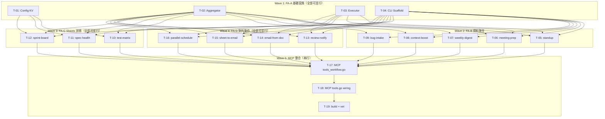

# S3 Implementation Plan: 內建 Workflow Skills

> **階段**: S3 實作計畫
> **建立時間**: 2026-03-19 20:00
> **Agent**: orchestrator（無 stack-specific agents）

---

## 1. 概述

### 1.1 功能目標
將 13 個跨服務 workflow skills 內建為 gwx CLI 命令 + MCP 工具（19 個），讓任何 Agent 或人類一行指令觸發跨服務工作流程。

### 1.2 實作範圍
- **範圍內**: workflow 引擎（aggregator + executor）、13 個 workflow CLI+MCP、安全確認機制、config KV store
- **範圍外**: AI 推理、UI、自訂 workflow

### 1.3 關聯文件
| 文件 | 路徑 | 狀態 |
|------|------|------|
| Brief Spec | `./s0_brief_spec.md` | ✅ |
| Dev Spec | `./s1_dev_spec.md` | ✅ |
| Implementation Plan | `./s3_implementation_plan.md` | 📝 當前 |

---

## 2. 實作任務清單

### 2.1 任務總覽

| # | 任務 | FA | Agent | 依賴 | 複雜度 | TDD | 狀態 |
|---|------|----|-------|------|--------|-----|------|
| T-01 | Config workflow_config.go | A | `orchestrator` | - | S | ✅ | ⬜ |
| T-02 | Aggregator RunParallel | A | `orchestrator` | - | M | ✅ | ⬜ |
| T-03 | Executor Dispatch | A | `orchestrator` | - | M | ✅ | ⬜ |
| T-04 | WorkflowCmd + root.go | A | `orchestrator` | - | S | ⛔ | ⬜ |
| T-05 | standup workflow + CLI | B | `orchestrator` | T-02,T-03,T-04 | M | ⛔ | ⬜ |
| T-06 | meeting-prep workflow + CLI | B | `orchestrator` | T-02,T-03,T-04 | M | ⛔ | ⬜ |
| T-07 | weekly-digest workflow + CLI | B | `orchestrator` | T-02,T-04 | S | ⛔ | ⬜ |
| T-08 | context-boost workflow + CLI | B | `orchestrator` | T-02,T-04 | S | ⛔ | ⬜ |
| T-09 | bug-intake workflow + CLI | B | `orchestrator` | T-02,T-04 | S | ⛔ | ⬜ |
| T-10 | test-matrix workflow + CLI | C | `orchestrator` | T-01,T-02,T-04 | M | ⛔ | ⬜ |
| T-11 | spec-health workflow + CLI | C | `orchestrator` | T-01,T-02,T-04 | M | ⛔ | ⬜ |
| T-12 | sprint-board workflow + CLI | C | `orchestrator` | T-01,T-02,T-04 | M | ⛔ | ⬜ |
| T-13 | review-notify workflow + CLI | D | `orchestrator` | T-02,T-03,T-04 | M | ⛔ | ⬜ |
| T-14 | email-from-doc workflow + CLI | D | `orchestrator` | T-02,T-03,T-04 | M | ⛔ | ⬜ |
| T-15 | sheet-to-email workflow + CLI | D | `orchestrator` | T-02,T-03,T-04 | M | ⛔ | ⬜ |
| T-16 | parallel-schedule workflow + CLI | D | `orchestrator` | T-02,T-03,T-04 | M | ⛔ | ⬜ |
| T-17 | MCP tools_workflow.go (19 tools) | - | `orchestrator` | T-05~T-16 | L | ✅ | ⬜ |
| T-18 | MCP tools.go integration | - | `orchestrator` | T-17 | S | ⛔ | ⬜ |
| T-19 | go build + go vet verification | - | `orchestrator` | T-18 | S | ⛔ | ⬜ |

**狀態圖例**：⬜ pending | 🔄 in_progress | ✅ completed | ❌ blocked | ⏭️ skipped

**複雜度**：S（<30min） | M（30min-2hr） | L（>2hr）

**TDD**: ✅ = has tdd_plan | ⛔ = N/A (skip_justification provided)

---

## 3. 任務詳情

### Task T-01: Config workflow_config.go

**基本資訊**
| 項目 | 內容 |
|------|------|
| 類型 | 後端（config 層） |
| FA | A — 基礎設施 |
| Agent | `orchestrator` |
| 複雜度 | S |
| 依賴 | - |
| 狀態 | ⬜ pending |

**描述**
新建 `internal/config/workflow_config.go`，提供 JSON flat map KV store。存放於 `~/.config/gwx/workflow.json`。使用 `config.Dir()` 定位目錄。提供 `GetWorkflowConfig(key)`, `SetWorkflowConfig(key, value)`, `GetAllWorkflowConfig()` 三個函式。寫入用 temp file + rename 確保原子性。

**輸入**
- 現有 `internal/config/` package 的 `Dir()` 函式

**輸出**
- `GetWorkflowConfig(key string) (string, error)` — 不存在回傳 `"", nil`
- `SetWorkflowConfig(key, value string) error` — 自動建立檔案/目錄
- `GetAllWorkflowConfig() (map[string]string, error)`

**受影響檔案**
| 檔案 | 變更類型 | 說明 |
|------|---------|------|
| `internal/config/workflow_config.go` | 新增 | KV store 實作 |

**DoD（完成定義）**
- [ ] `GetWorkflowConfig` 讀取 key，不存在回傳 `"", nil`
- [ ] `SetWorkflowConfig` 寫入 key-value，自動建立檔案/目錄
- [ ] 檔案格式為 `{"test-matrix.sheet-id": "abc123", ...}`
- [ ] 寫入用 temp file + rename 確保原子性
- [ ] `go vet` 通過

**TDD Plan**
| 項目 | 內容 |
|------|------|
| 測試檔案 | `internal/config/workflow_config_test.go` |
| 測試指令 | `go test -run TestWorkflowConfig ./internal/config/...` |
| 預期測試案例 | `TestWorkflowConfigGetMissing`, `TestWorkflowConfigSetAndGet`, `TestWorkflowConfigAtomicWrite`, `TestWorkflowConfigAutoCreateDir` |

**驗證方式**
```bash
go test -run TestWorkflowConfig ./internal/config/...
go vet ./internal/config/...
```

**實作備註**
- 使用 `config.Dir()` 取得基底目錄
- 寫入流程：讀取 → 修改 → 寫入 temp → rename（原子性）
- key 慣例：`{workflow_name}.{setting}`（如 `test-matrix.sheet-id`）

---

### Task T-02: Aggregator RunParallel

**基本資訊**
| 項目 | 內容 |
|------|------|
| 類型 | 後端（workflow 引擎） |
| FA | A — 基礎設施 |
| Agent | `orchestrator` |
| 複雜度 | M |
| 依賴 | - |
| 狀態 | ⬜ pending |

**描述**
新建 `internal/workflow/aggregator.go`，實作 `RunParallel` 函式。接收 `[]Fetcher`，每個 Fetcher 含 `Name string` 和 `Fn func(ctx context.Context) (interface{}, error)`。使用 goroutine 並行執行，收集結果為 `[]FetchResult`。支援 context cancellation。部分失敗不中斷其他 goroutine。Panic recovery。

**輸入**
- `[]Fetcher` — 一組命名的資料擷取函式
- `context.Context` — 支援 cancel/timeout

**輸出**
- `[]FetchResult` — 與輸入順序一致的結果集

**受影響檔案**
| 檔案 | 變更類型 | 說明 |
|------|---------|------|
| `internal/workflow/aggregator.go` | 新增 | RunParallel 框架 |

**DoD（完成定義）**
- [ ] `RunParallel` 並行執行所有 fetcher
- [ ] 任一 fetcher panic 時 recover 並寫入 Error
- [ ] context cancel 時所有 fetcher 可感知
- [ ] 回傳 `[]FetchResult` 順序與輸入 `[]Fetcher` 一致
- [ ] `go vet` 通過

**TDD Plan**
| 項目 | 內容 |
|------|------|
| 測試檔案 | `internal/workflow/aggregator_test.go` |
| 測試指令 | `go test -run TestRunParallel ./internal/workflow/...` |
| 預期測試案例 | `TestRunParallelAllSuccess`, `TestRunParallelPartialFailure`, `TestRunParallelContextCancel`, `TestRunParallelPanicRecovery`, `TestRunParallelOrderPreserved` |

**驗證方式**
```bash
go test -run TestRunParallel ./internal/workflow/...
go vet ./internal/workflow/...
```

**實作備註**
- 模式參考 `internal/cmd/context.go` 的 goroutine fan-out，但提取為可複用框架
- 使用 `sync.WaitGroup` + 預分配 slice（按 index 寫入，無需 mutex）
- 每個 goroutine 內 `defer recover()` 捕捉 panic

---

### Task T-03: Executor Dispatch

**基本資訊**
| 項目 | 內容 |
|------|------|
| 類型 | 後端（workflow 引擎） |
| FA | A — 基礎設施 |
| Agent | `orchestrator` |
| 複雜度 | M |
| 依賴 | - |
| 狀態 | ⬜ pending |

**描述**
新建 `internal/workflow/executor.go`，實作 `Dispatch` 函式。根據 `ExecuteOpts` 五種分支決定行為：IsMCP → no-op、Execute=false → no-op、TTY+confirm → execute、TTY+cancel → abort、NoInput → auto-execute。預覽輸出走 stderr。

**輸入**
- `context.Context`
- `[]Action` — 動作清單
- `ExecuteOpts` — 控制旗標

**輸出**
- `*ExecuteResult` — 執行結果

**受影響檔案**
| 檔案 | 變更類型 | 說明 |
|------|---------|------|
| `internal/workflow/executor.go` | 新增 | Dispatch + 型別定義 |

**DoD（完成定義）**
- [ ] 五種分支皆正確處理（IsMCP / no-execute / TTY-confirm / TTY-cancel / NoInput）
- [ ] 預覽輸出走 stderr（不污染 JSON stdout）
- [ ] 確認 prompt 格式：`Execute N action(s)? [y/N]`
- [ ] 單一 action 失敗不中斷其餘
- [ ] `go vet` 通過

**TDD Plan**
| 項目 | 內容 |
|------|------|
| 測試檔案 | `internal/workflow/executor_test.go` |
| 測試指令 | `go test -run TestDispatch ./internal/workflow/...` |
| 預期測試案例 | `TestDispatchIsMCP`, `TestDispatchNoExecuteFlag`, `TestDispatchTTYConfirm`, `TestDispatchTTYCancel`, `TestDispatchNoInput` |

**驗證方式**
```bash
go test -run TestDispatch ./internal/workflow/...
go vet ./internal/workflow/...
```

**實作備註**
- TTY 偵測用 `os.Stdin` 的 `IsTerminal` 或注入 reader/writer 以利測試
- 預覽格式：逐行列出 Action.Description，最後一行 `Execute N action(s)? [y/N]`
- Action.Fn 單獨失敗時記錄 error 繼續下一個

---

### Task T-04: WorkflowCmd + root.go

**基本資訊**
| 項目 | 內容 |
|------|------|
| 類型 | 後端（CLI scaffold） |
| FA | A — 基礎設施 |
| Agent | `orchestrator` |
| 複雜度 | S |
| 依賴 | - |
| 狀態 | ⬜ pending |

**描述**
新建 `internal/cmd/workflow.go` 定義 `WorkflowCmd` struct（空殼，子命令在各 workflow 任務中填入）。新建 `internal/cmd/standup.go` 和 `internal/cmd/meeting_prep.go` 的空殼 struct。修改 `internal/cmd/root.go` CLI struct 新增三個欄位：`Standup StandupCmd`, `MeetingPrep MeetingPrepCmd`, `Workflow WorkflowCmd`。

**輸入**
- 現有 `internal/cmd/root.go` 的 CLI struct 結構

**輸出**
- `gwx standup --help` 可用
- `gwx meeting-prep --help` 可用
- `gwx workflow --help` 顯示子命令群組

**受影響檔案**
| 檔案 | 變更類型 | 說明 |
|------|---------|------|
| `internal/cmd/workflow.go` | 新增 | WorkflowCmd struct + 子命令 struct 定義 |
| `internal/cmd/standup.go` | 新增 | StandupCmd struct + Run 空殼 |
| `internal/cmd/meeting_prep.go` | 新增 | MeetingPrepCmd struct + Run 空殼 |
| `internal/cmd/root.go` | 修改 | CLI struct 新增 3 個欄位 |

**DoD（完成定義）**
- [ ] `root.go` CLI struct 新增 3 個欄位
- [ ] `gwx standup --help` 可用
- [ ] `gwx meeting-prep --help` 可用
- [ ] `gwx workflow --help` 顯示子命令群組
- [ ] 不影響現有命令（`gwx gmail`, `gwx context` 等）
- [ ] 所有 workflow CLI 命令的 `Run` 方法第一行是 `CheckAllowlist(rctx, "workflow.{name}")`
- [ ] `go build` 通過

**TDD Plan**: N/A — CLI scaffold with no testable logic; validation deferred to build verification (T-19)

**驗證方式**
```bash
go build ./...
./gwx standup --help
./gwx meeting-prep --help
./gwx workflow --help
```

**實作備註**
- kong tag 慣例參照現有 `GmailCmd`、`CalendarCmd` 等
- 空殼 Run 方法先回傳 `fmt.Errorf("not implemented")`，待各 workflow task 填入
- `standup` 和 `meeting-prep` 為頂層命令，其餘 11 個在 `WorkflowCmd` 子命令群組下

---

### Task T-05: standup workflow + CLI

**基本資訊**
| 項目 | 內容 |
|------|------|
| 類型 | 後端 |
| FA | B — 資料聚合型 |
| Agent | `orchestrator` |
| 複雜度 | M |
| 依賴 | T-02, T-03, T-04 |
| 狀態 | ⬜ pending |

**描述**
新建 `internal/workflow/standup.go` 實作 `RunStandup`。並行聚合 4 來源：(1) Gmail digest（`DigestMessages`）、(2) Calendar agenda（`Agenda`）、(3) Tasks（`ListTasks`）、(4) Git log（`os/exec: git log --oneline --since=yesterday`）。填入 `internal/cmd/standup.go` 的 Run 邏輯。`--execute --push chat:spaces/XXX` 時用 `ChatService.SendMessage` 推送。

**輸入**
- T-02 的 `RunParallel` 框架
- T-03 的 `Dispatch` 機制
- T-04 的 `StandupCmd` CLI struct

**輸出**
- `StandupResult` JSON

**受影響檔案**
| 檔案 | 變更類型 | 說明 |
|------|---------|------|
| `internal/workflow/standup.go` | 新增 | RunStandup + StandupResult |
| `internal/cmd/standup.go` | 修改 | 填入 Run 邏輯 |

**DoD（完成定義）**
- [ ] `gwx standup` 輸出 StandupResult JSON
- [ ] 4 個聚合來源並行執行
- [ ] 非 git repo 時 git_changes 為空陣列不報錯
- [ ] `--execute --push chat:spaces/XXX` 推送成功
- [ ] 部分服務失敗時其餘正常
- [ ] CheckAllowlist 檢查 `workflow.standup`
- [ ] `go vet` 通過

**TDD Plan**: N/A — Depends on external API services; tested via build verification and integration test

**驗證方式**
```bash
go build ./...
go vet ./internal/workflow/... ./internal/cmd/...
```

**實作備註**
- services needed: `gmail`, `calendar`, `tasks`, `chat`（chat 只在 execute+push 時）
- git log 失敗時寫入空陣列，不影響其他聚合
- `--push` 參數解析 `chat:spaces/XXX` 取出 space name

---

### Task T-06: meeting-prep workflow + CLI

**基本資訊**
| 項目 | 內容 |
|------|------|
| 類型 | 後端 |
| FA | B — 資料聚合型 |
| Agent | `orchestrator` |
| 複雜度 | M |
| 依賴 | T-02, T-03, T-04 |
| 狀態 | ⬜ pending |

**描述**
新建 `internal/workflow/meeting_prep.go` 實作 `RunMeetingPrep`。用 `CalendarService.Agenda` 找匹配 meeting title（keyword match，非精確匹配）。然後並行聚合：(1) 出席者聯絡資訊（`ContactsService.SearchContacts`）、(2) 與出席者的近期信件（`GmailService.SearchMessages`）、(3) 相關文件（`DriveService.SearchFiles`）。

**輸入**
- T-02 的 `RunParallel`
- T-03 的 `Dispatch`
- T-04 的 `MeetingPrepCmd`

**輸出**
- `MeetingPrepResult` JSON

**受影響檔案**
| 檔案 | 變更類型 | 說明 |
|------|---------|------|
| `internal/workflow/meeting_prep.go` | 新增 | RunMeetingPrep + MeetingPrepResult |
| `internal/cmd/meeting_prep.go` | 修改 | 填入 Run 邏輯 |

**DoD（完成定義）**
- [ ] `gwx meeting-prep "Weekly"` 找到匹配事件並聚合（keyword match）
- [ ] 找不到匹配事件時回傳明確錯誤
- [ ] 3 個聚合來源並行
- [ ] CheckAllowlist 檢查 `workflow.meeting-prep`
- [ ] `go vet` 通過

**TDD Plan**: N/A — Depends on external API services; tested via build verification and integration test

**驗證方式**
```bash
go build ./...
go vet ./internal/workflow/... ./internal/cmd/...
```

**實作備註**
- S2 修正：meeting title 用 keyword match（strings.Contains），非精確比對
- services: `calendar`, `contacts`, `gmail`, `drive`

---

### Task T-07: weekly-digest workflow + CLI

**基本資訊**
| 項目 | 內容 |
|------|------|
| 類型 | 後端 |
| FA | B — 資料聚合型 |
| Agent | `orchestrator` |
| 複雜度 | S |
| 依賴 | T-02, T-04 |
| 狀態 | ⬜ pending |

**描述**
新建 `internal/workflow/weekly_digest.go` 實作 `RunWeeklyDigest`。掛到 `WorkflowCmd.WeeklyDigest`。並行聚合過去 7 天 email stats、會議數量/時數、已完成任務。

**輸入**
- T-02 的 `RunParallel`
- T-04 的 `WeeklyDigestCmd`

**輸出**
- `WeeklyDigestResult` JSON

**受影響檔案**
| 檔案 | 變更類型 | 說明 |
|------|---------|------|
| `internal/workflow/weekly_digest.go` | 新增 | RunWeeklyDigest + Result types |
| `internal/cmd/workflow.go` | 修改 | 填入 WeeklyDigestCmd.Run |

**DoD（完成定義）**
- [ ] `gwx workflow weekly-digest` 輸出 WeeklyDigestResult
- [ ] 預設 7 天，可用 `--weeks 2` 調整
- [ ] CheckAllowlist 檢查 `workflow.weekly-digest`
- [ ] `go vet` 通過

**TDD Plan**: N/A — Depends on external API services; tested via build verification and integration test

**驗證方式**
```bash
go build ./...
go vet ./internal/workflow/... ./internal/cmd/...
```

---

### Task T-08: context-boost workflow + CLI

**基本資訊**
| 項目 | 內容 |
|------|------|
| 類型 | 後端 |
| FA | B — 資料聚合型 |
| Agent | `orchestrator` |
| 複雜度 | S |
| 依賴 | T-02, T-04 |
| 狀態 | ⬜ pending |

**描述**
新建 `internal/workflow/context_boost.go` 實作 `RunContextBoost`。並行查 Gmail + Drive + Calendar + Contacts，比 `gwx context` 多查 contacts。

**輸入**
- T-02 的 `RunParallel`
- T-04 的 `ContextBoostCmd`

**輸出**
- `ContextBoostResult` JSON

**受影響檔案**
| 檔案 | 變更類型 | 說明 |
|------|---------|------|
| `internal/workflow/context_boost.go` | 新增 | RunContextBoost + Result types |
| `internal/cmd/workflow.go` | 修改 | 填入 ContextBoostCmd.Run |

**DoD（完成定義）**
- [ ] `gwx workflow context-boost --topic "Project X"` 回傳 ContextBoostResult
- [ ] 比 `gwx context` 多查 contacts
- [ ] CheckAllowlist 檢查 `workflow.context-boost`
- [ ] `go vet` 通過

**TDD Plan**: N/A — Depends on external API services; tested via build verification and integration test

**驗證方式**
```bash
go build ./...
go vet ./internal/workflow/... ./internal/cmd/...
```

---

### Task T-09: bug-intake workflow + CLI

**基本資訊**
| 項目 | 內容 |
|------|------|
| 類型 | 後端 |
| FA | B — 資料聚合型 |
| Agent | `orchestrator` |
| 複雜度 | S |
| 依賴 | T-02, T-04 |
| 狀態 | ⬜ pending |

**描述**
新建 `internal/workflow/bug_intake.go` 實作 `RunBugIntake`。S2 修正：bug-intake 用 search mode（`SearchMessages` 而非 `ListMessages`）。用 bug ID 或關鍵字並行查：(1) 相關郵件、(2) 相關文件、(3) git log grep。

**輸入**
- T-02 的 `RunParallel`
- T-04 的 `BugIntakeCmd`

**輸出**
- `BugIntakeResult` JSON

**受影響檔案**
| 檔案 | 變更類型 | 說明 |
|------|---------|------|
| `internal/workflow/bug_intake.go` | 新增 | RunBugIntake + Result types |
| `internal/cmd/workflow.go` | 修改 | 填入 BugIntakeCmd.Run |

**DoD（完成定義）**
- [ ] `gwx workflow bug-intake --bug-id "BUG-123"` 輸出 BugIntakeResult
- [ ] 使用 `SearchMessages`（search mode）查詢相關郵件
- [ ] git log grep 失敗時不報錯
- [ ] CheckAllowlist 檢查 `workflow.bug-intake`
- [ ] `go vet` 通過

**TDD Plan**: N/A — Depends on external API services; tested via build verification and integration test

**驗證方式**
```bash
go build ./...
go vet ./internal/workflow/... ./internal/cmd/...
```

---

### Task T-10: test-matrix workflow + CLI

**基本資訊**
| 項目 | 內容 |
|------|------|
| 類型 | 後端 |
| FA | C — Sheets 狀態型 |
| Agent | `orchestrator` |
| 複雜度 | M |
| 依賴 | T-01, T-02, T-04 |
| 狀態 | ⬜ pending |

**描述**
新建 `internal/workflow/test_matrix.go` 實作三個子命令：init（CreateSpreadsheet + 存 config）、sync（讀測試結果寫入 Sheet）、stats（讀 Sheet 統計 pass/fail/skip）。

**輸入**
- T-01 的 config KV store
- T-02 的 `RunParallel`（stats 可能並行讀多 range）
- T-04 的 `TestMatrixCmd`

**輸出**
- `TestMatrixResult` JSON

**受影響檔案**
| 檔案 | 變更類型 | 說明 |
|------|---------|------|
| `internal/workflow/test_matrix.go` | 新增 | test-matrix 三子命令邏輯 |
| `internal/cmd/workflow.go` | 修改 | 填入 TestMatrixCmd.Run |

**DoD（完成定義）**
- [ ] `gwx workflow test-matrix init` 建立 Sheet 並儲存 ID
- [ ] `gwx workflow test-matrix sync --file results.json` 更新 Sheet
- [ ] `gwx workflow test-matrix stats` 回傳統計
- [ ] Sheet ID 存在 workflow config 中
- [ ] CheckAllowlist 檢查 `workflow.test-matrix`
- [ ] `go vet` 通過

**TDD Plan**: N/A — Depends on external API services (Sheets); tested via build verification and integration test

**驗證方式**
```bash
go build ./...
go vet ./internal/workflow/... ./internal/cmd/...
```

---

### Task T-11: spec-health workflow + CLI

**基本資訊**
| 項目 | 內容 |
|------|------|
| 類型 | 後端 |
| FA | C — Sheets 狀態型 |
| Agent | `orchestrator` |
| 複雜度 | M |
| 依賴 | T-01, T-02, T-04 |
| 狀態 | ⬜ pending |

**描述**
新建 `internal/workflow/spec_health.go` 實作三個子命令：init（CreateSpreadsheet + 存 config）、record（解析 sdd_context.json 寫入 Sheet）、stats（統計 draft/review/approved/stale）。spec_folder 由 CLI `--spec-folder` 傳入。

**輸入**
- T-01 的 config KV store
- T-02 的 `RunParallel`
- T-04 的 `SpecHealthCmd`

**輸出**
- `SpecHealthResult` JSON

**受影響檔案**
| 檔案 | 變更類型 | 說明 |
|------|---------|------|
| `internal/workflow/spec_health.go` | 新增 | spec-health 三子命令邏輯 |
| `internal/cmd/workflow.go` | 修改 | 填入 SpecHealthCmd.Run |

**DoD（完成定義）**
- [ ] `gwx workflow spec-health init` 建立 Sheet
- [ ] `gwx workflow spec-health record --spec-folder dev/specs/xxx` 正確解析 sdd_context.json
- [ ] `gwx workflow spec-health stats` 回傳統計
- [ ] CheckAllowlist 檢查 `workflow.spec-health`
- [ ] `go vet` 通過

**TDD Plan**: N/A — Depends on external API services (Sheets); tested via build verification and integration test

**驗證方式**
```bash
go build ./...
go vet ./internal/workflow/... ./internal/cmd/...
```

---

### Task T-12: sprint-board workflow + CLI

**基本資訊**
| 項目 | 內容 |
|------|------|
| 類型 | 後端 |
| FA | C — Sheets 狀態型 |
| Agent | `orchestrator` |
| 複雜度 | M |
| 依賴 | T-01, T-02, T-04 |
| 狀態 | ⬜ pending |

**描述**
新建 `internal/workflow/sprint_board.go` 實作四個子命令：init、ticket、stats、archive。Ticket ID 自動生成（`T-{timestamp}`）。archive 只移 status=done 的列。

**輸入**
- T-01 的 config KV store
- T-02 的 `RunParallel`
- T-04 的 `SprintBoardCmd`

**輸出**
- `SprintBoardResult` JSON

**受影響檔案**
| 檔案 | 變更類型 | 說明 |
|------|---------|------|
| `internal/workflow/sprint_board.go` | 新增 | sprint-board 四子命令邏輯 |
| `internal/cmd/workflow.go` | 修改 | 填入 SprintBoardCmd.Run |

**DoD（完成定義）**
- [ ] 四個子命令皆可用（init, ticket, stats, archive）
- [ ] Ticket ID 自動生成（`T-{timestamp}`）
- [ ] archive 只移 status=done 的列
- [ ] CheckAllowlist 檢查 `workflow.sprint-board`
- [ ] `go vet` 通過

**TDD Plan**: N/A — Depends on external API services (Sheets); tested via build verification and integration test

**驗證方式**
```bash
go build ./...
go vet ./internal/workflow/... ./internal/cmd/...
```

---

### Task T-13: review-notify workflow + CLI

**基本資訊**
| 項目 | 內容 |
|------|------|
| 類型 | 後端 |
| FA | D — 對外動作型 |
| Agent | `orchestrator` |
| 複雜度 | M |
| 依賴 | T-02, T-03, T-04 |
| 狀態 | ⬜ pending |

**描述**
新建 `internal/workflow/review_notify.go` 實作 `RunReviewNotify`。聚合 spec 資訊，`--execute` 時透過 `--channel` 指定管道發通知（email 用 Gmail、chat 用 Chat）。

**輸入**
- T-02 的 `RunParallel`
- T-03 的 `Dispatch`
- T-04 的 `ReviewNotifyCmd`

**輸出**
- `ReviewNotifyResult` JSON

**受影響檔案**
| 檔案 | 變更類型 | 說明 |
|------|---------|------|
| `internal/workflow/review_notify.go` | 新增 | RunReviewNotify + Result types |
| `internal/cmd/workflow.go` | 修改 | 填入 ReviewNotifyCmd.Run |

**DoD（完成定義）**
- [ ] `gwx workflow review-notify --spec-folder xxx --reviewers a@x.com,b@x.com` 回傳預覽
- [ ] `--execute --channel email` 實際發信
- [ ] `--execute --channel chat:spaces/XXX` 實際推送
- [ ] 無 `--execute` 時只回傳預覽 JSON
- [ ] Error path: `--execute` 但未指定 `--channel` → `error: --channel required when --execute is set`
- [ ] Error path: TTY 確認 N → `{"cancelled": true, "reason": "user declined"}`
- [ ] CheckAllowlist 檢查 `workflow.review-notify`
- [ ] `go vet` 通過

**TDD Plan**: N/A — Depends on external API services; tested via build verification and integration test

**驗證方式**
```bash
go build ./...
go vet ./internal/workflow/... ./internal/cmd/...
```

---

### Task T-14: email-from-doc workflow + CLI

**基本資訊**
| 項目 | 內容 |
|------|------|
| 類型 | 後端 |
| FA | D — 對外動作型 |
| Agent | `orchestrator` |
| 複雜度 | M |
| 依賴 | T-02, T-03, T-04 |
| 狀態 | ⬜ pending |

**描述**
新建 `internal/workflow/email_from_doc.go` 實作 `RunEmailFromDoc`。用 `DocsService.GetDocument` 取文件內容，組裝為 email body，`--execute` 時用 `GmailService.SendMessage` 發送。

**輸入**
- T-02 的 `RunParallel`
- T-03 的 `Dispatch`
- T-04 的 `EmailFromDocCmd`

**輸出**
- `EmailFromDocResult` JSON

**受影響檔案**
| 檔案 | 變更類型 | 說明 |
|------|---------|------|
| `internal/workflow/email_from_doc.go` | 新增 | RunEmailFromDoc + Result types |
| `internal/cmd/workflow.go` | 修改 | 填入 EmailFromDocCmd.Run |

**DoD（完成定義）**
- [ ] `gwx workflow email-from-doc --doc-id XXX --recipients a@x.com` 回傳預覽
- [ ] 預覽含 subject（doc title）+ body（doc content）
- [ ] `--execute` 實際發信
- [ ] Error path: `--execute` 但未指定 `--recipients` → `error: --recipients required when --execute is set`
- [ ] Error path: TTY 確認 N → `{"cancelled": true, "reason": "user declined"}`
- [ ] CheckAllowlist 檢查 `workflow.email-from-doc`
- [ ] `go vet` 通過

**TDD Plan**: N/A — Depends on external API services; tested via build verification and integration test

**驗證方式**
```bash
go build ./...
go vet ./internal/workflow/... ./internal/cmd/...
```

---

### Task T-15: sheet-to-email workflow + CLI

**基本資訊**
| 項目 | 內容 |
|------|------|
| 類型 | 後端 |
| FA | D — 對外動作型 |
| Agent | `orchestrator` |
| 複雜度 | M |
| 依賴 | T-02, T-03, T-04 |
| 狀態 | ⬜ pending |

**描述**
新建 `internal/workflow/sheet_to_email.go` 實作 `RunSheetToEmail`。讀取 Sheet 資料，每列一封 email。硬限制 50 列（預覽階段就檢查，不只是 execute 時）。

**輸入**
- T-02 的 `RunParallel`
- T-03 的 `Dispatch`
- T-04 的 `SheetToEmailCmd`

**輸出**
- `SheetToEmailResult` JSON

**受影響檔案**
| 檔案 | 變更類型 | 說明 |
|------|---------|------|
| `internal/workflow/sheet_to_email.go` | 新增 | RunSheetToEmail + Result types |
| `internal/cmd/workflow.go` | 修改 | 填入 SheetToEmailCmd.Run |

**DoD（完成定義）**
- [ ] `gwx workflow sheet-to-email --sheet-id XXX --range "Sheet1!A:F" --email-col 0 --subject-col 1 --body-col 2` 回傳預覽
- [ ] 超過 50 列時硬拒絕（含預覽模式），錯誤訊息含 `exceeds limit 50`
- [ ] `--execute` 實際發信
- [ ] 每封信獨立失敗不影響其餘
- [ ] Error path: `limit > 50` → `error: row count {N} exceeds limit 50`，不做任何 API 呼叫
- [ ] Error path: TTY 確認 N → `{"cancelled": true, "reason": "user declined"}`
- [ ] CheckAllowlist 檢查 `workflow.sheet-to-email`
- [ ] `go vet` 通過

**TDD Plan**: N/A — Depends on external API services; tested via build verification and integration test

**驗證方式**
```bash
go build ./...
go vet ./internal/workflow/... ./internal/cmd/...
```

**實作備註**
- 50 列硬限制在 ReadRange 之後立即檢查，早於任何 execute 邏輯
- 預覽顯示前 3 筆收件者

---

### Task T-16: parallel-schedule workflow + CLI

**基本資訊**
| 項目 | 內容 |
|------|------|
| 類型 | 後端 |
| FA | D — 對外動作型 |
| Agent | `orchestrator` |
| 複雜度 | M |
| 依賴 | T-02, T-03, T-04 |
| 狀態 | ⬜ pending |

**描述**
新建 `internal/workflow/parallel_schedule.go` 實作 `RunParallelSchedule`。為每位 attendee 建立獨立 1-on-1 事件。用 `CalendarService.FindSlot` 找可用時段，`--execute` 時用 `CalendarService.CreateEvent` 建立。

**輸入**
- T-02 的 `RunParallel`
- T-03 的 `Dispatch`
- T-04 的 `ParallelScheduleCmd`

**輸出**
- `ParallelScheduleResult` JSON

**受影響檔案**
| 檔案 | 變更類型 | 說明 |
|------|---------|------|
| `internal/workflow/parallel_schedule.go` | 新增 | RunParallelSchedule + Result types |
| `internal/cmd/workflow.go` | 修改 | 填入 ParallelScheduleCmd.Run |

**DoD（完成定義）**
- [ ] `gwx workflow parallel-schedule --title "Code Review" --attendees a@x.com,b@x.com --duration 30m` 回傳每人可用時段
- [ ] `--execute` 為每人建立獨立事件
- [ ] Error path: FindSlot 無可用時段 → `{"attendee": "a@x.com", "error": "no available slots..."}`，不中斷其他人
- [ ] Error path: TTY 確認 N → `{"cancelled": true, "reason": "user declined"}`
- [ ] CheckAllowlist 檢查 `workflow.parallel-schedule`
- [ ] `go vet` 通過

**TDD Plan**: N/A — Depends on external API services; tested via build verification and integration test

**驗證方式**
```bash
go build ./...
go vet ./internal/workflow/... ./internal/cmd/...
```

---

### Task T-17: MCP tools_workflow.go (19 tools)

**基本資訊**
| 項目 | 內容 |
|------|------|
| 類型 | 後端（MCP 層） |
| FA | - |
| Agent | `orchestrator` |
| 複雜度 | L |
| 依賴 | T-05~T-16 |
| 狀態 | ⬜ pending |

**描述**
新建 `internal/mcp/tools_workflow.go`，定義 19 個 MCP 工具。每個工具呼叫對應 workflow 的 Run 函式，傳入 `ExecuteOpts{IsMCP: true}`。匯出 `WorkflowTools() []Tool` 和 `CallWorkflowTool(ctx, name, args) (*ToolResult, error, bool)`。

19 個工具清單：
1. `workflow_standup`
2. `workflow_meeting_prep`
3. `workflow_weekly_digest`
4. `workflow_context_boost`
5. `workflow_bug_intake`
6. `workflow_test_matrix_init`
7. `workflow_test_matrix_sync`
8. `workflow_test_matrix_stats`
9. `workflow_spec_health_init`
10. `workflow_spec_health_record`
11. `workflow_spec_health_stats`
12. `workflow_sprint_board_init`
13. `workflow_sprint_board_ticket`
14. `workflow_sprint_board_stats`
15. `workflow_review_notify`
16. `workflow_email_from_doc`
17. `workflow_sheet_to_email`
18. `workflow_parallel_schedule`
19. `workflow_digest` (alias for weekly-digest)

**輸入**
- T-05~T-16 所有 workflow Run 函式
- 現有 MCP `Tool` / `ToolResult` 型別

**輸出**
- `WorkflowTools()` 回傳 19 個 Tool 定義
- `CallWorkflowTool()` 路由到正確 handler

**受影響檔案**
| 檔案 | 變更類型 | 說明 |
|------|---------|------|
| `internal/mcp/tools_workflow.go` | 新增 | 19 個 MCP 工具定義 + handler |

**DoD（完成定義）**
- [ ] 19 個工具定義完整（Name, Description, InputSchema, Required）
- [ ] 每個 handler 正確呼叫 workflow.Run* 函式
- [ ] 所有 handler 傳 `IsMCP: true`，確保不觸發動作
- [ ] FA-C init/sync/record 工具在 MCP 模式下只回傳預覽
- [ ] MCP handler 輸入驗證與 CLI 一致（共用 workflow 層驗證）
- [ ] `go vet` 通過

**TDD Plan**
| 項目 | 內容 |
|------|------|
| 測試檔案 | `internal/mcp/tools_workflow_test.go` |
| 測試指令 | `go test -run TestWorkflowTools ./internal/mcp/...` |
| 預期測試案例 | `TestWorkflowToolsCount`, `TestCallWorkflowToolRouting`, `TestCallWorkflowToolUnknown` |

**驗證方式**
```bash
go test -run TestWorkflowTools ./internal/mcp/...
go vet ./internal/mcp/...
```

**實作備註**
- 沿用 `tools_batch.go` 的 `BatchTools()` / `CallBatchTool()` 模式
- InputSchema 用 JSON Schema 定義必填/選填參數
- handler 內解析 args map → 呼叫 workflow.Run* → marshal 結果

---

### Task T-18: MCP tools.go integration

**基本資訊**
| 項目 | 內容 |
|------|------|
| 類型 | 後端（MCP 接線） |
| FA | - |
| Agent | `orchestrator` |
| 複雜度 | S |
| 依賴 | T-17 |
| 狀態 | ⬜ pending |

**描述**
修改 `internal/mcp/tools.go`：ListTools 尾部追加 `WorkflowTools()`，CallTool default 在 `CallBatchTool` 之後追加 `CallWorkflowTool`。

**輸入**
- T-17 的 `WorkflowTools()` 和 `CallWorkflowTool()`
- 現有 `internal/mcp/tools.go` 的 chain 結構

**輸出**
- MCP server 可列出並路由 workflow 工具

**受影響檔案**
| 檔案 | 變更類型 | 說明 |
|------|---------|------|
| `internal/mcp/tools.go` | 修改 | ListTools + CallTool chain 追加 |

**DoD（完成定義）**
- [ ] ListTools 回傳包含 19 個 workflow 工具
- [ ] CallTool 可路由到 workflow handler
- [ ] 不影響現有工具（chain 順序正確：Extended → New → Batch → Workflow）
- [ ] `go vet` 通過

**TDD Plan**: N/A — Pure wiring with no independent testable logic; covered by T-17 tests and T-19 build verification

**驗證方式**
```bash
go build ./...
go vet ./internal/mcp/...
```

**實作備註**
- 必須在 `CallBatchTool` 之後追加，否則可能短路現有路由
- 兩處修改：`ListTools()` 追加一行 + `CallTool()` default branch 追加一段

---

### Task T-19: go build + go vet verification

**基本資訊**
| 項目 | 內容 |
|------|------|
| 類型 | 後端（驗證） |
| FA | - |
| Agent | `orchestrator` |
| 複雜度 | S |
| 依賴 | T-18 |
| 狀態 | ⬜ pending |

**描述**
全量 `go build ./...` 和 `go vet ./...` 確保無編譯錯誤和靜態分析問題。修復任何 import cycle 或 unused variable。驗證 CLI help 輸出。

**輸入**
- T-01~T-18 全部完成

**輸出**
- 零錯誤零警告的 build + vet

**受影響檔案**
| 檔案 | 變更類型 | 說明 |
|------|---------|------|
| （可能修正任何檔案的 import/typo） | 修改 | 修復 build/vet 問題 |

**DoD（完成定義）**
- [ ] `go build ./...` 成功
- [ ] `go vet ./...` 無警告
- [ ] `gwx --help` 顯示新命令（standup, meeting-prep）
- [ ] `gwx workflow --help` 顯示 11 個子命令

**TDD Plan**: N/A — Build verification task with no unit-testable logic

**驗證方式**
```bash
go build ./...
go vet ./...
./gwx --help
./gwx workflow --help
go test ./...
```

---

## 4. 依賴關係圖



---

## 5. 執行順序與 Agent 分配

### 5.1 執行波次

| 波次 | 任務 | Agent | 可並行 | 備註 |
|------|------|-------|--------|------|
| Wave 1 | T-01, T-02, T-03, T-04 | `orchestrator` | 全部並行 | FA-A 基礎設施，彼此無依賴 |
| Wave 2 | T-05, T-06 | `orchestrator` | 並行 | 依賴 T-02+T-03+T-04；T-05/T-06 需 executor |
| Wave 2 | T-07, T-08, T-09 | `orchestrator` | 並行 | 依賴 T-02+T-04（不需 executor）；可與 T-05/T-06 並行 |
| Wave 3 | T-10, T-11, T-12 | `orchestrator` | 全部並行 | 依賴 T-01+T-02+T-04；可與 Wave 2 並行（若 Wave 1 已完成） |
| Wave 4 | T-13, T-14, T-15, T-16 | `orchestrator` | 全部並行 | 依賴 T-02+T-03+T-04；可與 Wave 2/3 並行（若 Wave 1 已完成） |
| Wave 5 | T-17 → T-18 → T-19 | `orchestrator` | 串行 | 依賴 T-05~T-16 全部完成 |

> **並行最佳化**：Wave 2/3/4 的依賴全部來自 Wave 1，因此 Wave 1 完成後 Wave 2/3/4 理論上可完全並行。但考慮到單一 orchestrator 的 context 負擔，建議按 Wave 2 → Wave 3 → Wave 4 順序執行，每 wave 內部並行。

### 5.2 Agent 調度指令

本專案無 stack-specific agents，全部由 orchestrator 直接實作。以下為執行順序參考：

```
# Wave 1（並行）
T-01: internal/config/workflow_config.go — KV store
T-02: internal/workflow/aggregator.go — RunParallel
T-03: internal/workflow/executor.go — Dispatch
T-04: internal/cmd/workflow.go + standup.go + meeting_prep.go + root.go — CLI scaffold

# Wave 2（並行，依賴 Wave 1）
T-05: internal/workflow/standup.go + cmd/standup.go
T-06: internal/workflow/meeting_prep.go + cmd/meeting_prep.go
T-07: internal/workflow/weekly_digest.go + cmd/workflow.go
T-08: internal/workflow/context_boost.go + cmd/workflow.go
T-09: internal/workflow/bug_intake.go + cmd/workflow.go

# Wave 3（並行，依賴 Wave 1）
T-10: internal/workflow/test_matrix.go + cmd/workflow.go
T-11: internal/workflow/spec_health.go + cmd/workflow.go
T-12: internal/workflow/sprint_board.go + cmd/workflow.go

# Wave 4（並行，依賴 Wave 1）
T-13: internal/workflow/review_notify.go + cmd/workflow.go
T-14: internal/workflow/email_from_doc.go + cmd/workflow.go
T-15: internal/workflow/sheet_to_email.go + cmd/workflow.go
T-16: internal/workflow/parallel_schedule.go + cmd/workflow.go

# Wave 5（串行，依賴 Wave 2+3+4）
T-17: internal/mcp/tools_workflow.go
T-18: internal/mcp/tools.go
T-19: go build + go vet + go test
```

---

## 6. 驗證計畫

### 6.1 逐任務驗證

| 任務 | 驗證指令 | 預期結果 |
|------|---------|---------|
| T-01 | `go test -run TestWorkflowConfig ./internal/config/...` | Tests passed |
| T-02 | `go test -run TestRunParallel ./internal/workflow/...` | Tests passed |
| T-03 | `go test -run TestDispatch ./internal/workflow/...` | Tests passed |
| T-04 | `go build ./... && ./gwx workflow --help` | Build OK + help 顯示 |
| T-05~T-16 | `go build ./... && go vet ./...` | Build + vet clean |
| T-17 | `go test -run TestWorkflowTools ./internal/mcp/...` | Tests passed |
| T-18 | `go build ./... && go vet ./internal/mcp/...` | Build + vet clean |
| T-19 | `go build ./... && go vet ./... && go test ./...` | All green |

### 6.2 整體驗證

```bash
# Go 建置
go build ./...

# Go 靜態分析
go vet ./...

# Go 單元測試
go test ./...

# CLI 驗證
./gwx --help
./gwx standup --help
./gwx meeting-prep --help
./gwx workflow --help
./gwx workflow test-matrix --help
```

---

## 7. 實作進度追蹤

### 7.1 進度總覽

| 指標 | 數值 |
|------|------|
| 總任務數 | 19 |
| 已完成 | 0 |
| 進行中 | 0 |
| 待處理 | 19 |
| 完成率 | 0% |

### 7.2 時間軸

| 時間 | 事件 | 備註 |
|------|------|------|
| 2026-03-19 20:00 | S3 Implementation Plan 完成 | 待確認 |
| | | |

---

## 8. 變更記錄

### 8.1 檔案變更清單

```
新增：
  internal/config/workflow_config.go
  internal/config/workflow_config_test.go
  internal/workflow/aggregator.go
  internal/workflow/aggregator_test.go
  internal/workflow/executor.go
  internal/workflow/executor_test.go
  internal/workflow/standup.go
  internal/workflow/meeting_prep.go
  internal/workflow/weekly_digest.go
  internal/workflow/context_boost.go
  internal/workflow/bug_intake.go
  internal/workflow/test_matrix.go
  internal/workflow/spec_health.go
  internal/workflow/sprint_board.go
  internal/workflow/review_notify.go
  internal/workflow/email_from_doc.go
  internal/workflow/sheet_to_email.go
  internal/workflow/parallel_schedule.go
  internal/cmd/standup.go
  internal/cmd/meeting_prep.go
  internal/cmd/workflow.go
  internal/mcp/tools_workflow.go
  internal/mcp/tools_workflow_test.go

修改：
  internal/cmd/root.go
  internal/mcp/tools.go

刪除：
  (無)
```

### 8.2 Commit 記錄

| Commit | 訊息 | 關聯任務 |
|--------|------|---------|
| | | |

---

## 9. 風險與問題追蹤

### 9.1 已識別風險

| # | 風險 | 影響 | 緩解措施 | 狀態 |
|---|------|------|---------|------|
| 1 | root.go CLI struct 膨脹 | 中 | 頂層只加 2+1 群組 | 監控中 |
| 2 | MCP 工具數達 72+ | 低 | chain-of-responsibility 已驗證 | 已接受 |
| 3 | Config KV 併發寫入 | 中 | temp file + rename 原子性 | T-01 解決 |
| 4 | sheet-to-email 誤發大量信件 | 高 | 硬限 50 + --execute + TTY 三重保護 | T-15 解決 |
| 5 | tools.go chain 追加順序錯誤 | 中 | 文件明確指定在 BatchTool 之後 | T-18 解決 |
| 6 | root.go kong 解析衝突 | 中 | 已驗證無 standup/meeting-prep 命名衝突 | 已驗證 |

### 9.2 問題記錄

| # | 問題 | 發現時間 | 狀態 | 解決方案 |
|---|------|---------|------|---------|
| | | | | |

---

## SDD Context

```json
{
  "sdd_context": {
    "stages": {
      "s3": {
        "status": "pending_confirmation",
        "agent": "architect",
        "completed_at": "2026-03-19T20:00:00+08:00",
        "output": {
          "implementation_plan_path": "dev/specs/2026-03-19_2_builtin-workflow-skills/s3_implementation_plan.md",
          "waves": [
            {
              "wave": 1,
              "name": "FA-A 基礎設施",
              "tasks": [
                { "id": "T-01", "name": "Config workflow_config.go", "agent": "orchestrator", "dependencies": [], "complexity": "S", "parallel": true, "tdd_plan": { "test_file": "internal/config/workflow_config_test.go", "test_cases": ["TestWorkflowConfigGetMissing", "TestWorkflowConfigSetAndGet", "TestWorkflowConfigAtomicWrite", "TestWorkflowConfigAutoCreateDir"], "test_command": "go test -run TestWorkflowConfig ./internal/config/..." } },
                { "id": "T-02", "name": "Aggregator RunParallel", "agent": "orchestrator", "dependencies": [], "complexity": "M", "parallel": true, "tdd_plan": { "test_file": "internal/workflow/aggregator_test.go", "test_cases": ["TestRunParallelAllSuccess", "TestRunParallelPartialFailure", "TestRunParallelContextCancel", "TestRunParallelPanicRecovery", "TestRunParallelOrderPreserved"], "test_command": "go test -run TestRunParallel ./internal/workflow/..." } },
                { "id": "T-03", "name": "Executor Dispatch", "agent": "orchestrator", "dependencies": [], "complexity": "M", "parallel": true, "tdd_plan": { "test_file": "internal/workflow/executor_test.go", "test_cases": ["TestDispatchIsMCP", "TestDispatchNoExecuteFlag", "TestDispatchTTYConfirm", "TestDispatchTTYCancel", "TestDispatchNoInput"], "test_command": "go test -run TestDispatch ./internal/workflow/..." } },
                { "id": "T-04", "name": "WorkflowCmd + root.go", "agent": "orchestrator", "dependencies": [], "complexity": "S", "parallel": true, "tdd_plan": null, "skip_justification": "CLI scaffold with no testable logic — validation deferred to build" }
              ],
              "parallel": true
            },
            {
              "wave": 2,
              "name": "FA-B 資料聚合",
              "tasks": [
                { "id": "T-05", "name": "standup workflow + CLI", "agent": "orchestrator", "dependencies": ["T-02", "T-03", "T-04"], "complexity": "M", "parallel": true, "tdd_plan": null, "skip_justification": "Depends on external API services — tested via build verification and integration test" },
                { "id": "T-06", "name": "meeting-prep workflow + CLI", "agent": "orchestrator", "dependencies": ["T-02", "T-03", "T-04"], "complexity": "M", "parallel": true, "tdd_plan": null, "skip_justification": "Depends on external API services — tested via build verification and integration test" },
                { "id": "T-07", "name": "weekly-digest workflow + CLI", "agent": "orchestrator", "dependencies": ["T-02", "T-04"], "complexity": "S", "parallel": true, "tdd_plan": null, "skip_justification": "Depends on external API services — tested via build verification and integration test" },
                { "id": "T-08", "name": "context-boost workflow + CLI", "agent": "orchestrator", "dependencies": ["T-02", "T-04"], "complexity": "S", "parallel": true, "tdd_plan": null, "skip_justification": "Depends on external API services — tested via build verification and integration test" },
                { "id": "T-09", "name": "bug-intake workflow + CLI", "agent": "orchestrator", "dependencies": ["T-02", "T-04"], "complexity": "S", "parallel": true, "tdd_plan": null, "skip_justification": "Depends on external API services — tested via build verification and integration test" }
              ],
              "parallel": true
            },
            {
              "wave": 3,
              "name": "FA-C Sheets 狀態",
              "tasks": [
                { "id": "T-10", "name": "test-matrix workflow + CLI", "agent": "orchestrator", "dependencies": ["T-01", "T-02", "T-04"], "complexity": "M", "parallel": true, "tdd_plan": null, "skip_justification": "Depends on external API services (Sheets) — tested via build verification and integration test" },
                { "id": "T-11", "name": "spec-health workflow + CLI", "agent": "orchestrator", "dependencies": ["T-01", "T-02", "T-04"], "complexity": "M", "parallel": true, "tdd_plan": null, "skip_justification": "Depends on external API services (Sheets) — tested via build verification and integration test" },
                { "id": "T-12", "name": "sprint-board workflow + CLI", "agent": "orchestrator", "dependencies": ["T-01", "T-02", "T-04"], "complexity": "M", "parallel": true, "tdd_plan": null, "skip_justification": "Depends on external API services (Sheets) — tested via build verification and integration test" }
              ],
              "parallel": true
            },
            {
              "wave": 4,
              "name": "FA-D 對外動作",
              "tasks": [
                { "id": "T-13", "name": "review-notify workflow + CLI", "agent": "orchestrator", "dependencies": ["T-02", "T-03", "T-04"], "complexity": "M", "parallel": true, "tdd_plan": null, "skip_justification": "Depends on external API services — tested via build verification and integration test" },
                { "id": "T-14", "name": "email-from-doc workflow + CLI", "agent": "orchestrator", "dependencies": ["T-02", "T-03", "T-04"], "complexity": "M", "parallel": true, "tdd_plan": null, "skip_justification": "Depends on external API services — tested via build verification and integration test" },
                { "id": "T-15", "name": "sheet-to-email workflow + CLI", "agent": "orchestrator", "dependencies": ["T-02", "T-03", "T-04"], "complexity": "M", "parallel": true, "tdd_plan": null, "skip_justification": "Depends on external API services — tested via build verification and integration test" },
                { "id": "T-16", "name": "parallel-schedule workflow + CLI", "agent": "orchestrator", "dependencies": ["T-02", "T-03", "T-04"], "complexity": "M", "parallel": true, "tdd_plan": null, "skip_justification": "Depends on external API services — tested via build verification and integration test" }
              ],
              "parallel": true
            },
            {
              "wave": 5,
              "name": "MCP 整合",
              "tasks": [
                { "id": "T-17", "name": "MCP tools_workflow.go (19 tools)", "agent": "orchestrator", "dependencies": ["T-05", "T-06", "T-07", "T-08", "T-09", "T-10", "T-11", "T-12", "T-13", "T-14", "T-15", "T-16"], "complexity": "L", "parallel": false, "tdd_plan": { "test_file": "internal/mcp/tools_workflow_test.go", "test_cases": ["TestWorkflowToolsCount", "TestCallWorkflowToolRouting", "TestCallWorkflowToolUnknown"], "test_command": "go test -run TestWorkflowTools ./internal/mcp/..." } },
                { "id": "T-18", "name": "MCP tools.go integration", "agent": "orchestrator", "dependencies": ["T-17"], "complexity": "S", "parallel": false, "tdd_plan": null, "skip_justification": "Pure wiring — covered by T-17 tests and T-19 build verification" },
                { "id": "T-19", "name": "go build + go vet verification", "agent": "orchestrator", "dependencies": ["T-18"], "complexity": "S", "parallel": false, "tdd_plan": null, "skip_justification": "Build verification task with no unit-testable logic" }
              ],
              "parallel": false
            }
          ],
          "total_tasks": 19,
          "estimated_waves": 5,
          "verification": {
            "static_analysis": ["go vet ./..."],
            "unit_tests": ["go test ./..."],
            "build": ["go build ./..."]
          }
        }
      }
    }
  }
}
```

---

## 附錄

### A. 相關文件
- S0 Brief Spec: `./s0_brief_spec.md`
- S1 Dev Spec: `./s1_dev_spec.md`

### B. S2 Review 修正摘要
1. FA-C MCP 工具從 13 補齊到 19（init/sync/stats 各分開為獨立 tool）
2. CLI 契約漂移修訂：meeting-prep 改用 keyword match、bug-intake 改用 search mode
3. FA-D error path DoD 補齊（--execute 缺少必要參數、TTY 取消）
4. CheckAllowlist 納入所有 workflow 命令的 DoD

### C. Go 專案規範提醒
- module: `github.com/redredchen01/gwx`
- 測試：`go test ./...`
- 建置：`go build ./...`
- 靜態分析：`go vet ./...`
- CLI 框架：kong
- MCP 模式：chain-of-responsibility（Extended → New → Batch → Workflow）
- 輸出規範：slog/prompt → stderr，JSON 結果 → stdout
