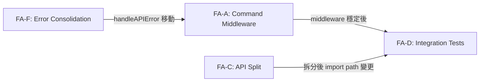
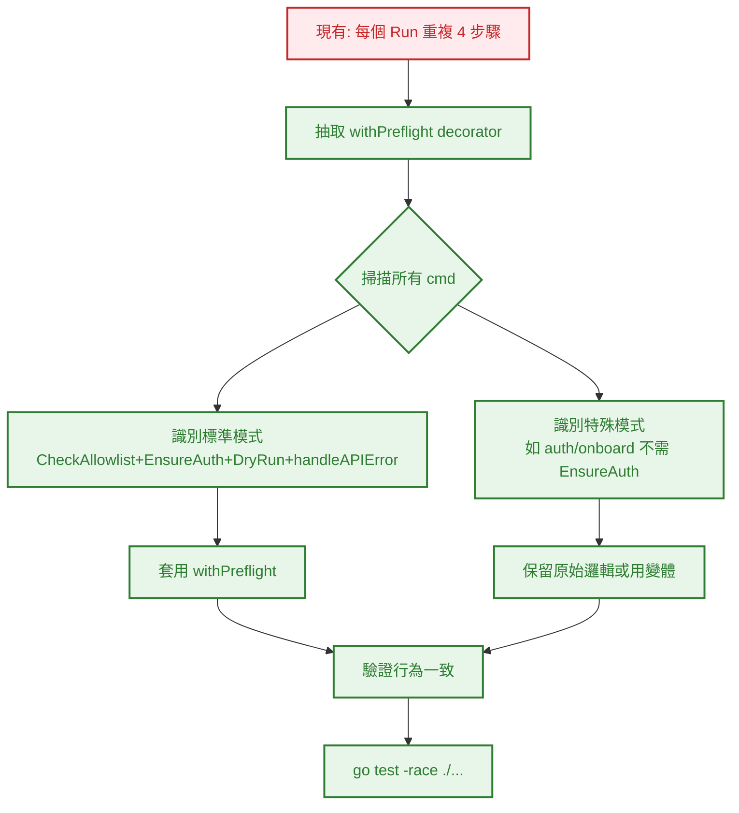
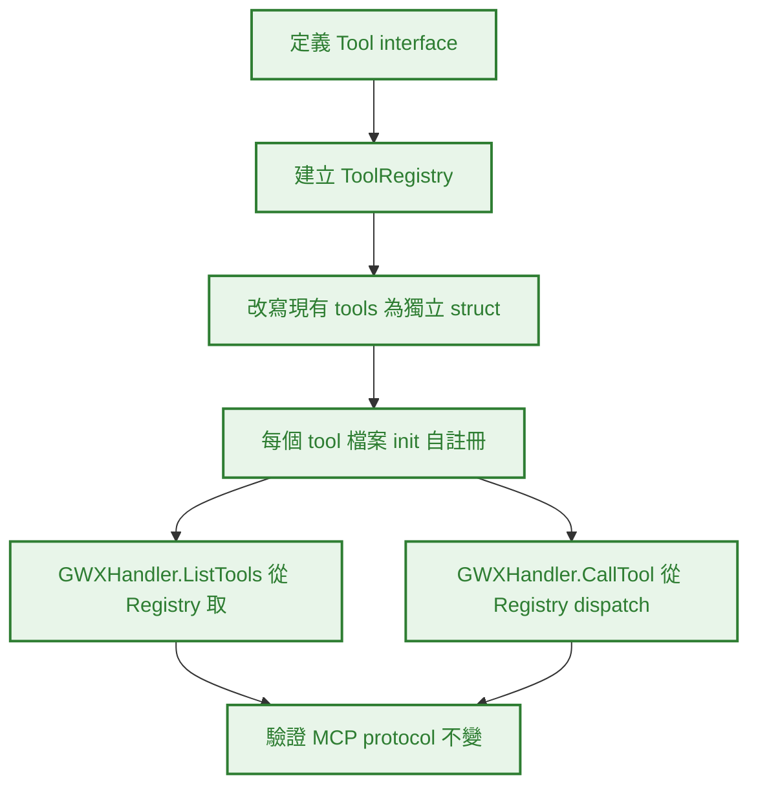
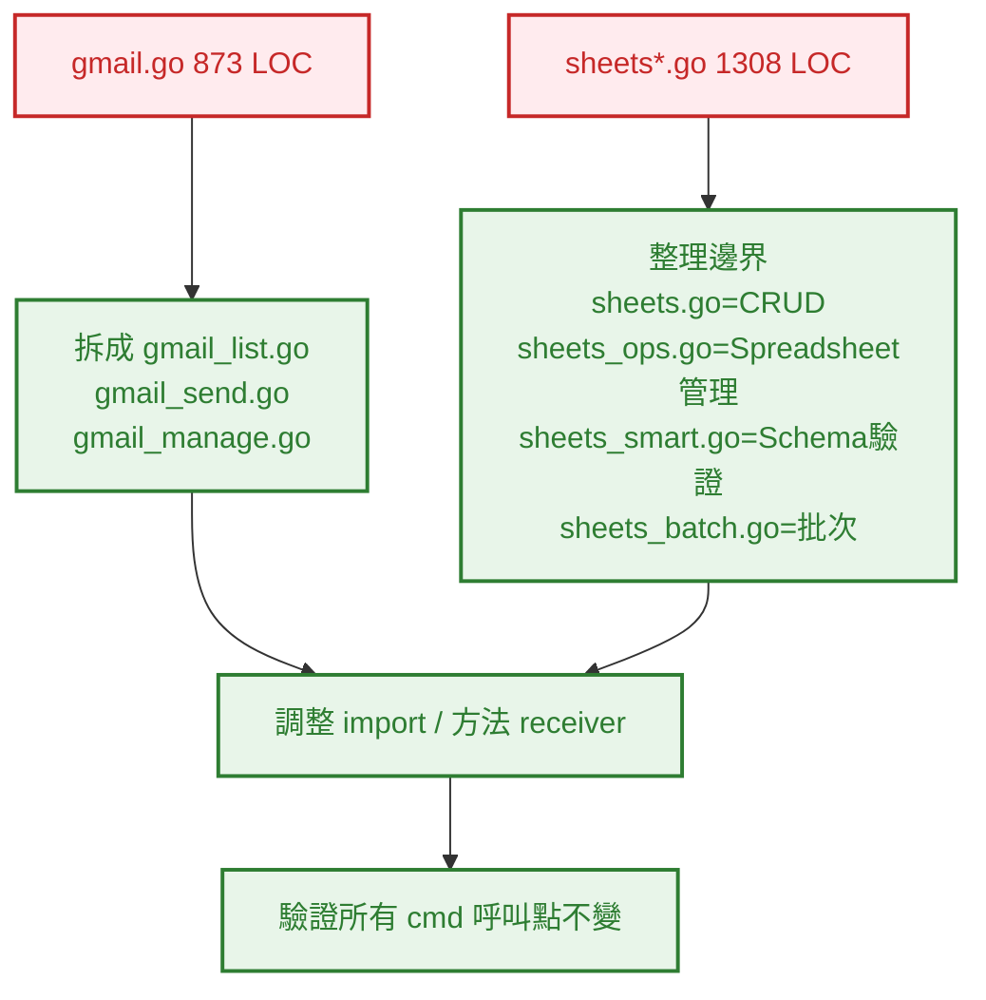
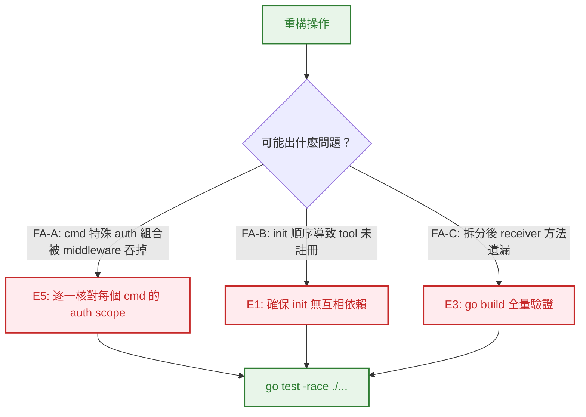

# S0 Brief Spec: gwx 架構重構

> **階段**: S0 需求討論
> **建立時間**: 2026-03-20 10:00
> **Agent**: requirement-analyst
> **Spec Mode**: Full Spec
> **工作類型**: refactor

---

## 0. 工作類型

| 類型 | 代碼 | 說明 |
|------|------|------|
| 重構 | `refactor` | 改善程式碼品質/架構，S1 深度分析現狀+耦合點 |

**本次工作類型**：`refactor`

## 1. 一句話描述

重構 gwx CLI 架構：抽取 command middleware、建立 MCP Tool Registry、拆分過大的 API service、統一 workflow interface、整理 error type、補測試。

## 2. 為什麼要做

### 2.1 痛點

- **Command Boilerplate 重複 50+ 次**：每個 `Run()` 方法都 copy-paste CheckAllowlist → EnsureAuth → DryRun → handleAPIError，新增指令時容易漏步驟
- **MCP Tools 無統一註冊機制**：3,591 LOC 分散 12 個檔案，新增工具要改多處，無法自動發現
- **API Service 過肥**：gmail.go 873 LOC、sheets*.go 1,308 LOC，職責混雜，難以獨立測試
- **Workflow 各自為政**：16 個 workflow 無共用 interface，無法統一排程/測試
- **Error Type 散亂**：CircuitOpenError 缺 Is()/As()，handleAPIError 定義在 gmail.go 但全域使用
- **測試覆蓋率 ~25%**：25 個 command、9 個 API service、16 個 workflow 零測試

### 2.2 目標

- 消除 command 層 boilerplate，每個 cmd 的 Run() 只含業務邏輯
- MCP 新增工具 = 寫一個檔案 + 自註冊，零修改現有程式碼
- API service 按操作類型拆分，單一職責
- Workflow 有統一 interface，可測試、可組合
- Error type 完整、exit code mapping 集中管理
- 主要 command 有 integration test 覆蓋

## 3. 使用者

| 角色 | 說明 |
|------|------|
| gwx 開發者 | 新增/維護 command、tool、workflow 的人 |
| gwx 終端用戶 | CLI 行為完全不變，無感知 |

## 4. 核心流程

> **閱讀順序**：功能區拆解 → 各功能區流程 → 例外處理

### 4.0 功能區拆解（Functional Area Decomposition）

#### 功能區識別表

| FA ID | 功能區名稱 | 一句話描述 | 入口 | 獨立性 |
|-------|-----------|-----------|------|--------|
| FA-A | Command Middleware | 抽取 Preflight decorator 消除 50+ 處 boilerplate | `internal/cmd/` | 高 |
| FA-B | MCP Tool Registry | 定義 Tool interface + Registry，工具自註冊 | `internal/mcp/` | 高 |
| FA-C | API Service Split | 拆分 gmail.go、整理 sheets*.go 邊界 | `internal/api/` | 中 |
| FA-D | Command Integration Tests | 補主要 command 的 happy path 測試 | `internal/cmd/` | 中 |
| FA-E | Workflow Interface | 統一 16 個 workflow 的共用 interface | `internal/workflow/` | 中 |
| FA-F | Error Consolidation | 集中 error type + exit code mapping | `internal/api/` + `internal/cmd/` | 中 |

#### 拆解策略

**本次策略**：`single_sop_fa_labeled`

> 6 FA，中高獨立性但共用同一 Go module。一份 spec，S3 波次按 FA 分組，S4 按依賴順序實作。

#### 跨功能區依賴



| 來源 FA | 目標 FA | 依賴類型 | 說明 |
|---------|---------|---------|------|
| FA-F | FA-A | 資料共用 | handleAPIError 需先移到共用位置，middleware 才能引用 |
| FA-A | FA-D | 事件觸發 | middleware 穩定後才能寫測試 |
| FA-C | FA-D | 資料共用 | API 拆分後 import path 影響測試 mock |

---

### 4.2 FA-A: Command Middleware

#### 4.2.1 全局流程圖



#### 4.2.N Happy Path 摘要

| 路徑 | 入口 | 結果 |
|------|------|------|
| **A：標準 cmd** | 50+ 個含完整 preflight 的 cmd | 全部改用 `withPreflight()` |
| **B：特殊 cmd** | auth/onboard/version 等不需完整 preflight | 保持原邏輯或用 withAuth() 變體 |

---

### 4.3 FA-B: MCP Tool Registry

#### 4.3.1 全局流程圖



#### 4.3.N Happy Path 摘要

| 路徑 | 入口 | 結果 |
|------|------|------|
| **A：Tool 定義** | `Tool` interface + `ToolRegistry` struct | 可自動發現已註冊工具 |
| **B：Tool 實作** | 每個 tool 自註冊 | 新增工具 = 新檔案 + `init()` |
| **C：Protocol** | ListTools/CallTool 改用 Registry | MCP JSON-RPC 行為完全不變 |

---

### 4.4 FA-C: API Service Split

#### 4.4.1 全局流程圖



#### 4.4.N Happy Path 摘要

| 路徑 | 入口 | 結果 |
|------|------|------|
| **A：Gmail 拆分** | gmail.go → 3 個檔案 | 每檔 <300 LOC，單一職責 |
| **B：Sheets 整理** | 4 個 sheets*.go | 職責邊界明確，不重複 |

---

### 4.5 FA-D: Command Integration Tests

#### 4.5.N Happy Path 摘要

| 路徑 | 入口 | 結果 |
|------|------|------|
| **A：核心 cmd 測試** | gmail, drive, calendar, sheets, docs | 每個 service 至少 1 個 happy path test |
| **B：系統 cmd 測試** | auth, config, schema, pipe | 驗證 flag parsing + output format |

---

### 4.6 FA-E: Workflow Interface

#### 4.6.N Happy Path 摘要

| 路徑 | 入口 | 結果 |
|------|------|------|
| **A：定義 Workflow interface** | `Name()`, `Execute()`, `Validate()` | 統一契約 |
| **B：遷移現有 workflow** | 16 個 workflow 實作 interface | 可統一排程、測試 |

---

### 4.7 FA-F: Error Consolidation

#### 4.7.N Happy Path 摘要

| 路徑 | 入口 | 結果 |
|------|------|------|
| **A：Error types** | CircuitOpenError 加 Is()/As()，新增 sentinel errors | 完整 error hierarchy |
| **B：handleAPIError** | 從 gmail.go 移到 `internal/cmd/errors.go` | 全域共用，不再 copy-paste |
| **C：Exit code mapping** | exitcode 與 error type 集中對應 | 一處管理 |

---

### 4.8 例外流程圖



### 4.9 六維度例外清單

| 維度 | ID | FA | 情境 | 觸發條件 | 預期行為 | 嚴重度 |
|------|-----|-----|------|---------|---------|--------|
| 並行/競爭 | E1 | FA-B | init() 註冊順序不確定 | 多個 tool 用 init() 自註冊 | Go init 順序按檔名字母序，不依賴順序 | P2 |
| 狀態轉換 | E2 | FA-A | middleware 攔截後 cmd 狀態不一致 | 某些 cmd 在 CheckAllowlist 前有前置邏輯 | 掃描所有 cmd 確認無前置邏輯 | P1 |
| 資料邊界 | E3 | FA-C | 拆分後方法漏移導致 compile error | gmail.go 拆成 3 檔 | go build 會立即報錯，安全 | P2 |
| 網路/外部 | E4 | 全域 | 無 — 不改 API 呼叫邏輯 | — | — | — |
| 業務邏輯 | E5 | FA-A | 特殊 cmd 的 auth scope 組合被標準 middleware 覆蓋 | auth/onboard 不需 EnsureAuth | 特殊 cmd 不使用 withPreflight 或用變體 | P1 |
| UI/體驗 | E6 | 全域 | 無 — CLI output format 不變 | — | — | — |

### 4.10 白話文摘要

這次重構把 gwx CLI 裡重複的程式碼模式抽成共用元件，讓未來新增指令、MCP 工具、workflow 都更快更安全。使用者完全無感，CLI 的輸入輸出行為不會改變。最壞情況是某個特殊指令的 auth 邏輯被 middleware 不小心覆蓋，我們用逐一核對 + 完整測試來防止。

## 5. 成功標準

| # | FA | 類別 | 標準 | 驗證方式 |
|---|-----|------|------|---------|
| 1 | FA-A | 結構 | 50+ 個 cmd 的 Run() 不再含 preflight boilerplate | grep 確認無重複模式 |
| 2 | FA-B | 結構 | MCP 新增工具只需新檔案 + init() | 新增一個 dummy tool 驗證 |
| 3 | FA-C | 結構 | gmail.go 拆成 ≤3 個檔案，每檔 <350 LOC | wc -l 驗證 |
| 4 | FA-D | 測試 | 主要 command 有 integration test | go test ./internal/cmd/... |
| 5 | FA-E | 結構 | 16 個 workflow 實作統一 interface | compile time 驗證 |
| 6 | FA-F | 結構 | handleAPIError 集中在一處，error type 完整 | grep 確認無重複定義 |
| 7 | 全域 | 行為 | `go test -race ./...` 全過 | CI |
| 8 | 全域 | 行為 | CLI 對外行為不變 | 手動測試核心指令 |

## 6. 範圍

### 範圍內
- **FA-A**: 抽取 withPreflight/withAuth middleware
- **FA-A**: 遷移所有 cmd 使用 middleware
- **FA-B**: 定義 Tool interface + ToolRegistry
- **FA-B**: 遷移所有現有 tools 到 registry 模式
- **FA-C**: 拆分 gmail.go 為 3 個檔案
- **FA-C**: 整理 sheets*.go 職責邊界
- **FA-D**: 補主要 command integration tests
- **FA-E**: 定義 Workflow interface + 遷移 16 個 workflow
- **FA-F**: 整理 error types + exit code mapping

### 範圍外
- 不改 API 呼叫邏輯或 Google API 行為
- 不改 CLI flag 定義或 output format
- 不改 auth flow（OAuth、keyring）
- 不新增功能
- 不改 MCP JSON-RPC protocol
- 不改 npm package

## 7. 已知限制與約束

- Go init() 順序依賴檔名字母序，tool 註冊不能有互相依賴
- 某些 cmd（auth, onboard, version）不適用標準 middleware，需個別處理
- Sheets 4 個檔案的職責邊界需 S1 深入分析後才能確定最終拆法

## 8. 前端 UI 畫面清單

> 純後端/CLI 重構，無 UI 變更。省略。

---

## 10. SDD Context

```json
{
  "sdd_context": {
    "stages": {
      "s0": {
        "status": "pending_confirmation",
        "agent": "requirement-analyst",
        "output": {
          "brief_spec_path": "dev/specs/2026-03-20_1_architecture-refactor/s0_brief_spec.md",
          "work_type": "refactor",
          "requirement": "重構 gwx CLI 架構：command middleware、MCP Tool Registry、API service split、workflow interface、error consolidation、integration tests",
          "goal": "消除重複、建立可擴展架構模式、提升測試覆蓋率",
          "success_criteria": [
            "50+ cmd 無 preflight boilerplate",
            "MCP 新增工具只需新檔案 + init()",
            "gmail.go 拆成 ≤3 檔，每檔 <350 LOC",
            "主要 command 有 integration test",
            "16 個 workflow 實作統一 interface",
            "error type 完整、handleAPIError 集中一處",
            "go test -race ./... 全過",
            "CLI 對外行為不變"
          ],
          "pain_points": [
            "Command boilerplate 重複 50+ 次",
            "MCP tools 3591 LOC 無統一註冊",
            "gmail.go 873 LOC 職責混雜",
            "16 workflow 無共用 interface",
            "Error type 散亂",
            "測試覆蓋率 ~25%"
          ],
          "scope_in": [
            "FA-A: Command Middleware",
            "FA-B: MCP Tool Registry",
            "FA-C: API Service Split",
            "FA-D: Command Integration Tests",
            "FA-E: Workflow Interface",
            "FA-F: Error Consolidation"
          ],
          "scope_out": [
            "不改 API 呼叫邏輯",
            "不改 CLI flag/output",
            "不改 auth flow",
            "不新增功能",
            "不改 MCP protocol",
            "不改 npm package"
          ],
          "constraints": [
            "行為不變原則",
            "Go init() 順序依賴檔名字母序",
            "特殊 cmd 不適用標準 middleware"
          ],
          "functional_areas": [
            {"id": "FA-A", "name": "Command Middleware", "description": "抽取 Preflight decorator", "independence": "high"},
            {"id": "FA-B", "name": "MCP Tool Registry", "description": "Tool interface + Registry 自註冊", "independence": "high"},
            {"id": "FA-C", "name": "API Service Split", "description": "拆分 gmail.go + 整理 sheets", "independence": "medium"},
            {"id": "FA-D", "name": "Command Integration Tests", "description": "補主要 cmd happy path 測試", "independence": "medium"},
            {"id": "FA-E", "name": "Workflow Interface", "description": "統一 16 workflow 的共用 interface", "independence": "medium"},
            {"id": "FA-F", "name": "Error Consolidation", "description": "集中 error type + exit code mapping", "independence": "medium"}
          ],
          "decomposition_strategy": "single_sop_fa_labeled",
          "child_sops": []
        }
      }
    }
  }
}
```
