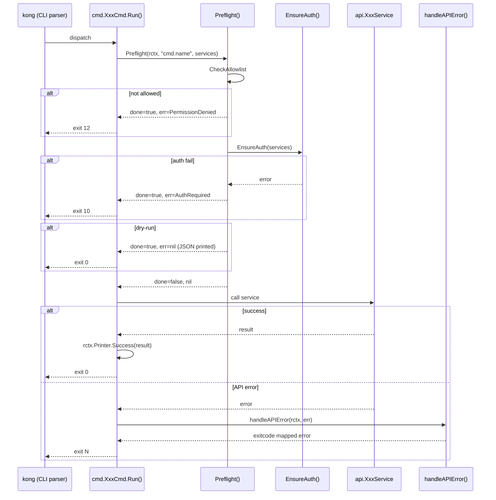
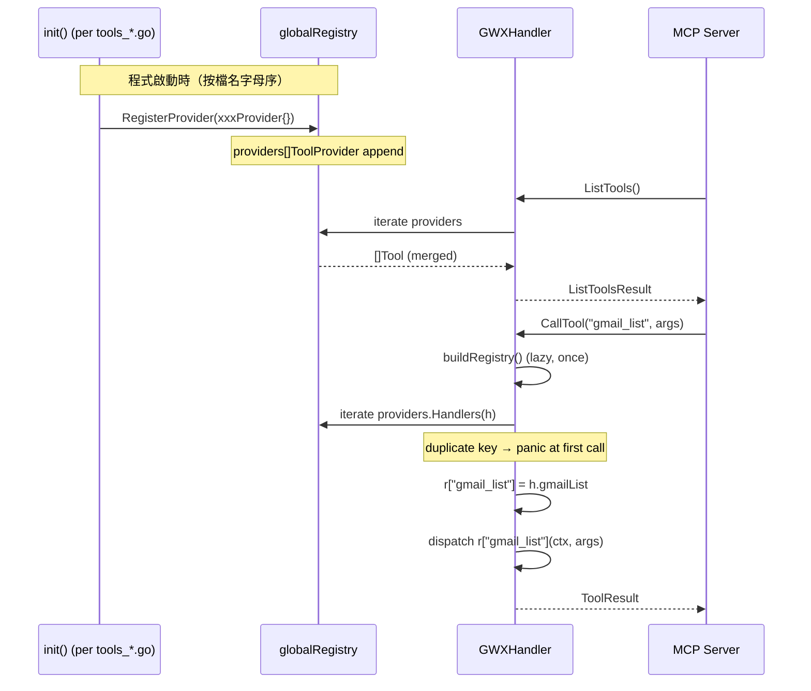

# S1 Dev Spec: Architecture Refactor — 6 Functional Areas

> **階段**: S1 技術分析
> **建立時間**: 2026-03-20 12:00
> **Agent**: codebase-explorer (Phase 1) + architect (Phase 2)
> **工作類型**: refactor
> **複雜度**: L

---

## 1. 概述

### 1.1 需求參照
> 完整需求見 `s0_brief_spec.md`，以下僅摘要。

消除 gwx CLI 中 50+ 處 boilerplate、散亂的 MCP tool 管理、過大的 api/gmail.go、無顯式 interface 的 workflow layer，以及定義在錯誤位置的共用 error handler，使整體 codebase 符合可維護、可擴展的架構標準。

### 1.2 技術方案摘要

六個功能區（FA）按依賴順序推進：先移動 `handleAPIError`（FA-F）使共用 error handler 到位，同步拆分 `api/gmail.go`（FA-C，package-internal，不影響外部）；再遷移所有 cmd 使用 `Preflight()`（FA-A，35 個直接遷移，17 個保留 manual 邏輯）；最後並行完成 MCP ToolProvider 自註冊機制（FA-B）、workflow Runner 介面文件化（FA-E）、integration test 補充（FA-D）。全程外部行為不變，唯一已知輸出差異是 dry-run JSON 格式統一為 `{"dry_run": true, "command": "xxx"}`（詳見 §6 決策 D-01）。

---

## 2. 影響範圍（Phase 1：codebase-explorer）

### 2.1 受影響檔案

#### API 層（internal/api/）

| 檔案 | 變更類型 | 說明 |
|------|---------|------|
| `internal/api/gmail.go` | 修改 | 保留 struct/constructor，methods 分散至 3 個新檔 |
| `internal/api/gmail_read.go` | 新增 | ListMessages, GetMessage, SearchMessages, ListLabels + read helpers |
| `internal/api/gmail_write.go` | 新增 | SendMessage, CreateDraft, ReplyMessage, ForwardMessage, ArchiveMessages, MarkRead, BatchModifyLabels + write helpers |
| `internal/api/gmail_digest.go` | 新增 | DigestMessages + digest helpers |

#### CMD 層（internal/cmd/）

| 檔案 | 變更類型 | 說明 |
|------|---------|------|
| `internal/cmd/errors.go` | 新增 | 搬移 handleAPIError，成為 cmd package 共用 |
| `internal/cmd/gmail.go` | 修改 | 刪除 handleAPIError 定義，11 個子命令改用 Preflight() |
| `internal/cmd/calendar.go` | 修改 | 部分子命令改用 Preflight()，特殊 cmd 保留 manual 邏輯 |
| `internal/cmd/drive.go` | 修改 | 子命令改用 Preflight() |
| `internal/cmd/docs.go` | 修改 | 部分子命令改用 Preflight()，export/from-sheet 保留 |
| `internal/cmd/sheets.go` | 修改 | 部分子命令改用 Preflight()，smart-append 保留 |
| `internal/cmd/tasks.go` | 修改 | 子命令改用 Preflight() |
| `internal/cmd/contacts.go` | 修改 | 子命令改用 Preflight() |
| `internal/cmd/chat.go` | 修改 | 子命令改用 Preflight() |
| `internal/cmd/analytics.go` | 修改 | 子命令改用 Preflight()，config.Get() 後置保留 |
| `internal/cmd/searchconsole.go` | 修改 | 子命令改用 Preflight()，config.Get() 後置保留 |
| `internal/cmd/meeting_prep.go` | 修改 | 改用 Preflight() |
| `internal/cmd/context.go` | 修改 | 改用 Preflight() |
| `internal/cmd/standup.go` | 不變 | services 動態，保留 manual EnsureAuth |
| `internal/cmd/workflow.go` | 不變 | 業務驗證前置，保留 manual 邏輯 |
| `internal/cmd/usearch.go` | 不變 | services 完全動態，保留 manual 邏輯 |

#### MCP 層（internal/mcp/）

| 檔案 | 變更類型 | 說明 |
|------|---------|------|
| `internal/mcp/registry.go` | 新增 | ToolRegistry struct + ToolProvider interface |
| `internal/mcp/tools.go` | 修改 | GWXHandler 改用 globalRegistry，移除 hardcoded 22 entries |
| `internal/mcp/tools_extended.go` | 修改 | 實作 ToolProvider，init() 自動注冊 |
| `internal/mcp/tools_new.go` | 修改 | 實作 ToolProvider，init() 自動注冊 |
| `internal/mcp/tools_batch.go` | 修改 | 實作 ToolProvider，init() 自動注冊 |
| `internal/mcp/tools_analytics.go` | 修改 | 實作 ToolProvider，init() 自動注冊 |
| `internal/mcp/tools_searchconsole.go` | 修改 | 實作 ToolProvider，init() 自動注冊 |
| `internal/mcp/tools_config.go` | 修改 | 實作 ToolProvider，init() 自動注冊 |
| `internal/mcp/tools_workflow.go` | 修改 | 實作 ToolProvider，init() 自動注冊 |
| `internal/mcp/tools_slides.go` | 修改 | 實作 ToolProvider，init() 自動注冊 |

#### Workflow 層（internal/workflow/）

| 檔案 | 變更類型 | 說明 |
|------|---------|------|
| `internal/workflow/types.go` | 新增 | Runnable interface + WorkflowFunc 型別別名文件 |
| 其他 workflow/*.go | 不修改 | 確認符合命名規範即可，無需改動 |

#### 測試

| 檔案 | 變更類型 | 說明 |
|------|---------|------|
| `internal/cmd/cli_test.go` | 修改 | 擴充 allowlist/auth 路徑覆蓋 |
| `internal/cmd/gmail_test.go` | 新增 | Gmail cmd happy path（--dry-run） |
| `internal/cmd/calendar_test.go` | 修改/新增 | Calendar cmd happy path |
| `internal/cmd/sheets_test.go` | 新增 | Sheets cmd happy path |
| `internal/cmd/drive_test.go` | 新增 | Drive/Docs cmd happy path |

### 2.2 依賴關係

- **上游依賴**: `internal/exitcode/codes.go`（已完善）、`internal/cmd/root.go`（Preflight 已定義）、`internal/mcp/protocol.go`（Tool struct 已定義）
- **下游影響**: 所有 cmd 呼叫 handleAPIError（FA-F 完成後路徑不變）、`internal/cmd/mcpserver.go`（使用 GWXHandler，FA-B 後行為不變）

### 2.3 現有模式與技術考量

- `slides.go` 是 Preflight() 採用的參考實作，FA-A 所有遷移以此為標準
- `internal/api/sheets*.go` 的 4 檔分割模式是 FA-C 的參考（同 package，struct 在主檔，methods 在子檔）
- `go test ./internal/cmd/ -run TestCLI` 的 binary exec 模式是 FA-D 的測試框架基礎

---

## 2.5 [refactor 專用] 現狀分析

### 現狀問題

| # | 問題 | 嚴重度 | 影響範圍 | 說明 |
|---|------|--------|---------|------|
| 1 | 3-step auth boilerplate 重複 50+ 次 | 高 | 16 個 cmd 檔案 | CheckAllowlist + EnsureAuth + DryRun 各自撰寫，slide.go 已遷移但其他未跟進 |
| 2 | handleAPIError 定義在 gmail.go | 中 | cmd package 全員 | 語意上是共用函數，與 Gmail 耦合造成誤導 |
| 3 | MCP ListTools() 手動 append 8 次 | 高 | internal/mcp/tools.go | 新增 tool 需改 2 個位置（ListTools + buildRegistry），容易漏改 |
| 4 | buildRegistry() 硬編碼 22 個 core tool | 高 | internal/mcp/tools.go | tool 名稱重複維護，無法靜態確保 ListTools 與 buildRegistry 一致 |
| 5 | gmail.go 874 LOC 五類職責混雜 | 中 | internal/api/gmail.go | read/write/digest/label/archive 耦合，難以單獨測試或維護 |
| 6 | 16 個 workflow 無顯式 interface | 低 | internal/workflow/*.go | 隱性 RunXxx(ctx, client, Opts) 規範未文件化，新加 workflow 無法參考 |

### 目標狀態（Before → After）

| 面向 | Before | After |
|------|--------|-------|
| Command auth 初始化 | 每個 cmd 手寫 3 步 boilerplate | `Preflight(rctx, "cmd.name", services)` 單行呼叫 |
| MCP tool 新增 | 改 tools.go 兩個位置 + 建新檔 | 只需建新 tools_xxx.go，init() 自動注冊 |
| gmail API 層 | gmail.go 874 LOC | gmail.go struct 定義 + 3 個職責分明的子檔，各 ≤280 LOC |
| Error handler | handleAPIError 定義在 cmd/gmail.go | 定義在 cmd/errors.go，全 cmd package 共用 |
| Workflow 規範 | 隱性命名規範 | types.go 顯式定義 Runnable interface + WorkflowFunc 文件 |

### 遷移路徑

執行順序如下（詳細 Wave 規劃見 §5）：

1. **FA-F**（Wave 1 起點）：搬移 `handleAPIError` 至 `cmd/errors.go`，不改邏輯，確保所有 cmd 仍可呼叫
2. **FA-C**（Wave 1 並行）：拆分 `api/gmail.go`，package 不變，struct/constructor 保留在 gmail.go，method 分散至 3 檔
3. **FA-A**（Wave 2）：逐步遷移 35 個 cmd 使用 Preflight()，17 個特殊 cmd 保留 manual 邏輯並加註解說明原因
4. **FA-B**（Wave 3 並行）：建立 ToolProvider interface + globalRegistry，改造 9 個 tools_*.go
5. **FA-E**（Wave 3 並行）：建立 workflow/types.go 文件化現有規範
6. **FA-D**（Wave 4）：補充 integration tests，cmd 穩定後執行

### 回歸風險矩陣

| 外部行為 | 驗證方式 | 風險等級 |
|---------|---------|---------|
| CLI flag 不變 | `go build ./...` + 手動 `gwx --help` | 低 |
| CLI output JSON 結構不變（dry-run 除外）| `cli_test.go` 回歸 + 新增 golden test | 中 |
| dry-run 輸出格式統一為新格式 | 明確接受此變更，在 §6 D-01 記錄 | 低（已知） |
| MCP tool schema 不變 | `ListTools()` 輸出 snapshot test | 中 |
| MCP tool dispatch 不變 | 現有 MCP tool handler 測試（若有）| 高 |
| handleAPIError 行為不變 | FA-F 前後 `go test ./internal/cmd/...` | 高 |
| gmail API method 可呼叫 | FA-C 後 `go build ./...` + `go test ./internal/api/...` | 高 |

---

## 3. Data Flow（重構無 User Flow，以 Data Flow 取代）

### 重構後 Command 執行路徑（FA-A + FA-F）



### 重構後 MCP Tool 注冊流程（FA-B）



---

## 4. 技術方案詳細設計

### 4.1 FA-F: cmd/errors.go

**新建檔案** `internal/cmd/errors.go`，直接搬移 `handleAPIError`，不改邏輯：

```go
package cmd

import (
    "errors"

    "github.com/redredchen01/gwx/internal/api"
    "github.com/redredchen01/gwx/internal/exitcode"
    "google.golang.org/api/googleapi"
)

// handleAPIError maps Google API errors to structured exit codes.
// Handles: CircuitOpenError, googleapi.Error (401/403/404/429/409), generic errors.
func handleAPIError(rctx *RunContext, err error) error {
    msg := err.Error()

    var circuitErr *api.CircuitOpenError
    if errors.As(err, &circuitErr) {
        return rctx.Printer.ErrExit(exitcode.CircuitOpen, msg)
    }

    var gErr *googleapi.Error
    if errors.As(err, &gErr) {
        switch gErr.Code {
        case 401:
            return rctx.Printer.ErrExit(exitcode.AuthExpired, msg)
        case 403:
            return rctx.Printer.ErrExit(exitcode.PermissionDenied, msg)
        case 404:
            return rctx.Printer.ErrExit(exitcode.NotFound, msg)
        case 429:
            return rctx.Printer.ErrExit(exitcode.RateLimited, msg)
        case 409:
            return rctx.Printer.ErrExit(exitcode.Conflict, msg)
        }
    }

    return rctx.Printer.ErrExit(exitcode.GeneralError, msg)
}
```

`internal/cmd/gmail.go` 中刪除 `handleAPIError` 定義及其相關 import（`errors`, `googleapi`），移至 `errors.go`。`var _ = fmt.Sprintf` 若 `fmt` 不再被使用也一併刪除。

### 4.2 FA-C: api/gmail.go 拆分

保留在 `api/gmail.go`：
- `GmailService` struct + `NewGmailService` constructor
- 所有 public types：`MessageSummary`, `MessageDetail`, `DigestGroup`, `LabelSummary`（及任何其他 struct 定義）

搬移至 `api/gmail_read.go`（目標 ~250 LOC）：
- `ListMessages`, `GetMessage`, `SearchMessages`, `ListLabels`
- 相關 private helpers：extract/parse 用的 read-only helpers

搬移至 `api/gmail_write.go`（目標 ~380 LOC）：
- `SendMessage`, `CreateDraft`, `ReplyMessage`, `ForwardMessage`
- `ArchiveMessages`, `MarkRead`, `BatchModifyLabels`
- 相關 private helpers：buildRawMessage, MIME 建構 helpers

搬移至 `api/gmail_digest.go`（目標 ~170 LOC）：
- `DigestMessages`
- 相關 private helpers：groupByDomain, buildDigestGroups 等

> **實作注意**：每個新檔案 package 宣告為 `package api`，不需要 import 調整（同 package 可見）。實際 method 分配以現有 gmail.go 的完整 method 清單為準，上述為估算分配，實作者需對照讀取完整 874 LOC 後確認。

### 4.3 FA-A: Preflight 遷移模式

**標準遷移（35 個 cmd）**：

Before（舊 boilerplate，以 `GmailListCmd.Run` 為例）：
```go
func (c *GmailListCmd) Run(rctx *RunContext) error {
    if err := CheckAllowlist(rctx, "gmail.list"); err != nil {
        return rctx.Printer.ErrExit(exitcode.PermissionDenied, err.Error())
    }
    if err := EnsureAuth(rctx, []string{"gmail"}); err != nil {
        return rctx.Printer.ErrExit(exitcode.AuthRequired, err.Error())
    }
    if rctx.DryRun {
        rctx.Printer.Success(map[string]string{"dry_run": "gmail.list would execute"})
        return nil
    }
    // ... business logic
}
```

After（統一 Preflight 模式，參考 slides.go）：
```go
func (c *GmailListCmd) Run(rctx *RunContext) error {
    if done, err := Preflight(rctx, "gmail.list", []string{"gmail"}); done {
        return err
    }
    // ... business logic（完全不變）
}
```

**保留 manual 邏輯的 17 個特殊 cmd**（加 `// NOTE:` 說明原因）：

| cmd | 不能直接遷移的原因 |
|-----|----------------|
| `calendar list` | `parseTime()` 在 `EnsureAuth` 之前執行，需要早期返回 |
| `docs export` | 多 service `[]string{"drive", "docs"}` 動態組合 |
| `docs from-sheet` | 多 service 動態組合 |
| `sheets smart-append` | DryRun 檢查需要在 service 初始化後，順序特殊 |
| `standup` | services 依 `--push` flag 動態（`gmail`/`chat`/`calendar`/`tasks`） |
| `workflow review-notify` | 業務驗證（PR URL 格式）在 EnsureAuth 之前 |
| `workflow email-from-doc` | 業務驗證（Doc ID 格式）在 EnsureAuth 之前 |
| `usearch` | services 完全動態（依 `--services` flag） |
| `analytics` (部分) | `config.Get()` 在 EnsureAuth 之後，需保留特定順序 |
| `searchconsole` (部分) | 同 analytics |

這些 cmd 保留原有邏輯，僅在 `Run()` 開頭加上：
```go
// NOTE: Not using Preflight() — [具體原因].
// Manual auth sequence required due to [reason].
```

**排除清單**（完全不動）：`auth.go`, `onboard.go`, `mcpserver.go`, `version.go`, `schema.go`, `agent.go`, `pipe.go`

### 4.4 FA-B: ToolProvider + ToolRegistry

**新建** `internal/mcp/registry.go`：

```go
package mcp

import "sync"

// ToolProvider is implemented by each tools_*.go to self-register tools and handlers.
// init() in each tools_*.go calls RegisterProvider to add itself to globalRegistry.
type ToolProvider interface {
    // Tools returns the Tool schemas for MCP tools/list.
    Tools() []Tool
    // Handlers returns tool name → handler mappings, bound to the given GWXHandler.
    // h is provided at dispatch time (not at init time) to allow method binding.
    Handlers(h *GWXHandler) map[string]ToolHandler
}

// ToolRegistry maintains the ordered list of registered ToolProviders.
type ToolRegistry struct {
    mu        sync.RWMutex
    providers []ToolProvider
}

var globalRegistry = &ToolRegistry{}

// RegisterProvider adds a ToolProvider to the global registry.
// Called from init() in each tools_*.go file.
// Panics if called after first CallTool (registry is immutable after lazy-init).
func RegisterProvider(p ToolProvider) {
    globalRegistry.mu.Lock()
    defer globalRegistry.mu.Unlock()
    globalRegistry.providers = append(globalRegistry.providers, p)
}

// allTools returns merged Tool list from all providers.
func (r *ToolRegistry) allTools() []Tool {
    r.mu.RLock()
    defer r.mu.RUnlock()
    var tools []Tool
    for _, p := range r.providers {
        tools = append(tools, p.Tools()...)
    }
    return tools
}

// buildHandlers returns merged handler map, panic on duplicate key.
func (r *ToolRegistry) buildHandlers(h *GWXHandler) map[string]ToolHandler {
    r.mu.RLock()
    defer r.mu.RUnlock()
    result := make(map[string]ToolHandler)
    for _, p := range r.providers {
        for k, v := range p.Handlers(h) {
            if _, exists := result[k]; exists {
                panic("mcp: duplicate tool key registered: " + k)
            }
            result[k] = v
        }
    }
    return result
}
```

**修改** `internal/mcp/tools.go`：
- 移除 `registry map[string]ToolHandler` 從 `GWXHandler` struct（或保留但從 globalRegistry 填充）
- `ListTools()` 改為 `return globalRegistry.allTools()`
- `buildRegistry()` 改為 `return globalRegistry.buildHandlers(h)`
- 移除 `tools.go` 中 hardcoded 的 22 個 core Tool 定義（搬移到 `tools_core.go` 或分配給對應的 `tools_*.go`）

> **實作注意**：原本 tools.go 的 22 個 core tools（gmail_list 等）需要找到歸屬的 tools_*.go。若這些 handler method（h.gmailList 等）定義在 tools.go，需決定是否搬移或在 tools_core.go 中新建 provider 處理這批 core tools。建議新建 `tools_core.go` 實作 `coreProvider`，包含 22 個 core tool + 對應 handler。

**每個 tools_*.go 的遷移模式**（以 `tools_slides.go` 為例）：

Before：
```go
func SlidesTools() []Tool { return []Tool{...} }
func (h *GWXHandler) registerSlidesTools(r map[string]ToolHandler) {
    r["slides_get"] = h.slidesGet
    // ...
}
```

After：
```go
type slidesProvider struct{}

func (slidesProvider) Tools() []Tool { return []Tool{...} }
func (slidesProvider) Handlers(h *GWXHandler) map[string]ToolHandler {
    return map[string]ToolHandler{
        "slides_get": h.slidesGet,
        // ...
    }
}

func init() { RegisterProvider(slidesProvider{}) }

// Keep exported aliases for backward compat if needed (can be removed after verification)
// func SlidesTools() []Tool { return slidesProvider{}.Tools() }
```

### 4.5 FA-E: workflow/types.go

**新建** `internal/workflow/types.go`：

```go
package workflow

import (
    "context"
    "github.com/redredchen01/gwx/internal/api"
)

// Runnable is implemented by workflow adapter structs that need dynamic dispatch.
// Used by cmd/workflow.go to dispatch to the correct workflow without type switching.
//
// Example adapter:
//   type standupAdapter struct{ opts StandupOpts }
//   func (a standupAdapter) Run(ctx context.Context, client *api.Client) (interface{}, error) {
//       return RunStandup(ctx, client, a.opts)
//   }
type Runnable interface {
    Run(ctx context.Context, client *api.Client) (interface{}, error)
}

// WorkflowFunc documents the canonical function signature for all workflow entry points.
// Every workflow package MUST expose a top-level function matching this pattern:
//
//   func RunXxx(ctx context.Context, client *api.Client, opts XxxOpts) (*XxxResult, error)
//
// Where:
//   - XxxOpts contains all input parameters (may include Execute, NoInput, IsMCP fields)
//   - *XxxResult is the structured output for agent consumption
//
// See: RunStandup, RunMeetingPrep, RunWeeklyDigest, etc.
type WorkflowFunc[O any, R any] func(ctx context.Context, client *api.Client, opts O) (*R, error)
```

> **說明**：`WorkflowFunc` 為泛型類型別名，僅作文件用途（Go interface 不支持泛型方法，此型別不用於 runtime dispatch）。`Runnable` 才是 runtime interface，供 cmd/workflow.go 使用。FA-E 不需修改現有任何 workflow 檔案。

---

## 5. 任務清單

### 5.1 任務總覽

| ID | 任務 | FA | 複雜度 | Agent | 依賴 | Wave |
|----|------|----|--------|-------|------|------|
| T01 | 新建 cmd/errors.go，搬移 handleAPIError | FA-F | S | backend-expert | - | 1 |
| T02 | 新建 api/gmail_read.go（read methods） | FA-C | M | backend-expert | - | 1 |
| T03 | 新建 api/gmail_write.go（write methods） | FA-C | M | backend-expert | - | 1 |
| T04 | 新建 api/gmail_digest.go（digest methods） | FA-C | M | backend-expert | - | 1 |
| T05 | 精簡 api/gmail.go 保留 struct/constructor | FA-C | S | backend-expert | T02,T03,T04 | 1 |
| T06 | 遷移 cmd/gmail.go 11 個子命令到 Preflight | FA-A | M | backend-expert | T01 | 2 |
| T07 | 遷移 cmd/calendar.go（部分，注意 list 特殊） | FA-A | M | backend-expert | T01 | 2 |
| T08 | 遷移 cmd/drive.go, docs.go（部分） | FA-A | M | backend-expert | T01 | 2 |
| T09 | 遷移 cmd/sheets.go（部分）, tasks.go, contacts.go, chat.go | FA-A | M | backend-expert | T01 | 2 |
| T10 | 遷移 cmd/analytics.go, searchconsole.go, meeting_prep.go, context.go | FA-A | M | backend-expert | T01 | 2 |
| T11 | 新建 mcp/registry.go（ToolRegistry + ToolProvider） | FA-B | M | backend-expert | - | 3 |
| T12 | 改造 mcp/tools.go 使用 globalRegistry | FA-B | M | backend-expert | T11 | 3 |
| T13 | 改造 9 個 tools_*.go 實作 ToolProvider + init() | FA-B | M | backend-expert | T11,T12 | 3 |
| T14 | 新建 workflow/types.go（Runnable + WorkflowFunc） | FA-E | S | backend-expert | - | 3 |
| T15 | 驗證 16 workflow 符合命名規範，補 package doc | FA-E | S | backend-expert | T14 | 3 |
| T16 | 新增 gmail/drive/docs cmd integration tests | FA-D | M | backend-expert | T06,T08 | 4 |
| T17 | 新增 calendar/sheets/tasks cmd integration tests | FA-D | M | backend-expert | T07,T09 | 4 |
| T18 | 擴充 cli_test.go 覆蓋遷移後 cmd 的 allowlist/auth 路徑 | FA-D | S | backend-expert | T06~T10 | 4 |

### 5.2 任務詳情

#### T01: 新建 cmd/errors.go，搬移 handleAPIError
- **FA**: FA-F
- **複雜度**: S
- **Agent**: backend-expert
- **依賴**: 無
- **描述**: 新建 `internal/cmd/errors.go`，內含 `handleAPIError` 函數（從 gmail.go 搬移，邏輯完全不變）。更新 `gmail.go` 刪除原定義及其專屬 import（`errors`, `googleapi`）。若 `gmail.go` 的 `var _ = fmt.Sprintf` 在移除後 `fmt` 不再使用，一併刪除。
- **DoD**:
  - [ ] `internal/cmd/errors.go` 存在，定義 `handleAPIError`
  - [ ] `internal/cmd/gmail.go` 不含 `handleAPIError` 定義
  - [ ] `go build ./internal/cmd/...` 通過
  - [ ] `go test ./internal/cmd/...` 結果與重構前相同（無新失敗）
  - [ ] `errors.go` 包含完整的 import（`errors`, `api`, `exitcode`, `googleapi`）

#### T02: 新建 api/gmail_read.go
- **FA**: FA-C
- **複雜度**: M
- **Agent**: backend-expert
- **依賴**: 無（可與 T01 並行）
- **描述**: 讀取完整 `api/gmail.go` 874 LOC，識別所有 read-type methods（ListMessages, GetMessage, SearchMessages, ListLabels）及其 private helpers，搬移至新建的 `api/gmail_read.go`。Package 宣告 `package api`，不需跨 package import 調整。
- **DoD**:
  - [ ] `internal/api/gmail_read.go` 存在，包含 read methods
  - [ ] 目標 LOC ≤ 300（估算，以實際為準）
  - [ ] `go build ./internal/api/...` 通過
  - [ ] 所有 read method 仍可被 `cmd` layer 呼叫（編譯確認）

#### T03: 新建 api/gmail_write.go
- **FA**: FA-C
- **複雜度**: M
- **Agent**: backend-expert
- **依賴**: 無
- **描述**: 識別所有 write-type methods（SendMessage, CreateDraft, ReplyMessage, ForwardMessage, ArchiveMessages, MarkRead, BatchModifyLabels）及其 MIME 建構 helpers，搬移至 `api/gmail_write.go`。
- **DoD**:
  - [ ] `internal/api/gmail_write.go` 存在，包含 write methods
  - [ ] 目標 LOC ≤ 400（估算）
  - [ ] `go build ./internal/api/...` 通過

#### T04: 新建 api/gmail_digest.go
- **FA**: FA-C
- **複雜度**: M
- **Agent**: backend-expert
- **依賴**: 無
- **描述**: 識別 DigestMessages 及其所有 digest-specific helpers，搬移至 `api/gmail_digest.go`。
- **DoD**:
  - [ ] `internal/api/gmail_digest.go` 存在，包含 digest methods
  - [ ] 目標 LOC ≤ 200（估算）
  - [ ] `go build ./internal/api/...` 通過

#### T05: 精簡 api/gmail.go
- **FA**: FA-C
- **複雜度**: S
- **Agent**: backend-expert
- **依賴**: T02, T03, T04
- **描述**: T02~T04 完成後，驗證 `gmail.go` 中已無待搬移 method，只保留 struct 定義（GmailService, MessageSummary, MessageDetail 等）與 NewGmailService constructor。確認目標 LOC ≤ 80。
- **DoD**:
  - [ ] `api/gmail.go` 只含 struct + constructor
  - [ ] 目標 LOC ≤ 80
  - [ ] `go build ./...` 通過（全 repo）
  - [ ] `go test -race ./internal/api/...` 通過

#### T06: 遷移 cmd/gmail.go
- **FA**: FA-A
- **複雜度**: M
- **Agent**: backend-expert
- **依賴**: T01
- **描述**: 將 gmail.go 中 11 個子命令（List, Get, Search, Labels, Send, Draft, Reply, Digest, Archive, Label, Forward）的 Run() 方法替換為 Preflight 模式。注意 dry-run 輸出格式改變（見 §6 D-01）。
- **DoD**:
  - [ ] 11 個 Run() 方法均使用 `Preflight(rctx, "gmail.xxx", services)` 模式
  - [ ] 舊的 CheckAllowlist + EnsureAuth + DryRun 三段式 boilerplate 已移除
  - [ ] `go build ./internal/cmd/...` 通過
  - [ ] `go test ./internal/cmd/ -run TestCLI` 通過

#### T07: 遷移 cmd/calendar.go
- **FA**: FA-A
- **複雜度**: M
- **Agent**: backend-expert
- **依賴**: T01
- **描述**: calendar.go 的 `list` cmd 在 EnsureAuth 之前執行 `parseTime()`，**不能**直接套用 Preflight。設計方案：`list` 保留 manual 邏輯並加 `// NOTE: parseTime must run before EnsureAuth` 說明；其他子命令（create, update, delete 等）正常遷移。
- **DoD**:
  - [ ] `list` cmd 保留 manual 邏輯，有 NOTE 說明
  - [ ] 其他子命令使用 Preflight 模式
  - [ ] `go build ./internal/cmd/...` 通過

#### T08: 遷移 cmd/drive.go, cmd/docs.go
- **FA**: FA-A
- **複雜度**: M
- **Agent**: backend-expert
- **依賴**: T01
- **描述**: drive.go 全部遷移。docs.go 中 `export` 和 `from-sheet` 使用多 service（`[]string{"drive", "docs"}`），可用 Preflight 傳多 service 遷移；若有前置驗證邏輯則保留 manual。
- **DoD**:
  - [ ] drive.go 所有子命令使用 Preflight
  - [ ] docs.go export/from-sheet 若無前置驗證則使用 Preflight，否則加 NOTE
  - [ ] `go build ./internal/cmd/...` 通過

#### T09: 遷移 cmd/sheets.go, tasks.go, contacts.go, chat.go
- **FA**: FA-A
- **複雜度**: M
- **Agent**: backend-expert
- **依賴**: T01
- **描述**: sheets.go 的 `smart-append` DryRun 順序特殊（DryRun 在 service 初始化後），保留 manual 邏輯加 NOTE；其他子命令正常遷移。tasks.go, contacts.go, chat.go 全部遷移。
- **DoD**:
  - [ ] sheets smart-append 保留 manual 邏輯，有 NOTE 說明
  - [ ] 其他所有子命令使用 Preflight
  - [ ] `go build ./internal/cmd/...` 通過

#### T10: 遷移 cmd/analytics.go, searchconsole.go, meeting_prep.go, context.go
- **FA**: FA-A
- **複雜度**: M
- **Agent**: backend-expert
- **依賴**: T01
- **描述**: analytics 和 searchconsole 在 EnsureAuth 後有 `config.Get()` 呼叫，若此呼叫不依賴 DryRun 判斷，可以遷移（Preflight 只做 allowlist + auth + dryrun，config.Get 可在 Preflight 返回 done=false 後繼續）。meeting_prep 和 context 正常遷移。
- **DoD**:
  - [ ] analytics/searchconsole 遷移後 config.Get() 仍在正確位置
  - [ ] meeting_prep, context 使用 Preflight
  - [ ] `go build ./internal/cmd/...` 通過

#### T11: 新建 mcp/registry.go
- **FA**: FA-B
- **複雜度**: M
- **Agent**: backend-expert
- **依賴**: 無
- **描述**: 按 §4.4 設計建立 `ToolRegistry` struct、`ToolProvider` interface、`globalRegistry` 全局變數、`RegisterProvider()` 函數。包含 duplicate key panic 保護。
- **DoD**:
  - [ ] `internal/mcp/registry.go` 存在，含 ToolProvider interface + ToolRegistry + globalRegistry + RegisterProvider
  - [ ] duplicate key 情況下 `buildHandlers` 明確 panic（`mcp: duplicate tool key registered: xxx`）
  - [ ] `go build ./internal/mcp/...` 通過

#### T12: 改造 mcp/tools.go
- **FA**: FA-B
- **複雜度**: M
- **Agent**: backend-expert
- **依賴**: T11
- **描述**: 修改 `GWXHandler.ListTools()` 改為 `globalRegistry.allTools()`。修改 `buildRegistry()` 改為 `globalRegistry.buildHandlers(h)`。建立 `tools_core.go` 並定義 `coreProvider` 處理原本 hardcoded 的 22 個 core tool schema + handler（gmailList, gmailGet 等 handler method 仍定義在 tools.go 或 tools_core.go）。
- **DoD**:
  - [ ] `tools.go` 的 `ListTools()` 不含硬編碼 Tool literal
  - [ ] `tools.go` 的 `buildRegistry()` 不含硬編碼 map entry
  - [ ] `tools_core.go` 存在，coreProvider 涵蓋 22 個 core tools
  - [ ] `go build ./internal/mcp/...` 通過
  - [ ] `go test -race ./internal/mcp/...` 通過（若有測試）

#### T13: 改造 9 個 tools_*.go 實作 ToolProvider
- **FA**: FA-B
- **複雜度**: M
- **Agent**: backend-expert
- **依賴**: T11, T12
- **描述**: 將 tools_extended.go, tools_new.go, tools_batch.go, tools_analytics.go, tools_searchconsole.go, tools_config.go, tools_workflow.go, tools_slides.go 各自改造為實作 ToolProvider interface，並在 `init()` 中呼叫 `RegisterProvider`。保留原有 exported function 的 compatibility shim（或在確認無外部使用後移除）。
- **DoD**:
  - [ ] 9 個 tools_*.go 各自定義 xxxProvider struct，實作 Tools() 和 Handlers()
  - [ ] 每個 tools_*.go 有 `func init() { RegisterProvider(xxxProvider{}) }`
  - [ ] `go build ./internal/mcp/...` 通過
  - [ ] MCP server 啟動後 `tools/list` 回應與重構前 tool 數量/schema 相同（snapshot 比較）

#### T14: 新建 workflow/types.go
- **FA**: FA-E
- **複雜度**: S
- **Agent**: backend-expert
- **依賴**: 無
- **描述**: 按 §4.5 設計建立 `internal/workflow/types.go`，定義 `Runnable` interface 和 `WorkflowFunc` 泛型類型別名（文件用途）。
- **DoD**:
  - [ ] `internal/workflow/types.go` 存在
  - [ ] `Runnable` interface 有完整 doc comment 含 adapter example
  - [ ] `WorkflowFunc` 有完整 doc comment 說明規範
  - [ ] `go build ./internal/workflow/...` 通過

#### T15: 驗證 workflow 命名規範
- **FA**: FA-E
- **複雜度**: S
- **Agent**: backend-expert
- **依賴**: T14
- **描述**: 掃描 14 個 workflow 檔案，確認每個均有 `func RunXxx(ctx, client, XxxOpts) (*XxxResult, error)` 入口。若有缺漏，補充對應入口函數或修正命名。為 `internal/workflow/` package 補充 package-level doc comment（在 types.go 或新建 doc.go）。
- **DoD**:
  - [ ] 14 個 workflow 都有符合規範的 RunXxx 入口
  - [ ] package-level doc comment 存在
  - [ ] `go vet ./internal/workflow/...` 通過

#### T16: Gmail/Drive/Docs Integration Tests
- **FA**: FA-D
- **複雜度**: M
- **Agent**: backend-expert
- **依賴**: T06, T08
- **描述**: 新建 `internal/cmd/gmail_test.go` 和 `internal/cmd/drive_test.go`，沿用現有 binary exec 模式（`exec.Command(gwxBinary, ...)`），測試 `--dry-run` happy path。測試 Preflight 後的 dry-run 輸出格式（`{"command": "...", "dry_run": true}`）。
- **DoD**:
  - [ ] `gmail_test.go` 覆蓋 list/search/send --dry-run
  - [ ] `drive_test.go` 覆蓋 list/search --dry-run
  - [ ] `go test ./internal/cmd/ -run TestGmail` 通過
  - [ ] `go test ./internal/cmd/ -run TestDrive` 通過

#### T17: Calendar/Sheets/Tasks Integration Tests
- **FA**: FA-D
- **複雜度**: M
- **Agent**: backend-expert
- **依賴**: T07, T09
- **描述**: 新建 `internal/cmd/calendar_test.go`（或確認已存在的是否已有內容），`internal/cmd/sheets_test.go`，測試 --dry-run happy path。
- **DoD**:
  - [ ] calendar/sheets/tasks 各主要命令有 --dry-run test
  - [ ] `go test ./internal/cmd/ -run TestCalendar` 通過

#### T18: 更新 cli_test.go 覆蓋率
- **FA**: FA-D
- **複雜度**: S
- **Agent**: backend-expert
- **依賴**: T06~T10
- **描述**: 確認 `cli_test.go` 的 allowlist 拒絕 + auth required 路徑覆蓋到遷移後的 cmd。若現有測試已用通用方式覆蓋所有 cmd，則只需驗證通過即可；若有 cmd-specific 測試缺漏，補充之。
- **DoD**:
  - [ ] allowlist 拒絕路徑（exit 12）覆蓋遷移後各 cmd
  - [ ] auth required 路徑（exit 10）覆蓋遷移後各 cmd
  - [ ] `go test -race ./internal/cmd/...` 全部通過

---

## 6. 技術決策

### 6.1 架構決策

| ID | 決策點 | 選項 | 選擇 | 理由 |
|----|--------|------|------|------|
| D-01 | dry-run 輸出格式 | A: 維持舊格式（per-cmd string message）B: 統一新格式（`{"dry_run": true, "command": "..."}`) | B（新格式） | slides.go 已在 production 使用新格式，統一比不一致更好；舊格式是字串，新格式是布林，agent parsing 更可靠。此為已知 breaking change，記錄於此。 |
| D-02 | FA-B 注冊機制 | A: init() 自動注冊（ToolProvider interface）B: 顯式 provider 列表（tools.go 維護 slice） | A（init 自動注冊） | 新增工具只需一個新檔案，不需改 tools.go。init() 在 mcp package 內按檔名字母序執行，在 buildRegistry lazy-init 之前完成，無順序問題。 |
| D-03 | FA-B core tools 歸屬 | A: 留在 tools.go（hardcoded）B: 搬移到 tools_core.go | B（tools_core.go） | tools.go 應只含 GWXHandler 的基礎設施，不含業務 tool 定義。core tools 是業務定義，歸屬獨立的 coreProvider。 |
| D-04 | FA-E interface 強度 | A: 強制所有 workflow 實作統一 interface（泛型或 any）B: 只定義文件規範 + Runnable for dispatch | B（文件規範 + Runnable） | Go 泛型 interface 語法限制，強制統一 interface 需引入大量 adapter boilerplate。現有 aggregator.Fetcher 和 executor.Action 已分別解決 parallel 和 dispatch 場景，再加頂層 interface 沒有實際 runtime 收益。 |
| D-05 | FA-A 特殊 cmd 處理 | A: 設計 PreflightWith 變體函數 B: 保留 manual 邏輯，加 NOTE 說明 | B（保留 manual + NOTE） | 特殊 cmd 的特殊性各不相同（parseTime/多service/業務驗證），設計統一變體函數反而增加抽象複雜度。明確保留 manual 邏輯並說明原因更易維護。 |

### 6.2 設計模式

- **Provider 模式（FA-B）**: `ToolProvider` interface + `init()` 自動注冊，符合 Go 的 blank import 插件模式慣例
- **搬移重構（FA-F, FA-C）**: 不改邏輯，只改位置，最小化回歸風險
- **最小介面原則（FA-E）**: `Runnable` 只有一個方法，避免 fat interface

### 6.3 相容性考量

- **向後相容**: CLI 對外 flag/command 結構完全不變。唯一已知輸出差異：dry-run JSON 格式（D-01）
- **MCP 協議相容**: `ListTools` 回應的 tool schema 結構不變，只有工具數量/schema 的一致性需要 snapshot 驗證
- **Go 版本**: `WorkflowFunc[O, R any]` 泛型需要 Go 1.18+。確認 `go.mod` 的 `go` 指令 ≥ 1.18

---

## 7. 驗收標準

### 7.1 功能驗收

| # | 場景 | Given | When | Then | 優先級 |
|---|------|-------|------|------|--------|
| AC-01 | Preflight 遷移後 auth 拒絕 | GWX_ENABLE_COMMANDS 不包含 gmail | 執行 `gwx gmail list` | exit 12，JSON 含 permission_denied | P0 |
| AC-02 | Preflight 遷移後 auth 缺失 | 無 token/credential | 執行 `gwx gmail list` | exit 10，JSON 含 auth_required | P0 |
| AC-03 | Preflight dry-run 格式統一 | --dry-run flag | 執行 `gwx gmail list --dry-run` | exit 0，JSON 含 `{"command":"gmail.list","dry_run":true}` | P0 |
| AC-04 | 特殊 cmd 保留正確行為 | --dry-run flag | 執行 `gwx standup --dry-run` | standup 的 manual dry-run 邏輯正確執行 | P0 |
| AC-05 | MCP ListTools 回應完整 | MCP server 啟動 | 發送 `tools/list` | 回應包含重構前所有 tool（數量相同，schema 相同） | P0 |
| AC-06 | MCP 重複 key 防護 | 有重複 tool key 的 tools_*.go | MCP server 啟動後第一次 CallTool | server panic 並印出 `mcp: duplicate tool key registered: xxx` | P1 |
| AC-07 | gmail API 拆分後正常呼叫 | 有效 auth token | 執行 `gwx gmail list` (實際模式) | 正常回傳郵件列表，exit 0 | P0 |
| AC-08 | handleAPIError 409 mapping | API 回傳 409 conflict | 任意 cmd 觸發 409 | exit 21（Conflict），JSON 含 conflict | P0 |
| AC-09 | workflow Runnable interface | workflow dispatch code | `standupAdapter.Run(ctx, client)` | 呼叫 RunStandup，結果型別正確 | P1 |
| AC-10 | integration test dry-run 覆蓋 | binary 編譯完成 | `go test ./internal/cmd/ -run TestGmail` | 全部通過，無 flaky | P1 |

### 7.2 非功能驗收

| 項目 | 標準 |
|------|------|
| 編譯 | `go build ./...` 通過，無 warning |
| 競態 | `go test -race ./...` 通過 |
| 行數 | `api/gmail.go` ≤ 80 LOC；各子檔 ≤ 400 LOC |
| 重複程式碼 | `internal/cmd/` 中 CheckAllowlist+EnsureAuth+DryRun 三段式 boilerplate 僅保留在特殊 cmd（≤17 處） |
| MCP tools | `tools.go` 無 hardcoded Tool literal，`buildRegistry()` 無 hardcoded map entry |

### 7.3 測試計畫

- **單元測試**: 無新增（重構不改邏輯）
- **整合測試（FA-D）**: binary exec 模式，`--dry-run` happy path，覆蓋 gmail/calendar/drive/sheets/tasks
- **回歸測試**: `go test -race ./...` 全 repo 執行，確保無退步
- **手動驗證**: MCP server 啟動 + `tools/list` 呼叫；重要 cmd dry-run 格式確認

---

## 8. 風險與緩解

### 8.1 風險矩陣

| 風險 | 影響 | 機率 | 緩解措施 | 負責 FA |
|------|------|------|---------|--------|
| FA-A 誤套用 Preflight 到特殊 cmd | 高（行為改變） | 中 | 明確 17 個特殊 cmd 清單，逐一 code review | FA-A |
| FA-B init() 重複 key panic | 高（MCP startup 崩潰） | 中 | duplicate key 偵測在 buildHandlers 明確 panic，T12 加測試 | FA-B |
| FA-C gmail.go 拆分後 private helper 歸屬錯誤 | 中（編譯失敗） | 中 | T02~T04 實作者需完整讀取 874 LOC 後再分配，`go build` 立即驗證 | FA-C |
| FA-F 移動 handleAPIError 後 import cycle | 中（編譯失敗） | 低 | errors.go 在 `cmd` package 內，不引入新 package，無 cycle 風險 | FA-F |
| dry-run 格式改變（D-01）影響外部工具 | 中（automation 解析失敗） | 低 | 已記錄為 known breaking change，changelog 標註 | FA-A |
| FA-E WorkflowFunc 泛型 Go 版本不符 | 低（編譯失敗） | 低 | 確認 go.mod 的 go 指令 ≥ 1.18，若不符改用 type alias 文件 | FA-E |

### 8.2 歷史 Pitfalls

| Pitfall | 關聯 FA | 具體風險 | 防禦措施 |
|---------|---------|---------|---------|
| `new-service-key-mismatch` | FA-C | gmail 拆分時 service key 字串（`"gmail"`）需在所有 3 個新檔中保持一致 | 新檔只是同 package 的 method 分散，不改 `WaitRate`/`ClientOptions` 的 service key 參數 |
| `mcp-cli-validation-parity` | FA-B | ToolProvider 改造後若有 handler 遺漏，CLI 有但 MCP 無，反之亦然 | T13 DoD 要求 snapshot 比對 ListTools 回應前後一致 |
| GA4 整合教訓（handleAPIError 未提取） | FA-F | 新增 cmd 仍在 gmail.go 定義 handler | FA-F 完成後 gmail.go 不再含 handleAPIError，未來新 cmd 只能從 errors.go 找到 |

### 8.3 回歸風險

- FA-C 拆分後如有 private helper 被兩個新檔依賴，Go 同 package 可互相引用，不會重複定義，但需確保沒有名稱衝突
- FA-A 遷移後 dry-run 輸出格式改變（已知，D-01），可能影響依賴此輸出的 automation script 或測試
- FA-B 改造後若有 tools_*.go 的 `init()` 未被 link（例如只被條件 import），RegisterProvider 不會執行。確保 mcpserver.go 的 import 路徑涵蓋所有 mcp subpackage

---

## SDD Context

```json
{
  "sdd_context": {
    "stages": {
      "s1": {
        "status": "completed",
        "agents": ["codebase-explorer", "architect"],
        "completed_at": "2026-03-20T12:30:00+08:00",
        "output": {
          "completed_phases": [1, 2, 3],
          "dev_spec_path": "dev/specs/2026-03-20_1_architecture-refactor/s1_dev_spec.md",
          "solution_summary": "六個功能區按依賴順序推進：FA-F（搬移 handleAPIError）→ FA-C（拆分 gmail.go）→ FA-A（35 cmd 遷移 Preflight）→ FA-B（ToolProvider 自注冊）/ FA-E（workflow types.go）→ FA-D（integration tests）。外部行為不變，dry-run 格式統一為已知 breaking change。",
          "tasks": [
            {"id": "T01", "fa": "FA-F", "name": "新建 cmd/errors.go", "complexity": "S", "wave": 1},
            {"id": "T02", "fa": "FA-C", "name": "新建 api/gmail_read.go", "complexity": "M", "wave": 1},
            {"id": "T03", "fa": "FA-C", "name": "新建 api/gmail_write.go", "complexity": "M", "wave": 1},
            {"id": "T04", "fa": "FA-C", "name": "新建 api/gmail_digest.go", "complexity": "M", "wave": 1},
            {"id": "T05", "fa": "FA-C", "name": "精簡 api/gmail.go", "complexity": "S", "wave": 1},
            {"id": "T06", "fa": "FA-A", "name": "遷移 cmd/gmail.go", "complexity": "M", "wave": 2},
            {"id": "T07", "fa": "FA-A", "name": "遷移 cmd/calendar.go", "complexity": "M", "wave": 2},
            {"id": "T08", "fa": "FA-A", "name": "遷移 cmd/drive.go, docs.go", "complexity": "M", "wave": 2},
            {"id": "T09", "fa": "FA-A", "name": "遷移 cmd/sheets.go, tasks.go, contacts.go, chat.go", "complexity": "M", "wave": 2},
            {"id": "T10", "fa": "FA-A", "name": "遷移 cmd/analytics.go, searchconsole.go, meeting_prep.go, context.go", "complexity": "M", "wave": 2},
            {"id": "T11", "fa": "FA-B", "name": "新建 mcp/registry.go", "complexity": "M", "wave": 3},
            {"id": "T12", "fa": "FA-B", "name": "改造 mcp/tools.go", "complexity": "M", "wave": 3},
            {"id": "T13", "fa": "FA-B", "name": "改造 9 個 tools_*.go", "complexity": "M", "wave": 3},
            {"id": "T14", "fa": "FA-E", "name": "新建 workflow/types.go", "complexity": "S", "wave": 3},
            {"id": "T15", "fa": "FA-E", "name": "驗證 workflow 命名規範", "complexity": "S", "wave": 3},
            {"id": "T16", "fa": "FA-D", "name": "Gmail/Drive/Docs integration tests", "complexity": "M", "wave": 4},
            {"id": "T17", "fa": "FA-D", "name": "Calendar/Sheets/Tasks integration tests", "complexity": "M", "wave": 4},
            {"id": "T18", "fa": "FA-D", "name": "擴充 cli_test.go 覆蓋率", "complexity": "S", "wave": 4}
          ],
          "acceptance_criteria": [
            "AC-01: 遷移後 auth 拒絕路徑，exit 12",
            "AC-02: 遷移後 auth 缺失路徑，exit 10",
            "AC-03: dry-run 格式統一為 {dry_run:true, command:xxx}",
            "AC-04: 特殊 cmd（standup 等）保留正確行為",
            "AC-05: MCP ListTools 回應與重構前 tool 數量/schema 相同",
            "AC-06: MCP 重複 key 明確 panic",
            "AC-07: gmail API 拆分後正常呼叫",
            "AC-08: handleAPIError 409 mapping 正確",
            "AC-09: workflow Runnable interface 可被 dispatch",
            "AC-10: integration test dry-run 全部通過"
          ],
          "assumptions": [
            "go.mod 的 go 指令 >= 1.18（FA-E 泛型）",
            "現有 go test -race ./... 在重構前全過（無既有 race condition）",
            "calendar_test.go 若已存在有實際內容，T17 以其為基礎擴充",
            "tools_*.go 的 handler method（h.gmailList 等）仍定義在 tools.go / tools_core.go，不搬移"
          ],
          "tech_debt": [
            "slides.go 已用新 Preflight 格式，FA-A 後全 cmd 統一",
            "handleAPIError 與 Gmail 的耦合，FA-F 後解除",
            "tools.go buildRegistry 硬編碼，FA-B 後消除",
            "workflow 隱性規範，FA-E 後文件化"
          ],
          "regression_risks": [
            "dry-run JSON 格式改變（已知，D-01）",
            "FA-C 拆分後 private helper 歸屬需正確（go build 驗證）",
            "FA-B init() 未被 link 的邊緣情況（mcpserver.go import 需涵蓋所有 tools_*.go）"
          ]
        }
      }
    }
  }
}
```
