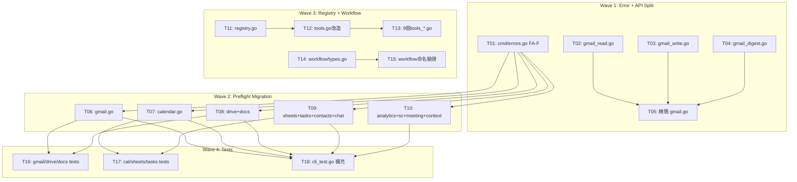

# S3 Implementation Plan: Architecture Refactor

> **階段**: S3 執行計畫
> **建立時間**: 2026-03-20 13:00
> **Agents**: backend-expert (all tasks)

---

## 1. 概述

### 1.1 功能目標
重構 gwx CLI 架構：消除 command boilerplate、建立 MCP Tool Registry、拆分過大 API service、統一 workflow interface、整理 error type、補測試。

### 1.2 實作範圍
- **範圍內**: FA-A~FA-F（6 個功能區）
- **範圍外**: 不改 API 邏輯、CLI flag/output、auth flow、MCP protocol

### 1.3 關聯文件
| 文件 | 路徑 | 狀態 |
|------|------|------|
| Brief Spec | `./s0_brief_spec.md` | ✅ |
| Dev Spec | `./s1_dev_spec.md` | ✅ |
| Implementation Plan | `./s3_implementation_plan.md` | 📝 當前 |

---

## 2. 實作任務清單

### 2.1 任務總覽

| # | 任務 | FA | Agent | 依賴 | 複雜度 | TDD | 狀態 |
|---|------|----|-------|------|--------|-----|------|
| T01 | 新建 cmd/errors.go | FA-F | backend | - | S | ⛔ | ⬜ |
| T02 | 新建 api/gmail_read.go | FA-C | backend | - | M | ⛔ | ⬜ |
| T03 | 新建 api/gmail_write.go | FA-C | backend | - | M | ⛔ | ⬜ |
| T04 | 新建 api/gmail_digest.go | FA-C | backend | - | M | ⛔ | ⬜ |
| T05 | 精簡 api/gmail.go | FA-C | backend | T02,T03,T04 | S | ⛔ | ⬜ |
| T06 | 遷移 cmd/gmail.go → Preflight | FA-A | backend | T01 | M | ⛔ | ⬜ |
| T07 | 遷移 cmd/calendar.go | FA-A | backend | T01 | M | ⛔ | ⬜ |
| T08 | 遷移 cmd/drive.go, docs.go | FA-A | backend | T01 | M | ⛔ | ⬜ |
| T09 | 遷移 cmd/sheets.go, tasks.go, contacts.go, chat.go | FA-A | backend | T01 | M | ⛔ | ⬜ |
| T10 | 遷移 cmd/analytics.go, searchconsole.go, meeting_prep.go, context.go | FA-A | backend | T01 | M | ⛔ | ⬜ |
| T11 | 新建 mcp/registry.go | FA-B | backend | - | M | ✅ | ⬜ |
| T12 | 改造 mcp/tools.go | FA-B | backend | T11 | M | ⛔ | ⬜ |
| T13 | 改造 9 個 tools_*.go → ToolProvider | FA-B | backend | T11,T12 | M | ⛔ | ⬜ |
| T14 | 新建 workflow/types.go | FA-E | backend | - | S | ⛔ | ⬜ |
| T15 | 驗證 workflow 命名規範 | FA-E | backend | T14 | S | ⛔ | ⬜ |
| T16 | Gmail/Drive/Docs integration tests | FA-D | backend | T06,T08 | M | ✅ | ⬜ |
| T17 | Calendar/Sheets/Tasks integration tests | FA-D | backend | T07,T09 | M | ✅ | ⬜ |
| T18 | 擴充 cli_test.go 覆蓋率 | FA-D | backend | T06-T10 | S | ✅ | ⬜ |

**TDD 說明**: T01-T10 為純搬移/遷移重構，不改邏輯，`go build` 即為驗證 → TDD N/A。T11 有 duplicate key 邏輯需測試。T14-T15 為文件化，N/A。T16-T18 本身就是寫測試。

---

## 4. 依賴關係圖



---

## 5. 執行順序與 Agent 分配

### 5.1 執行波次

| 波次 | 任務 | 可並行 | 備註 |
|------|------|--------|------|
| Wave 1 | T01, T02, T03, T04 | 全部可並行 | T05 等 T02-T04 完成 |
| Wave 2 | T06, T07, T08, T09, T10 | 全部可並行 | 都只依賴 T01 |
| Wave 3 | T11→T12→T13, T14→T15 | FA-B 內部有序；FA-B 和 FA-E 可並行 | |
| Wave 4 | T16, T17, T18 | T16/T17 可並行；T18 等全部 | |

---

## 6. 驗證計畫

### 6.1 逐任務驗證

| 任務 | 驗證指令 | 預期結果 |
|------|---------|---------|
| T01-T05 | `go build ./...` | 編譯通過 |
| T05 | `wc -l internal/api/gmail.go` | ≤ 80 LOC |
| T06-T10 | `go build ./internal/cmd/...` + `go test ./internal/cmd/ -run TestCLI` | 通過 |
| T11-T13 | `go build ./internal/mcp/...` + `go test ./internal/mcp/...` | 通過 |
| T14-T15 | `go build ./internal/workflow/...` + `go vet ./internal/workflow/...` | 通過 |
| T16-T18 | `go test -race ./internal/cmd/...` | 通過 |

### 6.2 整體驗證

```bash
go build ./...
go test -race ./...
go vet ./...
```

---

## 7. 實作進度追蹤

| 指標 | 數值 |
|------|------|
| 總任務數 | 18 |
| 已完成 | 0 |
| 進行中 | 0 |
| 待處理 | 18 |
| 完成率 | 0% |

---

## 9. 風險與問題追蹤

### 9.1 已識別風險

| # | 風險 | 影響 | 緩解措施 | 狀態 |
|---|------|------|---------|------|
| 1 | FA-A 特殊 cmd 誤套用 Preflight | 高 | 17 個特殊 cmd 明確排除清單 | 監控中 |
| 2 | FA-B init() 重複 key panic | 高 | buildHandlers duplicate check | 監控中 |
| 3 | FA-C private helper 歸屬錯誤 | 中 | go build 立即驗證 | 監控中 |
| 4 | dry-run 格式改變 (D-01) | 中 | 已知 breaking change | 已接受 |
