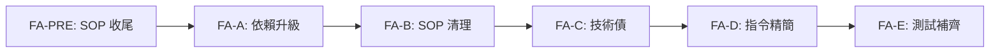

# S0 Brief Spec: 全面代碼升級整合

> **階段**: S0 需求討論
> **建立時間**: 2026-03-20 15:00
> **Agent**: requirement-analyst
> **Spec Mode**: Full Spec
> **工作類型**: refactor

---

## 0. 工作類型

**本次工作類型**：`refactor`（含 maintenance、chore、test coverage 子類型）

## 1. 一句話描述

完成 2 個未跑完的 SOP 收尾，然後依賴升級、技術債清理、指令精簡、測試補齊，全面提升 gwx codebase 品質。

## 2. 為什麼要做

### 2.1 痛點

- **SOP 殘留**：builtin-workflow-skills 和 ux-improvements 兩個 SOP 的程式碼已 merge，但 S5 Code Review / S6 Test / S7 Commit 沒跑，品質未驗證
- **依賴滯後**：Go modules 和 npm 依賴未定期升級，潛在安全漏洞與相容性問題
- **架構重構後遺症**：剛完成大型架構重構（Preflight、ToolRegistry、gmail split），可能有技術債殘留
- **指令膨脹**：101 個 CLI 指令，可能有功能重疊或命名不一致
- **測試覆蓋不足**：54 個 test 檔 vs 171 個 source 檔（31% 檔案覆蓋率），重構後需要補齊

### 2.2 目標

- 所有既有程式碼通過 Code Review + 測試驗證
- 依賴升到最新穩定版
- 消除技術債，程式碼一致性提升
- CLI 指令精簡，消除冗餘
- 測試覆蓋率顯著提升

## 3. 使用者

| 角色 | 說明 |
|------|------|
| 開發者（自己） | 維護 gwx codebase，需要乾淨的程式碼基礎繼續開發 |
| AI Agent（Claude/Codex） | 使用 MCP 工具操作 gwx，需要穩定可靠的指令介面 |

## 4. 核心流程

### 4.0 功能區拆解（Functional Area Decomposition）

#### 功能區識別表

| FA ID | 功能區名稱 | 一句話描述 | 入口 | 獨立性 |
|-------|-----------|-----------|------|--------|
| FA-PRE | SOP 收尾 | 補跑 builtin-workflow-skills 和 ux-improvements 的 S5→S7 | 既有 SOP context | 高 |
| FA-A | 依賴升級 | Go modules + npm 依賴升到最新版 | go.mod / package.json | 高 |
| FA-B | SOP 清理 | 修正 3 個舊 SOP context 狀態，清理殘留 | dev/specs/ | 高 |
| FA-C | 技術債清理 | 架構重構後 code review，修掉發現的問題 | codebase 全域 | 中 |
| FA-D | 指令精簡 | 101 個 CLI 指令找重複冗餘，合併或移除 | cmd/ 目錄 | 中 |
| FA-E | 測試補齊 | 補 integration test，提升覆蓋率 | *_test.go | 中（依賴 C+D） |

#### 拆解策略

**本次策略**：`multi_sop`

執行順序：

```
Phase 0: FA-PRE（恢復 2 個 SOP，補跑 S5→S7）
    ↓
Phase 1: SOP-2a（FA-A + FA-B，Quick Mode）
    ↓
Phase 2: SOP-2b（FA-C + FA-D，Full Spec）
    ↓
Phase 3: SOP-2c（FA-E，Quick Mode）
```

#### 跨功能區依賴



| 來源 FA | 目標 FA | 依賴類型 | 說明 |
|---------|---------|---------|------|
| FA-PRE | FA-A | 順序依賴 | SOP 收尾先做，確保既有程式碼已驗證 |
| FA-A | FA-B | 弱依賴 | 升級後再清理 context |
| FA-C | FA-D | 資料共用 | 技術債修完再合併指令，避免改兩次 |
| FA-D | FA-E | 資料共用 | 指令結構穩定後再補測試 |

### 4.1 各 Phase 摘要

#### Phase 0: SOP 收尾（非新 SOP，恢復既有）

| SOP | 當前階段 | 要做的事 |
|-----|---------|---------|
| builtin-workflow-skills | S4 完成 | S5 Code Review → S6 Test → S7 Commit |
| ux-improvements | S4 進行中 | 確認 S4 狀態 → S5 → S6 → S7 |

#### Phase 1: SOP-2a 快速維護（Quick Mode）

- FA-A：`go get -u ./...` + `go mod tidy` + 編譯測試
- FA-A：npm 依賴升級 + 版本 bump
- FA-B：修正 3 個 SOP context 狀態為 completed/abandoned

#### Phase 2: SOP-2b 重構核心（Full Spec）

- FA-C：全域 code review，找技術債 → 修復
- FA-D：分析 101 個指令 → 識別重複 → 合併/重命名（breaking change OK）

#### Phase 3: SOP-2c 測試補強（Quick Mode）

- FA-E：依 SOP-2b 穩定後的程式碼補 integration test
- 目標：關鍵路徑 100% 覆蓋

### 4.2 六維度例外清單

| 維度 | ID | FA | 情境 | 觸發條件 | 預期行為 | 嚴重度 |
|------|-----|-----|------|---------|---------|--------|
| 資料邊界 | E1 | FA-A | 依賴升級後 API 不相容 | Go/npm 套件 breaking change | 編譯失敗，需 pin 版本或修改程式碼 | P1 |
| 狀態轉換 | E2 | FA-PRE | SOP context 狀態與 git 不一致 | S4 程式碼已 merge 但 context 顯示 in_progress | 以 git 實際狀態為準，修正 context | P2 |
| 業務邏輯 | E3 | FA-D | 指令合併後 MCP tool 名稱連動 | MCP registry 引用舊指令名 | 同步更新 MCP tool 註冊 | P0 |
| 網路/外部 | E4 | FA-E | 測試依賴 Google API 需要認證 | CI 環境無 OAuth token | 用 mock 或 skip 標記 | P1 |

### 4.3 白話文摘要

這次升級把 gwx 的程式碼從「功能都有但有點亂」的狀態，整理成「乾淨、有測試、沒有冗餘」的狀態。先把之前沒做完的驗證補完，再升級套件、清理技術債、精簡指令、補測試。最壞情況是依賴升級導致編譯不過，我們的應對方式是 pin 版本並逐步遷移。

## 5. 成功標準

| # | FA | 類別 | 標準 | 驗證方式 |
|---|-----|------|------|---------|
| 1 | FA-PRE | 品質 | 2 個 SOP 完成 S5→S7 | sdd_context.status == completed |
| 2 | FA-A | 維護 | Go modules 全部升到最新穩定版 | `go list -m -u all` 無可升級項 |
| 3 | FA-A | 維護 | npm 依賴升到最新 | `npm outdated` 無輸出 |
| 4 | FA-B | 清理 | 3 個舊 SOP context 狀態正確 | 手動確認 JSON |
| 5 | FA-C | 品質 | 技術債清零（code review P0/P1 = 0） | S5 review 通過 |
| 6 | FA-D | 精簡 | 消除重複指令，CLI 指令數下降 | `gwx --help` 計數 |
| 7 | FA-E | 測試 | 關鍵路徑有 integration test | `go test ./...` 通過 |

## 6. 範圍

### 範圍內
- **FA-PRE**: 恢復 builtin-workflow-skills、ux-improvements，補跑 S5→S7
- **FA-A**: Go modules 升級、npm 依賴升級
- **FA-B**: 修正 3 個舊 SOP context JSON 狀態
- **FA-C**: 全域 code review + 技術債修復
- **FA-D**: CLI 指令重複分析 + 合併（breaking change OK）
- **FA-E**: 補 integration test

### 範圍外
- 新功能開發
- UI/前端變更（純 CLI 工具）
- CI/CD pipeline 建置
- 效能優化（除非 code review 發現明顯問題）
- 文件大幅改寫（只做必要的 --help 更新）

## 7. 已知限制與約束

- Go 1.26.1 為當前版本，不升級 Go 本身
- npm 發行套件需保持 `gwx-cli` 名稱
- MCP tool 名稱變更需同步更新所有 `init()` 註冊
- 測試依賴 Google API 認證，integration test 需考慮 mock 策略

## 8. 前端 UI 畫面清單

> 純 CLI 工具，無前端畫面。省略。

---

## 10. SDD Context

```json
{
  "sdd_context": {
    "version": "3.0.0",
    "feature": "codebase-upgrade",
    "current_stage": "S0",
    "spec_mode": "full",
    "spec_mode_reason": "多 FA 跨域重構，涉及依賴、指令結構、測試，需完整規劃",
    "work_type": "refactor",
    "spec_folder": "dev/specs/2026-03-20_2_codebase-upgrade",
    "execution_mode": "autopilot",
    "status": "in_progress",
    "stages": {
      "s0": {
        "status": "pending_confirmation",
        "agent": "requirement-analyst",
        "output": {
          "brief_spec_path": "dev/specs/2026-03-20_2_codebase-upgrade/s0_brief_spec.md",
          "work_type": "refactor",
          "requirement": "全面代碼升級整合：SOP 收尾 + 依賴升級 + SOP 清理 + 技術債 + 指令精簡 + 測試補齊",
          "pain_points": [
            "2 個 SOP 未完成 S5-S7",
            "依賴未定期升級",
            "架構重構後可能有技術債",
            "101 指令可能有冗餘",
            "54/171 測試檔案覆蓋不足"
          ],
          "goal": "codebase 品質全面提升：乾淨、有測試、無冗餘",
          "success_criteria": [
            "2 個 SOP 完成 S5→S7",
            "Go modules + npm 依賴最新",
            "技術債 P0/P1 = 0",
            "CLI 指令無冗餘重複",
            "關鍵路徑有 integration test"
          ],
          "scope_in": [
            "SOP 收尾（S5→S7）",
            "Go/npm 依賴升級",
            "SOP context 狀態修正",
            "Code review + 技術債修復",
            "CLI 指令合併精簡",
            "Integration test 補齊"
          ],
          "scope_out": [
            "新功能開發",
            "CI/CD pipeline",
            "效能優化",
            "文件大改"
          ],
          "constraints": [
            "Go 1.26.1 不升級",
            "npm 名稱 gwx-cli 不變",
            "MCP tool 名稱變更需同步註冊"
          ],
          "functional_areas": [
            {"id": "FA-PRE", "name": "SOP 收尾", "description": "補跑 builtin-workflow-skills 和 ux-improvements 的 S5→S7", "independence": "high"},
            {"id": "FA-A", "name": "依賴升級", "description": "Go modules + npm 依賴升到最新穩定版", "independence": "high"},
            {"id": "FA-B", "name": "SOP 清理", "description": "修正 3 個舊 SOP context 狀態", "independence": "high"},
            {"id": "FA-C", "name": "技術債清理", "description": "架構重構後 code review + 修復", "independence": "medium"},
            {"id": "FA-D", "name": "指令精簡", "description": "101 個 CLI 指令找重複冗餘合併", "independence": "medium"},
            {"id": "FA-E", "name": "測試補齊", "description": "補 integration test 覆蓋率", "independence": "medium"}
          ],
          "decomposition_strategy": "multi_sop",
          "child_sops": [
            "Phase 0: 恢復 builtin-workflow-skills + ux-improvements (S5→S7)",
            "Phase 1: SOP-2a 快速維護 (FA-A + FA-B, Quick)",
            "Phase 2: SOP-2b 重構核心 (FA-C + FA-D, Full Spec)",
            "Phase 3: SOP-2c 測試補強 (FA-E, Quick)"
          ]
        }
      }
    }
  }
}
```
