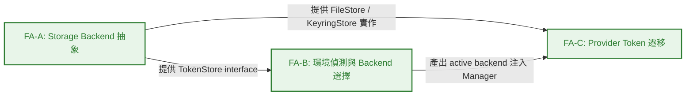
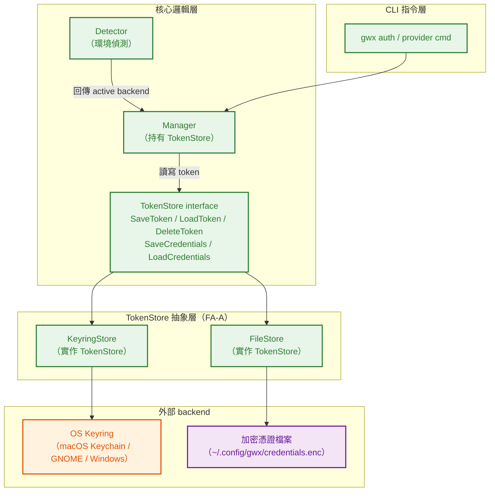
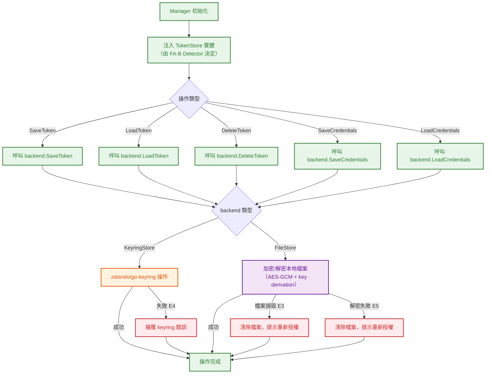
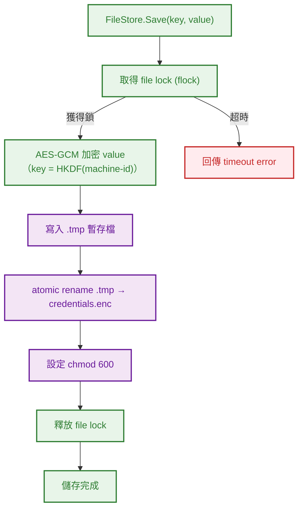
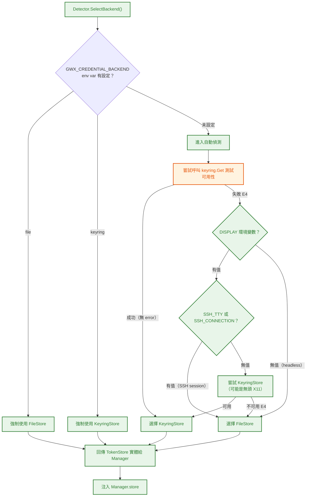
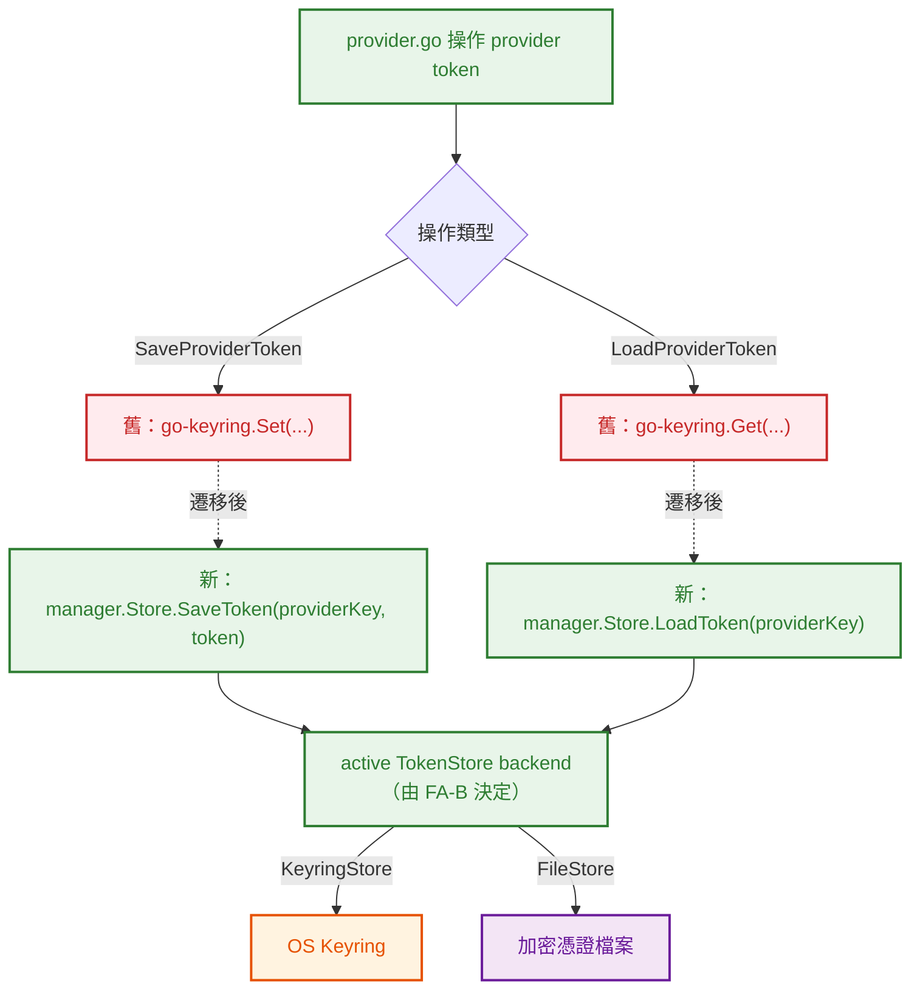
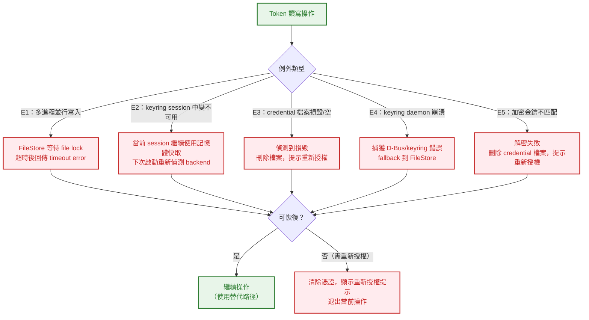

# S0 Brief Spec: OAuth Headless File Storage

> **階段**: S0 需求討論
> **建立時間**: 2026-03-26 00:00
> **Agent**: requirement-analyst
> **Spec Mode**: Full Spec
> **工作類型**: completion（補完）

---

## 0. 工作類型

| 類型 | 代碼 | 說明 |
|------|------|------|
| 補完 | `completion` | 已有部分實作，需補齊缺漏功能/修正問題。S1 深度分析現有 baseline、缺漏 gap、耦合點 |

**本次工作類型**：`completion`

## 1. 一句話描述

OAuth 憑證存儲新增 headless 環境自動偵測，在無 keyring 的 VPS/SSH 環境自動降級為加密檔案存儲。

## 2. 為什麼要做

### 2.1 痛點

- **keyring 硬綁定（HS-1）**：`Manager.store` 硬編碼為 `*KeyringStore`，無介面抽象，無法切換 backend。headless 環境直接 panic 或 error，阻斷 OAuth 授權流程。
- **provider token 無抽象（HS-2）**：`provider.go` 的 `SaveProviderToken`/`LoadProviderToken` 是 package-level 函數直接呼叫 keyring，完全繞過 Manager 層，無法納入統一 fallback 邏輯。
- **無環境偵測（HS-3）**：無任何 headless 環境判斷，在 VPS/Docker/SSH 環境下無法自動適配。
- **無 fallback 機制（HS-4）**：keyring 失敗即終止，沒有降級路徑。

### 2.2 目標

- 讓 gwx 在所有環境（桌面/headless/Docker）都能正常存取 OAuth 憑證。
- 引入 `TokenStore` interface，使 backend 切換成為架構能力而非一次性 hack。
- 消除 HS-1~HS-4，統一 OAuth token 和 provider token 的存儲抽象。

## 3. 使用者

| 角色 | 說明 |
|------|------|
| 開發者 | 在 VPS/headless 環境執行 CLI 授權，期望指令能正常運作而不需手動配置 |
| DevOps | 部署自動化流程中管理憑證，可能使用 env var 強制指定 backend |

## 4. 核心流程

> **閱讀順序**：功能區拆解（理解全貌）→ 系統架構總覽（理解組成）→ 各功能區流程圖（對焦細節）→ 例外處理（邊界情境）

> 圖例：🟦 藍色 = 前端頁面/UI　｜　🟩 綠色 = 後端服務/邏輯　｜　🟧 橘色 = 第三方服務　｜　🟪 紫色 = 資料儲存　｜　🟥 紅色 = 例外/錯誤

### 4.0 功能區拆解（Functional Area Decomposition）

#### 功能區識別表

| FA ID | 功能區名稱 | 一句話描述 | 入口 | 獨立性 |
|-------|-----------|-----------|------|--------|
| FA-A | Storage Backend 抽象 | 定義 `TokenStore` interface，重構 `KeyringStore` 實作 interface，新增 `FileStore` 實作 | Manager 初始化時選擇 backend | 中 |
| FA-B | 環境偵測與 Backend 選擇 | 自動偵測 headless 環境，選擇適當 backend，支援 env var 手動覆蓋 | CLI 啟動或 OAuth 授權觸發時 | 中 |
| FA-C | Provider Token 遷移 | 將 `provider.go` 的 package-level keyring 函數遷移到統一的 `TokenStore` interface | provider token 讀寫操作 | 低 |

> **獨立性判斷**：FA-A 是基礎 interface，FA-B 依賴 FA-A 的 interface 存在，FA-C 依賴 FA-A 的 interface 與 FA-B 產出的 Manager 注入機制。

#### 拆解策略

**本次策略**：`single_sop_fa_labeled`（3 FA，中獨立性）

一份 SOP，S3 波次按 FA 順序推進（FA-A → FA-B → FA-C），S4 按 FA 實作。

#### 跨功能區依賴



| 來源 FA | 目標 FA | 依賴類型 | 說明 |
|---------|---------|---------|------|
| FA-A | FA-B | 介面依賴 | FA-B 的 backend 選擇邏輯回傳 `TokenStore` interface 實體 |
| FA-A | FA-C | 介面依賴 | FA-C 的 provider token 操作改呼叫 `TokenStore` 方法 |
| FA-B | FA-C | 資料共用 | FA-C 的 `SaveProviderToken`/`LoadProviderToken` 使用 FA-B 選出的 active backend |

---

### 4.1 系統架構總覽



**架構重點**：

| 層級 | 組件 | 職責 |
|------|------|------|
| **CLI** | `gwx auth` / `gwx provider` | 觸發 OAuth 授權流程與 provider token 操作 |
| **核心邏輯** | `Manager` | 持有 `TokenStore` interface，協調 OAuth 流程（不再硬綁 `KeyringStore`） |
| **核心邏輯** | `Detector` | 偵測執行環境，選擇並回傳 active backend 實體 |
| **抽象層** | `TokenStore` interface | 統一 backend 操作契約（新增） |
| **抽象層** | `KeyringStore` | 實作 `TokenStore`，呼叫 `zalando/go-keyring`（既有重構） |
| **抽象層** | `FileStore` | 實作 `TokenStore`，加密後寫入本地檔案（新增） |
| **外部** | OS Keyring | 桌面環境憑證存儲 |
| **外部** | 加密憑證檔案 | headless 環境憑證存儲，權限 600 |

---

### 4.2 FA-A: Storage Backend 抽象

> 定義 `TokenStore` interface，重構既有 `KeyringStore` 實作該 interface，新增 `FileStore` 實作（含加密/解密）。

#### 4.2.1 全局流程圖



**技術細節補充**：

- `TokenStore` interface 方法簽名需與現有 `KeyringStore` 方法一致，確保 drop-in 替換。
- `FileStore` 加密策略：使用機器綁定 key derivation（e.g., 以機器 UUID 或 hostname 為 seed 的 HKDF），不需要用戶輸入密碼，純 Go 實作（無 CGO）。
- `FileStore.SaveToken` 寫入時使用 atomic rename（write to temp → rename），避免並行寫入損毀（E1）。
- `FileStore` 操作需在 `flock` 保護下進行，防止多 gwx 實例競爭（E1）。

---

#### 4.2.2 FileStore 加密流程（局部）



**FileStore 特殊注意事項**：加密金鑰與機器綁定（machine-id/hostname），credential 檔案無法跨機器使用（E5）。此為設計決策，不是 bug。

---

#### 4.2.3 Happy Path 摘要

| 路徑 | 入口 | 結果 |
|------|------|------|
| **A：KeyringStore 儲存** | `backend.SaveToken(key, token)` → 呼叫 `go-keyring.Set` | token 存入 OS keyring |
| **B：FileStore 儲存** | `backend.SaveToken(key, token)` → AES-GCM 加密 → atomic write | token 加密後寫入本地檔案，權限 600 |
| **C：KeyringStore 讀取** | `backend.LoadToken(key)` → 呼叫 `go-keyring.Get` | 回傳 token string |
| **D：FileStore 讀取** | `backend.LoadToken(key)` → 讀檔 → AES-GCM 解密 | 回傳 token string |

---

### 4.3 FA-B: 環境偵測與 Backend 選擇

> 在 CLI 啟動或 OAuth 授權觸發時，自動偵測執行環境，選擇適當 backend。支援 env var / config 手動覆蓋。

#### 4.3.1 全局流程圖



**技術細節補充**：

- `GWX_CREDENTIAL_BACKEND` env var 優先級最高，忽略所有自動偵測邏輯。
- keyring 可用性測試：呼叫 `go-keyring.Get("gwx-probe", "probe")` 並忽略 ErrNotFound，只偵測 ErrNoKeyring / service unavailable 等系統錯誤。
- 偵測結果應在 Manager lifetime 內快取，避免每次操作都重新偵測。

---

#### 4.3.2 Happy Path 摘要

| 路徑 | 入口 | 結果 |
|------|------|------|
| **A：桌面環境（auto）** | `Detector.SelectBackend()` → keyring probe 成功 | 選擇 `KeyringStore`，行為與舊版完全一致 |
| **B：headless 環境（auto）** | `Detector.SelectBackend()` → 無 DISPLAY + 無 SSH_TTY | 選擇 `FileStore`，自動使用加密檔案 |
| **C：SSH session（auto）** | `Detector.SelectBackend()` → 有 SSH_TTY | 選擇 `FileStore` |
| **D：手動強制 file** | `GWX_CREDENTIAL_BACKEND=file` | 強制選擇 `FileStore`，忽略環境偵測 |
| **E：手動強制 keyring** | `GWX_CREDENTIAL_BACKEND=keyring` | 強制選擇 `KeyringStore`，忽略環境偵測 |

---

### 4.4 FA-C: Provider Token 遷移

> 將 `provider.go` 的 package-level `SaveProviderToken`/`LoadProviderToken` 函數，從直接呼叫 `go-keyring` 改為呼叫注入的 `TokenStore` interface。

#### 4.4.1 全局流程圖



**技術細節補充**：

- `SaveProviderToken` / `LoadProviderToken` 目前是 package-level 函數（無 receiver），遷移時需要改為透過 Manager 實例呼叫，或接受 `TokenStore` 作為參數。
- key 命名策略需統一：建議 `gwx:provider:{provider_name}:{user_id}` 格式，確保與 OAuth token 的 key 不衝突。
- 既有 keyring 中已存在的 provider token key 格式需保持相容，避免現有用戶 token 遺失。

---

#### 4.4.2 Happy Path 摘要

| 路徑 | 入口 | 結果 |
|------|------|------|
| **A：儲存 provider token** | `SaveProviderToken(store, provider, token)` → `store.SaveToken(key, token)` | token 存入 active backend（keyring 或 file） |
| **B：讀取 provider token** | `LoadProviderToken(store, provider)` → `store.LoadToken(key)` | 從 active backend 回傳 token string |

---

### 4.5 例外流程圖

> 跨所有功能區的例外路徑。



**技術細節補充**：
- E3 / E5 重新授權提示需清楚說明原因（e.g., `credential file corrupted, please run gwx auth login`）。
- E4 的 fallback 邏輯在 FA-B `Detector` 已涵蓋（keyring probe 失敗 → 選 FileStore）。執行中 keyring 突然失效（E2）較少見，Session cache 作為短期防護。

---

### 4.6 六維度例外清單

| 維度 | ID | FA | 情境 | 觸發條件 | 預期行為 | 嚴重度 |
|------|-----|-----|------|---------|---------|--------|
| 並行/競爭 | E1 | FA-A | 多進程同時讀寫 credential 檔案 | 多個 gwx 實例同時 refresh token（CI/CD 並行腳本） | `flock` 保護寫入；讀取使用 atomic rename；超時回傳 error | P1 |
| 狀態轉換 | E2 | FA-B | session 中 keyring 變不可用 | 螢幕鎖定導致 GNOME Keyring locked | 當前 session 繼續使用記憶體快取的 token；下次 CLI 啟動重新偵測 backend | P2 |
| 資料邊界 | E3 | FA-A | credential 檔案損毀或為空 | 寫入中途中斷（磁碟滿、kill -9）導致檔案不完整 | 讀取時偵測到損毀（AES-GCM 認證失敗）→ 刪除檔案 → 提示重新授權 | P1 |
| 網路/外部 | E4 | 全域 | keyring daemon 崩潰或 D-Bus 不可用 | Linux 上 D-Bus session bus 未啟動，或 GNOME Keyring daemon crash | 捕獲 keyring 錯誤，Detector 選擇 FileStore 作為 fallback | P1 |
| 業務邏輯 | E5 | FA-A | 加密金鑰與機器不匹配 | 將 credential 檔案複製到另一台機器後執行 gwx | AES-GCM 解密失敗（認證 tag 不符）→ 刪除 credential 檔案 → 提示重新授權 | P2 |
| UI/體驗 | — | — | 不適用（純 CLI 工具，無 UI loading state） | — | — | — |

---

### 4.7 白話文摘要

這次改造讓 gwx 在 VPS、SSH 遠端連線、Docker 容器等沒有圖形介面的環境中也能正常保存登入憑證，不再因為「系統鑰匙圈不可用」而報錯中斷。當系統環境支援鑰匙圈時，行為跟原本完全一樣，不影響現有用戶；偵測到 headless 環境時，自動改用加密的本地檔案保存憑證。最壞情況下（檔案損毀或憑證複製到其他機器），系統會主動清除問題憑證並引導用戶重新登入，不會讓用戶看到難以理解的加密錯誤訊息。

---

## 5. 成功標準

| # | FA | 類別 | 標準 | 驗證方式 |
|---|-----|------|------|---------|
| 1 | FA-B | 功能 | headless 環境（無 DISPLAY、SSH session、Docker）自動偵測並使用 file-based storage | 在無 DISPLAY env var 的環境執行 gwx，確認 `Detector` 選擇 `FileStore` |
| 2 | FA-A | 相容性 | keyring 環境行為不變（向後相容），現有 keyring token 不遺失 | 在桌面環境執行舊版授權後升級，確認 token 仍可讀取 |
| 3 | FA-B | 可靠性 | keyring 故障時（E4）自動 fallback 到 file-based storage | mock keyring 回傳 error，確認 Detector 選擇 FileStore |
| 4 | FA-B | 可配置性 | 支援 `GWX_CREDENTIAL_BACKEND` env var 手動覆蓋 backend 選擇 | 設定 `GWX_CREDENTIAL_BACKEND=file` 後執行，確認使用 FileStore；設定 `keyring` 後確認使用 KeyringStore |
| 5 | FA-A | 安全性 | credential 檔案權限自動設為 600，過寬時警告並修正 | 建立一個 644 的舊憑證檔案，執行 gwx，確認權限自動改為 600 |

---

## 6. 範圍

### 範圍內

- **FA-A**：定義 `TokenStore` interface（`SaveToken` / `LoadToken` / `DeleteToken` / `SaveCredentials` / `LoadCredentials`）
- **FA-A**：重構 `KeyringStore` 實作 `TokenStore` interface
- **FA-A**：新增 `FileStore` 實作 `TokenStore`（AES-GCM 加密、atomic write、file lock、chmod 600）
- **FA-B**：新增 `Detector`（環境偵測邏輯：keyring probe → DISPLAY → SSH_TTY → env var override）
- **FA-B**：`Manager` 從硬綁 `*KeyringStore` 改為依賴注入 `TokenStore` interface
- **FA-C**：`provider.go` 的 `SaveProviderToken` / `LoadProviderToken` 遷移到 `TokenStore` interface

### 範圍外

- 跨 backend 的 token 遷移工具（keyring → file 自動遷移）
- GUI 設定介面
- 現有 keyring 路徑的加密方式變更
- refresh token 有效期管理（現有 oauth.go 邏輯不改）

---

## 7. 已知限制與約束

- **zalando/go-keyring 相容性**：`KeyringStore` 必須維持與現有 keyring key 格式一致，現有用戶的 token 不能丟失。
- **純 Go（無 CGO）**：`FileStore` 加密實作必須只用 Go 標準庫（`crypto/aes`、`crypto/cipher`、`golang.org/x/crypto/hkdf`），不能引入需要 CGO 的依賴。
- **key derivation 策略決定**：機器綁定方式（以 `/etc/machine-id` 或 hostname 為 seed），credential 檔案不可跨機器使用，這是設計決策，需在 S1 確認具體實作。
- **既有 provider token key 格式相容**：FA-C 遷移時需確認現有 keyring 中的 provider token key 格式，避免遷移後讀不到舊資料。

---

## 8. 前端 UI 畫面清單

本功能為純 CLI/backend 功能，無前端 UI 畫面，省略此節。

---

## 9. 補充說明

### 9.1 Baseline 檔案清單

| 檔案 | 現狀 | 預計變更 |
|------|------|---------|
| `internal/auth/keyring.go` | `KeyringStore`，硬綁 `go-keyring` | 重構實作 `TokenStore` interface |
| `internal/auth/oauth.go` | `Manager` 持有 `*KeyringStore` | 改為持有 `TokenStore` interface + 依賴注入 |
| `internal/auth/provider.go` | package-level 函數直接呼叫 `go-keyring` | 遷移到 `TokenStore` interface |
| `internal/auth/filestore.go` | 不存在 | 新增 `FileStore` 實作 |
| `internal/auth/detect.go` | 不存在 | 新增 `Detector`（環境偵測） |

### 9.2 已知問題對應

| 問題 ID | 嚴重度 | 問題描述 | 對應 FA |
|--------|--------|---------|---------|
| HS-1 | blocker | `Manager.store` 硬編碼為 `*KeyringStore` | FA-A + FA-B |
| HS-2 | high | `provider.go` 直接呼叫 keyring，無抽象 | FA-C |
| HS-3 | medium | 無環境偵測邏輯 | FA-B |
| HS-4 | medium | 無 fallback 機制 | FA-B + FA-A |

### 9.3 Key Derivation 策略備選方案

S1 需確認具體方案：

| 方案 | 優點 | 缺點 |
|------|------|------|
| `/etc/machine-id` 綁定 | 穩定、唯一、無用戶感知 | Linux 限定，macOS/Windows 需替代方案 |
| Hostname 綁定 | 跨平台，純 Go | hostname 可修改，安全性略低 |
| `os.Getwd()` + username | 簡單 | 可預測性低，遷移困難 |

建議優先使用 `/etc/machine-id`（Linux）/ `IOPlatformUUID`（macOS）/ `MachineGuid`（Windows）的跨平台抽象。

---

## 10. SDD Context

```json
{
  "sdd_context": {
    "stages": {
      "s0": {
        "status": "pending_confirmation",
        "agent": "requirement-analyst",
        "output": {
          "brief_spec_path": "dev/specs/2026-03-26_1_oauth-headless-file-storage/s0_brief_spec.md",
          "work_type": "completion",
          "requirement": "OAuth 憑證存儲新增 headless 環境自動偵測，在無 keyring 的 VPS/SSH 環境自動降級為加密檔案存儲",
          "pain_points": [
            "Manager.store 硬編碼為 *KeyringStore，無介面抽象，無法切換 backend（HS-1）",
            "provider.go 的 provider token 操作直接呼叫 go-keyring，完全繞過 Manager 層（HS-2）",
            "無環境偵測邏輯，headless 環境直接 panic 或 error（HS-3）",
            "無 fallback 機制，keyring 失敗即終止（HS-4）"
          ],
          "goal": "讓 gwx 在所有環境（桌面/headless/Docker）都能正常存取 OAuth 憑證，並引入 TokenStore interface 使 backend 切換成為架構能力",
          "success_criteria": [
            "headless 環境自動偵測並使用 file-based storage",
            "keyring 環境行為不變（向後相容）",
            "keyring 故障時自動 fallback 到 file-based",
            "支援 GWX_CREDENTIAL_BACKEND env var 手動覆蓋 backend",
            "credential 檔案權限自動設為 600"
          ],
          "scope_in": [
            "FA-A: 定義 TokenStore interface + 重構 KeyringStore + 新增 FileStore",
            "FA-B: 環境偵測 Detector + Manager 依賴注入重構",
            "FA-C: provider.go 遷移到 TokenStore interface"
          ],
          "scope_out": [
            "跨 backend token 遷移工具",
            "GUI 設定介面",
            "現有 keyring 加密方式變更"
          ],
          "constraints": [
            "維持 zalando/go-keyring 相容（現有 keyring key 格式不變）",
            "純 Go，無 CGO 依賴",
            "file-based 需選 key derivation 策略（S1 確認）"
          ],
          "functional_areas": [
            {
              "id": "FA-A",
              "name": "Storage Backend 抽象",
              "description": "定義 TokenStore interface，重構 KeyringStore 實作 interface，新增 FileStore 實作（AES-GCM + atomic write + file lock）",
              "independence": "medium"
            },
            {
              "id": "FA-B",
              "name": "環境偵測與 Backend 選擇",
              "description": "自動偵測 headless 環境（keyring probe / DISPLAY / SSH_TTY），選擇 backend，支援 env var 手動覆蓋",
              "independence": "medium"
            },
            {
              "id": "FA-C",
              "name": "Provider Token 遷移",
              "description": "provider.go package-level keyring 函數遷移到 TokenStore interface，統一 token 存儲路徑",
              "independence": "low"
            }
          ],
          "decomposition_strategy": "single_sop_fa_labeled",
          "child_sops": []
        }
      }
    }
  }
}
```
