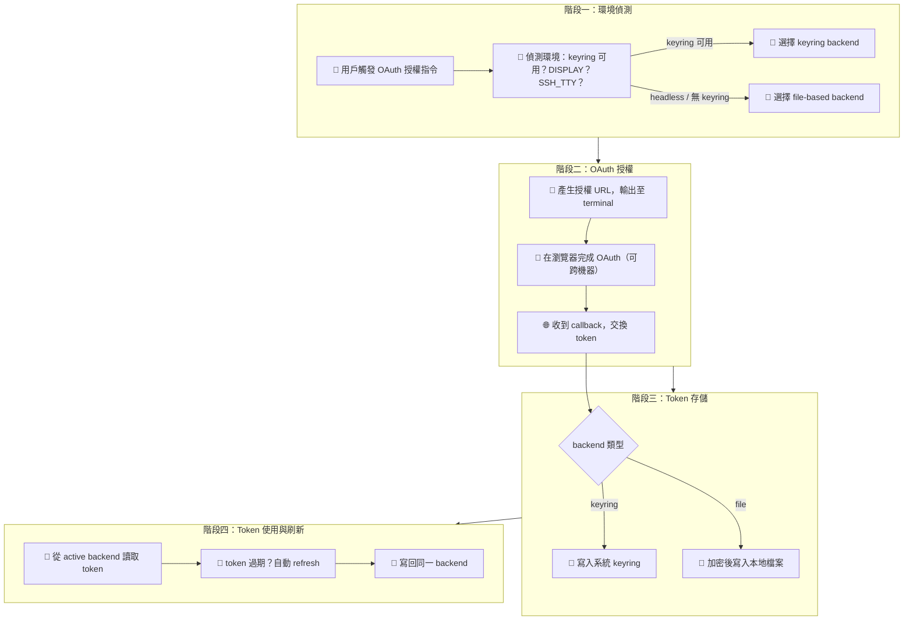

# 需求輸入：OAuth Headless File Storage

> **文件角色**：需求詳細文件（Detailed Requirement Document）。
> 可在 SOP 外獨立填寫，作為 S0 的輸入源。S0 消費本文件後產出精簡版 `s0_brief_spec.md`。
> 本文件在整個 SOP 生命週期中作為「需求百科」被 S1~S7 各階段引用。
>
> 填寫說明：帶 `*` 為必填，其餘選填。填得越完整 S0 討論越快收斂。
> 不確定的欄位寫「待討論」即可，S0 會主動釐清。

---

## 0. 工作類型 *

- [ ] 新需求（全新功能或流程）
- [ ] 重構（改善現有程式碼品質/架構，不改變外部行為）
- [ ] Bug 修復（修正錯誤行為）
- [ ] 調查（問題方向不明，需先探索再決定行動）
- [x] 補完（已有部分實作，需補齊缺漏功能/修正問題）
- [ ] 待討論

## 1. 一句話描述 *

OAuth 憑證存儲新增 headless 環境自動偵測，在無 keyring 的 VPS/SSH 環境自動降級為加密檔案存儲。

## 2. 為什麼要做 *

目前 OAuth 憑證強綁 keyring（如 macOS Keychain、GNOME Keyring），在 VPS、SSH session、Docker container 等 headless 環境下會直接報錯或無法使用，導致這些環境無法完成 OAuth 授權流程。

## 3. 使用者是誰 *

| 角色 | 參與方式 | 說明 |
|------|---------|------|
| 開發者 | 操作者 | 在 VPS/headless 環境執行 CLI 授權 |
| DevOps | 操作者 | 部署自動化流程中管理憑證 |
| 終端用戶 | 無關 | 不直接接觸 credential storage |

## 4. 核心流程 *

### 4.1 Happy Path

> 節點標注規則：🤖 = 系統自動、👤 = 人工操作、🔄 = 半自動（需人工確認）、🌐 = 外部服務

### 4.2 異常/邊界情境

| 情境 | 預期行為 | 現況 |
|------|---------|------|
| keyring 存在但鎖定/故障 | 捕獲例外，自動 fallback 到 file-based | ❌ 缺少 |
| 檔案權限過寬（如 644） | 警告用戶，自動修正為 600 | ❌ 缺少 |
| 從桌面遷移到 headless | token 不跨 backend，需重新授權 | ⚠️ 需確認策略 |
| 用戶手動指定 backend | 支援 env var 或 config 強制 file-based | ❌ 缺少 |
| 加密金鑰遺失/損毀 | 清除 credential 檔案，重新授權 | ❌ 缺少 |

## 5. 成功長什麼樣 *

- [ ] headless 環境（無 DISPLAY、SSH session、Docker）自動偵測並使用 file-based storage
- [ ] keyring 環境行為不變（向後相容）
- [ ] keyring 故障時自動 fallback 到 file-based
- [ ] 支援 env var / config 手動覆蓋 backend 選擇
- [ ] credential 檔案權限自動設為 600，過寬時警告

## 6. 不做什麼

- 不做跨 backend 的 token 遷移工具
- 不做 GUI 設定介面
- 不改變現有 keyring 路徑的加密方式

---

## 9. 外部服務與依賴

| 服務 | 用途 | 已知限制 | 環境狀態 |
|------|------|---------|---------|
| Google OAuth 2.0 | token 取得與 refresh | refresh token 有效期限制 | production |
| 系統 keyring（macOS Keychain / GNOME Keyring / Windows Credential） | 現有 token 存儲 | headless 環境不可用 | production |

## 10. 已有實作 Baseline

### 10.1 已完成

- `internal/auth/keyring.go` — `KeyringStore` 結構體，實作 `SaveToken`/`LoadToken`/`DeleteToken`/`SaveCredentials`/`LoadCredentials`，全部綁定 `zalando/go-keyring`
- `internal/auth/oauth.go` — `Manager` 持有 `*KeyringStore`（硬編碼），支援 3 種 login 模式：`LoginBrowser`、`LoginManual`、`LoginRemote`
- `internal/auth/provider.go` — provider token（Slack/GitHub/Notion 等）也全部用 `go-keyring` 直接呼叫 package-level 函數

### 10.2 已知問題

| ID | 嚴重度 | 問題 |
|----|--------|------|
| HS-1 | blocker | `Manager.store` 硬編碼為 `*KeyringStore`，無介面抽象，無法切換 backend |
| HS-2 | high | `provider.go` 的 `SaveProviderToken`/`LoadProviderToken` 是 package-level 函數直接呼叫 keyring，完全沒有 backend 抽象 |
| HS-3 | medium | 無環境偵測邏輯，headless 環境直接 panic 或 error |
| HS-4 | medium | 無 fallback 機制，keyring 失敗即終止 |

### 10.3 參考文件

- `internal/auth/keyring.go` — 現有 keyring storage 實作
- `internal/auth/oauth.go` — OAuth Manager，硬綁 KeyringStore
- `internal/auth/provider.go` — provider token 的 keyring 直接呼叫

## 11. 已知限制或依賴

- 必須維持對 `zalando/go-keyring` 的相容（現有用戶的 token 不能丟）
- file-based 加密需要選擇 key derivation 策略（機器綁定 or 密碼）
- 不能引入 CGO 依賴（影響 cross-compile）

## 12. 優先級

- [ ] 緊急（阻斷其他工作）
- [x] 高（本週要完成）
- [ ] 中（排入計畫）
- [ ] 低（有空再做）
