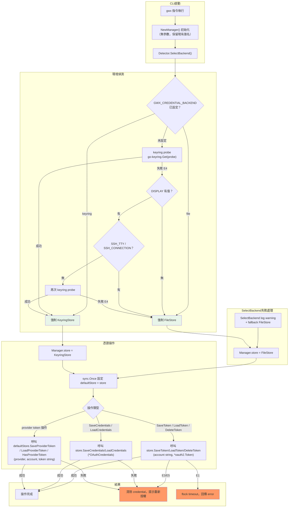

# S1 Dev Spec: OAuth Headless File Storage

> **階段**: S1 技術分析
> **建立時間**: 2026-03-26 11:00
> **修正時間**: 2026-03-26（Phase 5 交叉驗證修正；S2 R2 修正）
> **Agent**: codebase-explorer (Phase 1) + architect (Phase 2 + 3 + 5 + S2 R2)
> **工作類型**: completion（補完）
> **複雜度**: M

---

## 1. 概述

### 1.1 需求參照
> 完整需求見 `s0_brief_spec.md`，以下僅摘要。

OAuth 憑證存儲新增 headless 環境自動偵測，在無 keyring 的 VPS/SSH 環境自動降級為加密檔案存儲，並引入 `TokenStore` interface 統一存儲抽象。

### 1.2 技術方案摘要

引入 `TokenStore` interface（`store.go`），將 `KeyringStore` 重構為實作 interface 的具體型別，新增 `FileStore`（AES-GCM + atomic write + flock），並新增 `Detector` 負責環境偵測與 backend 選擇（支援 `GWX_CREDENTIAL_BACKEND` env var 覆蓋）。`Manager.store` 從硬綁 `*KeyringStore` 改為依賴注入 `TokenStore` interface。`provider.go` 的 package-level 函數保留簽名但內部委派至 module-level `defaultStore TokenStore`（由 Manager 初始化時設定），實現零 caller 變更。加密金鑰採 machine-id（跨平台：Linux `/etc/machine-id`、macOS `syscall.Sysctl("kern.uuid")`、Windows `MachineGuid`）+ HKDF 策略。

**[Phase 5 修正]** TokenStore interface 保留 `*oauth2.Token` 與 `*OAuthCredentials` 原始型別，與現有 `KeyringStore` 方法簽名完全一致，實現 drop-in 替換。`NewManager()` 保留無參數簽名，新增 `NewManagerWithStore()` 供測試注入。

**[S2 R2 修正]** TokenStore interface 擴展加入 provider token 方法（raw string）；`defaultStore` 用 `sync.Once` 保護；macOS `machineID()` 改用 `syscall.Sysctl`；credentials key prefix 統一為 `cred:`；T3 新增 `ensurePermissions()` 步驟。

---

## 2. 影響範圍（Phase 1：codebase-explorer）

### 2.1 受影響檔案

#### Go Backend（`internal/auth/`）

| 檔案 | 變更類型 | 說明 |
|------|---------|------|
| `internal/auth/keyring.go` | 重構 | `KeyringStore` 新增 `var _ TokenStore = (*KeyringStore)(nil)` 編譯期驗證；原有 5 個方法簽名不變；新增 3 個 `SaveProviderToken`/`LoadProviderToken`/`DeleteProviderToken`/`HasProviderToken` 方法（將現有 provider.go 邏輯搬入） |
| `internal/auth/oauth.go` | 重構 | `Manager.store` 從 `*KeyringStore` 改為 `TokenStore`；`NewManager()` 保留無參數簽名，內部呼叫 `SelectBackend()`；新增 `NewManagerWithStore(store TokenStore) *Manager` 供測試注入；`LoadConfigFromKeyring` 保留 + 新增 deprecation comment；`TokenSource()` 內部 `LoadConfigFromKeyring` 呼叫保留（語意不變，底層已走 TokenStore） |
| `internal/auth/provider.go` | 重構 | 4 個 package-level 函數改為委派 module-level `defaultStore`，呼叫 `defaultStore.SaveProviderToken`/`LoadProviderToken`/`DeleteProviderToken`/`HasProviderToken`；保留原函數簽名（零 caller 變更） |
| `internal/auth/store.go` | 新增 | `TokenStore` interface 定義（8 個方法：OAuth2 token + credentials + provider token） |
| `internal/auth/filestore.go` | 新增 | `FileStore` 實作（AES-GCM、atomic write、flock、chmod 600、ensurePermissions） |
| `internal/auth/detector.go` | 新增 | `Detector`（環境偵測 + env var override + backend 選擇） |
| `internal/auth/filestore_test.go` | 新增 | FileStore 單元測試 |
| `internal/auth/detector_test.go` | 新增 | Detector 單元測試 |

#### 間接影響（不需修改代碼，但需驗證相容性）

| 檔案 | 影響原因 |
|------|---------|
| `internal/cmd/root.go` | `RunContext.Auth` 型別為 `*auth.Manager`；`EnsureAuth` 呼叫 `LoadConfigFromKeyring`（保留方法，無需改） |
| `internal/cmd/onboard.go` | 呼叫 `rctx.Auth.SaveToken` / `LoadConfigFromJSON`（Manager API 不變） |
| `internal/cmd/auth.go` | 呼叫 `rctx.Auth.SaveToken`（不變） |
| `internal/cmd/doctor.go` | 呼叫 `auth.HasProviderToken` / `auth.LoadProviderToken`（package-level 函數保留） |
| `internal/cmd/github.go` | 呼叫 4 個 provider token 函數（保留簽名） |
| `internal/cmd/slack.go` | 呼叫 3 個 provider token 函數（保留簽名） |
| `internal/cmd/notion.go` | 呼叫 3 個 provider token 函數（保留簽名） |
| `internal/mcp/tools_github.go` | 呼叫 `auth.LoadProviderToken`（保留簽名） |
| `internal/mcp/tools_slack.go` | 呼叫 `auth.LoadProviderToken`（保留簽名） |
| `internal/mcp/tools_notion.go` | 呼叫 `auth.LoadProviderToken`（保留簽名） |

### 2.2 依賴關係

- **上游依賴**：`zalando/go-keyring v0.2.6`（保留）、`golang.org/x/crypto v0.49.0`（從 indirect 提升為 direct，HKDF 用途）
- **下游影響**：10 個 cmd/mcp caller 呼叫 package-level 函數，但因採用方案 A（wrapper 委派）零修改需求

### 2.3 現有模式與技術考量

- **interface 命名**：慣例為 `ToolCaller`、`Handler`、`ToolProvider`、`Runnable`；`TokenStore` 符合此模式
- **error handling**：`fmt.Errorf("context: %w", err)` 標準 wrap 格式，FileStore 需遵循
- **env var 命名**：`GWX_` 前綴（如 `GWX_ACCESS_TOKEN`）；新增 `GWX_CREDENTIAL_BACKEND` 符合慣例
- **config 讀取**：`os.Getenv()` 直接呼叫，Detector 遵循此模式

---

## 2.5 [completion 專用] 現狀分析

### 現狀問題

| # | 問題 ID | 問題 | 嚴重度 | 影響範圍 |
|---|---------|------|--------|---------|
| 1 | HS-1 | `Manager.store` 硬編碼為 `*KeyringStore`，無介面抽象，headless 環境直接 panic | 高 | `oauth.go`、所有 Auth 操作 |
| 2 | HS-2 | `provider.go` 4 個函數直接呼叫 `go-keyring`，繞過 Manager | 高 | `provider.go`、10 個 caller |
| 3 | HS-3 | 無環境偵測邏輯，headless 環境無自動適配 | 中 | CLI 啟動流程 |
| 4 | HS-4 | keyring 失敗即終止，無 fallback 機制 | 中 | 所有憑證存取操作 |

### 目標狀態（Before → After）

| 面向 | Before | After |
|------|--------|-------|
| 存儲抽象 | `*KeyringStore` 具體型別硬綁 | `TokenStore` interface 依賴注入 |
| provider token | `go-keyring` 直接呼叫（package-level） | `defaultStore TokenStore` 委派（`SaveProviderToken` 方法） |
| headless 支援 | 直接 panic/error | `Detector` 自動偵測，選 `FileStore` |
| fallback | 無 | keyring probe 失敗 → FileStore |
| caller 影響 | 需改動 | 零 caller 變更（wrapper 策略） |

### 遷移路徑

1. **Wave 1（FA-A）**：新增 `TokenStore` interface（含 provider token 方法） → 重構 `KeyringStore`（含搬入 provider 方法） → 實作 `FileStore`（含 provider token 方法）
2. **Wave 2（FA-B）**：實作 `Detector` → 重構 `Manager` 依賴注入（`NewManager()` 呼叫 `Detector`，`sync.Once` 保護 defaultStore）
3. **Wave 3（FA-C）**：`provider.go` 改為委派 `defaultStore.SaveProviderToken/LoadProviderToken`
4. **Wave 4**：補齊測試，CI headless 環境驗證

### 回歸風險矩陣

| 外部行為 | 驗證方式 | 風險等級 |
|---------|---------|---------|
| 桌面環境 keyring 存取行為不變 | 整合測試（MockKeyring） | 高 |
| 10 個 caller 的 provider token 函數簽名不變 | 編譯即驗證（Go 強型別） | 低 |
| `LoadConfigFromKeyring` 仍可呼叫 | 編譯 + 現有測試 | 中 |
| `oauth_test.go` 不在 headless CI 失敗 | 補 `keyring.MockInit()` | 中 |
| `NewManager()` 現有 8+ caller 簽名不變 | 編譯即驗證 | 低 |

---

## 3. User Flow（Phase 2：architect）

### 主流程：CLI 啟動 → 憑證操作



### 3.1 主要流程

| 步驟 | 動作 | 系統回應 | 備註 |
|------|------|---------|------|
| 1 | gwx 指令執行 | `NewManager()` 被呼叫（無參數） | root.go 初始化，8+ caller 不變 |
| 2 | Manager 初始化 | `Detector.SelectBackend()` 執行環境偵測 | 結果快取至 Manager lifetime；失敗時 log warning + fallback FileStore |
| 3a | keyring 環境 | 回傳 `KeyringStore` 實體 | 桌面環境，行為不變 |
| 3b | headless 環境 | 回傳 `FileStore` 實體 | 自動偵測 |
| 4 | token 讀寫操作 | `store.SaveToken(account, *oauth2.Token)` 透過 interface 呼叫 | 對 caller 透明 |
| 5 | provider token 操作 | `defaultStore.SaveProviderToken(provider, account, token string)` | FA-C：零 caller 變更，`sync.Once` 保護 defaultStore 初始化 |

### 3.2 異常流程

| S0 ID | 情境 | 觸發條件 | 系統處理 | 用戶看到 |
|-------|------|---------|---------|---------|
| E1 | 多進程並行寫入 | 多個 gwx 實例同時 refresh token | FileStore `flock` 等待，超時後回傳 `ErrLockTimeout` | `error: credential lock timeout, retry` |
| E2 | session 中 keyring 變不可用 | GNOME Keyring 被螢幕鎖定 | 當前 session 繼續（記憶體快取的 token）；下次啟動重新偵測 | 當前操作不受影響 |
| E3 | credential 檔案損毀 | 寫入中斷（磁碟滿/kill -9）導致檔案不完整 | AES-GCM 認證失敗，刪除檔案，回傳需重新授權錯誤 | `credential file corrupted, please run gwx auth login` |
| E4 | keyring daemon 崩潰 | D-Bus session bus 未啟動 | Detector 選 FileStore 作為 fallback | 無感知，自動切換 |
| E5 | 加密金鑰不匹配 | credential 檔案複製到另一台機器 | AES-GCM 解密失敗，刪除 credential 檔案 | `credential invalid on this machine, please run gwx auth login` |

### 3.3 S0→S1 例外追溯表

| S0 ID | 維度 | S0 描述 | S1 處理位置 | 覆蓋狀態 |
|-------|------|---------|-----------|---------|
| E1 | 並行/競爭 | 多進程同時讀寫 credential 檔案 | `filestore.go`：`flock` 保護 + atomic rename；`ErrLockTimeout` 定義在 `store.go` | ✅ 覆蓋 |
| E2 | 狀態轉換 | session 中 keyring 變不可用 | `oauth.go`：Manager lifetime 快取 store 選擇；不即時重偵測 | ✅ 覆蓋 |
| E3 | 資料邊界 | credential 檔案損毀或為空 | `filestore.go` LoadToken：AES-GCM 認證失敗 → `os.Remove` + 回傳 `ErrCredentialCorrupted` | ✅ 覆蓋 |
| E4 | 網路/外部 | keyring daemon 崩潰或 D-Bus 不可用 | `detector.go`：keyring probe 失敗 → 選 FileStore | ✅ 覆蓋 |
| E5 | 業務邏輯 | 加密金鑰與機器不匹配 | `filestore.go` LoadToken：GCM Open 失敗 → `os.Remove` + 回傳 `ErrKeyMismatch` | ✅ 覆蓋 |
| — | UI/體驗 | 不適用 | — | 不適用：純 CLI 工具，無 UI loading state |

---

## 4. Data Flow

```mermaid
sequenceDiagram
    participant CMD as CLI cmd layer
    participant MGR as Manager (oauth.go)
    participant DET as Detector (detector.go)
    participant TS as TokenStore interface
    participant KS as KeyringStore
    participant FS as FileStore
    participant KR as OS Keyring
    participant EF as credentials.enc

    CMD->>MGR: NewManager()（無參數）
    MGR->>DET: SelectBackend()

    alt GWX_CREDENTIAL_BACKEND=file (手動覆蓋)
        DET-->>MGR: FileStore{}
    else GWX_CREDENTIAL_BACKEND=keyring (手動覆蓋)
        DET-->>MGR: KeyringStore{}
    else 自動偵測
        DET->>KR: go-keyring.Get("gwx-probe","probe")
        alt keyring 可用
            KR-->>DET: ErrNotFound (正常)
            DET-->>MGR: KeyringStore{}
        else keyring 不可用 (E4)
            KR-->>DET: ErrNoKeyring / D-Bus error
            DET-->>MGR: FileStore{}
        end
    end

    MGR->>MGR: store = backend; sync.Once → auth.defaultStore = backend

    CMD->>MGR: SaveToken(account, *oauth2.Token)
    MGR->>TS: store.SaveToken(account, token)

    alt KeyringStore 路徑
        TS->>KS: SaveToken(account, *oauth2.Token)
        KS->>KR: go-keyring.Set(service, key, jsonToken)
        KR-->>KS: nil
        KS-->>TS: nil
        TS-->>MGR: nil
        MGR-->>CMD: nil
    else FileStore 路徑（正常）
        TS->>FS: SaveToken(account, *oauth2.Token)
        FS->>FS: json.Marshal(*oauth2.Token)
        FS->>FS: ensurePermissions()
        FS->>FS: flock 取鎖
        FS->>FS: AES-GCM 加密(key=HKDF(machineID))
        FS->>EF: write .tmp → rename → chmod 600
        EF-->>FS: success
        FS->>FS: 釋放 flock
        FS-->>TS: nil
        TS-->>MGR: nil
        MGR-->>CMD: nil
    else FileStore flock 超時 (E1)
        FS-->>TS: ErrLockTimeout
        TS-->>MGR: ErrLockTimeout
        MGR-->>CMD: error("credential lock timeout")
    end

    CMD->>TS: LoadProviderToken(provider, account) [via defaultStore，FA-C]
    alt FileStore 讀取成功
        TS->>FS: LoadProviderToken(provider, account)
        FS->>EF: read file
        FS->>FS: AES-GCM 解密 → json.Unmarshal map → 讀取 key "provider:{provider}:{account}" → string token
        FS-->>TS: token string
        TS-->>CMD: token string
    else 檔案損毀 (E3)
        FS->>EF: read file
        EF-->>FS: corrupted bytes
        FS->>EF: os.Remove (清除)
        FS-->>TS: ErrCredentialCorrupted
        TS-->>CMD: error("credential file corrupted, please run gwx auth login")
    else 金鑰不匹配 (E5)
        FS->>FS: GCM Open 失敗
        FS->>EF: os.Remove (清除)
        FS-->>TS: ErrKeyMismatch
        TS-->>CMD: error("credential invalid on this machine, please run gwx auth login")
    end
```

> **錯誤路徑說明**：上述 sequenceDiagram 包含 E1（flock 超時）、E3（檔案損毀）、E4（keyring 不可用→自動切換）、E5（金鑰不匹配）共四條錯誤傳播路徑。E2（session 中 keyring 失效）在 Manager 層已透過快取 backend 實體處理，不在 Data Flow 中展示（屬 Manager 內部狀態管理）。

### 4.1 API 契約

本功能為純 Go 套件內部重構，無 HTTP API 端點。對外介面為 Go package-level 函數與 Manager 方法。

**`TokenStore` Interface（S2 R2 修正後）**

```go
// TokenStore 定義存儲抽象，分三組方法：
// 1. OAuth2 token（*oauth2.Token）
// 2. OAuth2 client credentials（*OAuthCredentials）
// 3. Provider raw token（string，如 GitHub PAT、Slack token）
type TokenStore interface {
    // OAuth2 token
    SaveToken(account string, token *oauth2.Token) error
    LoadToken(account string) (*oauth2.Token, error)
    DeleteToken(account string) error

    // OAuth2 client credentials
    SaveCredentials(name string, creds *OAuthCredentials) error
    LoadCredentials(name string) (*OAuthCredentials, error)

    // Provider raw token（GitHub PAT, Slack token 等 raw string）
    SaveProviderToken(provider, account, token string) error
    LoadProviderToken(provider, account string) (string, error)
    DeleteProviderToken(provider, account string) error
    HasProviderToken(provider, account string) bool
}
```

> **[S2 R2 修正 SR-001]**：原 interface 5 個方法擴展為 9 個方法，新增 provider token 方法組（raw string）。這解決了 provider.go 現有函數（接受/回傳 string token）與 TokenStore interface（接受 `*oauth2.Token`）之間的型別不相容問題。
>
> KeyringStore 新增 4 個 provider token 方法，將現有 provider.go 的 keyring 邏輯搬入（FA-C 原為 T6，現在 KeyringStore 方法體內完成）。FileStore 新增 4 個 provider token 方法，用 JSON map + key 格式 `"provider:{provider}:{account}"` 存儲。provider.go 的 package-level 函數委派至 `defaultStore.SaveProviderToken/LoadProviderToken/DeleteProviderToken/HasProviderToken`。

**`Detector` 函數**

```go
func SelectBackend() TokenStore
// 偵測環境並回傳適當的 TokenStore 實體
// GWX_CREDENTIAL_BACKEND env var 優先（"file" | "keyring"）
// 自動偵測：keyring probe → DISPLAY → SSH_TTY
// 失敗時 log warning 並 fallback FileStore（不回傳 error）
```

**`Manager` 建構函式（修正後）**

```go
// NewManager 保留現有無參數簽名，8+ caller 無需修改。
// 內部呼叫 SelectBackend()，注入 store；同時透過 sync.Once 設定 auth.defaultStore = store。
func NewManager() *Manager

// NewManagerWithStore 供測試注入，避免需要真實環境偵測。
func NewManagerWithStore(store TokenStore) *Manager
```

> **[Phase 5 修正 W3]**：不改變 `NewManager()` 簽名（保留無參數 + 回傳 `*Manager`）。原先 spec 的 `NewManager(ctx context.Context) (*Manager, error)` 設計廢棄。
>
> **[S2 R2 修正 SR-003]**：`auth.defaultStore` 用 `sync.Once` 保護，確保並發呼叫 `NewManager()` 不產生 race condition。

**`provider.go` package-level 函數（保留簽名）**

```go
func SaveProviderToken(provider, account string, token string) error
func LoadProviderToken(provider, account string) (string, error)
func DeleteProviderToken(provider, account string) error
func HasProviderToken(provider, account string) bool
// 內部委派至 auth.defaultStore.SaveProviderToken/LoadProviderToken/DeleteProviderToken/HasProviderToken
// key 格式由 TokenStore 實作決定（統一為 provider:{provider}:{account}）
```

> **[Phase 5 修正 W4]**：key 格式為 `"provider:{provider}:{account}"`，不加 `gwx:` 前綴。FA-C 遷移保持與現有 keyring key 完全相同的格式，確保 token 不遺失。

### 4.2 資料模型

#### `TokenStore` interface 使用的型別（`store.go`）

```go
// 不定義新的 Credentials struct。直接使用現有型別：
//   *oauth2.Token        — user token (AccessToken, RefreshToken, Expiry)
//   *OAuthCredentials    — client credentials (ClientID, ClientSecret, ProjectID)
//   string               — provider raw token (GitHub PAT, Slack token 等)
//
// FileStore 內部用 JSON map 分組存儲：
//   OAuth2 token key 格式:       "token:{account}"
//   credentials key 格式:        "cred:{name}"      ← 統一用 cred: 前綴（SR-005 修正）
//   provider token key 格式:     "provider:{provider}:{account}"
```

#### `FileStore` 加密儲存格式（`credentials.enc`）

```
// 檔案格式：JSON map 加密後的二進位
// 明文（加密前）：map[string]string{"key1": "jsonValue1", ...}
//   - OAuth2 token 值：json.Marshal(*oauth2.Token)，key = "token:{account}"
//   - credentials 值：json.Marshal(*OAuthCredentials)，key = "cred:{name}"
//   - provider token 值：raw string，key = "provider:{provider}:{account}"
// 加密：AES-256-GCM，key = HKDF-SHA256(machineID, salt="gwx-filestore-v1")
// 檔案：[12 byte nonce][ciphertext+tag]
// 路徑：os.UserConfigDir()/gwx/credentials.enc
// 權限：0600（每次 Load/Save 入口呼叫 ensurePermissions() 自動修正）
```

#### `machineID()` 跨平台策略

```
Linux:   /etc/machine-id（讀取失敗 fallback 到 os.Hostname()）
macOS:   syscall.Sysctl("kern.uuid")（SR-004 修正：取代 ioreg exec 呼叫，純 Go syscall，無 exec 開銷）
Windows: HKLM\SOFTWARE\Microsoft\Cryptography\MachineGuid（失敗 fallback）
Fallback: os.Hostname()
```

#### Sentinel Errors（`store.go`）

```go
var (
    ErrLockTimeout         = errors.New("credential lock timeout")
    ErrCredentialCorrupted = errors.New("credential file corrupted")
    ErrKeyMismatch         = errors.New("credential invalid on this machine")
    ErrNotFound            = errors.New("credential not found")
)
```

---

## 5. 任務清單

### 5.1 任務總覽

| # | 任務 | FA | 類型 | 複雜度 | Agent | 依賴 |
|---|------|----|------|--------|-------|------|
| T1 | 定義 `TokenStore` interface（9 方法）+ sentinel errors | FA-A | 後端 | S | backend-developer | — |
| T2 | 重構 `KeyringStore` 實作 `TokenStore`（含 provider token 方法） | FA-A | 後端 | S | backend-developer | T1 |
| T3 | 實作 `FileStore`（AES-GCM + atomic write + flock + ensurePermissions） | FA-A | 後端 | L | backend-developer | T1 |
| T4 | 實作 `Detector`（環境偵測 + env var override） | FA-B | 後端 | M | backend-developer | T1 |
| T5 | 重構 `Manager` 依賴注入 + `sync.Once` 保護 `defaultStore` | FA-B | 後端 | M | backend-developer | T2, T3, T4 |
| T6 | 遷移 `provider.go`（委派 `defaultStore.SaveProviderToken` 等） | FA-C | 後端 | S | backend-developer | T5 |
| T7 | 補全 `FileStore` + `Detector` 單元測試 | 全域 | 後端 | M | backend-developer | T3, T4 |
| T8 | 整合測試 + `oauth_test.go` MockInit 修復 | 全域 | 後端 | M | backend-developer | T5, T6, T7 |

### 5.2 任務詳情

#### Task T1: 定義 `TokenStore` interface + sentinel errors
- **FA**：FA-A
- **類型**：後端
- **複雜度**：S
- **Agent**：backend-developer
- **依賴**：無
- **描述**：新增 `internal/auth/store.go`。定義 `TokenStore` interface（9 個方法，分三組：OAuth2 token 3 個、OAuth2 credentials 2 個、provider raw token 4 個）、4 個 sentinel errors（`ErrLockTimeout`、`ErrCredentialCorrupted`、`ErrKeyMismatch`、`ErrNotFound`）。**不定義新的 Credentials struct**，直接沿用現有型別。

  ```go
  type TokenStore interface {
      SaveToken(account string, token *oauth2.Token) error
      LoadToken(account string) (*oauth2.Token, error)
      DeleteToken(account string) error
      SaveCredentials(name string, creds *OAuthCredentials) error
      LoadCredentials(name string) (*OAuthCredentials, error)
      SaveProviderToken(provider, account, token string) error
      LoadProviderToken(provider, account string) (string, error)
      DeleteProviderToken(provider, account string) error
      HasProviderToken(provider, account string) bool
  }
  ```

- **DoD**：
  - [ ] `store.go` 存在並包含完整 `TokenStore` interface 定義（9 個方法）
  - [ ] OAuth2 token 方法使用 `*oauth2.Token`；provider token 方法使用 `string`
  - [ ] 無新 `Credentials` struct（不引入語意混淆）
  - [ ] 4 個 sentinel errors 定義完整，`errors.Is()` 可比對
  - [ ] `go build ./internal/auth/...` 通過
- **驗收方式**：`go vet ./internal/auth/...` 無警告

#### Task T2: 重構 `KeyringStore` 實作 `TokenStore`
- **FA**：FA-A
- **類型**：後端
- **複雜度**：S
- **Agent**：backend-developer
- **依賴**：T1
- **描述**：修改 `internal/auth/keyring.go`，新增編譯期驗證 `var _ TokenStore = (*KeyringStore)(nil)`。現有 5 個方法（`SaveToken`、`LoadToken`、`DeleteToken`、`SaveCredentials`、`LoadCredentials`）簽名與型別均不變，無需修改方法體。新增 4 個 provider token 方法（`SaveProviderToken`、`LoadProviderToken`、`DeleteProviderToken`、`HasProviderToken`），將現有 `provider.go` 的 `go-keyring` 直接呼叫邏輯搬入，key 格式 `"provider:{provider}:{account}"`。
- **DoD**：
  - [ ] `var _ TokenStore = (*KeyringStore)(nil)` 編譯通過（zero-cost 驗證）
  - [ ] `KeyringStore` 現有 5 個方法簽名完全不變
  - [ ] 新增 4 個 provider token 方法，key 格式確認為 `provider:{provider}:{account}`（記錄在 comment 中）
  - [ ] 現有 `oauth_test.go` 中的 KeyringStore 相關測試通過（加 `keyring.MockInit()`）
  - [ ] `go build ./internal/auth/...` 通過
- **驗收方式**：`go test ./internal/auth/... -run TestKeyring` 通過

#### Task T3: 實作 `FileStore`
- **FA**：FA-A
- **類型**：後端
- **複雜度**：L
- **Agent**：backend-developer
- **依賴**：T1
- **描述**：新增 `internal/auth/filestore.go`，實作完整 `FileStore`：
  - `machineID()` 跨平台讀取：
    - Linux：`/etc/machine-id`（失敗 fallback `os.Hostname()`）
    - macOS：`syscall.Sysctl("kern.uuid")`（**SR-004**：純 Go syscall，取代 `ioreg` exec 呼叫，失敗 fallback `os.Hostname()`）
    - Windows：registry `MachineGuid`（失敗 fallback `os.Hostname()`）
  - 加密金鑰：`HKDF-SHA256(machineID, salt="gwx-filestore-v1")` → 32 byte AES-256 key
  - 儲存格式：`map[string]string` JSON → AES-256-GCM 加密（12 byte nonce 前置）
  - Key 格式：
    - OAuth2 token：`"token:{account}"`
    - credentials：`"cred:{name}"`（**SR-005**：統一用 `cred:` 前綴，不用 `creds:`）
    - provider token：`"provider:{provider}:{account}"`
  - `ensurePermissions(path string)`（**SR-006**）：在 Load/Save 入口呼叫，`os.Stat` 檢查檔案權限，若非 0600 則 `os.Chmod` 修正並 log warning
  - `SaveToken`：JSON marshal → `ensurePermissions` → flock → 加密 → write `.tmp` → rename → chmod 600 → unlock
  - `LoadToken`：`ensurePermissions` → read → GCM Open → JSON unmarshal → `*oauth2.Token`（失敗 E3/E5 處理）
  - `DeleteToken`：load map → delete key → save map
  - `SaveCredentials`：JSON marshal → 用 `"cred:{name}"` 為 key 存入 map
  - `LoadCredentials`：從 map 讀取 → JSON unmarshal → `*OAuthCredentials`
  - `SaveProviderToken`：raw string → 用 `"provider:{provider}:{account}"` 為 key 存入 map
  - `LoadProviderToken`：從 map 讀取 → 回傳 string（ErrNotFound 若 key 不存在）
  - `DeleteProviderToken`：load map → delete key → save map
  - `HasProviderToken`：`LoadProviderToken` 無 error → true；`ErrNotFound` → false；其他 error → false + log warning
  - 路徑：`os.UserConfigDir() + "/gwx/credentials.enc"`
  - 編譯期驗證：`var _ TokenStore = (*FileStore)(nil)`
- **DoD**：
  - [ ] `var _ TokenStore = (*FileStore)(nil)` 編譯通過
  - [ ] `SaveToken` / `LoadToken` 使用 `*oauth2.Token`（JSON marshal/unmarshal 轉換）
  - [ ] `SaveCredentials` / `LoadCredentials` 使用 `*OAuthCredentials`（JSON marshal/unmarshal 轉換）
  - [ ] `SaveProviderToken` / `LoadProviderToken` 使用 raw string
  - [ ] key prefix 統一：`token:`、`cred:`、`provider:`（無 `creds:` 不一致變體）
  - [ ] `ensurePermissions()` 在 Load/Save 入口呼叫，既有 644 檔案自動修正為 600 + log warning
  - [ ] E1（flock 超時）回傳 `ErrLockTimeout`
  - [ ] E3（檔案損毀）`LoadToken` 自動刪除並回傳 `ErrCredentialCorrupted`
  - [ ] E5（金鑰不匹配）`LoadToken` 自動刪除並回傳 `ErrKeyMismatch`
  - [ ] 檔案權限確認為 0600（`os.Stat` 驗證）
  - [ ] atomic rename 確保寫入不產生殘檔
  - [ ] macOS `machineID()` 使用 `syscall.Sysctl("kern.uuid")`，無 `exec.Command("ioreg")` 呼叫
  - [ ] `golang.org/x/crypto` 在 `go.mod` 提升為 direct dependency
  - [ ] `go build ./internal/auth/...` 通過
- **驗收方式**：`go test ./internal/auth/... -run TestFileStore` 通過；手動確認 credentials.enc 路徑與權限

#### Task T4: 實作 `Detector`
- **FA**：FA-B
- **類型**：後端
- **複雜度**：M
- **Agent**：backend-developer
- **依賴**：T1
- **描述**：新增 `internal/auth/detector.go`，實作 `SelectBackend() TokenStore`（不回傳 error，失敗時 log warning + fallback FileStore）：
  1. 檢查 `GWX_CREDENTIAL_BACKEND` env var（`"file"` → `FileStore{}`、`"keyring"` → `KeyringStore{}`，其他值 log warning + fallback）
  2. 若未設定：呼叫 `go-keyring.Get("gwx-probe", "probe")`，忽略 `ErrNotFound`，只偵測系統層錯誤
  3. keyring 可用 → `KeyringStore{}`
  4. keyring 不可用 → 檢查 `DISPLAY` env var；無 DISPLAY 或有 `SSH_TTY`/`SSH_CONNECTION` → `FileStore{}`
  5. 有 DISPLAY 無 SSH → 再次 keyring probe → 可用 `KeyringStore{}` / 不可用 `FileStore{}`
- **DoD**：
  - [ ] `GWX_CREDENTIAL_BACKEND=file` 強制回傳 `FileStore{}`
  - [ ] `GWX_CREDENTIAL_BACKEND=keyring` 強制回傳 `KeyringStore{}`
  - [ ] keyring probe 失敗且無 DISPLAY → 回傳 `FileStore{}`
  - [ ] keyring probe 成功 → 回傳 `KeyringStore{}`
  - [ ] 無效的 `GWX_CREDENTIAL_BACKEND` 值 → log warning + fallback `FileStore{}`（不 panic，不中止）
  - [ ] `go build ./internal/auth/...` 通過
- **驗收方式**：`go test ./internal/auth/... -run TestDetector` 通過

#### Task T5: 重構 `Manager` 依賴注入
- **FA**：FA-B
- **類型**：後端
- **複雜度**：M
- **Agent**：backend-developer
- **依賴**：T2, T3, T4
- **描述**：修改 `internal/auth/oauth.go`：
  - `Manager.store` 欄位從 `*KeyringStore` 改為 `TokenStore`
  - **保留** `NewManager() *Manager` 無參數簽名（8+ caller 不變）；內部呼叫 `SelectBackend()` 自動偵測並注入 store
  - 新增 `NewManagerWithStore(store TokenStore) *Manager`（供測試注入，不影響現有 caller）
  - `NewManager()` 完成後透過 `sync.Once` 設定 `auth.defaultStore = store`（**SR-003**：防止並發 race condition）
  - `TokenSource()` 內部的 `LoadConfigFromKeyring(nil)` 呼叫保留原行為（語意不變，底層 Manager 已走 TokenStore；若 `LoadConfigFromKeyring` 實作內部呼叫 `m.store.LoadCredentials`，則無需額外修改）
  - `LoadConfigFromKeyring` 保留原方法名，新增 `// Deprecated: use LoadConfigFromStore` comment
  - 新增 `LoadConfigFromStore` 作為通用名稱（與舊方法邏輯相同）
- **DoD**：
  - [ ] `Manager.store` 型別為 `TokenStore`（interface）
  - [ ] `NewManager()` 保持無參數簽名，回傳 `*Manager`（無 error 回傳）
  - [ ] `NewManagerWithStore(store TokenStore) *Manager` 存在
  - [ ] `LoadConfigFromKeyring` 仍存在（不破壞 root.go 的 `EnsureAuth`）
  - [ ] `auth.defaultStore` 在 Manager 初始化後透過 `sync.Once` 被設定（確認 `go test -race` 無 race condition）
  - [ ] `TokenSource()` 內部邏輯驗證：確認 `LoadConfigFromKeyring` 底層走 `m.store.LoadCredentials`，而非繞過 TokenStore 直接讀 keyring
  - [ ] 所有現有 `oauth_test.go` 測試通過
  - [ ] `go build ./...` 通過（包含 cmd/ 和 mcp/ 層）
- **驗收方式**：`go build ./...` 成功；`go test -race ./internal/auth/...` 全部通過

#### Task T6: 遷移 `provider.go`
- **FA**：FA-C
- **類型**：後端
- **複雜度**：S
- **Agent**：backend-developer
- **依賴**：T5
- **描述**：修改 `internal/auth/provider.go`：
  - 移除 `go-keyring` import
  - 4 個 package-level 函數改為委派至 `defaultStore.SaveProviderToken`/`LoadProviderToken`/`DeleteProviderToken`/`HasProviderToken`
  - **保留外部簽名不變**（`SaveProviderToken(provider, account, token string)`、`LoadProviderToken(provider, account string) (string, error)` 等）
  - `HasProviderToken` wrapper：`defaultStore == nil` 時安全回傳 `false`（防 init ordering 問題）
- **DoD**：
  - [ ] `provider.go` 不再 import `zalando/go-keyring`
  - [ ] 4 個函數簽名完全不變（入參與回傳型別均不變）
  - [ ] `HasProviderToken` 在 `defaultStore == nil` 時回傳 false，不 panic
  - [ ] FA-C 遷移前後，FileStore 與 KeyringStore 使用相同 key 格式（token 不遺失）
  - [ ] `go build ./...` 通過
  - [ ] 所有 `provider_test.go` 測試通過
- **驗收方式**：`go test ./internal/auth/... -run TestProvider` 通過；`grep "go-keyring" internal/auth/provider.go` 回傳無結果

#### Task T7: `FileStore` + `Detector` 單元測試
- **類型**：後端測試
- **複雜度**：M
- **Agent**：backend-developer
- **依賴**：T3, T4
- **描述**：
  - `filestore_test.go`：覆蓋 SaveToken/LoadToken/DeleteToken 正常路徑（含 `*oauth2.Token` roundtrip）；SaveCredentials/LoadCredentials 正常路徑（含 `*OAuthCredentials` roundtrip）；SaveProviderToken/LoadProviderToken/HasProviderToken 正常路徑（raw string roundtrip）；E1（模擬 flock 超時）；E3（寫入損毀 bytes）；E5（不同 machineID 解密）；chmod 600 驗證；ensurePermissions 修正 644 → 600 驗證
  - `detector_test.go`：覆蓋 env var override（file/keyring/invalid）；keyring probe 成功/失敗；無 DISPLAY 情境；SSH_TTY 情境
  - 使用 `t.TempDir()` 隔離 FileStore 路徑，不寫入真實 `os.UserConfigDir()`
- **DoD**：
  - [ ] `filestore_test.go` 覆蓋上述 9 個場景（含 provider token string roundtrip + ensurePermissions）
  - [ ] `detector_test.go` 覆蓋上述 4 個情境
  - [ ] `go test ./internal/auth/... -v -run TestFileStore` 全部通過
  - [ ] `go test ./internal/auth/... -v -run TestDetector` 全部通過
  - [ ] 測試不依賴真實 keyring（使用 `keyring.MockInit()` 或環境變數控制）
- **驗收方式**：`go test ./internal/auth/... -count=1` 全部通過

#### Task T8: 整合測試 + `oauth_test.go` MockInit 修復
- **類型**：後端測試
- **複雜度**：M
- **Agent**：backend-developer
- **依賴**：T5, T6, T7
- **描述**：
  - 在 `oauth_test.go` 頂層加入 `func init() { keyring.MockInit() }` 確保 headless CI 可執行
  - 補充整合測試：端到端流程（`NewManagerWithStore(mockStore)` → `SaveToken` → `LoadToken` → `DeleteToken`），分別以 FileStore 和 KeyringStore（Mock）模式執行
  - 補充整合測試：`provider.go` 函數在 FileStore backend 下的 roundtrip（raw string token 型別）
  - 驗證 `TokenSource()` 底層不繞過 TokenStore（使用 `NewManagerWithStore` 注入 mock store，確認 mock 方法被呼叫）
  - 驗證 10 個 indirect caller 編譯無誤（`go build ./cmd/... ./mcp/...`）
- **DoD**：
  - [ ] `oauth_test.go` 加入 `keyring.MockInit()`，CI headless 不再失敗
  - [ ] 整合測試使用 `NewManagerWithStore()` 注入 mock，不依賴真實偵測邏輯
  - [ ] 整合測試覆蓋 FileStore + KeyringStore 兩種 backend 路徑
  - [ ] provider token roundtrip 在 FileStore backend 下通過（raw string 正確存取）
  - [ ] `TokenSource()` 測試確認 LoadCredentials 透過 TokenStore 呼叫，非繞過
  - [ ] `go build ./...` 完整編譯通過
  - [ ] `go test -race ./...` 全部通過（無 skip、無 panic、無 race condition）
- **驗收方式**：`GWX_CREDENTIAL_BACKEND=file go test -race ./... -count=1` 全部通過

---

## 6. 技術決策

### 6.1 架構決策

| # | 決策點 | 選項 | 選擇 | 理由 |
|---|--------|------|------|------|
| D1 | FA-C 策略：provider.go 遷移方式 | A：保留 package-level wrapper（委派 defaultStore） / B：改 Manager method | **方案 A** | 零 caller 變更（10 個 caller 不用動）；遷移風險最低；向後相容性最佳 |
| D2 | Key derivation 策略 | A：跨平台 machine-id + HKDF / B：os.Hostname() + HKDF / C：固定 salt | **方案 A** | 安全性最高；machine-id 比 hostname 更穩定（不可被用戶隨意修改）；讀取失敗 fallback 到 hostname |
| D3 | FileStore 儲存路徑 | A：XDG_DATA_HOME / B：`~/.config/gwx/` / C：`os.UserConfigDir()` | **方案 C** | Go 標準庫原生跨平台支援（macOS: `~/Library/Application Support`、Linux: `~/.config`、Windows: `%AppData%`）；無額外實作 |
| D4 | FileStore 內部 token 格式 | A：JSON map `map[string]string` / B：每個 key 一個加密檔案 | **方案 A** | 單一檔案便於 flock 保護；atomic rename 只需操作一個 .tmp 檔；讀取效率高 |
| D5 | TokenStore interface 型別策略 | A：用 `string` 做 interface（內外轉換）/ B：用 `*oauth2.Token` + `*OAuthCredentials`（drop-in） | **方案 B + 擴展** | KeyringStore 現有方法簽名直接符合；provider token 用 raw string 方法組獨立處理；避免 `*oauth2.Token` 與 string 互轉的誤用 |
| D6 | defaultStore 並發保護 | A：`sync.Once` / B：`sync.RWMutex` / C：`atomic.Pointer` | **方案 A（sync.Once）** | defaultStore 語意為「首次初始化後不可變」；`sync.Once` 最簡潔，語意最清晰；不需讀寫分離（無 runtime 更換 backend 的需求） |
| D7 | macOS machineID 實作 | A：`exec.Command("ioreg")` / B：`syscall.Sysctl("kern.uuid")` | **方案 B** | 純 Go syscall，無 exec 開銷，不受沙箱/容器限制；Go 標準 `syscall` 套件直接支援 |

> **[Phase 5 新增 D5]**：解決 W1（TokenStore interface 型別不相容）與 W2（Credentials struct 語意混淆）。
> **[S2 R2 新增 D6、D7]**：分別對應 SR-003（defaultStore race condition）與 SR-004（ioreg 不穩定）。

### 6.2 設計模式

- **Interface Segregation + Dependency Injection**：`Manager.store` 持有 `TokenStore` interface，由 `Detector` 在初始化時決定具體實作，測試時透過 `NewManagerWithStore()` 直接注入 mock store
- **Module-level Default（Adapter Pattern）**：`auth.defaultStore` 作為 package-level 變數，讓 `provider.go` 的 package-level 函數能在不改變簽名的情況下使用 interface；`sync.Once` 保護初始化
- **Sentinel Errors**：統一在 `store.go` 定義，避免各實作分散 error 定義，便於 `errors.Is()` 比對
- **Drop-in Replacement**：TokenStore interface OAuth2 token 部分型別與現有 KeyringStore 完全一致，不需中間適配層；provider token 方法為新增，不影響現有方法

### 6.3 相容性考量

- **向後相容**：10 個 caller 函數簽名完全不變；`NewManager()` 簽名不變；`LoadConfigFromKeyring` 保留（加 deprecation comment）；keyring key 格式維持 `provider:{provider}:{account}`
- **Migration**：無資料遷移（現有 keyring 資料繼續使用；filestore 為新建）；跨 backend 遷移工具列為 scope_out（未來可獨立實作）
- **Dependency**：`golang.org/x/crypto` 從 indirect 提升為 direct，需更新 `go.mod`；不新增其他外部依賴

---

## 7. 驗收標準

### 7.1 功能驗收

| # | 場景 | Given | When | Then | 優先級 |
|---|------|-------|------|------|--------|
| AC-1 | headless 環境自動偵測 | DISPLAY env var 未設定、SSH_TTY 未設定、keyring daemon 不可用 | 執行 `gwx auth login` 或任何需要憑證的指令 | `Detector` 選擇 `FileStore`；credentials.enc 在 `os.UserConfigDir()/gwx/` 建立；chmod 600 | P0 |
| AC-2 | 桌面環境向後相容 | 桌面環境，keyring 可用，現有 keyring token 存在 | 執行任何 auth 操作 | `Detector` 選擇 `KeyringStore`；行為與舊版完全一致；現有 token 可讀取 | P0 |
| AC-3 | env var 強制 file | `GWX_CREDENTIAL_BACKEND=file` | 執行任何需要憑證的指令 | 強制使用 `FileStore`，忽略 keyring 狀態 | P0 |
| AC-4 | env var 強制 keyring | `GWX_CREDENTIAL_BACKEND=keyring` | 執行任何需要憑證的指令 | 強制使用 `KeyringStore`，忽略環境偵測 | P0 |
| AC-5 | keyring 故障 fallback | 桌面環境但 keyring daemon crash（E4） | 執行 auth 操作 | 自動 fallback 到 `FileStore`，用戶無感知 | P0 |
| AC-6 | credential 檔案 chmod 600 | FileStore 模式，credential 檔案已建立（可能為舊有 644 權限） | 讀取或寫入操作 | `ensurePermissions()` 確認或修正為 0600；若發現 644 自動修正並 log warning | P1 |
| AC-7 | 多進程 flock（E1） | FileStore 模式，兩個 gwx 實例同時寫入 | 同時觸發寫入 | 後者等待 flock；超過 timeout 回傳 `ErrLockTimeout`；前者正常完成 | P1 |
| AC-8 | 檔案損毀清除重授權（E3） | FileStore 模式，credentials.enc 為損毀內容 | 執行 `LoadToken` 或任何需要讀取 token 的操作 | 自動刪除損毀檔案；回傳明確錯誤訊息引導重新授權 | P1 |
| AC-9 | 金鑰不匹配（E5） | FileStore 模式，credentials.enc 來自另一台機器 | 執行 `LoadToken` | GCM Open 失敗；自動刪除檔案；回傳 `credential invalid on this machine` | P1 |
| AC-10 | provider token 零 caller 變更 | FA-C 遷移完成 | 編譯 `go build ./...` | 所有 cmd/ 和 mcp/ 層 caller 無需修改即可編譯通過 | P0 |
| AC-11 | SSH session 自動偵測 | SSH_TTY 或 SSH_CONNECTION 有值 | 執行 gwx 指令 | `Detector` 選擇 `FileStore` | P1 |
| AC-12 | NewManager() 呼叫不變 | 現有 8+ caller 使用 `NewManager()` 無參數 | 重構後執行 `go build ./...` | 所有 caller 無需修改，編譯通過 | P0 |
| AC-13 | defaultStore 並發安全 | 多 goroutine 並發呼叫 `NewManager()` | 並發初始化 | `sync.Once` 確保 defaultStore 只設定一次；`go test -race` 無 race condition 回報 | P1 |

### 7.2 非功能驗收

| 項目 | 標準 |
|------|------|
| 純 Go（無 CGO） | `CGO_ENABLED=0 go build ./...` 成功 |
| 相依套件 | 不新增 `go-keyring` 以外的 OS 系統依賴；`golang.org/x/crypto` 已在 go.mod；macOS 使用 `syscall` 套件（標準庫） |
| 測試覆蓋率 | `filestore_test.go` 和 `detector_test.go` 覆蓋所有 E1~E5 路徑；`*oauth2.Token` + provider string roundtrip 覆蓋 |
| CI headless 相容 | `GWX_CREDENTIAL_BACKEND=file go test -race ./... -count=1` 通過（不依賴真實 keyring） |

### 7.3 測試計畫

- **單元測試**：`filestore_test.go`（T7）、`detector_test.go`（T7）、`provider_test.go` 現有測試需仍通過
- **整合測試**：端到端 `NewManagerWithStore()` → store → 讀寫 → verify（T8），FileStore + KeyringStore（Mock）各一條；`TokenSource()` 底層走 TokenStore 驗證
- **E2E 測試**：手動在 Docker/SSH 環境執行 `gwx auth login`，確認 FileStore 路徑與 credentials.enc 建立

---

## 8. 風險與緩解

| 風險 | 影響 | 機率 | 緩解措施 | 負責任務 |
|------|------|------|---------|---------|
| machineID() 在特定 Linux 發行版讀取失敗 | 中 | 低 | fallback 到 `os.Hostname()`；T3 需覆蓋 `/etc/machine-id` 不存在的測試案例 | T3 |
| flock 在 NFS/網路磁碟上行為不一致 | 中 | 低 | 文件說明 `$XDG_CONFIG_HOME` 應指向本地磁碟；不阻擋功能，列為已知限制 | — |
| oauth_test.go 加 MockInit 後影響其他測試 | 低 | 低 | `keyring.MockInit()` 設計為無副作用（僅替換實作，不修改 OS keyring）；T8 確認全套測試通過 | T8 |
| `golang.org/x/crypto` 提升 direct 影響其他 indirect 版本解析 | 低 | 低 | `go mod tidy` 後確認 go.sum 無衝突 | T3 |
| defaultStore 在 Manager 初始化前被呼叫（init ordering） | 中 | 低 | `sync.Once` 保護；`HasProviderToken` 在 `defaultStore==nil` 時安全回傳 false | T5, T6 |
| macOS syscall.Sysctl("kern.uuid") 在某些舊版 macOS 不可用 | 低 | 極低 | fallback 到 `os.Hostname()`；macOS 10.12+ 均支援 | T3 |

> **[Phase 5 移除]**：W4 已明確 key 格式為 `provider:{provider}:{account}`（無 `gwx:` 前綴），provider.go key 格式不相容風險已消除，從風險表移除。

### 回歸風險

- **最高風險**：桌面環境 keyring 行為在重構後不一致 → AC-2 驗收強制覆蓋
- **次高風險**：`NewManager()` 簽名在重構後不慎加入 error 回傳導致 8+ caller 編譯失敗 → T5 DoD 明確要求保留無參數無 error 簽名（AC-12 覆蓋）
- **新增風險**：`TokenSource()` 繞過 TokenStore 直接讀 keyring → T5 DoD 新增驗證點（AC-13 覆蓋）

---

## SDD Context

```json
{
  "stages": {
    "s1": {
      "status": "completed",
      "agents": ["codebase-explorer", "architect"],
      "completed_at": "2026-03-26T11:00:00+08:00",
      "output": {
        "completed_phases": [1, 2, 3, 4, 5],
        "dev_spec_path": "dev/specs/2026-03-26_1_oauth-headless-file-storage/s1_dev_spec.md",
        "solution_summary": "引入 TokenStore interface（9 方法：OAuth2 token + credentials + provider raw string），KeyringStore 重構實作 interface（含 provider token 方法），FileStore（AES-GCM + flock + atomic write + ensurePermissions），Detector 負責環境偵測，Manager 保留 NewManager() + sync.Once 保護 defaultStore，provider.go 委派 defaultStore.SaveProviderToken/LoadProviderToken，macOS machineID 改用 syscall.Sysctl",
        "validation_summary": { "critical": 2, "high": 1, "fixed": true },
        "tasks": ["T1", "T2", "T3", "T4", "T5", "T6", "T7", "T8"],
        "acceptance_criteria": ["AC-1", "AC-2", "AC-3", "AC-4", "AC-5", "AC-6", "AC-7", "AC-8", "AC-9", "AC-10", "AC-11", "AC-12", "AC-13"],
        "risks": ["machineID fallback", "flock 在 NFS 上行為", "defaultStore init ordering", "TokenSource 繞過 TokenStore"],
        "tech_debt": [
          "oauth_test.go 缺少 keyring.MockInit()，測試在 headless 環境不穩定（T8 修復）",
          "LoadConfigFromKeyring 命名語意與 FileStore 不符（保留 + deprecation comment，後續可重命名）"
        ],
        "regression_risks": [
          "桌面環境 keyring 行為不一致（AC-2 覆蓋）",
          "NewManager() 簽名被意外修改（AC-12 強制驗收）",
          "defaultStore 在 Manager 初始化前被呼叫（T5 確認 init ordering + sync.Once）",
          "TokenSource() 繞過 TokenStore 直接讀 keyring（T5 DoD + T8 整合測試驗證）"
        ],
        "assumptions": [
          "現有 provider token keyring key 格式為 provider:{provider}:{account}（無 gwx: 前綴），T2 實作前確認",
          "go-keyring.Get 回傳的非 ErrNotFound 錯誤可用於可靠偵測 keyring 不可用",
          "macOS syscall.Sysctl(kern.uuid) 在目標支援版本（macOS 10.12+）均可用"
        ]
      }
    }
  }
}
```
