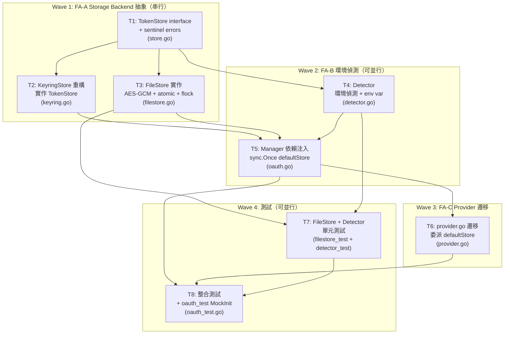

# S3 Implementation Plan: OAuth Headless File Storage

> **階段**: S3 實作計畫
> **建立時間**: 2026-03-26 14:30
> **Agents**: frontend-developer（所有任務）
> **工作類型**: completion（補完）

---

## 1. 概述

### 1.1 功能目標

OAuth 憑證存儲新增 headless 環境自動偵測，在無 keyring 的 VPS/SSH 環境自動降級為加密檔案存儲。引入 `TokenStore` interface 統一存儲抽象，使 backend 切換成為架構能力，同時對所有現有 caller 零修改。

### 1.2 實作範圍

- **範圍內**：
  - FA-A：定義 `TokenStore` interface（9 方法）+ sentinel errors + `KeyringStore` 重構 + `FileStore` 實作（AES-GCM + atomic write + flock + ensurePermissions）
  - FA-B：`Detector` 環境偵測（keyring probe + DISPLAY/SSH_TTY + env var override） + `Manager` 依賴注入重構（`sync.Once` 保護 `defaultStore`）
  - FA-C：`provider.go` 遷移（委派 `defaultStore.SaveProviderToken` 等，保留 package-level 函數簽名）
  - 測試：FileStore 單元測試、Detector 單元測試、整合測試、`oauth_test.go` MockInit 修復
- **範圍外**：跨 backend token 遷移工具、GUI 設定介面、現有 keyring 加密方式變更

### 1.3 關聯文件

| 文件 | 路徑 | 狀態 |
|------|------|------|
| Brief Spec | `./s0_brief_spec.md` | 已完成 |
| Dev Spec | `./s1_dev_spec.md` | 已完成（S2 R2） |
| Implementation Plan | `./s3_implementation_plan.md` | 當前 |

---

## 2. 實作任務清單

### 2.1 任務總覽

| # | 任務 | FA | 類型 | Agent | 依賴 | 複雜度 | TDD | 狀態 |
|---|------|----|------|-------|------|--------|-----|------|
| T1 | 定義 `TokenStore` interface（9 方法）+ sentinel errors | FA-A | 後端 | `frontend-developer` | - | S | N/A | ⬜ |
| T2 | 重構 `KeyringStore` 實作 `TokenStore`（含 provider token 方法） | FA-A | 後端 | `frontend-developer` | T1 | S | ✅ | ⬜ |
| T3 | 實作 `FileStore`（AES-GCM + atomic write + flock + ensurePermissions） | FA-A | 後端 | `frontend-developer` | T1 | L | ✅ | ⬜ |
| T4 | 實作 `Detector`（環境偵測 + env var override） | FA-B | 後端 | `frontend-developer` | T1 | M | ✅ | ⬜ |
| T5 | 重構 `Manager` 依賴注入 + `sync.Once` 保護 `defaultStore` | FA-B | 後端 | `frontend-developer` | T2, T3, T4 | M | ✅ | ⬜ |
| T6 | 遷移 `provider.go`（委派 `defaultStore.SaveProviderToken` 等） | FA-C | 後端 | `frontend-developer` | T5 | S | ✅ | ⬜ |
| T7 | `FileStore` + `Detector` 單元測試 | ALL | 後端測試 | `frontend-developer` | T3, T4 | M | 本身即測試 | ⬜ |
| T8 | 整合測試 + `oauth_test.go` MockInit 修復 | ALL | 後端測試 | `frontend-developer` | T5, T6, T7 | M | 本身即測試 | ⬜ |

**狀態圖例**：
- ⬜ pending（待處理）
- 🔄 in_progress（進行中）
- ✅ completed（已完成）
- ❌ blocked（被阻擋）
- ⏭️ skipped（跳過）

**複雜度**：S（小，<30min）、M（中，30min-2hr）、L（大，>2hr）

**TDD**：✅ = has tdd_plan、N/A = pure interface / 測試任務本身

---

## 3. 任務詳情

### Task T1: 定義 `TokenStore` interface + sentinel errors

**基本資訊**

| 項目 | 內容 |
|------|------|
| 類型 | 後端（Go） |
| Agent | `frontend-developer` |
| 複雜度 | S |
| 依賴 | - |
| 狀態 | ⬜ pending |

**描述**

新增 `internal/auth/store.go`。定義 `TokenStore` interface（9 個方法，分三組：OAuth2 token 3 個、OAuth2 credentials 2 個、provider raw token 4 個）、4 個 sentinel errors。不定義新的 Credentials struct，直接沿用現有型別（`*oauth2.Token`、`*OAuthCredentials`、`string`）。

**輸入**

- 現有 `internal/auth/keyring.go`（確認 `OAuthCredentials` struct 位置與欄位）
- dev_spec §4.1 TokenStore interface 定義（9 個方法）
- dev_spec §4.2 sentinel errors 定義

**輸出**

- `internal/auth/store.go`（新增）：TokenStore interface + 4 個 sentinel errors

**受影響檔案**

| 檔案 | 變更類型 | 說明 |
|------|---------|------|
| `internal/auth/store.go` | 新增 | TokenStore interface（9 方法）+ ErrLockTimeout / ErrCredentialCorrupted / ErrKeyMismatch / ErrNotFound |

**DoD**

- [ ] `store.go` 存在並包含完整 `TokenStore` interface 定義（9 個方法）
- [ ] OAuth2 token 方法使用 `*oauth2.Token`；provider token 方法使用 `string`
- [ ] 無新 `Credentials` struct（不引入語意混淆）
- [ ] 4 個 sentinel errors 定義完整，`errors.Is()` 可比對
- [ ] `go build ./internal/auth/...` 通過
- [ ] `go vet ./internal/auth/...` 無警告

**TDD Plan**: N/A — 純 interface 定義 + sentinel errors，無可測試的執行邏輯；下游任務（T2/T3）透過編譯期驗證 `var _ TokenStore = (...)` 間接驗證此 interface。

**驗證方式**

```bash
cd /Users/dex/YD\ 2026/Archived/references/0323/gwx\ 2603
go build ./internal/auth/...
go vet ./internal/auth/...
```

**實作備註**

- `OAuthCredentials` struct 定義位置：確認在 `keyring.go` 或 `oauth.go`，若在，直接沿用；不搬移
- Interface 方法排序：OAuth2 token → credentials → provider token（三組順序固定，與 doc 一致）
- Sentinel errors 使用 `errors.New()`，不使用 `fmt.Errorf()`（純哨兵值，無動態內容）

---

### Task T2: 重構 `KeyringStore` 實作 `TokenStore`

**基本資訊**

| 項目 | 內容 |
|------|------|
| 類型 | 後端（Go） |
| Agent | `frontend-developer` |
| 複雜度 | S |
| 依賴 | T1 |
| 狀態 | ⬜ pending |

**描述**

修改 `internal/auth/keyring.go`，新增編譯期驗證 `var _ TokenStore = (*KeyringStore)(nil)`。現有 5 個方法（`SaveToken`、`LoadToken`、`DeleteToken`、`SaveCredentials`、`LoadCredentials`）簽名與方法體均不變。新增 4 個 provider token 方法（`SaveProviderToken`、`LoadProviderToken`、`DeleteProviderToken`、`HasProviderToken`），將現有 `provider.go` 的 `go-keyring` 直接呼叫邏輯搬入，key 格式維持 `"provider:{provider}:{account}"`（與現有 keyring 完全相同，確保 token 不遺失）。

**輸入**

- T1 產出的 `store.go`（TokenStore interface）
- 現有 `internal/auth/provider.go`（搬入 keyring 邏輯）
- 現有 `internal/auth/keyring.go`（確認現有 5 個方法實作）

**輸出**

- `internal/auth/keyring.go`（修改）：新增 4 個 provider token 方法 + 編譯期驗證

**受影響檔案**

| 檔案 | 變更類型 | 說明 |
|------|---------|------|
| `internal/auth/keyring.go` | 修改 | 新增 `var _ TokenStore = (*KeyringStore)(nil)` + 4 個 provider token 方法 |

**DoD**

- [ ] `var _ TokenStore = (*KeyringStore)(nil)` 編譯通過（zero-cost 驗證）
- [ ] `KeyringStore` 現有 5 個方法簽名完全不變（方法體不修改）
- [ ] 新增 4 個 provider token 方法，key 格式確認為 `provider:{provider}:{account}`（comment 中記錄）
- [ ] 現有 `oauth_test.go` 中的 KeyringStore 相關測試通過（加 `keyring.MockInit()`）
- [ ] `go build ./internal/auth/...` 通過

**TDD Plan**

| 項目 | 內容 |
|------|------|
| 測試檔案 | `internal/auth/keyring_test.go`（若不存在則新增） |
| 測試指令 | `go test ./internal/auth/ -run TestKeyring -v` |
| 預期失敗測試 | `TestKeyringStore_SaveProviderToken`、`TestKeyringStore_LoadProviderToken`、`TestKeyringStore_DeleteProviderToken`、`TestKeyringStore_HasProviderToken` |

**驗證方式**

```bash
cd /Users/dex/YD\ 2026/Archived/references/0323/gwx\ 2603
go test ./internal/auth/ -run TestKeyring -v
go build ./internal/auth/...
```

**實作備註**

- provider token 的 keyring service name 與現有 `provider.go` 一致（實作前先 grep 現有 keyring service name）
- `HasProviderToken` 返回 bool，不回傳 error；keyring 系統錯誤時 log warning + 回傳 false
- 新增方法後需確認 `KeyringStore` 實作 interface 完整性（編譯期驗證會自動捕捉）

---

### Task T3: 實作 `FileStore`

**基本資訊**

| 項目 | 內容 |
|------|------|
| 類型 | 後端（Go） |
| Agent | `frontend-developer` |
| 複雜度 | L |
| 依賴 | T1 |
| 狀態 | ⬜ pending |

**描述**

新增 `internal/auth/filestore.go`，實作完整 `FileStore`，包含：

1. `machineID()` 跨平台讀取：Linux 讀 `/etc/machine-id`；macOS 用 `syscall.Sysctl("kern.uuid")`（純 Go syscall，無 exec 開銷）；Windows 讀 registry `MachineGuid`；失敗統一 fallback `os.Hostname()`
2. 加密金鑰：`HKDF-SHA256(machineID, salt="gwx-filestore-v1")` → 32 byte AES-256 key
3. 儲存格式：`map[string]string` JSON → AES-256-GCM 加密（12 byte nonce 前置）
4. Key 格式：`"token:{account}"`、`"cred:{name}"`（SR-005：統一 `cred:` 前綴）、`"provider:{provider}:{account}"`
5. `ensurePermissions(path string)`（SR-006）：在每個 Load/Save 入口呼叫，`os.Stat` 檢查，非 0600 自動 `os.Chmod` 修正 + log warning
6. `SaveToken`：JSON marshal → `ensurePermissions` → flock → 加密 → write `.tmp` → rename → chmod 600 → unlock
7. `LoadToken`：`ensurePermissions` → read → GCM Open → JSON unmarshal（失敗 E3/E5 自動刪除並回傳對應 sentinel error）
8. `DeleteToken`：load map → delete key → save map
9. `SaveCredentials` / `LoadCredentials`：`"cred:{name}"` key，JSON marshal/unmarshal `*OAuthCredentials`
10. `SaveProviderToken` / `LoadProviderToken` / `DeleteProviderToken` / `HasProviderToken`：raw string，`"provider:{provider}:{account}"` key
11. 路徑：`os.UserConfigDir() + "/gwx/credentials.enc"`
12. 編譯期驗證：`var _ TokenStore = (*FileStore)(nil)`

**輸入**

- T1 產出的 `store.go`（TokenStore interface + sentinel errors）
- dev_spec §4.2 FileStore 加密格式說明
- dev_spec §4.2 machineID 跨平台策略
- `golang.org/x/crypto`（已在 go.mod indirect，需提升為 direct）

**輸出**

- `internal/auth/filestore.go`（新增）：完整 FileStore 實作

**受影響檔案**

| 檔案 | 變更類型 | 說明 |
|------|---------|------|
| `internal/auth/filestore.go` | 新增 | 完整 FileStore 實作 |
| `go.mod` | 修改 | `golang.org/x/crypto` 從 indirect 提升為 direct |
| `go.sum` | 修改 | `go mod tidy` 後更新 |

**DoD**

- [ ] `var _ TokenStore = (*FileStore)(nil)` 編譯通過
- [ ] `SaveToken` / `LoadToken` 使用 `*oauth2.Token`（JSON marshal/unmarshal 轉換）
- [ ] `SaveCredentials` / `LoadCredentials` 使用 `*OAuthCredentials`（JSON marshal/unmarshal 轉換）
- [ ] `SaveProviderToken` / `LoadProviderToken` 使用 raw string
- [ ] key prefix 統一：`token:`、`cred:`、`provider:`（無 `creds:` 不一致變體）
- [ ] `ensurePermissions()` 在 Load/Save 入口呼叫，既有 644 檔案自動修正為 600 + log warning
- [ ] E1（flock 超時）回傳 `ErrLockTimeout`
- [ ] E3（檔案損毀）`LoadToken` 自動刪除並回傳 `ErrCredentialCorrupted`
- [ ] E5（金鑰不匹配）`LoadToken` 自動刪除並回傳 `ErrKeyMismatch`
- [ ] 檔案權限確認為 0600（`os.Stat` 驗證）
- [ ] atomic rename 確保寫入不產生殘檔（write `.tmp` → rename）
- [ ] macOS `machineID()` 使用 `syscall.Sysctl("kern.uuid")`，無 `exec.Command("ioreg")` 呼叫
- [ ] `golang.org/x/crypto` 在 `go.mod` 提升為 direct dependency
- [ ] `go build ./internal/auth/...` 通過

**TDD Plan**

| 項目 | 內容 |
|------|------|
| 測試檔案 | `internal/auth/filestore_test.go` |
| 測試指令 | `go test ./internal/auth/ -run TestFileStore -v` |
| 預期失敗測試（先寫測試再實作） | `TestFileStore_SaveLoadToken_Roundtrip`、`TestFileStore_SaveLoadCredentials_Roundtrip`、`TestFileStore_SaveLoadProviderToken_Roundtrip`、`TestFileStore_LockTimeout`、`TestFileStore_CorruptedFile`、`TestFileStore_KeyMismatch`、`TestFileStore_ChmodPermissions`、`TestFileStore_EnsurePermissions_Fix644`、`TestFileStore_AtomicWrite` |

> 注意：T7 會補全更多測試案例，T3 先建立骨架（SaveToken/LoadToken/DeleteToken 正常路徑）讓 T3 DoD 可達。

**驗證方式**

```bash
cd /Users/dex/YD\ 2026/Archived/references/0323/gwx\ 2603
go test ./internal/auth/ -run TestFileStore -v
# 手動確認
GWX_CREDENTIAL_BACKEND=file go run ./cmd/gwx auth login
ls -la "$(go env GOPATH)/../.config/gwx/credentials.enc" 2>/dev/null || \
  ls -la "${HOME}/Library/Application Support/gwx/credentials.enc" 2>/dev/null
```

**實作備註**

- flock 使用 `syscall.Flock()` 或 `golang.org/x/sys/unix.Flock()`（確認 go.mod 是否已有 `x/sys`）
- `golang.org/x/crypto/hkdf` 用於金鑰派生
- 測試使用 `t.TempDir()` 覆蓋 FileStore 路徑，不寫入真實 `os.UserConfigDir()`
- machineID fallback 順序必須有測試（模擬 `/etc/machine-id` 不存在）

---

### Task T4: 實作 `Detector`

**基本資訊**

| 項目 | 內容 |
|------|------|
| 類型 | 後端（Go） |
| Agent | `frontend-developer` |
| 複雜度 | M |
| 依賴 | T1 |
| 狀態 | ⬜ pending |

**描述**

新增 `internal/auth/detector.go`，實作 `SelectBackend() TokenStore`（不回傳 error，失敗時 log warning + fallback FileStore）。

偵測邏輯（優先順序）：
1. 檢查 `GWX_CREDENTIAL_BACKEND` env var：`"file"` → `&FileStore{}`、`"keyring"` → `&KeyringStore{}`；其他值 log warning + fallback
2. 若未設定：呼叫 `go-keyring.Get("gwx-probe", "probe")`，只看系統層錯誤（忽略 `ErrNotFound`）
3. keyring 可用 → `&KeyringStore{}`
4. keyring 不可用 → 檢查 `DISPLAY` env var；無 DISPLAY 或有 `SSH_TTY`/`SSH_CONNECTION` → `&FileStore{}`
5. 有 DISPLAY 無 SSH → 再次 keyring probe → 可用 `&KeyringStore{}` / 不可用 `&FileStore{}`

**輸入**

- T1 產出的 `store.go`（TokenStore interface）
- T3 產出（FileStore struct 型別，用於建立實例）
- T2 產出（KeyringStore struct 型別）
- `zalando/go-keyring`（已有，用於 probe）

**輸出**

- `internal/auth/detector.go`（新增）：`SelectBackend() TokenStore` 實作

**受影響檔案**

| 檔案 | 變更類型 | 說明 |
|------|---------|------|
| `internal/auth/detector.go` | 新增 | SelectBackend() 環境偵測邏輯 |

**DoD**

- [ ] `GWX_CREDENTIAL_BACKEND=file` 強制回傳 `*FileStore`（編譯型別正確）
- [ ] `GWX_CREDENTIAL_BACKEND=keyring` 強制回傳 `*KeyringStore`
- [ ] keyring probe 失敗且無 `DISPLAY` → 回傳 `*FileStore`
- [ ] keyring probe 成功 → 回傳 `*KeyringStore`
- [ ] 無效的 `GWX_CREDENTIAL_BACKEND` 值 → log warning + fallback `*FileStore`（不 panic，不中止）
- [ ] `SSH_TTY` 或 `SSH_CONNECTION` 有值時 → 回傳 `*FileStore`
- [ ] `go build ./internal/auth/...` 通過

**TDD Plan**

| 項目 | 內容 |
|------|------|
| 測試檔案 | `internal/auth/detector_test.go` |
| 測試指令 | `go test ./internal/auth/ -run TestDetector -v` |
| 預期失敗測試 | `TestDetector_EnvVarFile`、`TestDetector_EnvVarKeyring`、`TestDetector_EnvVarInvalid`、`TestDetector_SSHSession`、`TestDetector_NoDisplay_NoKeyring`、`TestDetector_KeyringAvailable` |

> T7 會補全更多 Detector 測試場景，T4 先確保 env var override 路徑通過。

**驗證方式**

```bash
cd /Users/dex/YD\ 2026/Archived/references/0323/gwx\ 2603
go test ./internal/auth/ -run TestDetector -v
GWX_CREDENTIAL_BACKEND=file go test ./internal/auth/ -run TestDetector -v
```

**實作備註**

- Detector 測試需要控制環境變數（`t.Setenv()`）和 keyring mock（`keyring.MockInit()`）
- keyring probe 的 service name 建議用 `"gwx-probe"`、user 用 `"probe"`（與現有 codebase 慣例確認）
- `SelectBackend()` 是 package-level 函數，不是 struct method

---

### Task T5: 重構 `Manager` 依賴注入

**基本資訊**

| 項目 | 內容 |
|------|------|
| 類型 | 後端（Go） |
| Agent | `frontend-developer` |
| 複雜度 | M |
| 依賴 | T2, T3, T4 |
| 狀態 | ⬜ pending |

**描述**

修改 `internal/auth/oauth.go`：

- `Manager.store` 欄位型別從 `*KeyringStore` 改為 `TokenStore` interface
- **保留** `NewManager() *Manager` 無參數簽名（8+ caller 不變）；內部呼叫 `SelectBackend()` 自動偵測並注入 store
- 新增 `NewManagerWithStore(store TokenStore) *Manager`（供測試注入，不影響現有 caller）
- `NewManager()` 完成後透過 `sync.Once` 設定 `auth.defaultStore = store`（SR-003：防止並發 race condition）
- `LoadConfigFromKeyring` 保留原方法名，新增 `// Deprecated: use LoadConfigFromStore` comment
- 新增 `LoadConfigFromStore`（與 `LoadConfigFromKeyring` 邏輯相同的通用名稱）
- `TokenSource()` 驗證確認：`LoadConfigFromKeyring` 底層走 `m.store.LoadCredentials`，非繞過 TokenStore

**輸入**

- T2 產出（KeyringStore 完整實作 TokenStore）
- T3 產出（FileStore 完整實作 TokenStore）
- T4 產出（Detector.SelectBackend()）
- 現有 `internal/auth/oauth.go`（Manager 結構、現有方法實作）

**輸出**

- `internal/auth/oauth.go`（修改）：Manager.store 型別更改 + 新增方法 + sync.Once

**受影響檔案**

| 檔案 | 變更類型 | 說明 |
|------|---------|------|
| `internal/auth/oauth.go` | 修改 | Manager.store 改為 TokenStore interface；新增 NewManagerWithStore；sync.Once 保護 defaultStore；LoadConfigFromKeyring 加 Deprecated comment；新增 LoadConfigFromStore |

**DoD**

- [ ] `Manager.store` 型別為 `TokenStore`（interface）
- [ ] `NewManager()` 保持無參數簽名，回傳 `*Manager`（無 error 回傳）
- [ ] `NewManagerWithStore(store TokenStore) *Manager` 存在
- [ ] `LoadConfigFromKeyring` 仍存在（不破壞 `root.go` 的 `EnsureAuth`）
- [ ] `auth.defaultStore` 在 Manager 初始化後透過 `sync.Once` 被設定
- [ ] `TokenSource()` 內部邏輯驗證：確認 `LoadConfigFromKeyring` 底層走 `m.store.LoadCredentials`，非繞過 TokenStore 直接讀 keyring
- [ ] 所有現有 `oauth_test.go` 測試通過
- [ ] `go build ./...` 通過（包含 cmd/ 和 mcp/ 層）
- [ ] `go test -race ./internal/auth/...` 無 race condition

**TDD Plan**

| 項目 | 內容 |
|------|------|
| 測試檔案 | `internal/auth/oauth_test.go`（修改現有） |
| 測試指令 | `go test -race ./internal/auth/ -run TestManager -v` |
| 預期失敗測試 | `TestManager_NewManagerWithStore`、`TestManager_DefaultStore_SyncOnce`、`TestManager_TokenSource_UsesTokenStore` |

**驗證方式**

```bash
cd /Users/dex/YD\ 2026/Archived/references/0323/gwx\ 2603
go build ./...
go test -race ./internal/auth/ -v
```

**實作備註**

- `defaultStore` 宣告位置：package-level `var defaultStore TokenStore`（在 `oauth.go` 或 `store.go` 頂部）
- `sync.Once` 搭配方式：`var initOnce sync.Once`，在 `NewManager()` 內 `initOnce.Do(func() { defaultStore = store })`
- `HasProviderToken` 在 `defaultStore == nil` 時安全回傳 false（T6 實作，此處確認 nil guard 設計）

---

### Task T6: 遷移 `provider.go`

**基本資訊**

| 項目 | 內容 |
|------|------|
| 類型 | 後端（Go） |
| Agent | `frontend-developer` |
| 複雜度 | S |
| 依賴 | T5 |
| 狀態 | ⬜ pending |

**描述**

修改 `internal/auth/provider.go`：

- 移除 `go-keyring` import
- 4 個 package-level 函數（`SaveProviderToken`、`LoadProviderToken`、`DeleteProviderToken`、`HasProviderToken`）改為委派至 `defaultStore.SaveProviderToken` 等
- **保留外部簽名不變**（零 caller 變更）
- `HasProviderToken` wrapper：`defaultStore == nil` 時安全回傳 `false`（防 init ordering 問題）

**輸入**

- T5 產出（`defaultStore TokenStore` package-level 變數已設定）
- 現有 `internal/auth/provider.go`（現有 4 個函數實作）

**輸出**

- `internal/auth/provider.go`（修改）：4 個函數委派 defaultStore，移除 go-keyring import

**受影響檔案**

| 檔案 | 變更類型 | 說明 |
|------|---------|------|
| `internal/auth/provider.go` | 修改 | 4 個函數改為委派 defaultStore；移除 go-keyring import |

**DoD**

- [ ] `provider.go` 不再 import `zalando/go-keyring`
- [ ] 4 個函數簽名完全不變（入參與回傳型別均不變）
- [ ] `HasProviderToken` 在 `defaultStore == nil` 時回傳 false，不 panic
- [ ] FA-C 遷移前後，FileStore 與 KeyringStore 使用相同 key 格式（`provider:{provider}:{account}`）
- [ ] `go build ./...` 通過
- [ ] 所有 `provider_test.go` 測試通過（若存在）

**TDD Plan**

| 項目 | 內容 |
|------|------|
| 測試檔案 | `internal/auth/provider_test.go`（若不存在則新增） |
| 測試指令 | `go test ./internal/auth/ -run TestProvider -v` |
| 預期失敗測試 | `TestProvider_SaveLoadProviderToken_FileStore`、`TestProvider_HasProviderToken_NilDefaultStore`、`TestProvider_DeleteProviderToken` |

**驗證方式**

```bash
cd /Users/dex/YD\ 2026/Archived/references/0323/gwx\ 2603
go test ./internal/auth/ -run TestProvider -v
grep "go-keyring" internal/auth/provider.go && echo "FAIL: still imports" || echo "OK: no go-keyring import"
go build ./...
```

**實作備註**

- `defaultStore == nil` guard 只加在 `HasProviderToken`（回傳 false）；其他三個函數 `defaultStore == nil` 時傳遞正常錯誤（`ErrNotFound` 或返回 error）
- provider.go 修改後執行 `go mod tidy` 確認 `go-keyring` 仍在 go.mod（KeyringStore 仍使用）

---

### Task T7: `FileStore` + `Detector` 單元測試

**基本資訊**

| 項目 | 內容 |
|------|------|
| 類型 | 後端測試 |
| Agent | `frontend-developer` |
| 複雜度 | M |
| 依賴 | T3, T4 |
| 狀態 | ⬜ pending |

**描述**

補全 `filestore_test.go` 和 `detector_test.go` 的完整測試場景：

**filestore_test.go** 覆蓋（9 個場景）：
- `TestFileStore_SaveLoadToken_Roundtrip`：`*oauth2.Token` 完整 roundtrip（AccessToken, RefreshToken, Expiry 均正確）
- `TestFileStore_SaveLoadCredentials_Roundtrip`：`*OAuthCredentials` roundtrip
- `TestFileStore_SaveLoadProviderToken_Roundtrip`：raw string provider token roundtrip
- `TestFileStore_LockTimeout`：模擬 flock 超時 → `ErrLockTimeout`
- `TestFileStore_CorruptedFile`：寫入損毀 bytes → `ErrCredentialCorrupted` + 自動刪除
- `TestFileStore_KeyMismatch`：不同 machineID 解密 → `ErrKeyMismatch` + 自動刪除
- `TestFileStore_ChmodPermissions`：save 後確認檔案權限為 0600
- `TestFileStore_EnsurePermissions_Fix644`：預先建立 644 檔案 → load/save 後自動修正為 600
- `TestFileStore_AtomicWrite`：write 期間中斷不產生殘檔（`.tmp` 不存在）

**detector_test.go** 覆蓋（4 個情境）：
- `TestDetector_EnvVarFile`：`GWX_CREDENTIAL_BACKEND=file` → `*FileStore`
- `TestDetector_EnvVarKeyring`：`GWX_CREDENTIAL_BACKEND=keyring` → `*KeyringStore`
- `TestDetector_EnvVarInvalid`：非法值 → `*FileStore`（log warning）
- `TestDetector_SSHSession`：`SSH_TTY` 有值 → `*FileStore`

**輸入**

- T3 產出（FileStore 完整實作）
- T4 產出（Detector.SelectBackend()）

**輸出**

- `internal/auth/filestore_test.go`（新增或補全）
- `internal/auth/detector_test.go`（新增或補全）

**受影響檔案**

| 檔案 | 變更類型 | 說明 |
|------|---------|------|
| `internal/auth/filestore_test.go` | 新增 | 9 個測試場景 |
| `internal/auth/detector_test.go` | 新增 | 4 個情境測試 |

**DoD**

- [ ] `filestore_test.go` 覆蓋上述 9 個場景（含 provider token string roundtrip + ensurePermissions）
- [ ] `detector_test.go` 覆蓋上述 4 個情境
- [ ] `go test ./internal/auth/ -v -run TestFileStore` 全部通過
- [ ] `go test ./internal/auth/ -v -run TestDetector` 全部通過
- [ ] 測試不依賴真實 keyring（使用 `keyring.MockInit()` 或 `t.Setenv("GWX_CREDENTIAL_BACKEND", "file")`）
- [ ] FileStore 測試使用 `t.TempDir()` 隔離路徑，不寫入真實 `os.UserConfigDir()`

**TDD Plan**: 本任務本身就是測試任務，執行 `go test ./internal/auth/ -v -run 'TestFileStore|TestDetector'` 全部通過即為完成。

**驗證方式**

```bash
cd /Users/dex/YD\ 2026/Archived/references/0323/gwx\ 2603
go test ./internal/auth/ -v -run TestFileStore
go test ./internal/auth/ -v -run TestDetector
go test ./internal/auth/ -count=1
```

**實作備註**

- `TestFileStore_LockTimeout`：可用 goroutine 持鎖 + 超短 timeout 模擬；FileStore 需提供可注入 timeout 的選項（或使用 build tag 縮短 timeout）
- `TestFileStore_KeyMismatch`：用不同 salt 或手動寫入亂數 bytes 模擬跨機器 key 不匹配
- Detector 測試需要 `t.Setenv()` 控制 env var（測試結束後自動還原）

---

### Task T8: 整合測試 + `oauth_test.go` MockInit 修復

**基本資訊**

| 項目 | 內容 |
|------|------|
| 類型 | 後端測試 |
| Agent | `frontend-developer` |
| 複雜度 | M |
| 依賴 | T5, T6, T7 |
| 狀態 | ⬜ pending |

**描述**

修復 `oauth_test.go` + 補充整合測試：

1. 在 `oauth_test.go` 頂層加入 `func init() { keyring.MockInit() }` 確保 headless CI 可執行
2. 整合測試：端到端流程（`NewManagerWithStore(mockStore)` → `SaveToken` → `LoadToken` → `DeleteToken`），分別以 FileStore 和 KeyringStore（Mock）模式執行
3. 整合測試：`provider.go` 函數在 FileStore backend 下的 roundtrip（raw string token）
4. 驗證 `TokenSource()` 底層不繞過 TokenStore（使用 `NewManagerWithStore` 注入 mock store，確認 mock 方法被呼叫）
5. 驗證 10 個 indirect caller 編譯無誤（`go build ./internal/cmd/... ./internal/mcp/...`）

**輸入**

- T5 產出（NewManagerWithStore）
- T6 產出（provider.go 遷移完成）
- T7 產出（所有單元測試通過）
- 現有 `internal/auth/oauth_test.go`

**輸出**

- `internal/auth/oauth_test.go`（修改）：加 MockInit + 整合測試

**受影響檔案**

| 檔案 | 變更類型 | 說明 |
|------|---------|------|
| `internal/auth/oauth_test.go` | 修改 | 加 keyring.MockInit() + 整合測試 |

**DoD**

- [ ] `oauth_test.go` 加入 `keyring.MockInit()`，CI headless 不再失敗
- [ ] 整合測試使用 `NewManagerWithStore()` 注入 mock，不依賴真實偵測邏輯
- [ ] 整合測試覆蓋 FileStore + KeyringStore 兩種 backend 路徑
- [ ] provider token roundtrip 在 FileStore backend 下通過（raw string 正確存取）
- [ ] `TokenSource()` 測試確認 `LoadCredentials` 透過 TokenStore 呼叫，非繞過
- [ ] `go build ./...` 完整編譯通過（含 10 個 indirect caller）
- [ ] `GWX_CREDENTIAL_BACKEND=file go test -race ./... -count=1` 全部通過

**TDD Plan**: 本任務本身就是測試任務，最終驗收指令為 `GWX_CREDENTIAL_BACKEND=file go test -race ./... -count=1` 全部通過。

**驗證方式**

```bash
cd /Users/dex/YD\ 2026/Archived/references/0323/gwx\ 2603
go build ./...
go test ./internal/auth/ -v -run TestIntegration
GWX_CREDENTIAL_BACKEND=file go test -race ./... -count=1
```

**實作備註**

- Mock store 可使用簡單的 in-memory `map` 實作 TokenStore interface（不需要第三方 mock 框架）
- `TokenSource()` 測試：注入可記錄呼叫的 mock store，觸發 `TokenSource()`，確認 `LoadCredentials` 方法被呼叫
- `go test -race` 需在 CI headless 環境模擬（`DISPLAY=` 或 `GWX_CREDENTIAL_BACKEND=file` 強制 FileStore）

---

## 4. 依賴關係圖



---

## 5. 執行順序與 Agent 分配

### 5.1 執行波次

| 波次 | 任務 | Agent | 可並行 | 備註 |
|------|------|-------|--------|------|
| Wave 1 | T1 | `frontend-developer` | 否（起點） | 無依賴，先行 |
| Wave 1 | T2 | `frontend-developer` | 否（T1 後） | 依賴 T1 |
| Wave 1 | T3 | `frontend-developer` | 否（T1 後，可與 T2 並行） | 依賴 T1；與 T2 可並行（不互相依賴） |
| Wave 2 | T4 | `frontend-developer` | 是（與 T5 前置準備並行） | 依賴 T1；可在 T2/T3 完成前開始 |
| Wave 2 | T5 | `frontend-developer` | 否（等待 T2+T3+T4） | 依賴 T2, T3, T4 全部完成 |
| Wave 3 | T6 | `frontend-developer` | 否（T5 後） | 依賴 T5 |
| Wave 4 | T7 | `frontend-developer` | 是（與 T8 並行） | 依賴 T3, T4；T8 需等 T7 |
| Wave 4 | T8 | `frontend-developer` | 否（T7 後） | 依賴 T5, T6, T7 |

> **並行說明**：T2 + T3 均依賴 T1，彼此不相依，可並行開始。T4 依賴 T1（不依賴 T2/T3），可在 T2/T3 進行中同時開始。T7 + T8 理論上可並行開始（T7 依賴 T3/T4，T8 依賴 T5/T6/T7），但因 T8 依賴 T7，實際上 T7 需先完成。

### 5.2 Agent 調度指令

```
# Wave 1a: T1（無依賴，立即開始）
Task(
  subagent_type: "frontend-developer",
  prompt: "實作 T1：新增 internal/auth/store.go，定義 TokenStore interface（9 方法）+ 4 個 sentinel errors。\n\n參考 dev_spec: dev/specs/2026-03-26_1_oauth-headless-file-storage/s1_dev_spec.md §5.2 Task T1\n\nDoD:\n- store.go 存在並包含完整 TokenStore interface 定義（9 個方法）\n- OAuth2 token 方法使用 *oauth2.Token；provider token 方法使用 string\n- 無新 Credentials struct\n- 4 個 sentinel errors 定義完整（errors.Is() 可比對）\n- go build ./internal/auth/... 通過",
  description: "S3-T1 TokenStore interface 定義"
)

# Wave 1b: T2（T1 完成後）
Task(
  subagent_type: "frontend-developer",
  prompt: "實作 T2：修改 internal/auth/keyring.go，新增 var _ TokenStore = (*KeyringStore)(nil) + 4 個 provider token 方法。\n\n參考 dev_spec §5.2 Task T2\n\nDoD:\n- var _ TokenStore = (*KeyringStore)(nil) 編譯通過\n- KeyringStore 現有 5 個方法簽名完全不變\n- 新增 4 個 provider token 方法，key 格式為 provider:{provider}:{account}\n- go build ./internal/auth/... 通過\n\nTDD：go test ./internal/auth/ -run TestKeyring -v",
  description: "S3-T2 KeyringStore 重構"
)

# Wave 1b: T3（T1 完成後，可與 T2 並行）
Task(
  subagent_type: "frontend-developer",
  prompt: "實作 T3：新增 internal/auth/filestore.go，完整 FileStore 實作（AES-GCM + atomic write + flock + ensurePermissions）。\n\n參考 dev_spec §5.2 Task T3\n\nDoD:\n- var _ TokenStore = (*FileStore)(nil) 編譯通過\n- machineID() macOS 用 syscall.Sysctl(\"kern.uuid\")\n- key prefix 統一：token:、cred:、provider:\n- ensurePermissions() 在 Load/Save 入口呼叫\n- ErrLockTimeout / ErrCredentialCorrupted / ErrKeyMismatch 正確回傳\n- golang.org/x/crypto 提升為 direct dependency\n- go build ./internal/auth/... 通過\n\nTDD：go test ./internal/auth/ -run TestFileStore -v",
  description: "S3-T3 FileStore 實作"
)

# Wave 2a: T4（T1 完成後，可與 T2/T3 並行）
Task(
  subagent_type: "frontend-developer",
  prompt: "實作 T4：新增 internal/auth/detector.go，實作 SelectBackend() TokenStore。\n\n參考 dev_spec §5.2 Task T4\n\nDoD:\n- GWX_CREDENTIAL_BACKEND=file 強制 FileStore\n- GWX_CREDENTIAL_BACKEND=keyring 強制 KeyringStore\n- keyring probe 失敗且無 DISPLAY → FileStore\n- SSH_TTY 有值 → FileStore\n- 無效 GWX_CREDENTIAL_BACKEND → log warning + FileStore\n- go build ./internal/auth/... 通過\n\nTDD：go test ./internal/auth/ -run TestDetector -v",
  description: "S3-T4 Detector 環境偵測"
)

# Wave 2b: T5（T2 + T3 + T4 完成後）
Task(
  subagent_type: "frontend-developer",
  prompt: "實作 T5：修改 internal/auth/oauth.go，Manager 依賴注入重構 + sync.Once 保護 defaultStore。\n\n參考 dev_spec §5.2 Task T5\n\nDoD:\n- Manager.store 型別為 TokenStore interface\n- NewManager() 保持無參數簽名，回傳 *Manager\n- NewManagerWithStore(store TokenStore) *Manager 存在\n- LoadConfigFromKeyring 仍存在\n- auth.defaultStore 透過 sync.Once 設定\n- go build ./... 通過\n- go test -race ./internal/auth/... 無 race condition",
  description: "S3-T5 Manager 依賴注入"
)

# Wave 3: T6（T5 完成後）
Task(
  subagent_type: "frontend-developer",
  prompt: "實作 T6：修改 internal/auth/provider.go，4 個函數委派 defaultStore，移除 go-keyring import。\n\n參考 dev_spec §5.2 Task T6\n\nDoD:\n- provider.go 不再 import zalando/go-keyring\n- 4 個函數簽名完全不變\n- HasProviderToken 在 defaultStore == nil 時回傳 false\n- go build ./... 通過\n\nTDD：go test ./internal/auth/ -run TestProvider -v\n驗證：grep \"go-keyring\" internal/auth/provider.go && echo FAIL || echo OK",
  description: "S3-T6 provider.go 遷移"
)

# Wave 4a: T7（T3 + T4 完成後）
Task(
  subagent_type: "frontend-developer",
  prompt: "實作 T7：補全 filestore_test.go（9 個場景）和 detector_test.go（4 個情境）。\n\n參考 dev_spec §5.2 Task T7 + s3_implementation_plan.md Task T7\n\nDoD:\n- filestore_test.go 覆蓋 9 個場景（Token/Credentials/ProviderToken roundtrip + 錯誤路徑 + 權限驗證）\n- detector_test.go 覆蓋 4 個情境（env var file/keyring/invalid + SSH session）\n- 測試使用 t.TempDir() 隔離路徑\n- go test ./internal/auth/ -count=1 全部通過",
  description: "S3-T7 FileStore + Detector 單元測試"
)

# Wave 4b: T8（T5 + T6 + T7 完成後）
Task(
  subagent_type: "frontend-developer",
  prompt: "實作 T8：修復 oauth_test.go（加 keyring.MockInit()）+ 補充整合測試。\n\n參考 dev_spec §5.2 Task T8\n\nDoD:\n- oauth_test.go 加入 func init() { keyring.MockInit() }\n- 整合測試覆蓋 FileStore + KeyringStore 兩種 backend\n- provider token roundtrip 在 FileStore backend 下通過\n- TokenSource() 確認走 TokenStore\n- go build ./... 通過\n- GWX_CREDENTIAL_BACKEND=file go test -race ./... -count=1 全部通過",
  description: "S3-T8 整合測試 + MockInit 修復"
)
```

---

## 6. 驗證計畫

### 6.1 逐任務驗證

| 任務 | 驗證指令 | 預期結果 |
|------|---------|---------|
| T1 | `go build ./internal/auth/... && go vet ./internal/auth/...` | 無錯誤，無警告 |
| T2 | `go test ./internal/auth/ -run TestKeyring -v` | 全部通過 |
| T3 | `go test ./internal/auth/ -run TestFileStore -v` | 全部通過 |
| T4 | `go test ./internal/auth/ -run TestDetector -v` | 全部通過 |
| T5 | `go build ./... && go test -race ./internal/auth/ -v` | build 成功，race-free |
| T6 | `go test ./internal/auth/ -run TestProvider -v` + `grep "go-keyring" internal/auth/provider.go` | 測試通過，grep 無結果 |
| T7 | `go test ./internal/auth/ -count=1 -v` | 全部通過（含 filestore + detector） |
| T8 | `GWX_CREDENTIAL_BACKEND=file go test -race ./... -count=1` | 全部通過，race-free |

### 6.2 整體驗證

```bash
cd /Users/dex/YD\ 2026/Archived/references/0323/gwx\ 2603

# 1. 完整編譯（含所有 10 個 indirect caller）
go build ./...

# 2. 靜態分析
go vet ./...

# 3. CGO-free 編譯（非功能驗收）
CGO_ENABLED=0 go build ./...

# 4. 完整測試（headless 模式，無真實 keyring 依賴）
GWX_CREDENTIAL_BACKEND=file go test -race ./... -count=1

# 5. Race detector 確認
go test -race ./internal/auth/... -count=1

# 6. 編譯期 TokenStore 實作驗證（含於 go build 中）
# 確認 var _ TokenStore = (*KeyringStore)(nil) 和 var _ TokenStore = (*FileStore)(nil) 均通過
```

### 6.3 驗收標準對照

| AC | 驗收場景 | 驗證任務 | 驗證方式 |
|----|---------|---------|---------|
| AC-1 | headless 環境自動選 FileStore | T4, T8 | `DISPLAY= GWX_CREDENTIAL_BACKEND=file go test ./... -count=1` |
| AC-2 | 桌面環境 keyring 行為不變 | T5, T8 | `go test ./internal/auth/ -run TestIntegration_KeyringBackend -v` |
| AC-3 | env var 強制 file | T4, T7 | `GWX_CREDENTIAL_BACKEND=file go test ./internal/auth/ -run TestDetector_EnvVarFile -v` |
| AC-4 | env var 強制 keyring | T4, T7 | `GWX_CREDENTIAL_BACKEND=keyring go test ./internal/auth/ -run TestDetector_EnvVarKeyring -v` |
| AC-5 | keyring 故障 fallback | T4, T7 | `go test ./internal/auth/ -run TestDetector_NoDisplay_NoKeyring -v` |
| AC-6 | credential 檔案 chmod 600 | T3, T7 | `go test ./internal/auth/ -run TestFileStore_EnsurePermissions -v` |
| AC-7 | 多進程 flock 超時 | T3, T7 | `go test ./internal/auth/ -run TestFileStore_LockTimeout -v` |
| AC-8 | 檔案損毀清除重授權 | T3, T7 | `go test ./internal/auth/ -run TestFileStore_CorruptedFile -v` |
| AC-9 | 金鑰不匹配 | T3, T7 | `go test ./internal/auth/ -run TestFileStore_KeyMismatch -v` |
| AC-10 | provider token 零 caller 變更 | T6, T8 | `go build ./...` 編譯通過 |
| AC-11 | SSH session 自動選 FileStore | T4, T7 | `go test ./internal/auth/ -run TestDetector_SSHSession -v` |
| AC-12 | NewManager() 簽名不變 | T5, T8 | `go build ./...` 編譯通過 |
| AC-13 | defaultStore 並發安全 | T5, T8 | `go test -race ./internal/auth/... -count=1` |

---

## 7. 實作進度追蹤

### 7.1 進度總覽

| 指標 | 數值 |
|------|------|
| 總任務數 | 8 |
| 已完成 | 0 |
| 進行中 | 0 |
| 待處理 | 8 |
| 完成率 | 0% |

### 7.2 時間軸

| 時間 | 事件 | 備註 |
|------|------|------|
| 2026-03-26 14:30 | S3 實作計畫產出 | |
| | | |

---

## 8. 變更記錄

### 8.1 檔案變更清單

```
新增：
  internal/auth/store.go        （T1）
  internal/auth/filestore.go    （T3）
  internal/auth/detector.go     （T4）
  internal/auth/filestore_test.go  （T7）
  internal/auth/detector_test.go   （T7）

修改：
  internal/auth/keyring.go      （T2）
  internal/auth/oauth.go        （T5）
  internal/auth/provider.go     （T6）
  internal/auth/oauth_test.go   （T8）
  go.mod                        （T3：golang.org/x/crypto 提升為 direct）
  go.sum                        （T3：go mod tidy 更新）

不變（僅驗證相容性）：
  internal/cmd/root.go
  internal/cmd/onboard.go
  internal/cmd/auth.go
  internal/cmd/doctor.go
  internal/cmd/github.go
  internal/cmd/slack.go
  internal/cmd/notion.go
  internal/mcp/tools_github.go
  internal/mcp/tools_slack.go
  internal/mcp/tools_notion.go
```

### 8.2 Commit 記錄

| Commit | 訊息 | 關聯任務 |
|--------|------|---------|
| | | |

---

## 9. 風險與問題追蹤

### 9.1 已識別風險

| # | 風險 | 影響 | 緩解措施 | 狀態 |
|---|------|------|---------|------|
| R1 | machineID() 在特定 Linux 發行版讀取失敗 | 中 | fallback 到 os.Hostname()；T7 覆蓋 /etc/machine-id 不存在場景 | 監控中 |
| R2 | flock 在 NFS/網路磁碟上行為不一致 | 低 | 文件說明 XDG_CONFIG_HOME 應指向本地磁碟；列為已知限制 | 接受 |
| R3 | defaultStore 在 Manager 初始化前被呼叫（init ordering） | 中 | sync.Once 保護；HasProviderToken nil guard；T5+T6 DoD 驗證 | 監控中 |
| R4 | TokenSource() 繞過 TokenStore 直接讀 keyring | 中 | T5 DoD 明確驗證點；T8 整合測試確認呼叫路徑 | 監控中 |
| R5 | golang.org/x/crypto 提升 direct 影響 go.sum | 低 | go mod tidy 後確認 go.sum 無衝突（T3 DoD 包含） | 低風險 |

### 9.2 問題記錄

| # | 問題 | 發現時間 | 狀態 | 解決方案 |
|---|------|---------|------|---------|
| | | | | |

---

## 10. E2E Test Plan

> 本功能為純 Go 後端套件重構，無 UI 層，不適用 Flutter E2E 測試框架。

### 10.1 手動驗證清單

| TC-ID | 描述 | 環境 | 預期結果 |
|-------|------|------|---------|
| TC-1 | headless Docker 環境 gwx auth login | Docker（無 DISPLAY/keyring） | credentials.enc 建立，chmod 0600 |
| TC-2 | SSH session 環境 gwx auth login | SSH（SSH_TTY 有值） | credentials.enc 建立 |
| TC-3 | 桌面環境 gwx auth login（現有行為不變） | macOS Desktop + keyring | keyring 存儲，無 credentials.enc |
| TC-4 | GWX_CREDENTIAL_BACKEND=file gwx auth login | 任意環境 | credentials.enc 建立，忽略 keyring |
| TC-5 | credentials.enc 損毀後執行任何 gwx 指令 | FileStore 模式 | 自動刪除，提示重新授權 |

---

## 附錄

### A. 相關文件

- S0 Brief Spec: `./s0_brief_spec.md`
- S1 Dev Spec: `./s1_dev_spec.md`（S2 R2 最終版）
- SDD Context: `./sdd_context.json`

### B. 關鍵技術參考

- `golang.org/x/crypto/hkdf`：金鑰派生（HKDF-SHA256）
- `syscall.Sysctl("kern.uuid")`：macOS machineID 讀取
- `syscall.Flock()`：Go 原生 flock（Linux/macOS）
- `zalando/go-keyring v0.2.6`：現有 keyring 操作（保留，不升級）
- `keyring.MockInit()`：測試用 in-memory keyring mock

### C. Go 命名規範（本 Repo）

- interface 命名：`TokenStore`（動作+名詞，ToolCaller / Handler 慣例）
- error wrap 格式：`fmt.Errorf("context: %w", err)`
- env var 命名：`GWX_` 前綴（如 `GWX_CREDENTIAL_BACKEND`）
- test 方法格式：`TestXxx_Yyy`（e.g., `TestFileStore_SaveToken`）
- 測試路徑隔離：`t.TempDir()` + `t.Setenv()`
