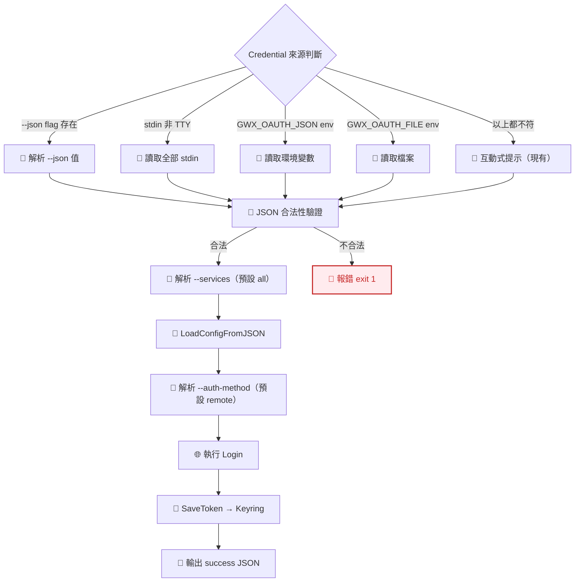

# S0 Brief Spec: gwx onboard JSON 直貼模式

> **階段**: S0 需求討論
> **建立時間**: 2026-03-27 12:00
> **Agent**: requirement-analyst
> **Spec Mode**: Quick
> **工作類型**: enhancement

---

## 0. 工作類型

**本次工作類型**：`enhancement`（補完現有 onboard 功能）

## 1. 一句話描述

gwx onboard 新增 `--json` flag 和 stdin pipe 兩種方式，讓 VPS 用戶可以不透過檔案上傳或互動式貼上，直接用 CLI 參數或 pipe 完成 OAuth credentials 導入。

## 2. 為什麼要做

### 2.1 痛點

- **SSH 傳檔困難**：VPS 用戶不熟 scp/sftp，無法方便地將 OAuth JSON 傳到伺服器
- **互動式 stdin 不穩定**：現有貼 JSON 在 tmux/screen/SSH tunnel 會斷行截斷
- **環境變數太囉嗦**：`GWX_OAUTH_JSON=...` 設定步驟多，自動化腳本不直觀
- **Agent 需要程式化介面**：Claude Code 等 AI Agent 透過 MCP 呼叫 gwx 需要 flag-based 非互動介面

### 2.2 目標

- VPS 用戶可用一行指令完成 onboard
- 自動化腳本可用 pipe 或 flag 無互動完成 onboard
- 現有互動模式和環境變數模式不受影響

## 3. 使用者

| 角色 | 說明 |
|------|------|
| VPS 終端用戶 | SSH 進 VPS，手動執行 `gwx onboard --json '{...}'` |
| 自動化腳本 | CI/CD、Ansible、Docker entrypoint 中用 pipe 或 flag |
| AI Agent | Claude Code 等 Agent 在 MCP 中程式化呼叫 gwx |

## 4. 核心流程

### 4.0 功能區拆解

| FA ID | 功能區名稱 | 一句話描述 | 入口 | 獨立性 |
|-------|-----------|-----------|------|--------|
| FA-A | Onboard Credential Input | 新增 --json flag 和 stdin pipe 作為 credential 來源 | `gwx onboard --json` 或 `pipe | gwx onboard` | 低 |

**本次策略**：`single_sop`

### 4.2 FA-A: Onboard Credential Input

#### 全局流程圖

**Credential 來源優先序**（由高到低）：
1. `--json` flag（最高）
2. stdin pipe（偵測 stdin 非 TTY）
3. `GWX_OAUTH_JSON` 環境變數
4. `GWX_OAUTH_FILE` 環境變數
5. 互動式提示（最低，現有行為不變）

#### 新增 CLI Flags

| Flag | 類型 | 預設值 | 說明 |
|------|------|--------|------|
| `--json` | string | "" | OAuth credentials JSON 字串 |
| `--services` | string | "" (= all) | 逗號分隔服務清單 |
| `--auth-method` | string | "remote" | 登入方式：browser/manual/remote |

#### Happy Path 摘要

| 路徑 | 入口 | 結果 |
|------|------|------|
| **A：--json flag** | `gwx onboard --json '{...}'` | credentials 存入 keyring + token saved |
| **B：stdin pipe** | `cat creds.json \| gwx onboard` | 同上 |
| **C：互動式（不變）** | `gwx onboard` → 貼 JSON 或給路徑 | 同上（現有行為） |

### 4.3 例外情境

| 維度 | ID | 情境 | 觸發條件 | 預期行為 | 嚴重度 |
|------|-----|------|---------|---------|--------|
| 資料邊界 | E1 | --json 值超長 | shell ARG_MAX 限制（~2MB） | 報錯建議用 pipe | P2 |
| 資料邊界 | E2 | --json 值非合法 JSON | 使用者貼錯內容 | `invalid JSON in --json flag` exit 1 | P1 |
| 資料邊界 | E3 | stdin pipe 為空 | `echo '' \| gwx onboard` | `empty stdin` exit 1 | P1 |
| 資料邊界 | E4 | stdin pipe 非合法 JSON | `echo 'garbage' \| gwx onboard` | `invalid JSON from stdin` exit 1 | P1 |
| 業務邏輯 | E5 | --json + stdin 同時存在 | `echo '{...}' \| gwx onboard --json '{...}'` | --json 優先 | P2 |

### 4.4 白話文摘要

這次改動讓 VPS 用戶可以直接在命令行用 `--json` 參數或 pipe 導入 OAuth 憑證，不再需要上傳檔案或手動貼 JSON。最壞情況是 JSON 格式錯誤，系統會明確報錯並提示正確格式。

## 5. 成功標準

| # | 類別 | 標準 | 驗證方式 |
|---|------|------|---------|
| 1 | 功能 | `gwx onboard --json '{...}'` 一行完成 onboard | 手動測試 |
| 2 | 功能 | `cat creds.json \| gwx onboard` pipe 模式正常 | 手動測試 |
| 3 | 功能 | `--services` 和 `--auth-method` flags 可覆蓋預設值 | 手動測試 |
| 4 | 相容 | 現有互動模式不受影響 | `gwx onboard` 無 flag 時行為一致 |
| 5 | 文件 | `gwx onboard --help` 列出所有新選項 | 檢查 help 輸出 |

## 6. 範圍

### 範圍內
- `OnboardCmd` struct 新增 `--json`、`--services`、`--auth-method` flags
- stdin TTY 偵測邏輯
- `Run()` 方法重構：統一 credential 來源優先序
- help text 和使用範例更新

### 範圍外
- 不改現有互動模式行為
- 不改現有環境變數模式
- 不做 token JSON 貼入
- 不做 GUI/TUI
- 不做 credentials 加密傳輸

## 7. 已知限制與約束

- shell ARG_MAX 限制 --json flag 長度（~2MB），超長 JSON 應用 pipe
- Kong CLI framework 的 struct tag 語法限制 flag 定義方式
