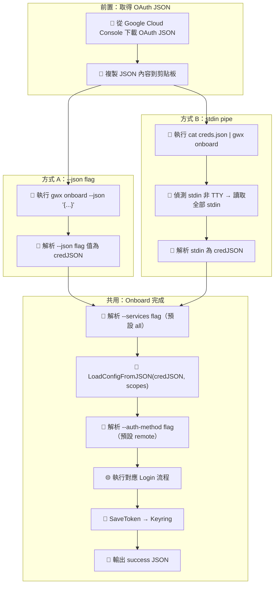

# 需求輸入：gwx onboard JSON 直貼模式

> **文件角色**：需求詳細文件（Detailed Requirement Document）。
> 可在 SOP 外獨立填寫，作為 S0 的輸入源。S0 消費本文件後產出精簡版 `s0_brief_spec.md`。
> 本文件在整個 SOP 生命週期中作為「需求百科」被 S1~S7 各階段引用。

---

## 0. 工作類型 *

- [ ] 新需求（全新功能或流程）
- [ ] 重構（改善現有程式碼品質/架構，不改變外部行為）
- [ ] Bug 修復（修正錯誤行為）
- [ ] 調查（問題方向不明，需先探索再決定行動）
- [x] 補完（已有部分實作，需補齊缺漏功能/修正問題）
- [ ] 待討論

## 1. 一句話描述 *

gwx onboard 新增 `--json` flag 和 stdin pipe 兩種方式，讓 VPS 用戶可以不透過檔案上傳或互動式貼上，直接用 CLI 參數或 pipe 完成 OAuth credentials 導入。

## 2. 為什麼要做 *

VPS 環境下現有的 onboard 方式都有痛點：

1. **檔案上傳困難**：VPS 用戶不熟悉 scp/sftp，無法方便地將 OAuth JSON 檔案傳到伺服器
2. **互動式 stdin 不穩定**：現有的互動式貼 JSON 在某些終端（tmux、screen、SSH tunnel）會斷行或截斷
3. **自動化腳本需要一行搞定**：環境變數（`GWX_OAUTH_JSON`）設定步驟太多，不直觀
4. **AI Agent 需要程式化呼叫**：Claude Code 等 Agent 透過 MCP 呼叫 gwx 時，需要 flag-based 的非互動介面

## 3. 使用者是誰 *

| 角色 | 參與方式 | 說明 |
|------|---------|------|
| VPS 終端用戶 | 操作者 | SSH 進 VPS，手動執行 `gwx onboard --json '{...}'` 完成設定 |
| 自動化腳本 | 操作者 | CI/CD、Ansible、Docker entrypoint 中用 pipe 或 flag 自動 onboard |
| AI Agent | 操作者 | Claude Code 等 Agent 在 MCP 中呼叫 gwx，需程式化傳入 credentials |

## 4. 核心流程 *

### 4.1 Happy Path

> 節點標注規則：🤖 = 系統自動、👤 = 人工操作、🔄 = 半自動（需人工確認）、🌐 = 外部服務

**Credential 來源優先序**（由高到低）：
1. `--json` flag
2. stdin pipe（偵測 stdin 非 TTY）
3. `GWX_OAUTH_JSON` 環境變數
4. `GWX_OAUTH_FILE` 環境變數
5. 互動式提示（現有行為，最低）

### 4.2 異常/邊界情境

| 情境 | 預期行為 | 現況 |
|------|---------|------|
| `--json` 值不是合法 JSON | 報錯 `invalid JSON in --json flag` 並 exit 1 | ❌ 缺少（flag 不存在） |
| stdin pipe 內容為空 | 報錯 `empty stdin` 並 exit 1 | ❌ 缺少 |
| stdin pipe 內容不是合法 JSON | 報錯 `invalid JSON from stdin` 並 exit 1 | ❌ 缺少 |
| `--json` 和 stdin 同時存在 | `--json` 優先，忽略 stdin | ❌ 缺少 |
| JSON 缺少必要 OAuth 欄位 | `LoadConfigFromJSON` 已有驗證，照常報錯 | ✅ 已實作 |
| `--services` 包含無效服務名 | 現有 `AllScopes` 邏輯處理 | ✅ 已實作 |

## 5. 成功長什麼樣 *

- [x] `gwx onboard --json '{"installed":...}'` 一行完成 onboard，零互動提示
- [x] `cat creds.json | gwx onboard` pipe 模式正常運作
- [x] `--services gmail,calendar` 可選覆蓋預設的 all services
- [x] `--auth-method remote|browser|manual` 可選覆蓋預設的 remote
- [x] 現有互動模式和環境變數模式完全不受影響
- [x] `gwx onboard --help` 清楚列出所有新選項與範例

## 6. 不做什麼（選填）

- 不改現有互動模式的行為
- 不改現有環境變數模式（`GWX_OAUTH_JSON`、`GWX_OAUTH_FILE`）
- 不做 token 的 JSON 貼入（只處理 OAuth credentials JSON）
- 不做 GUI/TUI 介面
- 不做 credentials 加密傳輸（JSON 明文傳入，keyring 負責安全存儲）

---

## 10. 已有實作 Baseline

### 10.1 已完成

- 互動模式：支援貼 JSON（偵測 `{` 前綴）+ 檔案路徑（`internal/cmd/onboard.go` L83-101）
- 非互動模式：`GWX_OAUTH_JSON` / `GWX_OAUTH_FILE` 環境變數（`internal/cmd/onboard.go` L199-282）
- `readPastedJSON` 多行 JSON 讀取器（`internal/cmd/onboard.go` L15-45）
- Keyring 存儲 credentials + token（`internal/auth/` package）

### 10.2 已知問題

| ID | 嚴重度 | 問題 |
|----|--------|------|
| ENH-1 | high | 無 CLI flag 方式直接傳入 JSON，VPS 用戶必須用環境變數或互動模式 |
| ENH-2 | medium | 無 stdin pipe 偵測，自動化腳本需依賴環境變數 |

### 10.3 參考文件

- `internal/cmd/onboard.go` — 現有 onboard 實作
- `internal/cmd/root.go` — CLI flag 定義
- `internal/auth/oauth.go` — OAuth 認證邏輯

## 12. 優先級（選填）

- [ ] 緊急（阻斷其他工作）
- [x] 高（本週要完成）
- [ ] 中（排入計畫）
- [ ] 低（有空再做）
