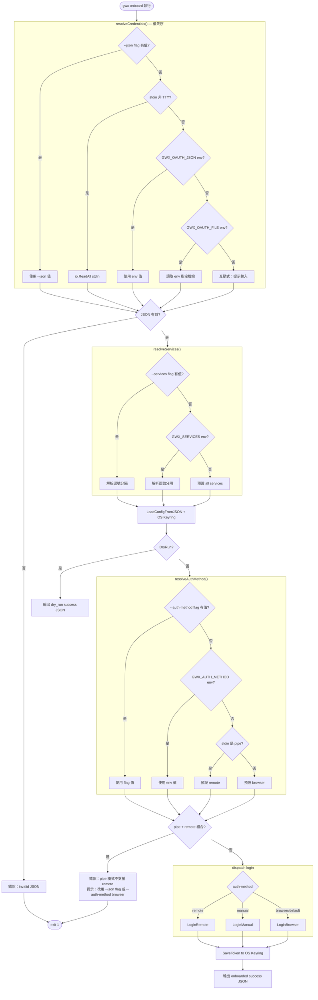
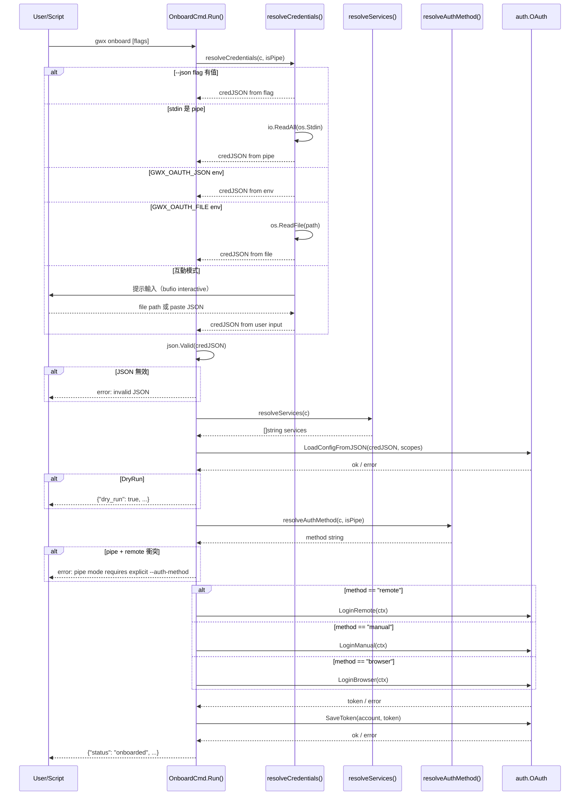

# S1 Dev Spec: onboard-json-paste

> **階段**: S1 技術分析
> **建立時間**: 2026-03-27 14:00
> **Agent**: codebase-explorer (Phase 1) + architect (Phase 2)
> **工作類型**: enhancement
> **複雜度**: M

---

## 1. 概述

### 1.1 需求參照
> 完整需求見 `s0_brief_spec.md`，以下僅摘要。

gwx onboard 新增 `--json` flag 和 stdin pipe，讓 VPS 用戶直接用 CLI 參數或 pipe 完成 OAuth credentials 導入，不需設定環境變數或互動式輸入。

### 1.2 技術方案摘要

修改 `internal/cmd/onboard.go` 單一檔案：OnboardCmd struct 新增三個 Kong flag（`--json`、`--services`、`--auth-method`）；重構 Run() 提取 `resolveCredentials()`、`resolveServices()`、`resolveAuthMethod()` 三個 helper；stdin pipe 偵測採用與 `obsidian.go` 相同的 `os.Stdin.Stat()` 模式；pipe 模式下若 `--auth-method` 未指定則預設 `remote`，但 pipe + remote 組合（stdin 已被消耗）報錯並提示用戶改用 `--json` 或 `--auth-method browser`；現有環境變數模式行為不變。

---

## 2. 影響範圍（Phase 1：codebase-explorer）

### 2.1 受影響檔案

#### Backend (Go CLI)
| 檔案 | 變更類型 | 說明 |
|------|---------|------|
| `internal/cmd/onboard.go` | 修改 | OnboardCmd struct 新增 3 個 Kong flag fields；Run() 重構；新增 resolveCredentials / resolveServices / resolveAuthMethod；runNonInteractive 整合進 Run() |

#### 參考（只讀，不修改）
| 檔案 | 說明 |
|------|------|
| `internal/cmd/obsidian.go` | stdin TTY 偵測模式參考（L190-196） |
| `internal/cmd/auth.go` | Kong struct tag 語法參考 |
| `internal/cmd/root.go` | OnboardCmd 掛載點，確認 Kong tag 格式 |

### 2.2 依賴關係
- **上游依賴**:
  - `internal/auth/oauth.go` — `LoadConfigFromJSON`、`LoginRemote`、`LoginManual`、`LoginBrowser`、`SaveToken` 方法簽名不變
  - `internal/auth/scopes.go` — `AllScopes()` 函數
- **下游影響**: 無

### 2.3 現有模式與技術考量

**Kong flag struct tag 語法**（參考 `auth.go`）：
```go
CredentialsFile string   `help:"..." name:"credentials" short:"c"`
Services        []string `help:"..." default:"gmail,calendar,..."`
```
注意：`Services []string` 在 Kong 是 repeatable flag（`--services gmail --services calendar`），不是逗號分隔字串。但需求指定逗號分隔字串，因此應用 `string` 型別並在 Run() 手動 split。

**stdin TTY 偵測**（參考 `obsidian.go` L190-196）：
```go
stat, _ := os.Stdin.Stat()
isPipe := (stat.Mode() & os.ModeCharDevice) == 0
```

**pipe + remote 衝突**：`LoginRemote` 在 `auth/oauth.go` 內部呼叫 `fmt.Fscanln(os.Stdin)` 讀取 auth code。stdin 已被 pipe 消耗後，`Fscanln` 會立即 EOF 導致靜默失敗。必須在進入 login 前偵測並報錯。

---

## 3. User Flow（Phase 2：architect）



### 3.1 主要流程
| 步驟 | 用戶動作 | 系統回應 | 備註 |
|------|---------|---------|------|
| 1 | 執行 `gwx onboard --json '{...}'` | resolveCredentials 取得 --json 值，跳過 stdin/env | 最高優先序 |
| 2 | 執行 `cat creds.json \| gwx onboard` | 偵測 stdin 非 TTY，io.ReadAll 讀取 | 第二優先序 |
| 3 | 設定 GWX_OAUTH_JSON 執行 `gwx onboard` | 讀取 env var | 維持現有行為 |
| 4 | TTY 模式執行 `gwx onboard` | 互動式 wizard | 維持現有行為 |
| 5 | 指定 --services / --auth-method | resolveServices / resolveAuthMethod 使用 flag 值 | 覆蓋預設與 env |

### 3.2 異常流程

| 情境 | 觸發條件 | 系統處理 | 用戶看到 |
|------|---------|---------|---------|
| pipe + remote 衝突 | stdin 是 pipe 且 auth-method 解析為 remote | 報錯並提示替代方案 | `error: pipe mode requires explicit --auth-method (browser or manual). Use --json flag instead of pipe, or set --auth-method browser` |
| --json 值不是有效 JSON | --json 傳入的字串 JSON 解析失敗 | 早期返回錯誤 | `error: --json: invalid JSON` |
| pipe 內容為空 | stdin pipe 但無資料 | 視為空字串，JSON 驗證失敗 | `error: --json: invalid JSON (empty input)` |
| GWX_OAUTH_FILE 不存在 | env 指向的檔案不存在 | 維持現有 os.ReadFile 錯誤 | `error: read GWX_OAUTH_FILE "...": ...` |
| login 失敗 | OAuth 流程錯誤 | 維持現有錯誤處理 | 維持現有行為 |

### 3.3 例外追溯表

| 維度 | 情境 | S1 處理位置 | 覆蓋狀態 |
|------|------|-----------|---------|
| pipe + remote 衝突 | stdin 消耗後 LoginRemote EOF | resolveAuthMethod + ConflictCheck | ✅ 覆蓋 |
| 無效 JSON 輸入 | --json 或 pipe 傳入非法 JSON | resolveCredentials 後 json.Valid 驗證 | ✅ 覆蓋 |
| 空 pipe | pipe 接通但無資料 | io.ReadAll 後 TrimSpace，JSON 驗證失敗 | ✅ 覆蓋 |
| 現有互動模式不受影響 | TTY 模式下 stdin 偵測為 CharDevice | resolveCredentials 走互動 branch | ✅ 覆蓋 |
| DryRun 路徑 | rctx.DryRun == true | LoadConfig 後、login 前獨立 check | ✅ 覆蓋 |

---

## 4. Data Flow



### 4.1 API 契約

本功能為 CLI 命令，無 HTTP API。

**CLI Interface**

```
gwx onboard [flags]

Flags:
  --json string          OAuth credentials JSON string (highest priority)
  --services string      Comma-separated services to authorize (default: all)
  --auth-method string   Auth flow: browser | manual | remote (default: remote for pipe/env, browser for interactive)
  --help                 Show help
```

**Credential Priority Order**

```
1. --json flag
2. stdin pipe (non-TTY)
3. GWX_OAUTH_JSON env
4. GWX_OAUTH_FILE env
5. Interactive prompt (TTY only)
```

### 4.2 資料模型

OnboardCmd struct（重構後）：
```go
type OnboardCmd struct {
    JSON       string `help:"OAuth credentials JSON string" name:"json"`
    Services   string `help:"Comma-separated services (default: all)" name:"services"`
    AuthMethod string `help:"Auth method: browser|manual|remote" name:"auth-method"`
}
```

Helper function signatures：
```go
func resolveCredentials(c *OnboardCmd, reader *bufio.Reader, isPipe bool) ([]byte, error)
func resolveServices(c *OnboardCmd) []string
func resolveAuthMethod(c *OnboardCmd, isPipe bool) string
```

---

## 5. 任務清單

### 5.1 任務總覽

| # | 任務 | 類型 | 複雜度 | Agent | 依賴 |
|---|------|------|--------|-------|------|
| 1 | OnboardCmd struct 新增 Kong flags | 後端 CLI | S | go-expert | - |
| 2 | resolveCredentials() 實作 | 後端 CLI | M | go-expert | #1 |
| 3 | resolveServices() / resolveAuthMethod() 實作 | 後端 CLI | S | go-expert | #1 |
| 4 | Run() 重構：整合 helpers + 衝突偵測 | 後端 CLI | M | go-expert | #2, #3 |
| 5 | 回歸測試：現有路徑驗證 | 測試 | S | go-expert | #4 |

### 5.2 任務詳情

#### Task #1: OnboardCmd struct 新增 Kong flags
- **類型**: 後端 CLI
- **複雜度**: S
- **Agent**: go-expert
- **描述**: 在 `OnboardCmd` struct 新增三個 Kong-compatible fields：`JSON string`、`Services string`、`AuthMethod string`，並加上對應的 `help`、`name` tag。Services 用 string（非 []string）以支援逗號分隔輸入。
- **DoD**:
  - [ ] `OnboardCmd` 包含 `JSON`、`Services`、`AuthMethod` 三個 exported fields
  - [ ] 每個 field 有正確的 Kong struct tag（`name`、`help`、`optional`）
  - [ ] `gwx onboard --help` 顯示三個新 flags
  - [ ] 不破壞現有 struct 零值行為（所有新 fields 為空字串時行為不變）
- **驗收方式**: `gwx onboard --help` 輸出包含 `--json`、`--services`、`--auth-method`

#### Task #2: resolveCredentials() 實作
- **類型**: 後端 CLI
- **複雜度**: M
- **Agent**: go-expert
- **依賴**: Task #1
- **描述**: 提取獨立函數 `resolveCredentials(c *OnboardCmd, reader *bufio.Reader, isPipe bool) ([]byte, error)`，實作五段優先序邏輯。stdin pipe 偵測使用 `os.Stdin.Stat()` + `os.ModeCharDevice` 模式（同 obsidian.go）。pipe 讀取改用 `io.ReadAll(os.Stdin)`，不再使用 `readPastedJSON()`（可保留但標記為 deprecated）。
- **DoD**:
  - [ ] 函數簽名為 `resolveCredentials(c *OnboardCmd, reader *bufio.Reader, isPipe bool) ([]byte, error)`
  - [ ] 五段優先序邏輯正確：flag > pipe > GWX_OAUTH_JSON > GWX_OAUTH_FILE > interactive
  - [ ] pipe 讀取使用 `io.ReadAll`，不消耗 bufio.Reader
  - [ ] 各來源的錯誤訊息清晰標識來源（如 `"--json: invalid JSON"`）
  - [ ] 互動式路徑行為與現有 Run() 互動邏輯一致
- **驗收方式**: 手動測試五種輸入路徑各一次（見驗收標準 §7.1）

#### Task #3: resolveServices() / resolveAuthMethod() 實作
- **類型**: 後端 CLI
- **複雜度**: S
- **Agent**: go-expert
- **依賴**: Task #1
- **描述**: 提取兩個 helper 函數。`resolveServices(c *OnboardCmd) []string`：優先 `--services` flag，次 `GWX_SERVICES` env，預設 all services。`resolveAuthMethod(c *OnboardCmd, isPipe bool) string`：優先 `--auth-method` flag，次 `GWX_AUTH_METHOD` env，pipe 模式預設 `"remote"`，互動模式預設 `"browser"`。
- **DoD**:
  - [ ] `resolveServices` 正確解析逗號分隔字串並 trim 空白
  - [ ] `resolveAuthMethod` 優先序正確
  - [ ] pipe 模式未指定 auth-method 時，resolveAuthMethod 回傳 `"remote"`（後續 ConflictCheck 處理）
  - [ ] 互動模式未指定 auth-method 時，resolveAuthMethod 回傳 `"browser"`
- **驗收方式**: 單元測試覆蓋各組合（flag 有值、env 有值、兩者皆空分 pipe/TTY）

#### Task #4: Run() 重構 — 整合 helpers + 衝突偵測
- **類型**: 後端 CLI
- **複雜度**: M
- **Agent**: go-expert
- **依賴**: Task #2, Task #3
- **描述**: 重構 `Run()` 主體：(1) 計算 `isPipe` 一次供所有 helper 使用；(2) 呼叫 `resolveCredentials`、`resolveServices`、`resolveAuthMethod`；(3) 在 LoadConfig 成功後、login 前插入 `DryRun` check；(4) 插入 pipe + remote 衝突偵測；(5) login dispatch；(6) 移除 `runNonInteractive()` 或保留其呼叫但內部委派至新 helpers（擇一，推薦直接移除）。
- **DoD**:
  - [ ] `Run()` 無重複 credential 解析邏輯
  - [ ] `DryRun` check 位於 `LoadConfigFromJSON` 之後、login 之前
  - [ ] pipe + remote 衝突時輸出明確錯誤訊息並包含替代方案提示
  - [ ] `runNonInteractive()` 已被整合移除（或明確標記 deprecated 並不再從 `Run()` 呼叫）
  - [ ] 現有互動式 Step 2/3 wizard 流程完整保留
- **驗收方式**: 整合測試（見驗收標準 §7.1 P0 cases）

#### Task #5: 回歸測試 — 現有路徑驗證
- **類型**: 測試
- **複雜度**: S
- **Agent**: go-expert
- **依賴**: Task #4
- **描述**: 驗證三條現有路徑在重構後行為不變：(1) GWX_OAUTH_JSON env 模式；(2) GWX_OAUTH_FILE env 模式；(3) TTY 互動模式（手動確認不被 pipe 誤判）。
- **DoD**:
  - [ ] `GWX_OAUTH_JSON` env 模式測試通過（dry_run）
  - [ ] `GWX_OAUTH_FILE` env 模式測試通過（dry_run）
  - [ ] TTY 模式下 isPipe 為 false（可用 `os.Stdin.Stat()` 確認）
  - [ ] `go test ./internal/cmd/...` 無新增失敗
- **驗收方式**: `go test ./internal/cmd/... -run TestOnboard`

---

## 6. 技術決策

### 6.1 架構決策

| 決策點 | 選項 | 選擇 | 理由 |
|--------|------|------|------|
| Services flag 型別 | `[]string`（Kong repeatable）vs `string`（逗號分隔）| `string` | 需求指定逗號分隔語法；與 GWX_SERVICES env 格式一致；減少用戶使用摩擦 |
| pipe + remote 衝突處理 | 靜默改為 browser vs 硬報錯 | 硬報錯 | 靜默修改用戶指定的 auth-method 會讓行為不可預期；明確報錯讓問題可追蹤 |
| runNonInteractive 去留 | 保留 vs 整合進 Run() | 整合進 Run()，刪除 runNonInteractive | 消除重複邏輯，單一路徑更易維護；U-2 裁決已確認 |
| DryRun check 位置 | credential 解析前 vs LoadConfig 後 | LoadConfig 後、login 前 | LoadConfig 失敗應先報錯（credentials 無效是比 dry_run 更早的問題）；維持現有語義 |
| isPipe 計算時機 | 每個 helper 內各算一次 vs Run() 算一次傳入 | Run() 算一次傳入 | 單一來源，避免多次 syscall；確保整個流程使用同一 isPipe 值 |

### 6.2 設計模式
- **Pattern**: Strategy + Helper Extraction — 三個 resolve 函數各自封裝一個維度的決策邏輯
- **理由**: 將 credential 來源、服務選擇、auth 方法三個正交關注點分離，Run() 只做組合與 error check，各 helper 可獨立測試

### 6.3 相容性考量
- **向後相容**: 完全相容。新 flags 全部是 optional，零值時行為退回現有邏輯。
- **Migration**: 無資料遷移。現有 env 變數（GWX_OAUTH_JSON、GWX_OAUTH_FILE、GWX_SERVICES、GWX_AUTH_METHOD）行為不變。

---

## 7. 驗收標準

### 7.1 功能驗收

| # | 場景 | Given | When | Then | 優先級 |
|---|------|-------|------|------|--------|
| 1 | --json flag onboard (dry-run) | 有效 credentials JSON，DryRun=true | `gwx --dry-run onboard --json '{...}'` | 輸出 `{"dry_run":true, "services":[...]}` | P0 |
| 2 | stdin pipe onboard (dry-run) | creds.json 存在，DryRun=true | `cat creds.json \| gwx --dry-run onboard` | 輸出 `{"dry_run":true, ...}` | P0 |
| 3 | pipe + remote 衝突報錯 | stdin 是 pipe，auth-method=remote（預設） | `cat creds.json \| gwx onboard` | exit 1，錯誤訊息含 "pipe mode" 和 "browser" 替代提示 | P0 |
| 4 | pipe + browser 成功 | stdin 是 pipe，`--auth-method browser` | `cat creds.json \| gwx onboard --auth-method browser` | 完成 browser login | P0 |
| 5 | --services 覆蓋 | `--services gmail,drive` | `gwx --dry-run onboard --json '{...}' --services gmail,drive` | 輸出 services 只有 gmail, drive | P1 |
| 6 | 現有 GWX_OAUTH_JSON env 模式不受影響 | env GWX_OAUTH_JSON 設定，DryRun=true | `GWX_OAUTH_JSON='...' gwx --dry-run onboard` | 輸出 `{"dry_run":true, ...}` | P0 |
| 7 | --json 無效 JSON 報錯 | --json 傳入非法字串 | `gwx onboard --json 'not-json'` | exit 1，錯誤訊息含 "invalid JSON" | P1 |
| 8 | --help 顯示新 flags | - | `gwx onboard --help` | 輸出包含 `--json`、`--services`、`--auth-method` | P1 |
| 9 | TTY 互動模式完整保留 | stdin 是 TTY，無 flags 無 env | `gwx onboard`（互動） | 顯示三步驟 wizard，行為與現有一致 | P0 |
| 10 | --json 優先於 env | --json flag 有值，同時設定 GWX_OAUTH_JSON | `GWX_OAUTH_JSON='...' gwx --dry-run onboard --json '{...}'` | 使用 --json 值（非 env 值） | P1 |

### 7.2 非功能驗收
| 項目 | 標準 |
|------|------|
| shell quoting | help text 包含正確 quoting 範例（single quote 包裹 JSON） |
| 錯誤訊息品質 | pipe + remote 衝突訊息明確列出替代方案 |
| 行為一致性 | isPipe 計算與 obsidian.go 使用相同模式 |

### 7.3 測試計畫
- **單元測試**: `resolveServices`、`resolveAuthMethod` 各組合（flag/env/default × pipe/TTY）
- **整合測試**: dry-run 模式測試五種 credential 來源路徑（不需真實 OAuth 流程）
- **手動測試**: pipe + browser 完整 onboard（需真實 Google OAuth 憑證）；TTY 互動模式完整走一次

---

## 8. 風險與緩解

| 風險 | 影響 | 機率 | 緩解措施 | 負責人 |
|------|------|------|---------|--------|
| pipe + remote 靜默失敗 | 高（EOF 錯誤訊息令人困惑） | 高（pipe 模式預設 remote） | 硬報錯並提示替代方案，不允許此組合繼續執行 | go-expert (Task #4) |
| Services string 解析邊界 | 低 | 低 | 解析時 TrimSpace 每個 token，空字串 skip；與 runNonInteractive 現有邏輯一致 | go-expert (Task #3) |
| --json flag ARG_MAX 限制 | 低（~2MB，credentials JSON 遠小於此） | 極低 | help text 說明若 JSON 很大請改用 pipe 模式 | - |
| TTY 誤判（某些 CI 環境） | 中（意外觸發 pipe 路徑） | 低 | CI 環境應明確設定 GWX_OAUTH_JSON env，不依賴 TTY 偵測 | go-expert (Task #5) |

### 回歸風險
- 現有環境變數模式（`GWX_OAUTH_JSON` / `GWX_OAUTH_FILE` / `GWX_SERVICES` / `GWX_AUTH_METHOD`）必須維持原有行為
- `rctx.DryRun` 路徑在 `LoadConfigFromJSON` 之後觸發，語義不變
- 互動式三步驟 wizard（Step 1-3 UI 輸出）在 TTY 模式下完整保留
- `readPastedJSON()` 若保留，不能被新路徑呼叫（防止意外副作用）

---

## SDD Context

```json
{
  "sdd_context": {
    "stages": {
      "s1": {
        "status": "completed",
        "agents": ["codebase-explorer", "architect"],
        "output": {
          "dev_spec_path": "dev/specs/2026-03-27_1_onboard-json-paste/s1_dev_spec.md",
          "tasks": [
            "T1: OnboardCmd struct 新增 Kong flags",
            "T2: resolveCredentials() 實作",
            "T3: resolveServices() / resolveAuthMethod() 實作",
            "T4: Run() 重構 — 整合 helpers + 衝突偵測",
            "T5: 回歸測試 — 現有路徑驗證"
          ],
          "acceptance_criteria": [
            "gwx --dry-run onboard --json '{...}' 輸出 dry_run success",
            "cat creds.json | gwx --dry-run onboard 輸出 dry_run success",
            "pipe + remote 組合 exit 1 並提示替代方案",
            "cat creds.json | gwx onboard --auth-method browser 完成 login",
            "現有 GWX_OAUTH_JSON env 模式不受影響",
            "gwx onboard --help 顯示 --json / --services / --auth-method"
          ],
          "solution_summary": "修改 onboard.go 單一檔案：OnboardCmd 新增三個 Kong flag fields；提取 resolveCredentials / resolveServices / resolveAuthMethod 三個 helper；Run() 整合新邏輯並加入 pipe+remote 衝突偵測；runNonInteractive 整合後移除",
          "regression_risks": [
            "現有 env var 模式行為不變",
            "DryRun 路徑語義不變（LoadConfig 後、login 前）",
            "互動式 wizard UI 完整保留"
          ],
          "tech_debt": [
            "readPastedJSON() 在 pipe 模式實作後可標記 deprecated",
            "stdin TTY 偵測模式與 obsidian.go 相同，可考慮提取為 pkg-level helper"
          ]
        }
      }
    }
  }
}
```
