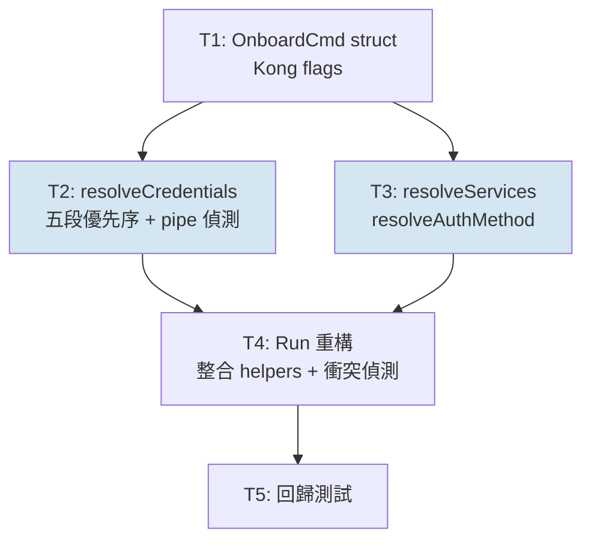

# S3 Implementation Plan: onboard-json-paste

> **階段**: S3 實作
> **建立時間**: 2026-03-27 15:00
> **Agents**: go-expert

---

## 1. 概述

### 1.1 功能目標

gwx onboard 新增 `--json` flag 和 stdin pipe 兩種方式，讓 VPS 用戶可用一行指令或 pipe 完成 OAuth credentials 導入，不依賴互動式 wizard。

### 1.2 實作範圍

- **範圍內**: OnboardCmd struct 新增 `--json`、`--services`、`--auth-method` flags；stdin TTY 偵測；Run() 重構統一 credential 來源優先序；help text 更新
- **範圍外**: 現有互動模式行為、環境變數模式、token JSON 貼入、GUI/TUI、credentials 加密傳輸

### 1.3 關聯文件

| 文件 | 路徑 | 狀態 |
|------|------|------|
| Brief Spec | `./s0_brief_spec.md` | ✅ |
| Dev Spec | `./s1_dev_spec.md` | ✅ |
| Implementation Plan | `./s3_implementation_plan.md` | 當前 |

---

## 2. 實作任務清單

### 2.1 任務總覽

| # | 任務 | 類型 | Agent | 依賴 | 複雜度 | TDD | 狀態 |
|---|------|------|-------|------|--------|-----|------|
| T1 | OnboardCmd struct 新增 Kong flags | 後端 CLI | `go-expert` | - | S | ✅ | ⬜ |
| T2 | resolveCredentials() 實作 | 後端 CLI | `go-expert` | T1 | M | ✅ | ⬜ |
| T3 | resolveServices() / resolveAuthMethod() 實作 | 後端 CLI | `go-expert` | T1 | S | ✅ | ⬜ |
| T4 | Run() 重構：整合 helpers + 衝突偵測 | 後端 CLI | `go-expert` | T2, T3 | M | ✅ | ⬜ |
| T5 | 回歸測試：現有路徑驗證 | 測試 | `go-expert` | T4 | S | ✅ | ⬜ |

**狀態圖例**：⬜ pending / 🔄 in_progress / ✅ completed / ❌ blocked / ⏭️ skipped

**複雜度**：S（<30min）/ M（30min-2hr）/ L（>2hr）

---

## 3. 任務詳情

### Task T1: OnboardCmd struct 新增 Kong flags

**基本資訊**

| 項目 | 內容 |
|------|------|
| 類型 | 後端 CLI |
| Agent | `go-expert` |
| 複雜度 | S |
| 依賴 | - |
| 狀態 | ⬜ pending |

**描述**

在 `internal/cmd/onboard.go` 的 `OnboardCmd` struct 新增三個 Kong tag field：

1. `JSON string` — `kong:"name='json',help='OAuth credentials JSON string (overrides env)'"`
2. `Services string` — `kong:"name='services',help='Comma-separated service list (overrides env)'"`
3. `AuthMethod string` — `kong:"name='auth-method',help='Auth method: browser or headless (overrides env)'"`

參考 `internal/cmd/root.go` 現有 Kong struct tag 語法確認格式。

**輸入**

- 現有 `OnboardCmd` struct 定義（`internal/cmd/onboard.go`）
- `internal/cmd/root.go` 的 Kong tag 語法範例

**輸出**

- `OnboardCmd` struct 新增 3 個 exported field，Kong CLI 解析後可直接存取

**受影響檔案**

| 檔案 | 變更類型 | 說明 |
|------|---------|------|
| `internal/cmd/onboard.go` | 修改 | struct 新增 3 個 field |

**DoD**

- [ ] `OnboardCmd` struct 包含 `JSON`、`Services`、`AuthMethod` 三個 field
- [ ] `gwx onboard --help` 顯示三個新 flags 及說明文字
- [ ] `go build ./...` 無錯誤

**TDD Plan**

| 項目 | 內容 |
|------|------|
| 測試檔案 | `internal/cmd/onboard_test.go`（新建） |
| 測試指令 | `go test ./internal/cmd/ -run TestOnboard -v` |
| 預期失敗測試 | `TestOnboardCmd_FlagsExist`（驗證三個 field 可被反射讀取） |

**驗證方式**

```bash
go build ./...
go run . onboard --help
# 預期輸出包含 --json, --services, --auth-method
```

**實作備註**

- Kong tag 語法依照 `root.go` 現有模式，若有 `optional` tag 也需加上
- `AuthMethod` 的合法值（`browser`/`headless`）在 T4 的 Run() 內驗證，T1 不做枚舉限制

---

### Task T2: resolveCredentials() 實作

**基本資訊**

| 項目 | 內容 |
|------|------|
| 類型 | 後端 CLI |
| Agent | `go-expert` |
| 複雜度 | M |
| 依賴 | T1 |
| 狀態 | ⬜ pending |

**描述**

在 `onboard.go` 新增 `resolveCredentials(cmd *OnboardCmd, isPipe bool) (string, error)` helper，實作五段優先序：

1. `--json` flag（`cmd.JSON != ""`）→ 直接回傳
2. stdin pipe（`isPipe == true`）→ `io.ReadAll(os.Stdin)`
3. `GWX_OAUTH_JSON` env var
4. `GWX_OAUTH_FILE` env var → `os.ReadFile(path)`
5. 以上均無 → 回傳空字串（交由 Run() 決定走互動模式）

注意：本專案無現有 `onboard_test.go`，T2 需先建立測試檔，再寫 `resolveCredentials` 的測試。

**輸入**

- T1 完成的 `OnboardCmd` struct（含 `JSON` field）
- `isPipe bool`（由 Run() 計算後傳入）

**輸出**

- `(credentialsJSON string, err error)`：字串為 raw JSON，空字串表示無法從非互動來源取得

**受影響檔案**

| 檔案 | 變更類型 | 說明 |
|------|---------|------|
| `internal/cmd/onboard.go` | 修改 | 新增 resolveCredentials() function |
| `internal/cmd/onboard_test.go` | 新增 | T2/T3 共用測試檔，本 task 先建立 |

**DoD**

- [ ] `resolveCredentials()` 函式存在，簽名符合規格
- [ ] `--json` flag 優先於 pipe（unit test 驗證）
- [ ] pipe 優先於 env var（unit test 驗證）
- [ ] `GWX_OAUTH_FILE` 路徑不存在時回傳 error
- [ ] 所有來源均無時回傳空字串（非 error）
- [ ] `go test ./internal/cmd/ -run TestOnboard -v` 通過

**TDD Plan**

| 項目 | 內容 |
|------|------|
| 測試檔案 | `internal/cmd/onboard_test.go` |
| 測試指令 | `go test ./internal/cmd/ -run TestOnboard -v` |
| 預期失敗測試 | `TestResolveCredentials_JSONFlagTakesPriority`, `TestResolveCredentials_PipeReadsStdin`, `TestResolveCredentials_EnvJSONFallback`, `TestResolveCredentials_EnvFileFallback`, `TestResolveCredentials_NoneReturnsEmpty` |

**驗證方式**

```bash
go test ./internal/cmd/ -run TestResolveCredentials -v
```

**實作備註**

- `isPipe` 透過 `os.Stdin.Stat()` + `(stat.Mode() & os.ModeCharDevice) == 0` 判斷，與 `internal/output/formatter.go` 的 `IsTTY()` 模式相同
- `io.ReadAll(os.Stdin)` 在 test 中用 `os.Pipe()` mock stdin

---

### Task T3: resolveServices() / resolveAuthMethod() 實作

**基本資訊**

| 項目 | 內容 |
|------|------|
| 類型 | 後端 CLI |
| Agent | `go-expert` |
| 複雜度 | S |
| 依賴 | T1 |
| 狀態 | ⬜ pending |

**描述**

新增兩個 helper：

**resolveServices(cmd \*OnboardCmd) []string**
優先序：`--services` flag（`strings.Split(cmd.Services, ",")` trim 空白）→ `GWX_SERVICES` env var → 回傳 nil（使用預設）

**resolveAuthMethod(cmd \*OnboardCmd) string**
優先序：`--auth-method` flag → `GWX_AUTH_METHOD` env var → 回傳空字串（使用預設）

注意：`Services` 使用 `string` 而非 `[]string`，透過手動 split 處理。

**輸入**

- T1 完成的 `OnboardCmd` struct（含 `Services`、`AuthMethod` field）
- 環境變數 `GWX_SERVICES`、`GWX_AUTH_METHOD`

**輸出**

- `resolveServices()` → `[]string`（nil 表示使用預設）
- `resolveAuthMethod()` → `string`（空字串表示使用預設）

**受影響檔案**

| 檔案 | 變更類型 | 說明 |
|------|---------|------|
| `internal/cmd/onboard.go` | 修改 | 新增兩個 helper function |
| `internal/cmd/onboard_test.go` | 修改 | 新增 T3 測試案例 |

**DoD**

- [ ] `resolveServices()` flag 優先於 env（unit test）
- [ ] `resolveServices()` 正確 split 並 trim 空白（如 `"gmail, calendar"` → `["gmail", "calendar"]`）
- [ ] `resolveAuthMethod()` flag 優先於 env（unit test）
- [ ] 兩個 function 均無依賴時回傳正確零值
- [ ] `go test ./internal/cmd/ -run TestOnboard -v` 通過

**TDD Plan**

| 項目 | 內容 |
|------|------|
| 測試檔案 | `internal/cmd/onboard_test.go` |
| 測試指令 | `go test ./internal/cmd/ -run TestOnboard -v` |
| 預期失敗測試 | `TestResolveServices_FlagSplitsAndTrims`, `TestResolveServices_EnvFallback`, `TestResolveServices_NoneReturnsNil`, `TestResolveAuthMethod_FlagPriority`, `TestResolveAuthMethod_EnvFallback` |

**驗證方式**

```bash
go test ./internal/cmd/ -run TestResolveServices -v
go test ./internal/cmd/ -run TestResolveAuthMethod -v
```

**實作備註**

- T2 和 T3 依賴相同的 T1，可在 T1 完成後並行實作
- `strings.TrimSpace()` 對每個 split 元素處理

---

### Task T4: Run() 重構：整合 helpers + 衝突偵測

**基本資訊**

| 項目 | 內容 |
|------|------|
| 類型 | 後端 CLI |
| Agent | `go-expert` |
| 複雜度 | M |
| 依賴 | T2, T3 |
| 狀態 | ⬜ pending |

**描述**

重構 `Run()` 方法，整合 T2/T3 的 helpers，並加入以下邏輯：

1. **isPipe 計算**：在 Run() 頂部計算一次，傳入 `resolveCredentials(cmd, isPipe)`
2. **優先序處理**：`--json` flag 存在時直接使用，忽略 stdin pipe（不報錯，`--json` 優先）
3. **resolveAuthMethod 驗證**：若 authMethod 非空且不是 `"browser"` / `"manual"` / `"remote"` → `return fmt.Errorf(...)`
4. **DryRun check 位置**：在 `LoadConfig` 後、login 前執行
5. **移除 runNonInteractive**：邏輯整合進 Run()，原 function 刪除

執行流程：

```
isPipe = detectPipe()
creds = resolveCredentials(cmd, isPipe)  // --json > pipe > env > file > empty
services = resolveServices(cmd)
authMethod = resolveAuthMethod(cmd)
if authMethod != "" && authMethod != "browser" && authMethod != "manual" && authMethod != "remote" → error
LoadConfig(...)
if rctx.DryRun → output dry run result, return
if creds != "" → 非互動模式（login with creds）
else if isPipe && authMethod == "" → error（pipe 模式缺少 auth-method）
else → 互動式 wizard（TTY 模式）
```

**輸入**

- T2 的 `resolveCredentials()`
- T3 的 `resolveServices()`、`resolveAuthMethod()`
- 現有 `Run()` 邏輯、`runNonInteractive()` 邏輯

**輸出**

- 重構後的 `Run()` 方法
- `runNonInteractive` 函式移除

**受影響檔案**

| 檔案 | 變更類型 | 說明 |
|------|---------|------|
| `internal/cmd/onboard.go` | 修改 | Run() 重構、runNonInteractive 移除 |
| `internal/cmd/onboard_test.go` | 修改 | 新增 T4 整合測試 |

**DoD**

- [ ] `--json` flag 存在時優先使用，忽略 stdin pipe（不報錯）
- [ ] pipe 模式無 `--auth-method` 時 exit 1 並提示替代方案
- [ ] `--auth-method` 非法值時 exit 1
- [ ] DryRun check 位於 `LoadConfig` 後、login 前
- [ ] `runNonInteractive` 已不存在
- [ ] 現有 env 模式（`GWX_OAUTH_JSON`）行為不受影響
- [ ] `go build ./...` 無錯誤

**TDD Plan**

| 項目 | 內容 |
|------|------|
| 測試檔案 | `internal/cmd/onboard_test.go` |
| 測試指令 | `go test ./internal/cmd/ -run TestOnboard -v` |
| 預期失敗測試 | `TestRun_JSONFlagPriorityOverPipe`, `TestRun_PipeWithoutAuthMethodErrors`, `TestRun_InvalidAuthMethodErrors`, `TestRun_DryRunAfterLoadConfig` |

**驗證方式**

```bash
go build ./...
# --json 優先於 pipe 測試（不報錯，--json 勝出）
echo 'garbage' | go run . --dry-run onboard --json '{"installed":{}}' --auth-method browser
# pipe 無 auth-method 測試
echo '{}' | go run . onboard 2>&1 | grep "auth-method"
```

**實作備註**

- 確認 `LoginRemote` 確實讀取 `os.Stdin`（pipe 模式會 EOF），若有影響在此處處理
- 互動式 wizard 的三步驟 UI 在 TTY 模式完整保留，不被 pipe 偵測誤判

---

### Task T5: 回歸測試：現有路徑驗證

**基本資訊**

| 項目 | 內容 |
|------|------|
| 類型 | 測試 |
| Agent | `go-expert` |
| 複雜度 | S |
| 依賴 | T4 |
| 狀態 | ⬜ pending |

**描述**

驗證現有路徑在重構後行為不變：

1. `GWX_OAUTH_JSON` env var 模式：設定 env → `resolveCredentials` 正確讀取
2. `GWX_OAUTH_FILE` env var 模式：指向測試 JSON 檔 → 正確讀取
3. `GWX_SERVICES` / `GWX_AUTH_METHOD` env var → helpers 正確 fallback
4. TTY 偵測：確認 `isPipe=false` 時 TTY 路徑不變（可 mock `os.Stdin.Stat`）

**輸入**

- T4 完成後的完整 `onboard.go`

**輸出**

- `onboard_test.go` 補充回歸測試案例，所有測試通過

**受影響檔案**

| 檔案 | 變更類型 | 說明 |
|------|---------|------|
| `internal/cmd/onboard_test.go` | 修改 | 新增回歸測試案例 |

**DoD**

- [ ] `TestResolveCredentials_EnvJSONFallback` 通過
- [ ] `TestResolveCredentials_EnvFileFallback` 通過
- [ ] `TestResolveServices_EnvFallback` 通過
- [ ] `TestResolveAuthMethod_EnvFallback` 通過
- [ ] `go test ./internal/cmd/ -run TestOnboard -v` 全部 PASS
- [ ] `go build ./...` 無錯誤

**TDD Plan**

| 項目 | 內容 |
|------|------|
| 測試檔案 | `internal/cmd/onboard_test.go` |
| 測試指令 | `go test ./internal/cmd/ -run TestOnboard -v` |
| 預期失敗測試 | `TestOnboard_ExistingEnvModeUnchanged`, `TestOnboard_TTYNotMisjudgedAsPipe` |

**驗證方式**

```bash
go test ./internal/cmd/ -run TestOnboard -v
go build ./...
```

---

## 4. 依賴關係圖



T2 與 T3 均依賴 T1，可在 T1 完成後並行執行。

---

## 5. 執行順序與 Agent 分配

### 5.1 執行波次

| 波次 | 任務 | Agent | 可並行 | 備註 |
|------|------|-------|--------|------|
| Wave 1 | T1 | `go-expert` | 否 | struct 定義，所有後續依賴 |
| Wave 2 | T2 | `go-expert` | 是（與 T3 並行） | 先建 onboard_test.go |
| Wave 2 | T3 | `go-expert` | 是（與 T2 並行） | 使用 T2 建立的測試檔 |
| Wave 3 | T4 | `go-expert` | 否 | 等 T2+T3 完成 |
| Wave 4 | T5 | `go-expert` | 否 | 回歸驗證 |

### 5.2 Agent 調度指令

```
# Wave 1 — T1: struct flags
Task(
  subagent_type: "go-expert",
  prompt: "實作 T1: 在 internal/cmd/onboard.go 的 OnboardCmd struct 新增三個 Kong flag fields（JSON string、Services string、AuthMethod string），參考 root.go 現有 Kong tag 語法。\n\nDoD:\n- struct 包含三個新 field\n- gwx onboard --help 顯示三個新 flags\n- go build ./... 無錯誤\n- 建立 internal/cmd/onboard_test.go，新增 TestOnboardCmd_FlagsExist",
  description: "S3-T1: OnboardCmd struct Kong flags"
)

# Wave 2 — T2 + T3 並行
Task(
  subagent_type: "go-expert",
  prompt: "實作 T2: 在 internal/cmd/onboard.go 新增 resolveCredentials(cmd *OnboardCmd, isPipe bool) (string, error)，五段優先序：--json flag > stdin pipe (io.ReadAll) > GWX_OAUTH_JSON env > GWX_OAUTH_FILE env > 空字串。\n\nDoD:\n- 函式存在，簽名符合規格\n- unit tests: TestResolveCredentials_JSONFlagTakesPriority / PipeReadsStdin / EnvJSONFallback / EnvFileFallback / NoneReturnsEmpty\n- go test ./internal/cmd/ -run TestOnboard -v 通過",
  description: "S3-T2: resolveCredentials helper"
)

Task(
  subagent_type: "go-expert",
  prompt: "實作 T3: 在 internal/cmd/onboard.go 新增 resolveServices(cmd *OnboardCmd) []string 和 resolveAuthMethod(cmd *OnboardCmd) string。Services 用 string field 手動 split（strings.Split + TrimSpace），優先序：flag > env > nil/空字串。\n\nDoD:\n- resolveServices() flag 優先 env，正確 split trim\n- resolveAuthMethod() flag 優先 env\n- unit tests: TestResolveServices_FlagSplitsAndTrims / EnvFallback / NoneReturnsNil + TestResolveAuthMethod_FlagPriority / EnvFallback\n- go test ./internal/cmd/ -run TestOnboard -v 通過",
  description: "S3-T3: resolveServices + resolveAuthMethod helpers"
)

# Wave 3 — T4: Run() 重構
Task(
  subagent_type: "go-expert",
  prompt: "實作 T4: 重構 onboard.go 的 Run()，整合 resolveCredentials / resolveServices / resolveAuthMethod。\n\n流程：isPipe 計算一次 → 衝突偵測（isPipe && JSON flag 同時 → error） → resolve helpers → authMethod 驗證（非空需為 browser/headless） → LoadConfig → DryRun check → 非互動/互動分流。移除 runNonInteractive function。\n\nDoD:\n- isPipe && --json 衝突 exit 1\n- pipe 模式無 --auth-method exit 1\n- --auth-method 非法值 exit 1\n- DryRun 在 LoadConfig 後、login 前\n- runNonInteractive 已移除\n- go build ./... 無錯誤",
  description: "S3-T4: Run() 重構整合"
)

# Wave 4 — T5: 回歸測試
Task(
  subagent_type: "go-expert",
  prompt: "實作 T5: 在 internal/cmd/onboard_test.go 補充回歸測試，驗證現有路徑行為不變：GWX_OAUTH_JSON / GWX_OAUTH_FILE / GWX_SERVICES / GWX_AUTH_METHOD env var 模式，以及 TTY 偵測不誤判。\n\nDoD:\n- TestOnboard_ExistingEnvModeUnchanged 通過\n- TestOnboard_TTYNotMisjudgedAsPipe 通過\n- go test ./internal/cmd/ -run TestOnboard -v 全部 PASS\n- go build ./... 無錯誤",
  description: "S3-T5: 回歸測試"
)
```

---

## 6. 驗證計畫

### 6.1 逐任務驗證

| 任務 | 驗證指令 | 預期結果 |
|------|---------|---------|
| T1 | `go run . onboard --help` | 顯示 --json / --services / --auth-method |
| T2 | `go test ./internal/cmd/ -run TestResolveCredentials -v` | 5 個 test PASS |
| T3 | `go test ./internal/cmd/ -run TestResolveServices -v && go test ./internal/cmd/ -run TestResolveAuthMethod -v` | 全部 PASS |
| T4 | `go build ./... && echo '{}' \| go run . onboard 2>&1` | exit 1 + 提示 --auth-method |
| T5 | `go test ./internal/cmd/ -run TestOnboard -v` | 全部 PASS |

### 6.2 整體驗證

```bash
# 建置確認
go build ./...

# 全部 onboard 測試
go test ./internal/cmd/ -run TestOnboard -v

# 驗收標準手動驗證
# 1. --json flag 一行 onboard（dry run）
go run . --dry-run onboard --json '{"access_token":"test"}' --auth-method browser

# 2. pipe 模式（dry run）
echo '{"access_token":"test"}' | go run . --dry-run onboard --auth-method browser

# 3. pipe + --json 衝突
echo '{}' | go run . onboard --json '{}' --auth-method browser
# 預期 exit 1

# 4. pipe 模式無 --auth-method
echo '{}' | go run . onboard
# 預期 exit 1 + 提示

# 5. help 確認
go run . onboard --help
```

---

## 7. 實作進度追蹤

### 7.1 進度總覽

| 指標 | 數值 |
|------|------|
| 總任務數 | 5 |
| 已完成 | 0 |
| 進行中 | 0 |
| 待處理 | 5 |
| 完成率 | 0% |

### 7.2 時間軸

| 時間 | 事件 | 備註 |
|------|------|------|
| 2026-03-27 | 實作計畫確認 | |
| | | |

---

## 8. 變更記錄

### 8.1 檔案變更清單

```
新增：
  internal/cmd/onboard_test.go

修改：
  internal/cmd/onboard.go

刪除：
  (runNonInteractive function，整合進 Run())
```

### 8.2 Commit 記錄

| Commit | 訊息 | 關聯任務 |
|--------|------|---------|
| | | |

---

## 9. 風險與問題追蹤

### 9.1 已識別風險

| # | 風險 | 影響 | 緩解措施 | 狀態 |
|---|------|------|---------|------|
| 1 | LoginRemote 讀取 os.Stdin 導致 pipe 模式 EOF | 中 | T4 確認 LoginRemote 行為；pipe 模式強制 --auth-method 可迴避互動式讀取 | 監控中 |
| 2 | Kong struct tag 語法差異 | 低 | T1 先確認 root.go 語法再動工 | 監控中 |
| 3 | onboard_test.go 無法 mock os.Stdin | 低 | 使用 os.Pipe() 替換 os.Stdin；resolveCredentials 接受 io.Reader 參數可進一步隔離 | 監控中 |

### 9.2 問題記錄

| # | 問題 | 發現時間 | 狀態 | 解決方案 |
|---|------|---------|------|---------|
| | | | | |

---

## 並行策略

Wave 2 的 T2 與 T3 可並行執行，因為：
- 兩者均依賴且僅依賴 T1
- T2 建立 `onboard_test.go`，T3 在同一檔案新增測試（若並行需協調測試檔建立，建議 T2 先建框架，T3 追加）
- 兩個 helper 互相獨立，無共享狀態

實務建議：T2 先建立 `onboard_test.go` 骨架後，T3 可立即開始；若 sequential 執行則 T2→T3 合計約 40min，並行約 25min。

---

## 驗收標準對照

| 驗收標準 | 對應任務 | 驗證方式 |
|---------|---------|---------|
| `gwx --dry-run onboard --json '{...}'` 輸出 dry_run result | T4 | 手動驗證 |
| `cat creds.json \| gwx --dry-run onboard --auth-method browser` 正常 | T2, T4 | 手動驗證 |
| pipe 無 `--auth-method` exit 1 並提示替代方案 | T4 | 自動測試 + 手動 |
| `GWX_OAUTH_JSON` env 模式行為不受影響 | T5 | 自動測試 |
| `gwx onboard --help` 顯示三個新 flags | T1 | 手動驗證 |
| TTY 互動模式完整保留（不被 pipe 誤判） | T4, T5 | 自動測試 |

---

## 附錄

### A. 相關文件

- S0 Brief Spec: `./s0_brief_spec.md`
- S1 Dev Spec: `./s1_dev_spec.md`
- 直接依賴: `internal/cmd/onboard.go`, `internal/output/formatter.go`（IsTTY 參考）

### B. Go 技術規範提醒

- `io.ReadAll(os.Stdin)` 用於 pipe 讀取
- `os.Stdin.Stat()` + `(stat.Mode() & os.ModeCharDevice) == 0` 判斷 pipe
- Kong struct tag 格式：`kong:"name='xxx',help='...',optional"`
- 測試 mock stdin：`r, w, _ := os.Pipe(); origStdin := os.Stdin; os.Stdin = r`
