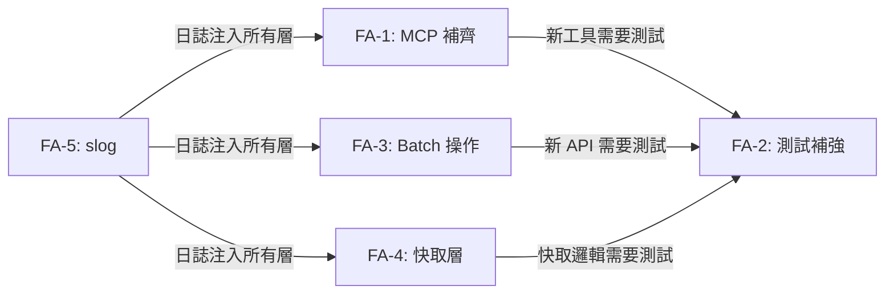

# S0 Brief Spec: gwx v0.8.0 全面升級

> **階段**: S0 需求討論
> **建立時間**: 2026-03-18 17:30
> **Agent**: requirement-analyst
> **Spec Mode**: Full Spec
> **工作類型**: new_feature + enhancement

---

## 0. 工作類型

**本次工作類型**：`new_feature`（新增基礎設施）+ `enhancement`（補齊既有功能暴露）

## 1. 一句話描述

將 gwx 從 v0.7.0 升級至 v0.8.0：補齊全部 MCP 工具（39→55+）、補強測試覆蓋、新增 batch 操作、加入記憶體快取層與結構化日誌。

## 2. 為什麼要做

### 2.1 痛點

- **MCP 工具不完整**：66 個 CLI 命令中有 16+ 未公開為 MCP 工具，AI agent 無法透過 MCP 協議使用 reply/update/download/template 等核心操作
- **測試覆蓋薄弱**：docs/calendar/contacts/tasks/chat/sheets 業務邏輯零 unit test，MCP 協議層零測試，無法保證重構安全
- **無 batch 操作**：agent 要上傳 10 個檔案需呼叫 10 次 drive_upload，效率低下
- **無快取層**：每次讀取都直接打 Google API，重複查詢浪費配額
- **無結構化日誌**：裸 `fmt.Print`，無法追蹤請求鏈路、無法觀測生產環境

### 2.2 目標

- MCP 工具完整覆蓋所有有意義的 CLI 命令
- 關鍵路徑有測試保護
- Agent 可一次呼叫完成批量操作
- 常用讀取操作有快取，減少 API 呼叫
- 日誌結構化，支援觀測與除錯

## 3. 使用者

| 角色 | 說明 |
|------|------|
| AI Agent | 透過 MCP 協議呼叫 gwx 工具操作 Google Workspace |
| CLI 使用者 | 直接使用 gwx 命令列操作 Google Workspace |
| 開發者 | 維護、測試、除錯 gwx 程式碼 |

## 4. 核心流程

> **閱讀順序**：功能區拆解 → 各 FA 詳細 → 例外處理

### 4.0 功能區拆解（Functional Area Decomposition）

#### 功能區識別表

| FA ID | 功能區名稱 | 一句話描述 | 入口 | 獨立性 |
|-------|-----------|-----------|------|--------|
| FA-1 | MCP 工具補齊 | 將 16+ 既有 CLI 命令公開為 MCP 工具定義 | MCP server 啟動時自動註冊 | 高 |
| FA-2 | 測試覆蓋補強 | 為 API 業務邏輯 + MCP 層新增 unit test | `go test ./...` | 中 |
| FA-3 | Batch 操作 | 新增 drive_batch_upload + sheets_batch_append | MCP/CLI 呼叫 | 高 |
| FA-4 | 記憶體快取層 | LRU + TTL 快取常用讀取操作 | API 層自動攔截 | 高 |
| FA-5 | 結構化日誌 | log/slog 替換所有 fmt.Print | 全域 | 高 |

#### 拆解策略

**本次策略**：`single_sop_fa_labeled`

5 個 FA 統一在 v0.8.0 release，按 FA 標籤組織。FA 間耦合低，S4 可按 FA 並行實作。

#### 跨功能區依賴



| 來源 FA | 目標 FA | 依賴類型 | 說明 |
|---------|---------|---------|------|
| FA-1 | FA-2 | 資料共用 | 新 MCP 工具需要對應測試 |
| FA-3 | FA-2 | 資料共用 | 新 batch API 需要測試 |
| FA-5 | FA-1,3,4 | 基礎設施 | slog 應先完成，其他 FA 使用 |

**建議實作順序**：FA-5 (slog) → FA-4 (cache) → FA-1 (MCP) + FA-3 (batch) 並行 → FA-2 (tests)

---

### 4.2 FA-1: MCP 工具補齊

#### 4.2.1 缺口清單

以下 CLI 命令需新增對應 MCP 工具：

| # | MCP 工具名稱 | 對應 CLI | API 方法 | 安全層級 |
|---|-------------|---------|---------|---------|
| 1 | `gmail_reply` | `gmail reply` | `SendMessage()` | 🔴 紅 |
| 2 | `calendar_list` | `calendar list` | `ListEvents()` | 🟢 綠 |
| 3 | `calendar_update` | `calendar update` | `UpdateEvent()` | 🟡 黃 |
| 4 | `contacts_list` | `contacts list` | `ListContacts()` | 🟢 綠 |
| 5 | `contacts_get` | `contacts get` | `GetContact()` | 🟢 綠 |
| 6 | `drive_download` | `drive download` | `DownloadFile()` | 🟢 綠 |
| 7 | `sheets_update` | `sheets update` | `UpdateValues()` | 🟡 黃 |
| 8 | `sheets_import` | `sheets import` | `ImportCSV()` | 🟡 黃 |
| 9 | `sheets_create` | `sheets create` | `CreateSpreadsheet()` | 🟡 黃 |
| 10 | `tasks_lists` | `tasks lists` | `ListTaskLists()` | 🟢 綠 |
| 11 | `tasks_complete` | `tasks complete` | `CompleteTask()` | 🟡 黃 |
| 12 | `tasks_delete` | `tasks delete` | `DeleteTask()` | 🔴 紅 |
| 13 | `docs_template` | `docs template` | `CreateFromTemplate()` | 🟡 黃 |
| 14 | `docs_from_sheet` | `docs from-sheet` | `CreateDocFromTable()` | 🟡 黃 |
| 15 | `docs_export` | `docs export` | `ExportDocument()` | 🟢 綠 |
| 16 | `chat_spaces` | `chat spaces` | `ListSpaces()` | 🟢 綠 |
| 17 | `chat_send` | `chat send` | `SendChatMessage()` | 🔴 紅 |
| 18 | `chat_messages` | `chat messages` | `ListMessages()` | 🟢 綠 |

#### 4.2.2 Happy Path 摘要

| 路徑 | 入口 | 結果 |
|------|------|------|
| MCP 工具呼叫 | Agent 發 MCP request → server dispatch → 執行對應 API | 回傳 JSON 結果 |

---

### 4.3 FA-2: 測試覆蓋補強

#### 4.3.1 測試範圍

| 層級 | 目標 | 測試類型 |
|------|------|---------|
| API 業務邏輯 | `docs.go`, `calendar.go`, `contacts.go`, `tasks.go`, `chat.go`, `sheets_smart.go` | Unit test (mock Google API) |
| MCP 協議層 | `tools.go`, `tools_extended.go` 工具註冊 + dispatch | Unit test |
| 新增工具 | FA-1 的 18 個新工具 | Unit test |
| 新增 batch | FA-3 的 batch 操作 | Unit test |
| 快取層 | FA-4 的 LRU + TTL | Unit test |

---

### 4.4 FA-3: Batch 操作

#### 4.4.1 新增工具

| 工具 | 描述 | 輸入 | 輸出 |
|------|------|------|------|
| `drive_batch_upload` | 一次上傳多個檔案 | `files: [{path, name, folder_id}]` | `[{file_id, name, url}]` |
| `sheets_batch_append` | 一次追加多個範圍 | `spreadsheet_id, ranges: [{range, values}]` | `{updated_ranges, total_rows}` |

> 注意：`gmail_batch_archive` 已存在（`gmail archive` 命令），不需新增。

---

### 4.5 FA-4: 記憶體快取層

#### 4.5.1 設計

- **實現**：Go 標準庫 `sync.Map` + TTL goroutine 清理
- **位置**：`internal/api/cache.go`（新檔案）
- **介面**：`Cache.Get(key) → (value, hit)` / `Cache.Set(key, value, ttl)`
- **快取對象**：

| 操作 | 預設 TTL | Cache Key |
|------|---------|-----------|
| `drive_list` | 5 min | `drive:list:{folder_id}:{page}` |
| `sheets_describe` | 10 min | `sheets:describe:{spreadsheet_id}:{sheet}` |
| `contacts_search` | 15 min | `contacts:search:{query}` |
| `sheets_info` | 10 min | `sheets:info:{spreadsheet_id}` |

- **失效策略**：寫入操作（append/update/create）自動清除對應資源的快取
- **CLI flag**：`--no-cache` 跳過快取

---

### 4.6 FA-5: 結構化日誌

#### 4.6.1 設計

- **實現**：`log/slog` 標準庫（Go 1.21+, gwx 使用 Go 1.22）
- **位置**：`internal/log/logger.go`（新檔案）
- **輸出**：stderr（不影響 JSON stdout）
- **格式**：JSON handler（MCP/agent 模式）或 Text handler（TTY 模式）
- **標準欄位**：`time`, `level`, `msg`, `service`（gmail/drive/...）, `operation`, `duration_ms`, `error`
- **Level 預設**：`INFO`，`--verbose` → `DEBUG`
- **注入點**：`RunContext` 建立時初始化，傳遞至所有 API 呼叫

---

### 4.7 例外流程

#### 4.7.1 六維度例外清單

| 維度 | ID | FA | 情境 | 觸發條件 | 預期行為 | 嚴重度 |
|------|-----|-----|------|---------|---------|--------|
| 並行/競爭 | E1 | FA-3 | batch 上傳部分成功部分失敗 | 網路中斷或配額耗盡 | 回傳已成功 + 失敗清單，不全部回滾 | P1 |
| 狀態轉換 | E2 | FA-4 | 快取資料過期但 API 不可用 | Google API 503 + cache miss | 返回過期資料 + 警告（graceful degradation） | P2 |
| 資料邊界 | E3 | FA-1 | drive_download 檔案超大 | 檔案 > 100MB | 回傳錯誤訊息，不嘗試下載 | P1 |
| 網路/外部 | E4 | 全域 | Google API rate limit | 429 Too Many Requests | 既有 retry + circuit breaker 機制處理 | P1 |
| 業務邏輯 | E5 | FA-1 | gmail_reply 找不到原始郵件 | message_id 無效或已刪除 | 回傳明確錯誤：message not found | P1 |
| 業務邏輯 | E6 | FA-3 | sheets_batch_append 部分範圍無效 | range 格式錯誤或 sheet 不存在 | 回傳已成功 + 失敗清單 | P1 |

#### 4.7.2 白話文摘要

這次升級讓 AI agent 能使用 gwx 的全部功能，不再受限於部分工具。批量操作讓 agent 更有效率，快取減少不必要的 API 呼叫，結構化日誌讓開發者能追蹤問題。最壞情況下 batch 操作部分失敗，系統會告訴你哪些成功哪些失敗，不會把所有結果丟掉。

## 5. 成功標準

| # | FA | 類別 | 標準 | 驗證方式 |
|---|-----|------|------|---------|
| 1 | FA-1 | 功能 | MCP 工具數 ≥ 55 | 計算 `registerTools()` 中的工具數 |
| 2 | FA-1 | 功能 | 所有新工具可透過 MCP 協議呼叫 | MCP 測試 |
| 3 | FA-2 | 品質 | `go test ./...` 全部通過 | CI |
| 4 | FA-2 | 品質 | 新增測試檔 ≥ 5 | 檔案計數 |
| 5 | FA-3 | 功能 | `drive_batch_upload` 可一次上傳多檔 | Unit test |
| 6 | FA-3 | 功能 | `sheets_batch_append` 可一次追加多範圍 | Unit test |
| 7 | FA-4 | 效能 | 重複讀取操作命中快取，不發 API | Unit test + log 驗證 |
| 8 | FA-5 | 觀測 | 所有 API 呼叫有 slog 紀錄 | grep slog 呼叫點 |
| 9 | 全域 | 版本 | `version.go` = `0.8.0` | 檢查 |

## 6. 範圍

### 範圍內
- **FA-1**: 新增 18 個 MCP 工具定義（`tools_extended.go` 或新 `tools_v2.go`）
- **FA-2**: 新增 API 層 + MCP 層 unit test
- **FA-3**: 新增 `drive_batch_upload` + `sheets_batch_append`（API + CLI + MCP）
- **FA-4**: 新增 `internal/api/cache.go`，整合至常用讀取操作
- **FA-5**: 新增 `internal/log/logger.go`，替換所有 `fmt.Print` 日誌
- **全域**: version bump 0.7.0 → 0.8.0

### 範圍外
- Web UI / GUI
- Persistent 磁碟快取（僅記憶體快取）
- 新的 Google API 服務整合（如 Google Meet, Admin SDK）
- Gmail batch archive（已存在）
- 效能 benchmark

## 7. 已知限制與約束

- Go 1.22（已支援 `log/slog`）
- Google API 配額限制（rate limiter 已處理）
- drive_download 檔案大小限制（記憶體載入，建議上限 100MB）
- MCP 工具安全層級需與 `skill/google-workspace.md` 保持一致

## 10. SDD Context

```json
{
  "sdd_context": {
    "stages": {
      "s0": {
        "status": "confirmed",
        "agent": "requirement-analyst",
        "output": {
          "brief_spec_path": "dev/specs/v0.8.0-full-upgrade/s0_brief_spec.md",
          "work_type": "new_feature",
          "requirement": "gwx v0.8.0 全面升級：MCP 工具補齊、測試覆蓋、batch 操作、快取層、結構化日誌",
          "pain_points": [
            "16+ CLI 命令未公開為 MCP 工具",
            "業務邏輯零 unit test",
            "無 batch 操作",
            "無快取層",
            "裸 fmt.Print 無結構化日誌"
          ],
          "goal": "v0.8.0 完整升級，MCP 55+ 工具、測試覆蓋、batch、cache、slog",
          "success_criteria": [
            "MCP 工具 ≥ 55",
            "go test ./... 全部通過",
            "batch upload/append 可用",
            "常用讀取有快取",
            "所有日誌走 slog"
          ],
          "scope_in": [
            "FA-1: 18 個新 MCP 工具",
            "FA-2: API + MCP 層 unit test",
            "FA-3: drive_batch_upload + sheets_batch_append",
            "FA-4: 記憶體 LRU 快取",
            "FA-5: log/slog 結構化日誌",
            "version bump 0.8.0"
          ],
          "scope_out": [
            "Web UI",
            "磁碟快取",
            "新 Google API 服務",
            "gmail batch archive（已存在）"
          ],
          "constraints": [
            "Go 1.22",
            "Google API 配額限制",
            "drive_download 100MB 上限"
          ],
          "functional_areas": [
            {"id": "FA-1", "name": "MCP 工具補齊", "description": "公開 16+ CLI 命令為 MCP 工具", "independence": "high"},
            {"id": "FA-2", "name": "測試覆蓋補強", "description": "API + MCP 層 unit test", "independence": "medium"},
            {"id": "FA-3", "name": "Batch 操作", "description": "drive_batch_upload + sheets_batch_append", "independence": "high"},
            {"id": "FA-4", "name": "記憶體快取層", "description": "LRU + TTL 快取常用讀取", "independence": "high"},
            {"id": "FA-5", "name": "結構化日誌", "description": "log/slog 替換 fmt.Print", "independence": "high"}
          ],
          "decomposition_strategy": "single_sop_fa_labeled",
          "child_sops": []
        }
      }
    }
  }
}
```
