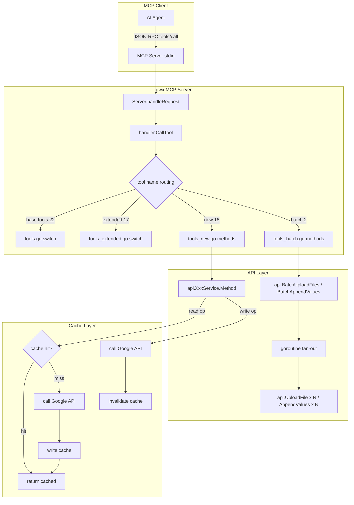
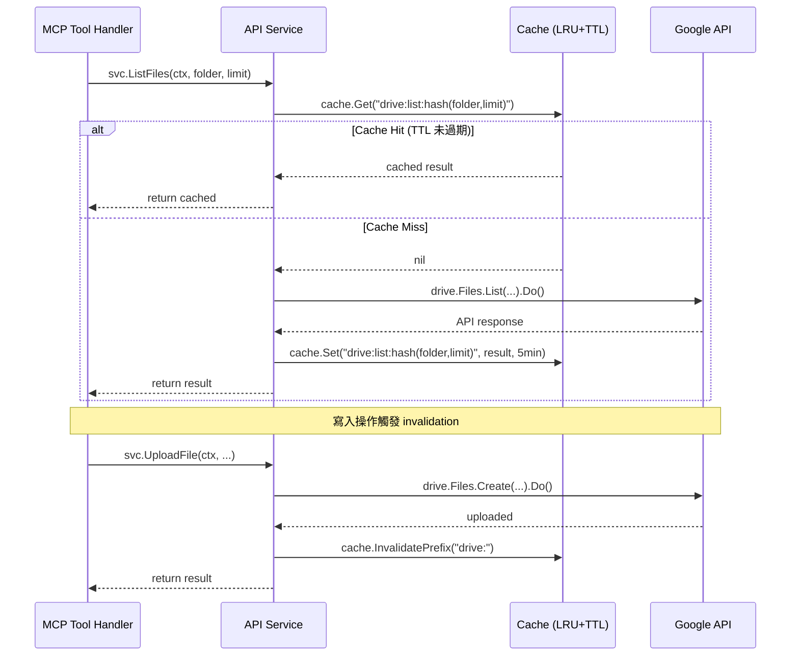
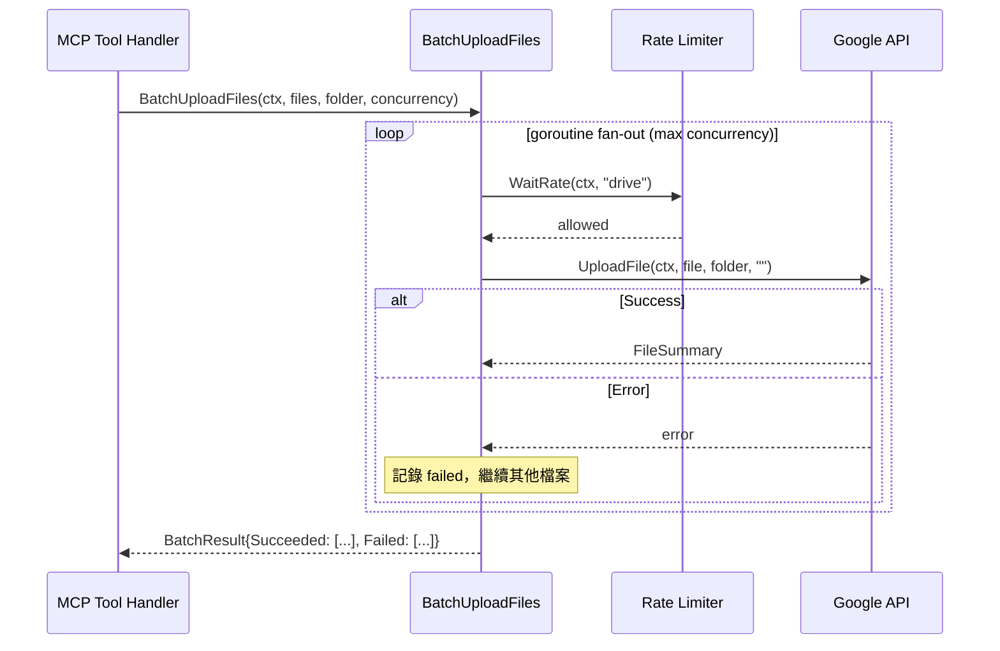

# S1 Dev Spec: gwx v0.8.0 Full Upgrade

> **階段**: S1 技術分析
> **建立時間**: 2026-03-18 18:30
> **Agent**: codebase-explorer (Phase 1) + architect (Phase 2)
> **工作類型**: new_feature
> **複雜度**: L

---

## 1. 概述

### 1.1 需求參照
> 完整需求見 `s0_brief_spec.md`，以下僅摘要。

gwx v0.8.0 全面升級：補齊 18 個 MCP 工具（39 to 59）、建立 API + MCP 層 unit test、新增 batch 操作（drive_batch_upload + sheets_batch_append）、引入記憶體 LRU+TTL 快取層、以 log/slog 取代裸 fmt.Fprintf 實現結構化日誌。

### 1.2 技術方案摘要

分 5 個 Functional Area 依序實施：

1. **FA-5 slog**（基礎設施）：新增 `internal/log/logger.go` 封裝 slog 初始化，替換 6 處 `fmt.Fprintf(os.Stderr)`（含 protocol.go 2 處），MCP server 和 CLI 各自初始化 handler（JSON/Text），注入 RunContext。
2. **FA-4 cache**（基礎設施）：新增 `internal/api/cache.go` 實作 LRU+TTL 快取，Client struct 注入 cache 欄位，讀取操作查快取、寫入操作清快取。純 stdlib（container/list + sync.Mutex）。
3. **FA-1 MCP tools**（功能擴展）：18 個新工具，所有 API 方法已存在，只需在 MCP 層新增工具定義 + handler 方法。新建 `internal/mcp/tools_new.go`。
4. **FA-3 batch**（功能擴展）：goroutine fan-out 並行呼叫既有 API 方法，partial success 語義。新建 `internal/api/drive_batch.go` + `internal/api/sheets_batch.go` + `internal/mcp/tools_batch.go`。
5. **FA-2 tests**（品質保障）：API 層 + MCP 層 unit test，mock Client interface。
6. **Version bump**：`0.7.0` to `0.8.0`。

---

## 2. 影響範圍（Phase 1：codebase-explorer）

### 2.1 受影響檔案

#### 新增檔案

| 檔案 | FA | 說明 |
|------|-----|------|
| `internal/log/logger.go` | FA-5 | slog 封裝：NewLogger(), SetupMCPLogger(), SetupCLILogger() |
| `internal/api/cache.go` | FA-4 | LRU+TTL 快取：Cache struct, Get/Set/Invalidate/InvalidatePrefix |
| `internal/api/cache_test.go` | FA-4 | 快取 unit test |
| `internal/mcp/tools_new.go` | FA-1 | 18 個新 MCP 工具定義 + handler 方法 |
| `internal/mcp/tools_batch.go` | FA-3 | drive_batch_upload + sheets_batch_append 工具定義 + handler |
| `internal/api/drive_batch.go` | FA-3 | BatchUploadFiles() goroutine fan-out |
| `internal/api/sheets_batch.go` | FA-3 | BatchAppendValues() goroutine fan-out |
| `internal/api/drive_batch_test.go` | FA-2 | batch upload unit test |
| `internal/api/sheets_batch_test.go` | FA-2 | batch append unit test |
| `internal/mcp/tools_test.go` | FA-2 | MCP tool handler unit test |

#### 修改檔案

| 檔案 | FA | 變更類型 | 說明 |
|------|-----|---------|------|
| `internal/api/client.go` | FA-4 | 修改 | 加 `cache *Cache` 欄位、`NoCache bool` 選項、NewClient 初始化 cache |
| `internal/api/drive.go` | FA-1, FA-4 | 修改 | ListFiles/SearchFiles 加快取；DownloadFile Fields 加 size（100MB pre-check） |
| `internal/api/sheets.go` | FA-4 | 修改 | ReadRange/DescribeSheet 加快取查詢；AppendValues/UpdateValues 加快取清除 |
| `internal/api/contacts.go` | FA-4 | 修改 | SearchContacts/ListContacts 加快取查詢 |
| `internal/mcp/tools.go` | FA-1 | 修改 | ListTools 合併 NewTools()；CallTool switch 加 18 個新 case |
| `internal/mcp/tools_extended.go` | FA-1 | 修改 | CallExtendedTool 加 2 個 batch case |
| `internal/cmd/mcpserver.go` | FA-5 | 修改 | fmt.Fprintf to slog |
| `internal/cmd/root.go` | FA-4/FA-5 | 修改 | RunContext 加 Logger；CLI 加 --no-cache flag；初始化 slog |
| `internal/output/formatter.go` | FA-5 | 修改 | fmt.Fprintf to slog |
| `internal/mcp/protocol.go` | FA-5 | 修改 | 2 處 fmt.Fprintf to slog（序列化錯誤路徑） |
| `internal/cmd/version.go` | VER | 修改 | `const version = "0.8.0"` |
| `internal/cmd/cli_test.go` | VER | 修改 | version 斷言更新 |

### 2.2 依賴關係

- **上游依賴**：所有 18 個 API 方法已存在於 `internal/api/` 各檔案（已驗證）
- **下游影響**：MCP handler 增加工具後，Claude Desktop / AI agent 可呼叫新工具
- **外部依賴**：無新依賴。log/slog、container/list、sync.Mutex 全為 Go stdlib

### 2.3 現有模式與技術考量

**MCP 工具模式**（必須遵循）：
```go
// 1. ListTools 中定義 InputSchema
{Name: "tool_name", Description: "...", InputSchema: InputSchema{...}}
// 2. CallTool switch case 路由
case "tool_name": return h.toolName(ctx, args)
// 3. handler method 實作
func (h *GWXHandler) toolName(ctx context.Context, args map[string]interface{}) (*ToolResult, error) {
    svc := api.NewXxxService(h.client)
    // 呼叫 API
    return jsonResult(result)
}
```

**API Service 模式**（必須遵循）：
```go
func (svc *XxxService) Method(ctx context.Context, ...) (Result, error) {
    svc.client.WaitRate(ctx, "service_name")
    opts, _ := svc.client.ClientOptions(ctx, "service_name")
    googleSvc, _ := xxx.NewService(ctx, opts...)
    // 呼叫 API
}
```

**Helper 函式**：`strArg()`, `intArg()`, `boolArg()`, `splitArg()`, `jsonResult()` 定義在 tools.go。

---

## 3. User Flow（Phase 2：architect）

### 3.1 FA-1/FA-3 MCP 工具呼叫流程



### 3.2 FA-5 slog 初始化流程

| 步驟 | 觸發 | 系統行為 | 備註 |
|------|------|---------|------|
| 1 | `gwx mcp-server` 啟動 | 初始化 JSON slog handler → os.Stderr | MCP stdout 不能被污染 |
| 2 | `gwx <any-cmd>` 啟動 | 初始化 Text slog handler → os.Stderr（TTY）或 JSON handler（pipe） | isatty 判斷 |
| 3 | 命令執行中遇錯 | `slog.Error("message", "key", value)` | 結構化 key-value |

### 3.3 異常流程

| ID | 情境 | 觸發條件 | 系統處理 | 用戶看到 |
|----|------|---------|---------|---------|
| E1 | batch 部分失敗 | N 個檔案上傳，部分失敗 | 收集 succeeded + failed 清單 | `{"succeeded": [...], "failed": [{"file": "x", "error": "y"}]}` |
| E2 | 快取返回過期資料 | write 操作後快取未清除（bug） | write 操作完成後 invalidate 對應 prefix | 透過 `--no-cache` flag 繞過 |
| E3 | drive_download 超過 100MB | 檔案大小超限 | pre-check file size via metadata | `{"error": "file size 150MB exceeds 100MB limit"}` |
| E4 | slog 寫入 stdout | handler 誤設 | 強制約束 handler.Writer = os.Stderr | MCP JSON-RPC 協議損壞 |

---

## 4. Data Flow

### 4.1 FA-4 Cache Data Flow



### 4.2 FA-3 Batch Data Flow



### 4.3 API 契約（MCP 工具 InputSchema）

此專案無 REST API，MCP 工具即 API 契約。完整 InputSchema 見下方 Section 4.4。

### 4.4 FA-1 新增 18 個 MCP 工具 InputSchema

#### Gmail

| # | 工具名稱 | 參數 | 類型 | 必填 | 說明 |
|---|---------|------|------|------|------|
| 1 | `gmail_reply` | `message_id` | string | Y | 要回覆的訊息 ID |
| | | `body` | string | Y | 回覆內容 |
| | | `reply_all` | boolean | N | 是否全部回覆（預設 false） |
| | | `cc` | string | N | 額外 CC，逗號分隔 |

#### Calendar

| # | 工具名稱 | 參數 | 類型 | 必填 | 說明 |
|---|---------|------|------|------|------|
| 2 | `calendar_list` | `time_min` | string | N | 開始時間 RFC3339（預設 now） |
| | | `time_max` | string | N | 結束時間 RFC3339（預設 now+7d） |
| | | `max_results` | integer | N | 上限（預設 50） |
| | | `calendar_id` | string | N | 日曆 ID（預設 primary） |
| 3 | `calendar_update` | `event_id` | string | Y | 事件 ID |
| | | `title` | string | N | 新標題 |
| | | `start` | string | N | 新開始時間 |
| | | `end` | string | N | 新結束時間 |
| | | `location` | string | N | 新地點 |
| | | `attendees` | string | N | 新出席者，逗號分隔 |
| | | `calendar_id` | string | N | 日曆 ID（預設 primary） |

#### Contacts

| # | 工具名稱 | 參數 | 類型 | 必填 | 說明 |
|---|---------|------|------|------|------|
| 4 | `contacts_list` | `limit` | integer | N | 上限（預設 50） |
| 5 | `contacts_get` | `resource_name` | string | Y | 聯絡人 resource name（如 people/c123） |

#### Drive

| # | 工具名稱 | 參數 | 類型 | 必填 | 說明 |
|---|---------|------|------|------|------|
| 6 | `drive_download` | `file_id` | string | Y | 檔案 ID |
| | | `output_path` | string | N | 輸出路徑（預設 /tmp/{filename}） |

#### Sheets

| # | 工具名稱 | 參數 | 類型 | 必填 | 說明 |
|---|---------|------|------|------|------|
| 7 | `sheets_update` | `spreadsheet_id` | string | Y | 試算表 ID |
| | | `range` | string | Y | 範圍 |
| | | `values` | string | Y | JSON 二維陣列 |
| 8 | `sheets_import` | `spreadsheet_id` | string | Y | 試算表 ID |
| | | `range` | string | Y | 匯入範圍 |
| | | `path` | string | Y | 本地檔案路徑 |
| | | `format` | string | N | csv 或 tsv（預設 csv） |
| 9 | `sheets_create` | `title` | string | Y | 試算表標題 |

#### Tasks

| # | 工具名稱 | 參數 | 類型 | 必填 | 說明 |
|---|---------|------|------|------|------|
| 10 | `tasks_lists` | (無參數) | - | - | 列出所有 task list |
| 11 | `tasks_complete` | `task_id` | string | Y | 任務 ID |
| | | `list_id` | string | N | 任務清單 ID（預設 @default） |
| 12 | `tasks_delete` | `task_id` | string | Y | 任務 ID |
| | | `list_id` | string | N | 任務清單 ID（預設 @default） |

#### Docs

| # | 工具名稱 | 參數 | 類型 | 必填 | 說明 |
|---|---------|------|------|------|------|
| 13 | `docs_template` | `template_id` | string | Y | 模板文件 ID |
| | | `title` | string | Y | 新文件標題 |
| | | `vars` | string | N | JSON 物件 `{"key": "value"}` 替換模板變數 |
| 14 | `docs_from_sheet` | `title` | string | Y | 文件標題 |
| | | `headers` | string | Y | JSON 陣列 `["col1","col2"]` |
| | | `rows` | string | Y | JSON 二維陣列 `[["a","b"],["c","d"]]` |
| 15 | `docs_export` | `doc_id` | string | Y | 文件 ID |
| | | `format` | string | N | pdf, docx, txt, html（預設 pdf） |
| | | `output_path` | string | N | 輸出路徑（預設 /tmp/{title}.{format}） |

#### Chat

| # | 工具名稱 | 參數 | 類型 | 必填 | 說明 |
|---|---------|------|------|------|------|
| 16 | `chat_spaces` | `limit` | integer | N | 上限（預設 50） |
| 17 | `chat_send` | `space` | string | Y | Space name（如 spaces/xxx） |
| | | `text` | string | Y | 訊息內容 |
| 18 | `chat_messages` | `space` | string | Y | Space name |
| | | `limit` | integer | N | 上限（預設 25） |

### 4.5 FA-3 Batch 工具 InputSchema

| # | 工具名稱 | 參數 | 類型 | 必填 | 說明 |
|---|---------|------|------|------|------|
| 19 | `drive_batch_upload` | `paths` | string | Y | 本地檔案路徑，逗號分隔 |
| | | `folder` | string | N | 目標資料夾 ID |
| | | `concurrency` | integer | N | 並行數（預設 3，上限 5） |
| 20 | `sheets_batch_append` | `spreadsheet_id` | string | Y | 試算表 ID |
| | | `entries` | string | Y | JSON 陣列 `[{"range":"Sheet1!A:C","values":[[...]]}, ...]` |
| | | `concurrency` | integer | N | 並行數（預設 3，上限 5） |

### 4.6 FA-3 Batch 回傳格式

```json
// drive_batch_upload 回傳
{
  "total": 5,
  "succeeded": [
    {"path": "/tmp/a.pdf", "file_id": "xxx", "name": "a.pdf"}
  ],
  "failed": [
    {"path": "/tmp/b.pdf", "error": "file not found"}
  ]
}

// sheets_batch_append 回傳
{
  "total": 3,
  "succeeded": [
    {"range": "Sheet1!A:C", "updated_rows": 5}
  ],
  "failed": [
    {"range": "Sheet2!A:B", "error": "range not found"}
  ]
}
```

### 4.7 FA-4 Cache 資料模型

```go
// internal/api/cache.go

type CacheConfig struct {
    MaxEntries int           // LRU 上限，預設 256
    DefaultTTL time.Duration // 預設 5 分鐘
}

type Cache struct {
    mu       sync.Mutex
    entries  map[string]*list.Element
    eviction *list.List
    config   CacheConfig
}

type cacheEntry struct {
    key       string
    value     interface{}
    expiresAt time.Time
}

// 方法
func NewCache(cfg CacheConfig) *Cache
func (c *Cache) Get(key string) (interface{}, bool)
func (c *Cache) Set(key string, value interface{}, ttl time.Duration)
func (c *Cache) Invalidate(key string)
func (c *Cache) InvalidatePrefix(prefix string)
func (c *Cache) Len() int
```

**快取 Key 策略**：`{service}:{method}:{sha256(json(params))[:16]}`

**TTL 配置表**：

| 操作 | TTL | 理由 |
|------|-----|------|
| drive_list / drive_search | 5 min | 檔案列表變動頻率低 |
| sheets_read / sheets_describe | 10 min | 表格結構較穩定 |
| sheets_info | 10 min | metadata 極少變動 |
| contacts_search / contacts_list | 15 min | 通訊錄幾乎不變 |
| calendar_list (calendar_agenda) | 2 min | 行程可能頻繁變動 |

**快取清除規則**：

| 寫入操作 | 清除 prefix |
|---------|------------|
| drive_upload / drive_batch_upload | `drive:` |
| sheets_append / sheets_update / sheets_batch_append / sheets_clear / sheets_smart_append | `sheets:` |
| calendar_create / calendar_update / calendar_delete | `calendar:` |

> **快取清除實作層級**：清除邏輯在 **API Service 層**實作（如 `AppendValues()` 內部呼叫 `InvalidatePrefix("sheets:")`）。
> 這意味著 `ImportFromFile()` → `ImportCSV()` → `AppendValues()` 會自動觸發快取清除，不需在 MCP handler 層重複處理。
> **Docs 和 Tasks 服務**不需要快取清除，因為它們的讀取操作（`docs_get`、`tasks_list`）不在快取對象中。

### 4.8 FA-5 slog 設計

```go
// internal/log/logger.go

// SetupMCPLogger 回傳 JSON handler → os.Stderr（MCP mode 專用）
func SetupMCPLogger() *slog.Logger

// SetupCLILogger 根據 os.Stderr 是否 TTY 選擇 Text/JSON handler
func SetupCLILogger() *slog.Logger

// 兩者都強制寫入 os.Stderr，不碰 stdout
```

**替換清單**：

| 檔案 | 行 | 現有 | 替換為 |
|------|-----|------|--------|
| `internal/cmd/mcpserver.go` | 23 | `fmt.Fprintf(os.Stderr, "gwx mcp-server: not authenticated...")` | `slog.Error("not authenticated", "hint", "run gwx onboard")` |
| `internal/cmd/mcpserver.go` | 31 | `fmt.Fprintf(os.Stderr, "gwx MCP server started (stdio)\n")` | `slog.Info("MCP server started", "transport", "stdio")` |
| `internal/cmd/root.go` | 72 | `fmt.Fprintf(os.Stderr, "error: %v\n", err)` | `slog.Error("command failed", "error", err)` |
| `internal/output/formatter.go` | 135 | `fmt.Fprintf(os.Stderr, "error: %s\n", msg)` | `slog.Error("output error", "message", msg)` |
| `internal/mcp/protocol.go` | 194 | `fmt.Fprintf(os.Stderr, "gwx mcp: failed to marshal result: %v\n", err)` | `slog.Error("failed to marshal result", "error", err)` |
| `internal/mcp/protocol.go` | 211 | `fmt.Fprintf(os.Stderr, "gwx mcp: failed to marshal error response: %v\n", err)` | `slog.Error("failed to marshal error response", "error", err)` |

**保留不動**（互動式 URL 輸出）：
- `internal/auth/oauth.go:149` — 互動式 browser URL 提示
- `internal/auth/oauth.go:223` — 互動式 browser URL 提示

---

## 5. 任務清單

### 5.1 任務總覽

| # | 任務 | FA | 類型 | 複雜度 | Agent | 依賴 |
|---|------|----|------|--------|-------|------|
| 1 | slog 封裝 + 替換 | FA-5 | 後端 | S | go-expert | - |
| 2 | LRU+TTL 快取實作 | FA-4 | 後端 | M | go-expert | - |
| 3 | 快取注入 API Service | FA-4 | 後端 | M | go-expert | #2 |
| 4 | 18 個 MCP 工具定義 + handler | FA-1 | 後端 | L | go-expert | - |
| 5 | drive_batch_upload 實作 | FA-3 | 後端 | M | go-expert | - |
| 6 | sheets_batch_append 實作 | FA-3 | 後端 | M | go-expert | - |
| 7 | batch MCP 工具定義 + handler | FA-3 | 後端 | S | go-expert | #5, #6 |
| 8 | API 層 unit test | FA-2 | 測試 | M | go-expert | #2, #3, #5, #6 |
| 9 | MCP 層 unit test | FA-2 | 測試 | M | go-expert | #4, #7 |
| 10 | Version bump + 整合驗證 | VER | 後端 | S | go-expert | #1~#9 |

### 5.2 任務詳情

#### Task #1: slog 封裝 + 替換
- **類型**: 後端
- **複雜度**: S
- **Agent**: go-expert
- **FA**: FA-5
- **描述**: 新建 `internal/log/logger.go`，提供 `SetupMCPLogger()` 和 `SetupCLILogger()`。替換 4 處 `fmt.Fprintf(os.Stderr)` 為 slog 呼叫。RunContext 加 `Logger *slog.Logger` 欄位。
- **DoD**:
  - [ ] `internal/log/logger.go` 建立，兩個 setup 函式正確回傳 slog.Logger
  - [ ] 6 處 fmt.Fprintf 替換為 slog.Error/slog.Info（含 protocol.go 2 處）
  - [ ] MCP server 模式下 slog handler 輸出到 os.Stderr（不碰 stdout）
  - [ ] CLI 模式下根據 isatty 選擇 Text/JSON handler
  - [ ] oauth.go 的 2 處 fmt.Fprintf 保持不動
  - [ ] `go build ./...` 通過
- **驗收方式**: `gwx mcp-server` 啟動時 stderr 出現 JSON 格式日誌，stdout 只有 JSON-RPC

#### Task #2: LRU+TTL 快取實作
- **類型**: 後端
- **複雜度**: M
- **Agent**: go-expert
- **FA**: FA-4
- **描述**: 新建 `internal/api/cache.go`，實作 Cache struct（sync.Mutex + container/list + map）。支援 Get/Set/Invalidate/InvalidatePrefix/Len。TTL 過期條目在 Get 時 lazy 清除。LRU 在 MaxEntries 滿時淘汰最舊條目。
- **DoD**:
  - [ ] Cache struct 實作完成，所有方法 thread-safe
  - [ ] Get 正確處理 TTL 過期（返回 miss）
  - [ ] LRU 淘汰邏輯正確
  - [ ] InvalidatePrefix 正確清除所有匹配 key
  - [ ] `internal/api/cache_test.go` 覆蓋：set/get、TTL 過期、LRU 淘汰、InvalidatePrefix、concurrent access
- **驗收方式**: `go test ./internal/api/ -run TestCache -v` 全部通過

#### Task #3: 快取注入 API Service
- **類型**: 後端
- **複雜度**: M
- **Agent**: go-expert
- **FA**: FA-4
- **依賴**: Task #2
- **描述**: Client struct 加 `cache *Cache` 和 `NoCache bool` 欄位。CLI 加 `--no-cache` flag。各 API service 的讀取方法在呼叫前查快取、miss 後寫快取。寫入方法完成後 InvalidatePrefix。
- **DoD**:
  - [ ] Client struct 有 cache 欄位，NewClient 初始化 cache（MaxEntries=256, DefaultTTL=5min）
  - [ ] `--no-cache` flag 加入 CLI struct，傳遞到 Client.NoCache
  - [ ] drive: ListFiles, SearchFiles 加快取（TTL 5min）
  - [ ] sheets: ReadRange, DescribeSheet, GetInfo 加快取（TTL 10min）
  - [ ] contacts: SearchContacts, ListContacts 加快取（TTL 15min）
  - [ ] calendar: Agenda, ListEvents 加快取（TTL 2min）
  - [ ] 所有寫入方法加 InvalidatePrefix
  - [ ] NoCache=true 時跳過所有快取邏輯
  - [ ] `go build ./...` 通過
- **驗收方式**: 連續兩次呼叫 drive_list，第二次不發 API 請求（可由日誌或 test mock 驗證）

#### Task #4: 18 個 MCP 工具定義 + handler
- **類型**: 後端
- **複雜度**: L
- **Agent**: go-expert
- **FA**: FA-1
- **描述**: 新建 `internal/mcp/tools_new.go`，定義 18 個工具的 InputSchema + handler 方法。在 `tools.go` 的 `ListTools()` 中合併 `NewTools()`；在 `CallTool` switch 中加入 18 個新 case（或委派到 CallNewTool）。
- **DoD**:
  - [ ] 18 個工具的 InputSchema 定義完成，參數名/類型/必填與 4.4 表格一致
  - [ ] 18 個 handler 方法實作完成，呼叫對應 API Service 方法
  - [ ] gmail_reply: 支援 reply_all 參數
  - [ ] drive_download: 修改 `drive.go` DownloadFile() 的 Fields 加入 `size`，pre-check 100MB 限制
  - [ ] docs_template: vars 參數為 JSON string，解析為 map[string]string
  - [ ] docs_from_sheet: headers + rows 為 JSON string，解析為對應類型
  - [ ] CallTool 能正確路由所有 18 個新工具
  - [ ] `go build ./...` 通過
  - [ ] MCP `tools/list` 回傳 59+ 工具
  - [ ] calendar_list vs calendar_agenda 差異備註：list 支援指定 calendar_id + 自訂時間範圍；agenda 是快捷方式（primary + days）
- **驗收方式**: `gwx mcp-server` 啟動後，`tools/list` JSON-RPC 請求回傳 >= 59 個工具（39 + 18 + 2 batch）

#### Task #5: drive_batch_upload 實作
- **類型**: 後端
- **複雜度**: M
- **Agent**: go-expert
- **FA**: FA-3
- **描述**: 新建 `internal/api/drive_batch.go`，實作 `BatchUploadFiles(ctx, paths []string, folder string, concurrency int) (*BatchUploadResult, error)`。使用 goroutine fan-out + semaphore 控制並行度，複用既有 `UploadFile()`。Partial success 語義：不因單一失敗中止。
- **DoD**:
  - [ ] BatchUploadFiles 實作完成
  - [ ] semaphore 控制並行度（上限 5）
  - [ ] 部分失敗不中止，回傳 succeeded + failed 清單
  - [ ] 每個 goroutine 遵守 rate limiter（UploadFile 內部已有 WaitRate）
  - [ ] BatchUploadResult struct 定義符合 4.6 回傳格式
  - [ ] `go build ./...` 通過
- **驗收方式**: unit test mock 5 個檔案上傳、其中 1 個失敗，驗證 succeeded=4 failed=1

#### Task #6: sheets_batch_append 實作
- **類型**: 後端
- **複雜度**: M
- **Agent**: go-expert
- **FA**: FA-3
- **描述**: 新建 `internal/api/sheets_batch.go`，實作 `BatchAppendValues(ctx, spreadsheetID string, entries []BatchAppendEntry, concurrency int) (*BatchAppendResult, error)`。同一 spreadsheet 的多個 range 並行 append。
- **DoD**:
  - [ ] BatchAppendValues 實作完成
  - [ ] BatchAppendEntry struct: `{Range string, Values [][]interface{}}`
  - [ ] semaphore 控制並行度（上限 5）
  - [ ] 部分失敗回傳 succeeded + failed
  - [ ] BatchAppendResult struct 定義符合 4.6 回傳格式
  - [ ] `go build ./...` 通過
- **驗收方式**: unit test mock 3 個 range append、其中 1 個失敗，驗證 succeeded=2 failed=1

#### Task #7: batch MCP 工具定義 + handler
- **類型**: 後端
- **複雜度**: S
- **Agent**: go-expert
- **FA**: FA-3
- **依賴**: Task #5, #6
- **描述**: 新建 `internal/mcp/tools_batch.go`，定義 `drive_batch_upload` + `sheets_batch_append` 的 InputSchema + handler 方法。在 CallExtendedTool 或 CallTool 加入路由。
- **DoD**:
  - [ ] 2 個 batch 工具 InputSchema 定義完成，符合 4.5 表格
  - [ ] handler 解析 paths（逗號分隔）和 entries（JSON 陣列）
  - [ ] concurrency 上限 cap 為 5
  - [ ] CallTool 能正確路由
  - [ ] `go build ./...` 通過
- **驗收方式**: `tools/list` 包含 drive_batch_upload 和 sheets_batch_append

#### Task #8: API 層 unit test
- **類型**: 測試
- **複雜度**: M
- **Agent**: go-expert
- **FA**: FA-2
- **依賴**: Task #2, #3, #5, #6
- **描述**: 為 cache、drive_batch、sheets_batch 撰寫 unit test。Cache 測試在 Task #2 已含。Batch 測試需 mock API client（interface extraction 或 httptest）。
- **DoD**:
  - [ ] `internal/api/cache_test.go` 覆蓋所有 cache 行為（已在 Task #2）
  - [ ] `internal/api/drive_batch_test.go` 覆蓋 batch upload 正常 + 部分失敗
  - [ ] `internal/api/sheets_batch_test.go` 覆蓋 batch append 正常 + 部分失敗
  - [ ] `go test ./internal/api/... -v` 全部通過
- **驗收方式**: `go test ./internal/api/... -count=1 -v` 全通過

#### Task #9: MCP 層 unit test
- **類型**: 測試
- **複雜度**: M
- **Agent**: go-expert
- **FA**: FA-2
- **依賴**: Task #4, #7
- **描述**: 為 MCP tools 撰寫 unit test。建立 mock handler 或使用 table-driven test 驗證 CallTool routing、參數解析、錯誤處理。
- **DoD**:
  - [ ] `internal/mcp/tools_test.go` 建立
  - [ ] 測試 ListTools 回傳數量 >= 59
  - [ ] 測試 CallTool routing：已知工具正確分派、未知工具回傳 error
  - [ ] 測試至少 3 個代表性工具的參數解析（gmail_reply, drive_batch_upload, sheets_create）
  - [ ] `go test ./internal/mcp/... -v` 全部通過
- **驗收方式**: `go test ./internal/mcp/... -count=1 -v` 全通過

#### Task #10: Version bump + 整合驗證
- **類型**: 後端
- **複雜度**: S
- **Agent**: go-expert
- **FA**: VER
- **依賴**: Task #1~#9
- **描述**: `internal/cmd/version.go` 改 `const version = "0.8.0"`。`internal/cmd/cli_test.go` 更新 version 斷言。`internal/mcp/protocol.go` 的 ServerInfo.Version 更新為 `"0.8.0"`。執行 `go test ./...` 全通過。
- **DoD**:
  - [ ] version.go: `const version = "0.8.0"`
  - [ ] protocol.go handleRequest: ServerInfo Version `"0.8.0"`
  - [ ] cli_test.go version 斷言更新
  - [ ] `go test ./...` 全部通過
  - [ ] `go build ./...` 通過
  - [ ] `gwx version` 輸出 0.8.0
- **驗收方式**: `go test ./... && gwx version` 輸出 0.8.0

---

## 6. 技術決策

### 6.1 架構決策

| 決策點 | 選項 | 選擇 | 理由 |
|--------|------|------|------|
| FA-3 batch 實作策略 | A: HTTP batch API / B: goroutine fan-out | B | Google 已棄用通用 batch HTTP endpoint，SDK 無封裝。rate limiter 已 thread-safe，fan-out 安全可行。 |
| FA-4 cache 庫 | A: 第三方（groupcache/ristretto）/ B: 純 stdlib | B | 需求簡單（process 級、LRU+TTL），不值得引入外部依賴。container/list + sync.Mutex 足夠。 |
| FA-4 cache key | A: 原始參數拼接 / B: `service:method:sha256(params)[:16]` | B | 避免 key 過長，sha256 前 16 字元碰撞機率極低。 |
| FA-1 新工具檔案 | A: 全塞 tools_extended.go / B: 新建 tools_new.go | B | tools_extended.go 已有 17 個工具 400+ 行，再加 18 個會超過 800 行不可維護。 |
| FA-5 slog handler | A: 全用 JSON / B: TTY=Text, pipe=JSON | B | 人類看 Text 更直覺，AI agent 看 JSON 更好解析。 |
| FA-1 gmail_reply reply_all | A: 不暴露 / B: 暴露 bool 參數 | B | API 層 SendInput.ReplyAll 已存在，MCP 工具應完整暴露。 |
| FA-3 batch 部分失敗 | A: 全部中止 / B: partial success | B | batch 操作的核心價值是批量處理，一個失敗不應影響其他。回傳 succeeded + failed 清單讓 agent 決定如何處理。 |
| FA-4 drive_download 大小限制 | A: 無限制 / B: 100MB pre-check | B | MCP 回傳是文字，超大檔案無意義。metadata API 呼叫成本低，先檢查避免浪費頻寬。 |

### 6.2 設計模式

- **Decorator Pattern**：Cache 層包裹 API 呼叫（非 middleware，而是在各 service method 內手動 Get/Set）
- **Fan-out/Fan-in**：Batch 操作使用 goroutine + channel + semaphore
- **Strategy Pattern**：slog handler 根據執行環境選擇 Text/JSON

### 6.3 相容性考量

- **向後相容**：現有 37 個 MCP 工具行為不變。新增工具 + cache 都是加法。`--no-cache` flag 預設 false，不影響現有行為。
- **Migration**：無資料遷移需求。

---

## 7. 驗收標準

### 7.1 功能驗收

| # | 場景 | Given | When | Then | 優先級 |
|---|------|-------|------|------|--------|
| 1 | MCP 工具數量 | gwx v0.8.0 已部署 | 發送 `tools/list` JSON-RPC | 回傳 >= 59 個工具（39+18+2） | P0 |
| 2 | gmail_reply 回覆 | 一封已存在的郵件 | 呼叫 `gmail_reply` 帶 message_id + body | 成功回傳 sent=true，thread_id 與原郵件相同 | P0 |
| 3 | gmail_reply 全部回覆 | 一封有多個收件人的郵件 | 呼叫 `gmail_reply` 帶 reply_all=true | To/CC 包含原郵件所有收件人 | P1 |
| 4 | drive_batch_upload 全部成功 | 3 個本地檔案存在 | 呼叫 `drive_batch_upload` paths="a,b,c" | succeeded=3, failed=0 | P0 |
| 5 | drive_batch_upload 部分失敗 | 3 個路徑，其中 1 個不存在 | 呼叫 `drive_batch_upload` | succeeded=2, failed=1，failed 包含錯誤訊息 | P0 |
| 6 | sheets_batch_append | 同一 spreadsheet 的 2 個 range | 呼叫 `sheets_batch_append` entries=JSON | 兩個 range 都成功 append | P0 |
| 7 | cache hit | 連續呼叫 drive_list 兩次（間隔 < 5min） | 第二次呼叫 | 回傳與第一次相同結果，不發 API 請求 | P0 |
| 8 | cache invalidation | 呼叫 drive_upload 後呼叫 drive_list | drive_list | 不返回舊快取，發新 API 請求 | P0 |
| 9 | --no-cache | 設定 --no-cache flag | 呼叫 drive_list | 即使快取存在也直接呼叫 API | P1 |
| 10 | slog 不污染 stdout | MCP server 啟動 | 觀察 stdout 和 stderr | stdout 只有 JSON-RPC，stderr 有 slog 日誌 | P0 |
| 11 | drive_download 大小限制 | 檔案 > 100MB | 呼叫 drive_download | 回傳錯誤：exceeds 100MB limit | P1 |
| 12 | version 更新 | v0.8.0 build | 執行 `gwx version` | 輸出 version=0.8.0 | P0 |
| 13 | 所有 test 通過 | 所有程式碼完成 | 執行 `go test ./...` | 0 failures | P0 |

### 7.2 非功能驗收

| 項目 | 標準 |
|------|------|
| 效能 | cache hit 回應 < 1ms；batch 5 檔案並行上傳 < 30s（依網路） |
| 記憶體 | cache 上限 256 條目，不會無限增長 |
| 安全 | drive_download 預設寫入 /tmp，不暴露任意路徑寫入 |
| 相容 | 現有 37 個 MCP 工具行為完全不變 |

### 7.3 測試計畫

- **單元測試**：cache 全功能、batch 正常+部分失敗、MCP routing、參數解析
- **整合測試**：`go test ./...` 全通過（含現有 circuitbreaker_test, transport_test 等）
- **手動測試**：MCP server 啟動後透過 Claude Desktop 呼叫新工具驗證 E2E

---

## 8. 風險與緩解

| 風險 | 影響 | 機率 | 緩解措施 | 負責人 |
|------|------|------|---------|--------|
| FA-3 goroutine fan-out race condition | 高 | 低 | rate limiter 已 thread-safe；semaphore 控制並行度；channel 收集結果 | go-expert |
| FA-4 快取散射修改 15+ method | 中 | 中 | 統一 cache.Get/Set/InvalidatePrefix 介面，每個 method 只加 3-5 行 | go-expert |
| FA-5 slog 污染 stdout | 高 | 低 | SetupMCPLogger 強制 os.Stderr；code review 驗證 | go-expert |
| FA-1 18 工具的 InputSchema 筆誤 | 中 | 中 | table-driven test 驗證所有 schema required 欄位 | go-expert |
| FA-4 cache stale data | 中 | 低 | 寫入後 InvalidatePrefix；--no-cache escape hatch | go-expert |

### 回歸風險

- FA-4 快取若未實作 write-invalidation，sheets_append / drive_upload 後讀取回傳舊資料
- FA-5 slog 替換必須確保 MCP server mode 下日誌仍寫 stderr 不寫 stdout
- cli_test.go TestCLI_Version 斷言 version=0.7.0，version bump 後需同步更新
- tools.go CallTool switch 新增 case 不能 shadow 既有 case
- protocol.go ServerInfo.Version 需同步更新為 0.8.0

---

## SDD Context

```json
{
  "stages": {
    "s1": {
      "status": "completed",
      "agents": ["codebase-explorer", "architect"],
      "output": {
        "completed_phases": [1, 2],
        "dev_spec_path": "dev/specs/v0.8.0-full-upgrade/s1_dev_spec.md",
        "tasks": [
          "T1: slog 封裝 + 替換 (FA-5, S)",
          "T2: LRU+TTL 快取實作 (FA-4, M)",
          "T3: 快取注入 API Service (FA-4, M)",
          "T4: 18 個 MCP 工具 (FA-1, L)",
          "T5: drive_batch_upload (FA-3, M)",
          "T6: sheets_batch_append (FA-3, M)",
          "T7: batch MCP 工具 (FA-3, S)",
          "T8: API 層 unit test (FA-2, M)",
          "T9: MCP 層 unit test (FA-2, M)",
          "T10: Version bump (VER, S)"
        ],
        "acceptance_criteria": [
          "MCP tools/list >= 57 tools",
          "go test ./... all pass",
          "batch partial failure returns succeeded + failed",
          "cache hit avoids API call",
          "slog only writes to stderr",
          "gwx version outputs 0.8.0"
        ],
        "solution_summary": "5 FA sequential: slog(FA-5) -> cache(FA-4) -> MCP tools(FA-1)+batch(FA-3) -> tests(FA-2) -> version bump",
        "tech_debt": [
          "API service methods repeat google.NewService() call - could pool service objects",
          "CallTool switch will have 40+ cases - consider map dispatch refactor in future"
        ],
        "regression_risks": [
          "Cache stale data if write-invalidation missed",
          "slog stdout pollution breaks MCP JSON-RPC",
          "cli_test.go version assertion needs sync update"
        ],
        "assumptions": [
          "All 18 API methods exist and are stable",
          "Go 1.26.1 fully supports log/slog",
          "Rate limiter is thread-safe for goroutine fan-out",
          "100MB drive_download limit is acceptable"
        ]
      }
    }
  }
}
```
